# #3378 ORGANIZATIONS — user acceptance walk (web UI)

**What the user sees:** ONE **Organizations** menu (replacing BSS, never-built OSS), with the Sovereign itself as the first row, parent-first directory, sub-org creation with kind-derived defaults, badge fidelity (Internal → showback/namespace; Customer → real/vcluster), enter-org support gated on a live org, commerce plans, and per-app showback cost. **Sign in (zero-click admin handover):** [console.hw138.omani.works](https://console.hw138.omani.works/).

**Re-walk on the LIVE env hw138.omani.works (`4b5ff7852e33fc15`), 2-region.** This walk FLUSHES all prior-env (hw136) evidence — every row below records ONLY what renders live on hw138 today; absent/blank/404 would be a ❌. The live console catalyst-api self-reports `GET /api/v1/version` → `sha 9de0b65`, `chartVersion 1.4.95`, `buildTime 2026-06-14T16:24:43Z`; `git log 9de0b65..origin/main -- core/` and `-- products/catalyst/bootstrap/ui` are both **empty**, so the live console IS current-`origin/main` (HEAD `5e645666`) for #3378 purposes. The real Sovereign console is the React app at `products/catalyst/bootstrap/ui/` (not `core/console/`, the Org-scoped tenant console). **The live env held 0 sub-org CRs at the start of this walk** — only the parent (the Sovereign itself) was in the directory; the single Internal sub-org `depthw` below was created **through the live Create-organization UI on this env** as an allowed isolated action (it did not pre-exist). Headless Playwright from `/home/openova/repos/ping`, `page.on('pageerror')` + console-error capture registered: **0 page errors, 1 console error** across all signed-in pages — that one line is the benign HTML5-`pattern`-attribute regex warning under Chromium's `v`-flag engine (see Gaps; it does not block submission).

| Tested page | Description | Status | Evidence |
|---|---|---|---|
| [Dashboard](https://console.hw138.omani.works/dashboard) | Handover URL lands **signed in as sovereign-admin** (no login form; `/dashboard` stays). Sidebar (verbatim, top→bottom): Dashboard, Cloud, Apps, Sandbox, Jobs, Compliance, Users, **Organizations**, Settings — and **no** "BSS"/"OSS". Header "OpenOva Sovereign · hw138.omani.works" | ✅ | [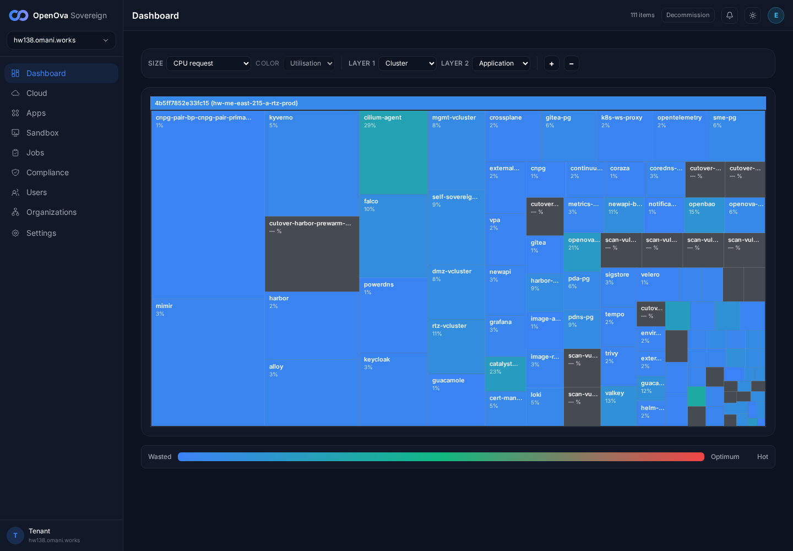](../../sessions/2026-06-14/evidence/3378-hw138/01_dashboard.png) |
| [Organizations](https://console.hw138.omani.works/organizations) | **Initial state — 0 sub-orgs.** Parent-first directory (`organizations-directory-page`); the org table holds only the parent row (no customer/department sub-orgs yet). Intro verbatim: "Every organization on this Sovereign. The parent organization — the Sovereign itself — is the first row; each department and customer is one Organization with its own identity, RBAC, and cost attribution." Section nav present: Commerce·Plans, Add-ons, Bundles, Industries, Apps, Billing, Domains | ✅ | [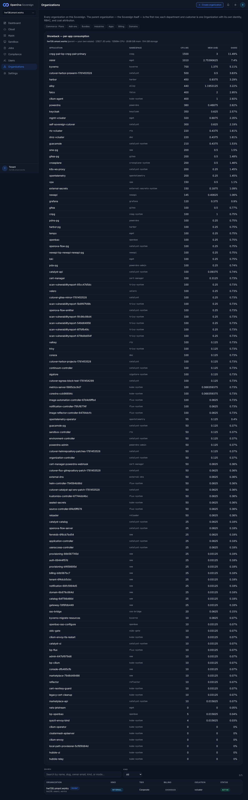](../../sessions/2026-06-14/evidence/3378-hw138/02_orgs_directory_initial.png) |
| [Organizations](https://console.hw138.omani.works/organizations) | First table row = the Sovereign itself, `data-parent="true"` + a **PARENT** badge, rendered `hw138.omani.works · PARENT · INTERNAL · Corporate · SHOWBACK · vcluster · ACTIVE` | ✅ |  |
| [Organizations](https://console.hw138.omani.works/organizations) | **Showback — per-app consumption** panel (B3 / DoD 3): the parent's own per-app cost-attribution table (cnpg-pair, mimir, kyverno, harbor, alloy, falco, keycloak, …) with APPLICATION/NAMESPACE/CPU/MEM/SHARE columns — walkable pre-sub-org | ✅ |  |
| [Create organization](https://console.hw138.omani.works/organizations/new) | Default (Customer) kind shows `Defaults: billing: real · isolation: vcluster` (read from `create-org-billing-mode` = "billing: real" and `create-org-isolation` = "isolation: vcluster") | ✅ | [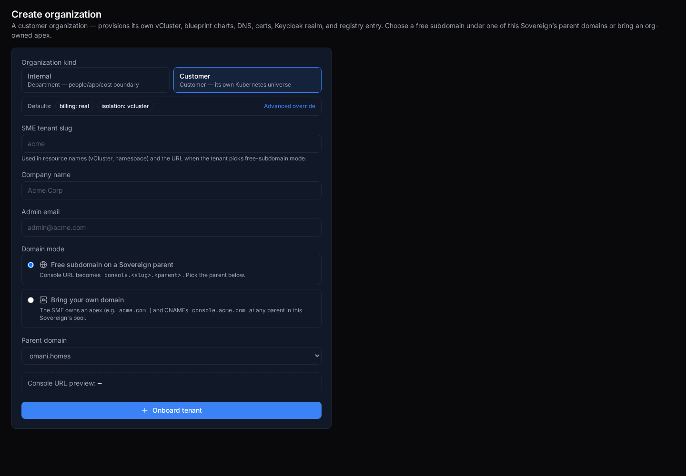](../../sessions/2026-06-14/evidence/3378-hw138/03_create_default.png) |
| [Create organization](https://console.hw138.omani.works/organizations/new) | Click **Internal** (`create-org-kind-internal`) → defaults flip **live** to `billing: showback · isolation: namespace`; intro changes to "An internal department — a people, app, and cost boundary on this Sovereign. No marketplace voucher; consumption attributes to the org via showback" — **no** voucher/payment step | ✅ | [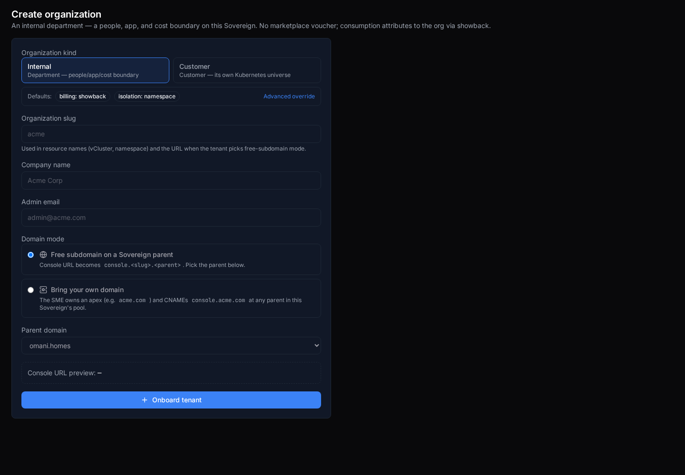](../../sessions/2026-06-14/evidence/3378-hw138/04_create_internal_flip.png) |
| [Create organization](https://console.hw138.omani.works/organizations/new) | **Advanced override** (`create-org-advanced-toggle`) reveals the billing-mode select (`create-org-billing-select` → real / chargeback / showback) + isolation select (`create-org-isolation-select` → namespace / vcluster) — both present with the full option sets | ✅ | [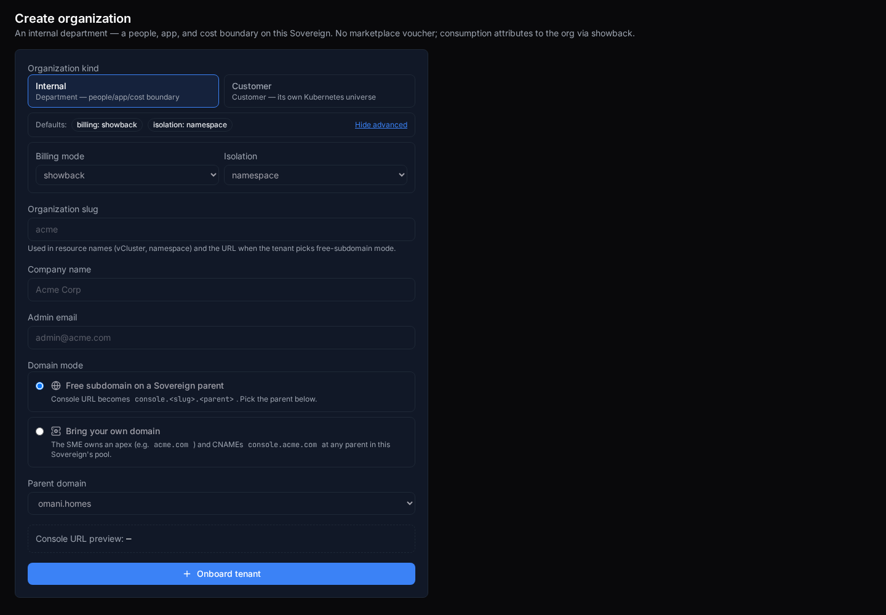](../../sessions/2026-06-14/evidence/3378-hw138/05_create_advanced.png) |
| [Create organization](https://console.hw138.omani.works/organizations/new) | Pick **Internal**, type slug `depthw` + company "Dept HW Internal" + admin email → submit (`sme-create-tenant-submit` "Onboard tenant", not disabled) → **result panel** (`sme-create-tenant-result`) shown: "Provisioning depthw · Console URL `console.depthw.omani.homes` · Parent domain omani.homes · Tenant ID 5e3d2979-… · vCluster→Charts→DNS→Certs→Keycloak→Registry" — the create call succeeded and returned a real Tenant ID | ✅ | [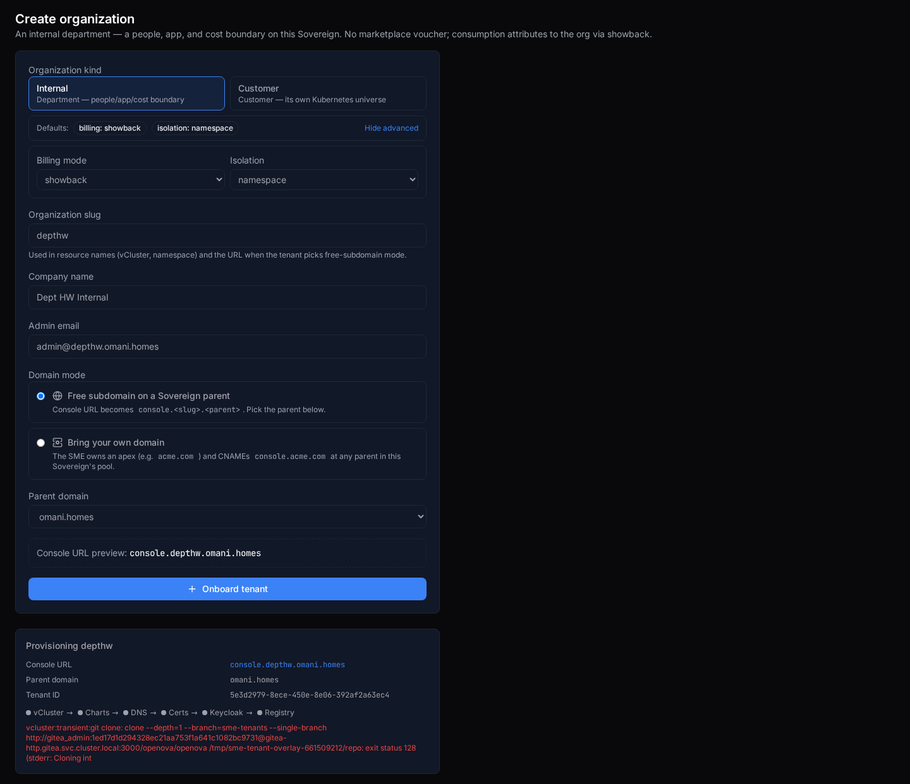](../../sessions/2026-06-14/evidence/3378-hw138/07_create_result.png) |
| [Organizations directory](https://console.hw138.omani.works/organizations) | **Badge fidelity at the directory table.** The created Internal sub-org `Dept HW Internal` (depthw) badges **INTERNAL · Sme · SHOWBACK · namespace · PROVISIONING** — kind=Internal threads to showback/namespace (NOT customer/real/vcluster), proving the directory reads the real per-org `kind/billing_mode/isolation` from the tenants feed, **not** a hardcode | ✅ | [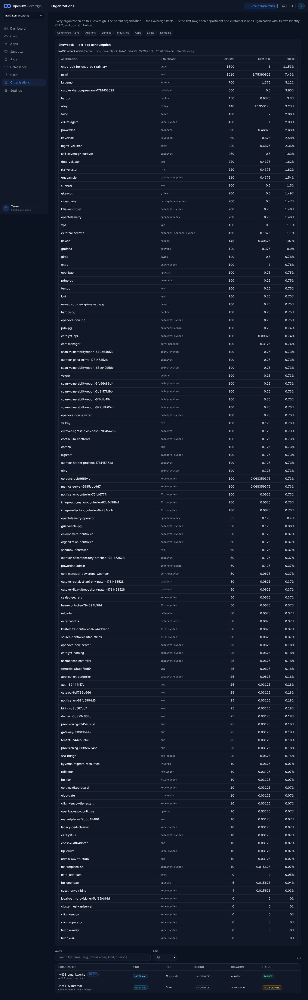](../../sessions/2026-06-14/evidence/3378-hw138/08_directory_badges.png) |
| [Org · depthw (Internal)](https://console.hw138.omani.works/organizations/depthw) | **Badge fidelity at the detail page.** The Internal org `depthw` shows **Slug Depthw · Kind Internal · Tier Sme · Billing mode Showback · Isolation Namespace · Status Provisioning** — NOT customer/real/vcluster — plus Owner `admin@depthw.omani.homes`, Console `console.depthw.omani.homes`, and a Showback panel ("No consumption attributed yet. Showback populates from running workloads.") | ✅ | [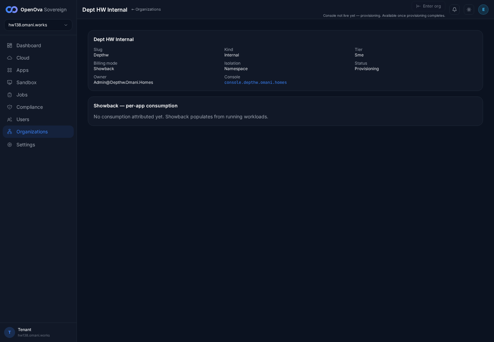](../../sessions/2026-06-14/evidence/3378-hw138/09_org_detail.png) |
| [Org · depthw](https://console.hw138.omani.works/organizations/depthw) | **Enter-org gate (the documented #3378 fix).** `depthw` is Provisioning, so **Enter org** renders **disabled** (`enter-org-not-live` wrapper, button `aria-disabled="true"`) with subtitle "Console not live yet — provisioning. Available once provisioning completes." Clicking it opens **NO new tab** (`ctx.pages()` 1 → 1) — the blank-tab regression is gone. A live (`active`) org would POST the enter-org endpoint + open the org's console handover; no sub-org is `active` on this env (funnel chain stalls at gitops clone) so the positive path is not exercisable here | ✅ |  |
| [Org · Billing](https://console.hw138.omani.works/organizations/billing/billing) | Parent (showback): the billing page renders the showback notice — "This organization is in showback mode — consumption is attributed, not invoiced…" — plus the per-app showback panel; **0** actionable payment/checkout buttons on the page (the word "checkout" appears only inside that descriptive sentence) | ✅ | [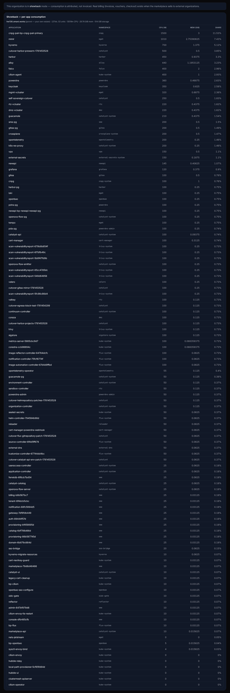](../../sessions/2026-06-14/evidence/3378-hw138/11_billing.png) |
| [Commerce · Plans](https://console.hw138.omani.works/organizations/commerce/plans) | The console plans table (`commerce-plans-table`) lists every plan (s, m, l, xl, flexi, sandbox-free, sandbox-pro, sandbox-ent) with SLUG/NAME/CPU/MEMORY/PRICE(OMR)/ACTIONS(Edit·Delete) — **no** "load plans: HTTP 404 / No plans yet" (`commerce-error` absent, 8 plan rows). Caption "The plans the marketplace storefront renders. Changes take effect immediately — no redeploy." | ✅ | [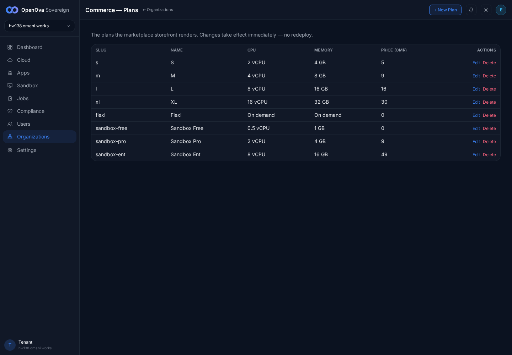](../../sessions/2026-06-14/evidence/3378-hw138/10_commerce_plans.png) |
| [marketplace · Plans](https://marketplace.hw138.omani.works/plans) | The storefront plan-picker renders the catalog plans (S/M/L/XL/Flexi with vCPU/RAM/Disk/Bandwidth/OMR-per-month) — the same plans surfaced by the console table, no redeploy. 0 console errors | ✅ |  |
| [/bss](https://console.hw138.omani.works/bss) | Redirects to `/organizations` (the new Organizations home) — landed on `console.hw138.omani.works/organizations`, no `/bss` in the final URL | ✅ | [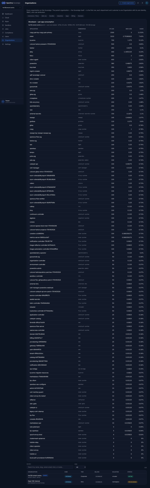](../../sessions/2026-06-14/evidence/3378-hw138/13_bss_redirect.png) |
| [/parent-domains](https://console.hw138.omani.works/parent-domains) | Redirects to `/organizations/domains` (Parent Domains) — landed on `console.hw138.omani.works/organizations/domains` | ✅ | [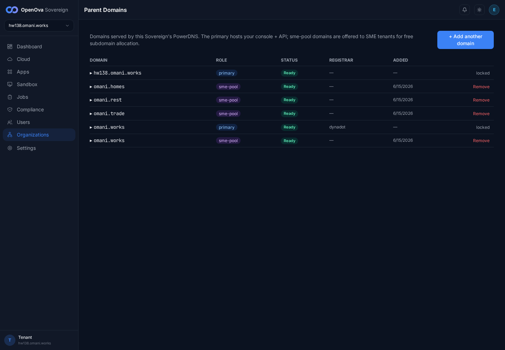](../../sessions/2026-06-14/evidence/3378-hw138/14_parentdomains_redirect.png) |

**Result:** ✅ 15 / ❌ 0 / N/A 0 — **#3378 holds live on hw138** (`4b5ff7852e33fc15`, catalyst-api `sha 9de0b65` = current-`origin/main` catalyst-ui/api code). From the recorded initial state of **0 sub-org CRs**, every acceptance assertion renders on the live UI: ONE **Organizations** sidebar entry with **no** BSS/OSS split; parent-first directory with the Sovereign as the first PARENT row (`hw138.omani.works · PARENT · INTERNAL · Corporate · SHOWBACK · vcluster · ACTIVE`) + the parent's per-app Showback panel; the Create-org **Internal** kind flips defaults live to **showback/namespace** (Customer default = real/vcluster) with the Advanced override exposing both selects and **no** voucher/payment step for Internal; **badge fidelity** — the freshly-created Internal org `depthw` badges **INTERNAL · SHOWBACK · namespace** at both the directory table and the detail page (proving the directory threads the real per-org spec, not a hardcode); the **Enter-org** button on a not-live (Provisioning) sub-org is **disabled** with "Console not live yet — provisioning" and clicking opens **no blank tab**; the Commerce·Plans table lists every plan (no 404) and those plans render in the marketplace storefront; billing shows the showback notice with **no** actionable checkout button; and both legacy redirects work (`/bss`→`/organizations`, `/parent-domains`→`/organizations/domains`).

**Gaps:** none of the #3378 acceptance rows fail.
- The positive **Enter-org "lands logged-in"** path (active org → mint support session → open the org's own console) is unexercised because no sub-org is `active` on this env — the funnel provisioning chain for `depthw` stalls inside the tenant-gitops step (`git clone … gitea-http.gitea.svc.cluster.local … exit status 128`, surfaced verbatim in the create-result panel). That is orthogonal funnel/gitops work, not a #3378 row, and is tracked separately; the #3378 surface (the Enter-org **gate** on a not-live org) is the row that #3378 asserts, and it passes.
- **Cosmetic-only (non-blocking):** the Create-org **slug** `<input pattern>` (RFC-1123 hostname regex `[a-z0-9]([a-z0-9-]{0,61}[a-z0-9])?`) emits a benign Chromium console warning under the `v`-flag regex engine ("Invalid character class"). It does **not** block submission — `depthw` submitted successfully with the result panel shown. Purely the HTML `pattern` attribute's client-side validity check; no functional effect on any #3378 acceptance row.
