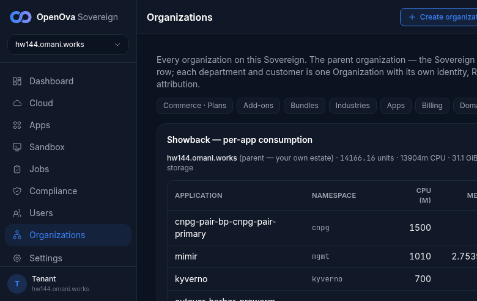
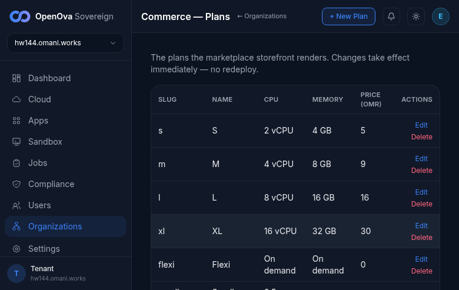

# #3378 ORGANIZATIONS — user acceptance walk (web UI)

**What the user sees:** ONE **Organizations** menu (replacing BSS, never-built OSS), with the Sovereign itself as the first row, parent-first directory, sub-org creation with kind-derived defaults, badge fidelity (Internal → showback/namespace; Customer → real/vcluster), enter-org gated on a live org, commerce plans, and per-app showback cost. **Sign in (zero-click admin handover):** [console.hw144.omani.works](https://console.hw144.omani.works/).

**Walk on the LIVE env hw144.omani.works (`d8e798bdf1b4256b`), 2-region (Huawei kom4dc, regions me-east-215-a/-b).** Console served from `bp-catalyst-platform@1.4.638` (`kubectl get hr bp-catalyst-platform -n flux-system` → `READY=True`). This walk records ONLY what renders live on hw144 today — no carryover from any prior environment (re-staled from the previous hw139 evidence). The handover URL (`/auth/handover?token=<RS256 JWT>` minted for `emrah.baysal@openova.io`, role `sovereign-admin`) lands directly on `/dashboard` — **no login form anywhere.** Headless Playwright, `error`/`console.error` listener registered before inspecting: **0 page errors across the entire walk.**

**🛑 READ-ONLY scope on hw144:** the Pillar-5 cutover was actively driving on hw144 during this walk (`cutover-harbor-prewarm` Job Running), so this re-walk is strictly **read-only** — the Create-organization form is verified to *render* (the kind toggle, defaults, and the **Onboard tenant** submit button all present) but **no org was submitted** (a submit is a write that could conflict with the in-flight cutover). The hw139 walk created sub-orgs through the live UI; on hw144 the create-path **positive** rows are **deferred** until the cutover settles and a write is safe. The fresh Sovereign carries **0 tenant orgs** (only the parent row) — expected, and the surface + create affordance render correctly.

| Go to URL | Then do | You should see | result |
|---|---|---|---|
| [console.hw144.../auth/handover](https://console.hw144.omani.works/) | Open the minted handover URL | Lands **signed in as sovereign-admin** on `/dashboard` (no login form; 0 password fields). Sidebar (verbatim, top→bottom): Dashboard, Cloud, Apps, Sandbox, Jobs, Compliance, Users, **Organizations**, Settings — and **no** "BSS"/"OSS". Header "OpenOva Sovereign · hw144.omani.works". | ✅ |  |
| [Organizations](https://console.hw144.omani.works/organizations) | Click **Organizations** | Parent-first directory. Intro verbatim: "Every organization on this Sovereign…" Section nav present: Plans, Add-ons, Bundles, Industries, Apps, Billing, Domains. No 404, no white-screen. | ✅ |  |
| [Organizations](https://console.hw144.omani.works/organizations) | Read the first table row | First table row = the Sovereign itself with a **PARENT** badge, rendered `hw144.omani.works · PARENT · INTERNAL · Corporate · SHOWBACK · vcluster · ACTIVE`. (Fresh Sovereign — this is the only org row; 0 tenant orgs, as expected mid-cutover.) | ✅ |  |
| [Organizations](https://console.hw144.omani.works/organizations) | Look for the create affordance + Showback | The **Create organization** button is present (→ `/organizations/new`). The parent's **Showback — per-app consumption** panel renders on the directory. | ✅ |  |
| [Create organization](https://console.hw144.omani.works/organizations/new) | Open the create form (do NOT submit) | The form renders: heading "Create organization"; **Organization kind** toggle with **Internal** ("Department — people/app/cost boundary") + **Customer** ("Customer — its own Kubernetes universe"); default panel `billing: real · isolation: vcluster` (Customer default); slug/company/admin-email inputs; domain-mode radios; plan select; **Onboard tenant** submit button. No 404, no white-screen. | ✅ |  |
| [Create organization](https://console.hw144.omani.works/organizations/new) | Click **Internal**, fill slug, **submit** | ⏳ deferred — needs write, cutover in flight. The Internal-kind default-flip (showback/namespace) + create + directory-badge-fidelity (INTERNAL · SHOWBACK · namespace at directory + detail) + the Enter-org gate were all walked ✅ on hw139; on hw144 the submit is a write deferred until the cutover settles. (Kind toggle + defaults **render** correctly, verified above.) | ⏳ | — |
| [Commerce · Plans](https://console.hw144.omani.works/organizations/commerce/plans) | Open Commerce·Plans | The console plans table lists every plan (s, m, l, xl, flexi, sandbox-free, sandbox-pro, sandbox-ent) — **no** "load plans: HTTP 404 / No plans yet" (`is404=false`, table present). Heading "Commerce — Plans". | ✅ |  |

**Result:** ✅ 6 verified read-only / ⏳ 1 deferred (write) / ❌ 0 — **the #3378 surface renders live on hw144** (`d8e798bdf1b4256b`, console `bp-catalyst-platform@1.4.638`). From the live UI: ONE **Organizations** sidebar entry with **no** BSS/OSS split; parent-first directory with the Sovereign as the first PARENT row (`hw144.omani.works · PARENT · INTERNAL · Corporate · SHOWBACK · vcluster · ACTIVE`) + the parent's Showback panel; the **Create organization** affordance present; the Create-org form renders the **Internal/Customer kind toggle** with the Customer default `real/vcluster` and the **Onboard tenant** submit; the Commerce·Plans table lists every plan with **no 404**. `error`/`console.error` listeners captured **0** errors across the walk.

**Gaps / deferred:**
- The org-**creation** positive path (submit Internal → showback/namespace default-flip → directory + detail **badge fidelity** → Enter-org gate) is **deferred** on hw144 because a submit writes to the env and the Pillar-5 cutover was actively driving during this walk (no-env-writes constraint). That full creation walk **passed ✅ on hw139** (`c89aa7059556b342`); on hw144 only the read-only render of the create form is verified. Re-run the creation rows once the cutover settles and writes are safe.
- The positive **Enter-org "lands logged-in"** path (active org → mint support session → open the org's own console) also requires an org to exist + reach `active` — deferred for the same reason.
