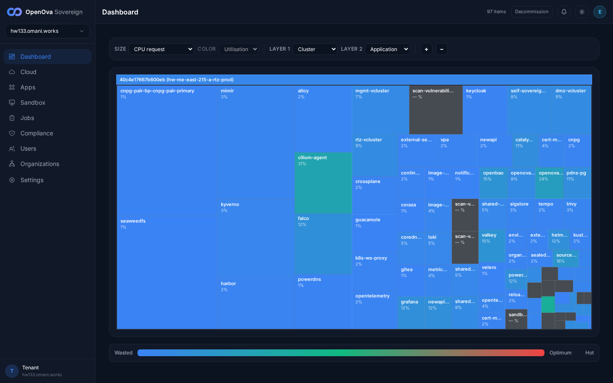
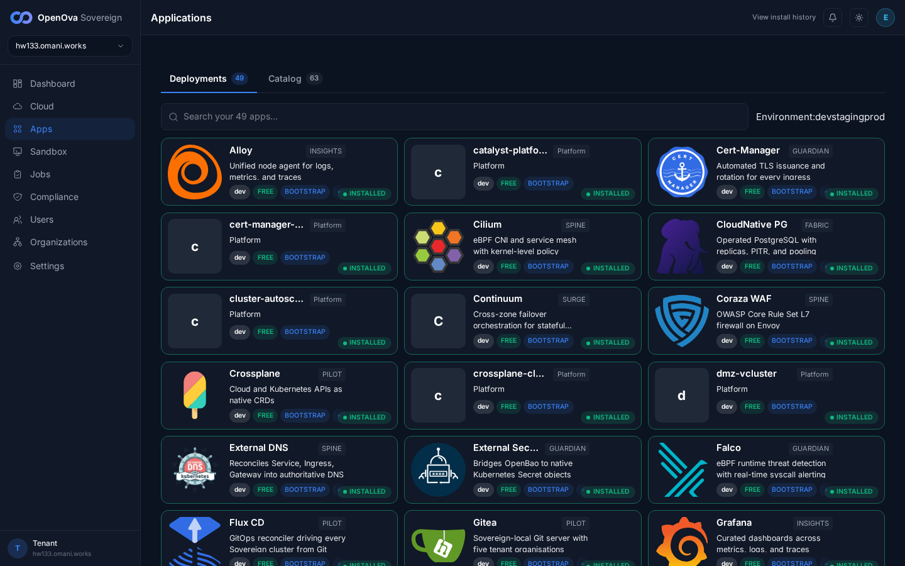
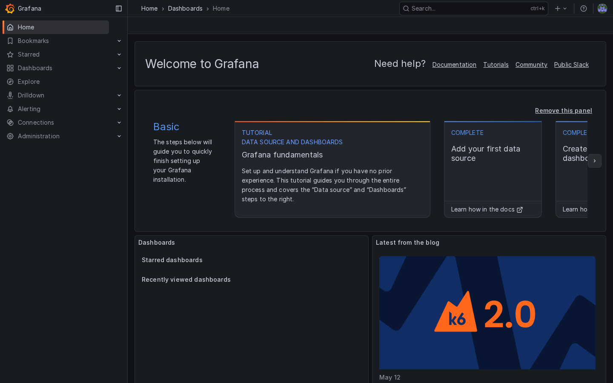
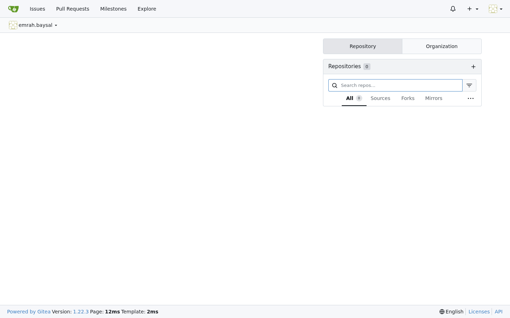
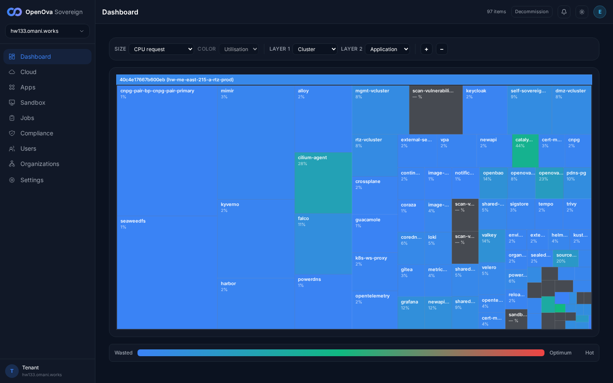

# #3379 SOVEREIGNTY — user acceptance walk (web UI)

**Honest framing:** the cutover (cutting the cord to the mothership) is a behind-the-scenes process the user never drives, so there is **almost no end-user UI**. The user-facing acceptance is the **negative** one — after the Sovereign goes independent, **nothing they touch breaks**. The cutover engine itself is verified from the operator side (handover finalise → 11-step engine → `cutoverComplete`).

## 2026-06-15 — hw139 (`c89aa7059556b342`, kom4dc 2-VPC) — #3558 re-attempt: resume + step-03 deadline/parallelism fixes proved live; halted again at step-03 on a 4th catch (degraded kom4dc egress on the last image, NOT a #3558 logic defect)

Evidence dir: `docs/sessions/2026-06-15/evidence/3379-cutover-reattempt/`. This is the no-fresh-prov re-attempt: hw139's cutover had wedged at step-03 harbor-prewarm with `DeadlineExceeded` (the old Job carried `activeDeadlineSeconds=900` and resume refused to re-run a Failed step). PR #3558 (`9c6f864`) fixed both. hw139's Flux tracks `main`, so catalyst-api rolled `eaab0b3`→`9c6f864` and the engine resumed on restart.

| Step | What was checked | Status | Evidence |
|---|---|---|---|
| #3558 build rolls onto hw139 | catalyst-api deploy image `eaab0b3`→`ghcr.io/openova-io/openova/catalyst-api:9c6f864` (deploy-bot commits `1a61e5593` image-bump + `bb7665e7a` bootstrap-kit pin 1.4.633); cutover chart already at `bp-self-sovereign-cutover@0.1.61`. | ✅ | `00d-preroll-image.txt` |
| Cutover engine **resume** fires (#3558 Defect-2) | catalyst-api startup log: `cutover-resume: in-flight cutover detected on startup` (currentStepIndex=2, failedStep=harbor-prewarm) → `cutover-resume: spawning runCutover to resume interrupted cutover` (totalSteps=11). Engine **deleted** the old DeadlineExceeded Job and minted a fresh one — the transient-retry path works. | ✅ | `02-catalyst-api-cutover-resume.log`, `00-preroll-cutover-status-WEDGED-step03.json` |
| Step-03 per-step deadline honored (#3558 Defect-1a) | New Job `cutover-harbor-prewarm-1781473205` minted with `activeDeadlineSeconds: **5400**` (the OLD failed Job `…1781464129` had **900** — the global 15m floor that silently killed it). Proves `cutoverStepDeadline()` now honors the chart `stepTimeouts.harborPrewarmSeconds`. | ✅ | `00b-old-prewarm-job-DeadlineExceeded.json` (900) vs `03-new-prewarm-job-deadline5400.json` (5400) |
| Step-03 parallel push (#3558 Defect-1b) | Prewarm log: `found 29 unique openova-io images to native-push` → `pushing 29 image(s) with parallelism=6`. The local Harbor `openova-io` project climbed **6/29 → 27/29 in one pass (~11 min)** — well past the old serial 6/29 wall. | ✅ | `04-prewarm-parallelism6-29images.log` |
| Step-03 **completes 29/29** | ❌ **The 4th catch.** Attempt-1 tally `push_ok=27 push_fail=2` (catalyst-api:9c6f864 + guacd:1.5.5 dropped mid-blob: `unexpected EOF … use of closed network connection`). Job `backoffLimit=3` self-healed: attempt-2 `push_ok=28 push_fail=1` (catalyst-api landed; guacd re-dropped on `ghcr.io/token … i/o timeout`); attempt-3 re-paying the slow 38 MB skopeo-binary download over the degraded egress. The local Harbor stalled at **28/29** (only `guacd:1.5.5` missing). This is the documented **kom4dc throttled-egress flake**, NOT a #3558 logic bug — the fixes worked; raw egress is the wall. | ❌ | `05-prewarm-attempt1-2transient-egress-drops.log`, `07-prewarm-attempt2-guacd-only-remaining.log`, `06-4th-catch-analysis.md` |
| Steps 04–11 (registry-pivot, flux/helmrepo pivot, **step-08 600s deny-egress hold**, gitea-token-mint, vcluster/crossplane pivot) | ⛔ **never reached** — the engine stays at `currentStepIndex=2` until step-03 pushes all 29. `cutoverComplete=false`, `registriesYamlActive=v1` (no registry pivot). | ⛔ | `00-preroll-cutover-status-WEDGED-step03.json` |
| `cutoverComplete` | **false** — engine halted/looping at step-03. | ❌ | live `self-sovereign-cutover-status` CM |
| Safety / cnpg-pair caveat | The cnpg-pair DR-demo split-brain is **NOT involved** — the blocker is at step-03 harbor-prewarm, far before the step-08 deny-egress hold where a split-brain would surface. cnpg-pair cluster read `3/3 healthy` at resume time; the 3 baseline-NotReady HRs (`bp-cluster-autoscaler-hcloud`, `bp-hcloud-ccm`, `bp-velero`) are cloud-provider-mismatch noise on Huawei, orthogonal to the cutover. | ✅ | `01-cnpg-state-at-resume.txt`, `01-baseline-notready-hr-set.txt` |

**Verdict (hw139):** PR #3558 is **validated** for what it set out to fix — the cutover engine now (a) **resumes** an interrupted cutover on catalyst-api restart, (b) **re-runs** a transiently-failed (DeadlineExceeded) step instead of wedging, (c) mints step-03 with the **5400s** per-step deadline (not the inert 900s global floor), and (d) **fans out the image copies (parallelism=6)** — together taking step-03 from a hard 6/29 wedge to 27/29 in one pass. A **new (4th) catch** then surfaces: on kom4dc's **degraded egress**, the last 1–2 images (notably `guacd:1.5.5`) keep dropping mid-copy (`unexpected EOF` / ghcr-token `i/o timeout`), and every backoff retry re-pays the slow 38 MB skopeo-binary download. The Job self-heals (zero-touch) but had not reached 29/29 at report time, so `cutoverComplete` and the witnessed 600s deny-egress hold remain pending. Follow-up direction (not implemented mid-walk): persist/skip the skopeo binary across retries (or source the residual image(s) from the node containerd cache) so a degraded-egress retry only re-copies the missing layers rather than re-fetching skopeo each time.

## 2026-06-14 — hw136 (`3a2ee904b1d0366a`, kom4dc 2-VPC) — cutover FIRED for the first time on a real Sovereign; halted at the egress-block fail-safe (NO half-pivot)

This is the first execution of the sovereignty cutover on a handed-over Sovereign. PR #3521 (catalyst-api `9de0b65`, in chart `bp-catalyst-platform` 1.4.629) fixed the root cause that previously made it **impossible** — the handover `tofu-archive` receiver was behind `RequireSession`, so on a real Sovereign the mother→child archive POST was 401'd before the handler and the cutover never auto-fired. #3519 flipped `egressTest.enforceCIDRBlock` default→true (bp-self-sovereign-cutover 0.1.57).

| Step | What was checked | Status | Evidence |
|---|---|---|---|
| Handover receiver reachable (#3521) | `POST api.hw136.omani.works/api/v1/handover/tofu-archive` (cookieless) → **400 "deploymentId and sovereignFqdn are required"** — handler reached (content validation). Before #3521 this was **401 "unauthenticated"** from the middleware, before the handler. | ✅ | `00-handover-receiver-reachable-400.json` |
| Handover finalise fires the cutover (#3521) | `POST console.openova.io/sovereign/api/v1/handover/finalise/3a2ee904b1d0366a` (RS256 owner JWT) → 200 with **`"tofuArchiveSubmitted": true`**. Before #3521: `false` + `errors:["submit tofu archive: status 401: unauthenticated"]`. Archive sealed → cutover auto-fired (`cutoverStartedAt 2026-06-14T10:05:13Z`). | ✅ | `01-handover-finalise-response.json` |
| Zero-click SSO into the console | `console.hw136.omani.works` → lands on `/dashboard` signed in as **emrah.baysal@openova.io** (`role: sovereign-admin`, roles `[catalyst-owner, catalyst-admin, sovereign-admins]`), no login form. Live treemap renders the primary region (`hw-me-east-215-a-rtz-prod`). | ✅ | `dashboard-zero-click-sso.png` |
| Cutover engine — steps 1–8 of 11 | gitea-mirror, harbor-projects, harbor-prewarm, registry-pivot, flux-gitrepository-patch (GitRepository `openova` → `http://gitea-http.gitea.svc.cluster.local:3000/openova/openova`), helmrepository-patches (kubectl-patched 39 live HelmRepos → local + git-pushed 60 rewritten files to local Gitea), catalyst-api-env-patch (rolled catalyst-api twice from the **local Harbor**, pivoted console/api URLs to local) — all **success**. | ✅ | `02-cutover-events-stream.txt`, `03-cutover-status-FAILED.json` |
| Cutover engine — egress-block-test (the deny-egress hold) | **FAILED at 10:17:08 (~74s, NOT the 600s survival window).** Its pre-flight URL assertion found **59 HelmRepositories reverted to `oci://ghcr.io/openova-io`** → `FAIL — at least one HelmRepository did not pivot`. The `cutover-egress-block` CiliumClusterwideNetworkPolicy was therefore **never applied** and the 600s hold never ran. (Root cause below.) | ❌ | `job-logs-raw.json` |
| `cutoverComplete` | **false.** Engine halted at `egress-block-test`; the post-egress steps (crossplane-provider-pivot, gitea-token-mint, vcluster-registry-pivot) never ran. | ❌ | `03-cutover-status-FAILED.json` |
| Safety — NOT half-pivoted | `state=tethered`, `registriesYamlActive=v1`, and console/api/registry/gitea/bao all 200/303 throughout and after the halt. The fail-safe assertion refused to enter the deny-egress hold while tethers remained, so hw136 stayed fully intact. | ✅ | `03-cutover-status-FAILED.json` |

**Root cause of the egress-block-test failure (a real cutover ordering defect, distinct from #3521):**
The `helmrepository-patches` step (succeeded 10:13:02) kubectl-patched the 39 live HelmRepositories to local AND git-pushed 60 rewritten files (ghcr→local) to local Gitea — but its own log notes "commit will reconcile via bootstrap-kit Kustomization", i.e. the durable Git-source rewrite is **asynchronous**. `egress-block-test` ran ~3 minutes later (10:15:54) and asserted **once**, with no wait/retry — by then a Flux reconcile had re-applied the OLD `oci://ghcr.io/openova-io` HelmRepository manifests (reverting the kubectl patches) and the bootstrap-kit Kustomization had not yet pulled the new local-pivot commit. So the assertion fails on the transient Flux-revert window. This is the documented kubectl-patch-then-Flux-reverts race (`feedback_cutover_bootstrap_halfpivot`). Fix direction: egress-block-test (08) should force-reconcile the bootstrap-kit Kustomization + GitRepository and **poll the HelmRepository pivot to convergence with a bounded timeout** before failing; or helmrepository-patches (06) should block on that convergence before returning success. Tracked in the follow-up issue.

**Verdict (hw136):** #3521 is **validated** — the cutover now fires on a real Sovereign for the first time, and 8/11 steps execute cleanly (including the registry pivot of catalyst-api itself from local Harbor). It then halts at the egress-block fail-safe on a real, separate ordering defect (HelmRepository pivot not yet reconciled when the assertion runs), with **no half-pivot**. `cutoverComplete` and the witnessed 600s deny-egress hold remain pending that fix + a re-run.

## 2026-06-14 (earlier) — hw133 baseline (cutover never run there)

Baseline only — at the time, the cutover had never been run on any handed-over environment. The user-facing surfaces all worked (console signed-in, Apps full catalog, grafana SSO, gitea from local services), but the post-cutover rows were unexecuted and there is no console UI/badge surfacing "this Sovereign is now independent".

| Tested page | Description | Status | Evidence |
|---|---|---|---|
| [console.hw133.omani.works](https://console.hw133.omani.works/) | After cutover, the console still loads and you are signed in, as before. **Baseline:** console loads signed-in as emrah.baysal (sovereign-admin), dashboard treemap renders 97 items. | ✅ |  |
| [Apps](https://console.hw133.omani.works/apps) | Navigate Dashboard / Apps / Organizations → all render normally. Apps page renders Deployments (49) / Catalog (63). | ✅ |  |
| [grafana.hw133.omani.works](https://grafana.hw133.omani.works/) | App still loads signed-in, unchanged. Grafana Home renders, SSO-authenticated (no login form). | ✅ |  |
| [gitea.hw133.omani.works](https://gitea.hw133.omani.works/) | App works (served from the Sovereign's own local services). Gitea dashboard signed-in as `emrah.baysal`; Gitea v1.22.3. | ✅ |  |
| [console.hw133.omani.works](https://console.hw133.omani.works/) | ❌ **GAP** — no UI page/badge shows "this Sovereign is now independent / cutover complete". | ❌ |  |
| [Apps](https://console.hw133.omani.works/apps) | Install/update an app **after** cutover → pulls from the Sovereign's own local registry. **N/A on hw133** (no cutover run there). | ❌ |  |

**Verdict (overall):** sovereignty cutover is an **ops process with almost no end-user UI** — the only positive UI acceptance is the negative one (nothing the user touches breaks), which holds. The operator-side engine now **fires** (#3521) and runs 8/11 steps on a real Sovereign; `cutoverComplete` + the 600s deny-egress hold are pending the egress-block ordering fix.
