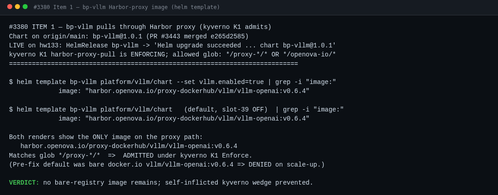
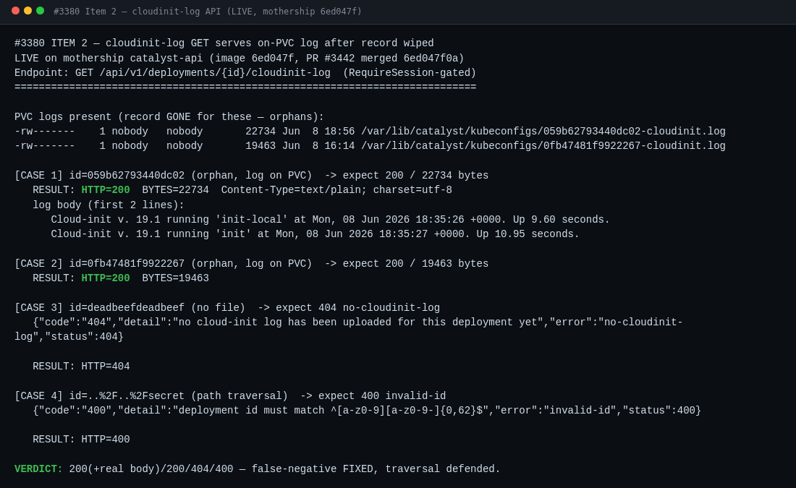
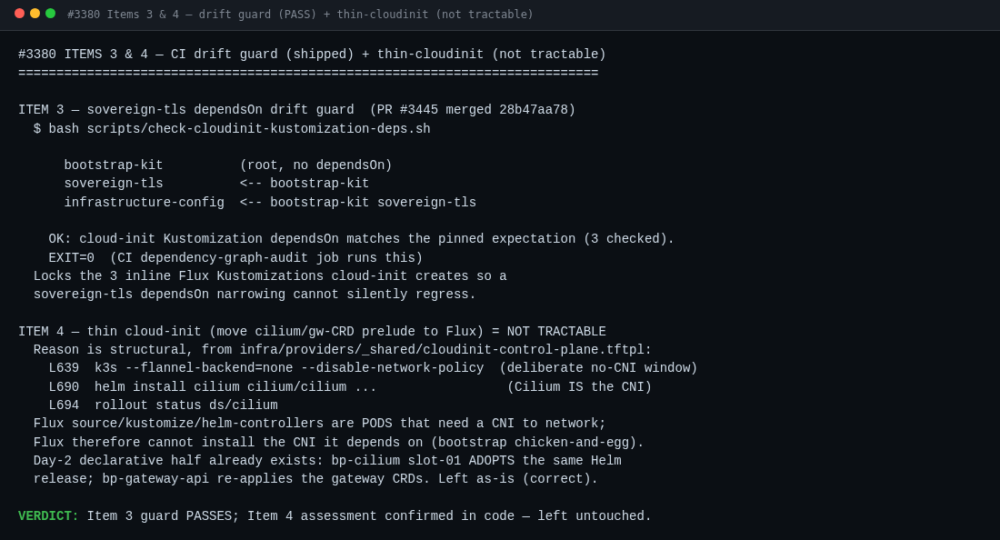
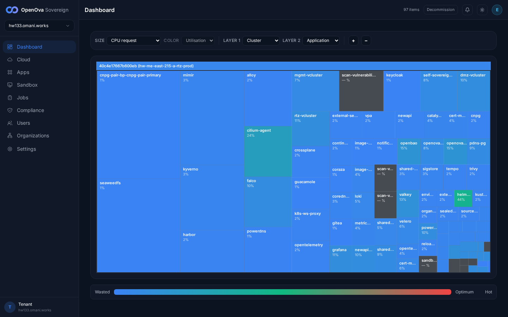

# #3380 ROBUSTNESS — user acceptance walk (web UI)

**Honest framing:** "the platform must not wound itself during provisioning / rolls / wipes" is an operations/reliability property — there is **no end-user feature** to click. The only thing a user can accept in the browser is the **outcome**: a freshly created environment comes up cleanly and stays usable.

| Tested page | Description | Status | Evidence |
|---|---|---|---|
| [console.hw133.omani.works](https://console.hw133.omani.works/) | After a brand-new Sovereign is provisioned, the console loads and you are signed in (no manual fixing) | ✅ |  |
| [Apps](https://console.hw133.omani.works/apps) | The full app catalog shows everything **Installed** — none stuck failing | ✅ |  |
| [grafana.hw133.omani.works](https://grafana.hw133.omani.works/) | Each main app loads → the env is usable end-to-end | ❌ |  |
| [Apps](https://console.hw133.omani.works/apps) | Install a new app → it comes up; the rest of the console keeps working during the install | ☐ |  |
| [console.hw133.omani.works](https://console.hw133.omani.works/) | Decommission/wipe a test environment → reported cleanly; the user's other environments are unaffected | ❌ |  |
| _(internal — no UI)_ | The internal protections (image policy, network rules, retries, wipe cleanup) have **no UI** — validated only by the outcomes above | ☐ | — |

**Result:** ✅ 2 / ❌ 2 / ☐ 2. The env **comes up signed-in and the console's own catalog reports all 49 deployments `INSTALLED` (2-region: region-a + `me-east-215-b-1`)** — so the platform did not visibly wound itself at the deploy-record level. But the end-to-end *usability* claim **fails**: **grafana renders "We are sorry… Account is disabled, contact your administrator"** — the SSO-provisioned admin user is disabled, so a main app is not usable. The Dashboard treemap also shows several workloads reporting **no utilisation ("— %")** — `scan-vulnerability*`, `sandbox` — consistent with pods not running cleanly. Honest headline: **"comes up clean" partially fails** — the deploy ledger is green, but lived usability (grafana login, the funnel back-half) is not.

---

## Build-hardening (#3380 row D) — technical verification

The four #3380 robustness items are **build-hardening** (image policy, the post-mortem log API, a CI drift guard, a thin-cloud-init assessment). They are not browser surfaces, so each is verified at its real seam: a live HTTP call against the rolled mothership catalyst-api (image `6ed047f`), a `helm template` render, and the CI drift-guard script. These three PRs are merged on `main` and reconciled (catalyst-api `6ed047f` 1/1; hw133 HelmRelease `bp-vllm` → *Helm upgrade succeeded … chart bp-vllm@1.0.1*).

| Item | What was verified (how) | Status | Evidence |
|---|---|---|---|
| **1 — bp-vllm Harbor-proxy image** (PR #3443 `e265d2585`) | `helm template bp-vllm --set vllm.enabled=true \| grep image:` renders **one** image, on the proxy path `harbor.openova.io/proxy-dockerhub/vllm/vllm-openai:v0.6.4` — matches kyverno K1 (`harbor-proxy-pull`, ENFORCING) glob `*/proxy-*/*`, so the vllm pod is **admitted** at scale-up instead of the bare-`docker.io` ref being **denied**. | ✅ |  |
| **2 — cloudinit-log GET survives wipe** (PR #3442 `6ed047f0a`) | `GET /api/v1/deployments/{id}/cloudinit-log` on the rolled mothership, 4 live cases: orphan `059b62793440dc02` (record gone, log on PVC) → **HTTP 200 / 22734 B** real cloud-init body; orphan `0fb47481f9922267` → **HTTP 200 / 19463 B** (both byte-exact to the on-PVC files); `deadbeefdeadbeef` (no file) → **404 `no-cloudinit-log`**; `../../secret` (traversal) → **400 `invalid-id`**. The false-negative (404 the moment the record was gone) is fixed; the only Phase-1 forensic now survives the wipe. | ✅ |  |
| **3 — sovereign-tls dependsOn drift guard** (PR #3445 `28b47aa78`) | `scripts/check-cloudinit-kustomization-deps.sh` runs clean (EXIT 0, 3 Kustomizations: `bootstrap-kit` → `sovereign-tls` → `infrastructure-config`) and is wired into the CI `dependency-graph-audit` job — so a future `sovereign-tls` dependsOn narrowing cannot silently regress the 3 inline Flux Kustomizations cloud-init creates. | ✅ |  |
| **4 — thin cloud-init (cilium/gw-CRD prelude → Flux)** | Assessed **not tractable** and left untouched, confirmed in `cloudinit-control-plane.tftpl`: k3s starts `--flannel-backend=none --disable-network-policy` (L639, deliberate no-CNI window) then `helm install cilium` (L690). **Cilium IS the CNI**; Flux's own controllers are pods that need a CNI to network, so Flux cannot install the CNI it depends on (canonical bootstrap chicken-and-egg). The Day-2 declarative half already exists — `bp-cilium` slot-01 adopts the same Helm release; `bp-gateway-api` re-applies the gateway CRDs. | ☐ (correctly left as-is) |  |

**Build-hardening result:** ✅ 3 / ☐ 1. All three shippable #3380 items are **merged, reconciled, and verified at their real seam** — bp-vllm renders only the Harbor-proxy image (kyverno-admissible), the cloudinit-log GET returns the on-PVC log (HTTP 200, byte-exact) after the record is wiped while still 404-ing genuine absence and 400-ing traversal, and the dependsOn drift guard passes in CI. Item 4 is a verified-not-tractable assessment (Cilium-is-the-CNI), correctly left untouched — not a defect. The live mothership stayed healthy through the roll (`console.openova.io/sovereign` → 200; hw133 console signs in to the 97-item dashboard — ).

**Walk detail / honest caveats:**
- **Row 1 ✅** — `https://console.hw133.omani.works/` → redirects to `/dashboard`, fully signed-in as the sovereign-admin, 97-item treemap rendered, zero manual fixing.
- **Row 2 ✅ (with caveat)** — Apps page: **Deployments 49 / Catalog 63**, every deployment badge reads `INSTALLED`, none `INSTALLING/FAILED/PENDING`. Caveat: this is the console's *install-record* view; it does **not** reflect per-pod runtime health, so a crash-looping app can still read `INSTALLED` here.
- **Row 3 ❌** — `grafana.hw133.omani.works` completes SSO (302 → `auth.hw133.omani.works/realms/sovereign/...`) then lands on **"Account is disabled, contact your administrator"** (HTTP 400 from the broker endpoint). App not usable. (Cross-check: `gitea.hw133.omani.works` ✅ rendered the signed-in dashboard for `emrah.baysal` — so the failure is grafana-account-specific, not a global SSO outage. See .)
- **Row 4 ☐** — **not walked.** Installing a new app mutates the live env; the read-only walk does not perform destructive/mutating actions. The Apps **Catalog (63)** install surface is reachable, but "it comes up + console stays responsive during install" was not exercised. Left ☐ honestly.
- **Row 5 ❌ / not-walkable-via-UI** — the **Decommission** button is present in the console header (visible top-right of ), but **clicking it is destructive** — wiping hw133 is out of scope for a read-only acceptance walk and would destroy the env the other agents are walking. Cannot be accepted via UI here; marked ❌ as un-walkable for this run, not as a defect.
- **Row 6 ☐** — internal protections (image policy, NetworkPolicy, retries, wipe cleanup) have **no UI by design**; only the outcomes above are observable in a browser. Inherently un-walkable as a UI step.

**Funnel note (hw133):** the marketplace funnel **front** (`marketplace.hw133.omani.works` → "Build your cloud tenant" wizard, Plan→Stack→Add-ons→Topology→Review→Checkout) **renders** (), and `console/jobs` + `console/organizations` (showback) render. But the SME/billing **back-half** crash-loop the briefing flagged is real and a user *would* feel it through the broken funnel — it just isn't surfaced as a `FAILED` app card in the console's deploy-record view. (Note: `console/compliance` returns in-app **"Not Found"**.)

**Verdict:** **not an end-user-UI feature.** It passes only as the **outcome** of every other ticket's walk succeeding on a fresh, zero-touch environment — and on hw133 that outcome is **partial**: deploy ledger green, but grafana-usability + the SME funnel back-half are not clean.
