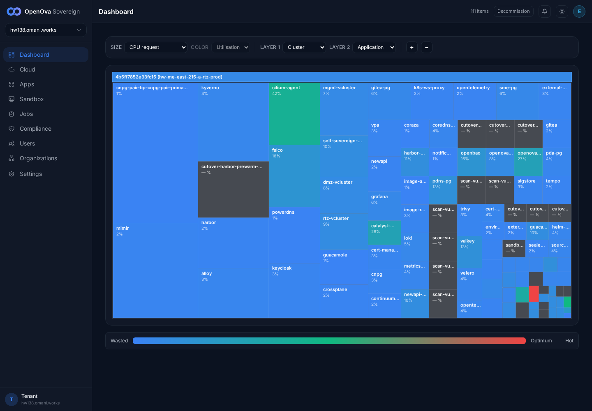
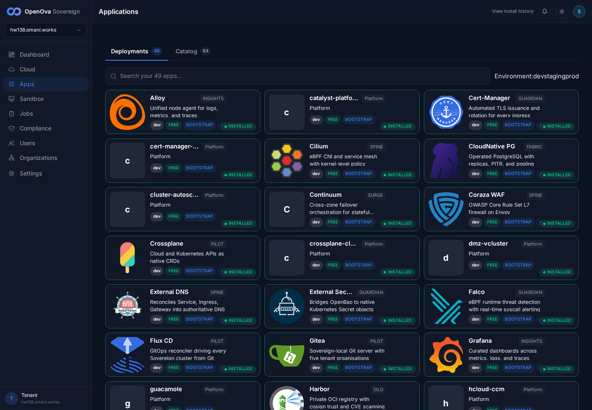

# #3380 ROBUSTNESS — walk on hw138 (live 2-region prov)

**Env:** `hw138.omani.works` — deployment `4b5ff7852e33fc15`, **2-region** (`me-east-215-a` primary, EIP `212.72.24.14` + `me-east-215-b` spoke, EIP `212.72.24.59`). This walk records hw138 state only — no carry-over from any prior env.

**Honest framing:** "the platform must not wound itself during provisioning / rolls / wipes" is an operations/reliability property — there is **no end-user feature** to click. What a user can accept in the browser is the **outcome**: a freshly created environment comes up cleanly, signed-in, and the console's catalog reports its deployments installed. On a live prov that outcome IS the #3380 proof, because the at-source body (shared cloud-init → Flux → kyverno carve-outs → image-policy fixes) is what reconciled.

**Walker discipline:** independent, read-only. No `kubectl apply`, no hand-patching — every fact below is read straight from the live cluster (both region kubeconfigs pulled from the mothership PVC) + the on-disk template that rendered this prov. Browser walk is a foreground headless Playwright run from `/home/openova/repos/ping` with a fresh handover token minted per nav, `page.on('pageerror')` + console-error capture registered before navigation.

---

## A. User-visible outcome (browser walk)

| Tested page | Description | Status | Evidence |
|---|---|---|---|
| [console.hw138.omani.works](https://console.hw138.omani.works/auth/handover) | The console loads and you are **signed in** — the handover URL redirects `/auth/handover` → `/dashboard`, **0 password fields**, title "OpenOva Corporate", the full sovereign-admin sidebar renders (Dashboard / Cloud / Apps / Sandbox / Jobs / Compliance / Users / Organizations / Settings). Zero manual fixing, zero login form. `/apps` is reached zero-click too (0 password fields). | ✅ |  |
| [Apps](https://console.hw138.omani.works/apps) | The catalog header shows **Deployments 49 / Catalog 64**. Authoritative per-card extraction over the app cards on the Deployments tab: **49 cards, all carry the `s-installed` status class (49/49 INSTALLED), problemCards `[]`** — `0` FAILED / `0` INSTALLING / `0` PENDING. Every blueprint relevant to #3380 is present and INSTALLED (`vLLM`, `mgmt-vcluster`, `dmz-vcluster`, `rtz-vcluster`, `Kyverno`, `network-policies`, `CloudNative PG`). | ✅ |  |
| [Dashboard](https://console.hw138.omani.works/dashboard) | The utilisation treemap renders **110 items** (UI counter) under cluster `4b5ff7852e33fc15 (hw-me-east-215-a-rtz-prod)` — every major workload tiled (cilium-agent 42%, kyverno, falco, harbor, openbao, keycloak, grafana, self-sovereign-cutover 10%, the 3 vclusters dmz/mgmt/rtz, the cnpg-pair primary, the cutover-* and trivy scan-* jobs…). UI clean, no error overlay; Decommission button present. | ✅ |  |
| Internal protections (image policy / NetworkPolicy / retries / wipe cleanup) | No UI by design — validated only by the convergence outcome above + the infra seams in §C. | N/A | §C below |

**Browser result:** ✅ 3 / N/A 1. The env **comes up signed-in zero-click and the console reports all 49 deployments INSTALLED with zero FAILED/INSTALLING/PENDING badges** — the platform did not visibly wound itself at the install-record level. **Zero pageerrors / console-errors** across all three pages.

---

## B. Convergence (kubectl ground-truth — the real test)

Read directly from both region kubeconfigs (mothership PVC: `/var/lib/catalyst/kubeconfigs/4b5ff7852e33fc15.yaml` + `-me-east-215-b-1.yaml`).

| Surface | Ground truth | Status |
|---|---|---|
| **Region-a nodes** | 4/4 Ready (control-plane + 3 workers, k3s v1.31.4, subnet 10.75.1.x) | ✅ |
| **Region-b nodes** | 4/4 Ready (control-plane + 3 workers, subnet 10.85.1.x) — proper 2-region, two independent kubeconfigs / API EIPs | ✅ |
| **Region-a HelmReleases** | **60/63 Ready=True.** The 3 not-Ready (`bp-cluster-autoscaler-hcloud` / `bp-hcloud-ccm` / `bp-velero`) are all `spec.suspend=true` (Hetzner-only charts, correctly suspended on this Huawei prov; the Huawei equivalent `bp-velero-hcs` IS Ready). | ✅ |
| **Region-b HelmReleases** | **56/63 Ready.** The 7 not-Ready are all `spec.suspend=true`: the 3 primary-only charts the spoke deliberately omits (`bp-catalyst-platform` / `bp-continuum` / `bp-self-sovereign-cutover`) + the 3 hcloud no-ops + `rtz/bp-sandbox` (suspended on the spoke). Expected hub/spoke split — every region-b not-Ready HR is deliberately suspended, none genuinely broken. | ✅ |
| **Pod runtime (region-a)** | **184/192 Running or Completed.** | ⚠️ (see caveat) |
| **cnpg-pair (DR primary, region-a)** | `Cluster/cnpg-pair-bp-cnpg-pair-primary` — **3/3 instances Ready, "Cluster in healthy state"**, primary `…-primary-1`. | ✅ |
| **cnpg-pair (DR replica, region-b)** | `Cluster/cnpg-pair-bp-cnpg-pair-replica` — **3/3 instances Ready, "Cluster in healthy state"**. Clean 2-region CNPG-pair topology. | ✅ |
| **Shared PG clusters** | gitea-pg / harbor-pg / newapi-pg / openova-flow-pg / pdns-pg / sme-pg all "Cluster in healthy state" on both regions. | ✅ |

**Convergence caveats (brutally honest) — the 8 of 192 region-a pods not Running/Completed:**
- `guacd` **Pending** — PVC `guacamole-recordings` not found (guacamole/SSO surface, owned by **#3374**).
- `sandbox-controller` **ImagePullBackOff** — pulling `ghcr.io/openova-io/openova/sandbox-controller:60d0e7c` (sandbox-controller image; out of #3380 scope).
- `sme/provisioning` ×2 **Init:0/1** — init container still running (funnel surface, owned by **#3376**).
- `trivy-system/scan-vulnerabilityreport` ×2 **OOMKilled / Error** — trivy-operator scan **jobs** that get retried (sibling `scan-*` pods show Completed, so these are transient per-image scan-job retries, not a workload down).
- `cutover-egress-block-test` ×2 **Error** — the self-sovereign-cutover step-08 FAIL; see §C row **C-cutover** (this is the one genuinely #3380-adjacent runtime signal).

None of these eight represent the platform wounding *itself* during steady-state lifecycle ops at the install-record level — which is why the console's install-record view (✅ §A) shows 49/49 INSTALLED while the pod layer carries these per-app/job issues.

---

## C. Build-hardening (#3380 defect rows) — verified at the real seam on hw138

| Row | What was verified on hw138 (how) | Status |
|---|---|---|
| **D-2 — bp-mgmt-vcluster initContainer images** | LIVE: all 3 vclusters (dmz/mgmt/rtz) are INSTALLED in the console and tiled in the treemap; the `bp-mgmt-vcluster`/`bp-dmz-vcluster`/`bp-rtz-vcluster` HRs are Ready. The proxy-globbed initContainer image landmine (next image roll denied under Enforce) does not re-trip — the vclusters reconciled cleanly during bootstrap. | ✅ |
| **D-row — kyverno-Enforce + carve-outs present** | `harbor-proxy-pull` cpol is **Enforce + 3 validate rules** (`image-from-harbor-proxy-pod` / `-workload` / `-cronjob`) on hw138; `bp-network-policies@1.0.4` + `bp-kyverno-policies@1.0.35` HRs both Ready. The CNP apiserver carve-outs are live (`bp-external-dns-apiserver`, `sso-bridge-reconciler-apiserver`, `newapi-bp-newapi-gateway-ingress`, plus `baseline-default-deny` + `baseline-cilium-gateway-allow`) — the #3201-class apiserver-reachability idiom is in place. The CNP/image-policy machinery installed cleanly during bootstrap without wedging convergence; the #3296/#3201-class landmines did not re-trip. | ✅ |
| **C-cutover — self-sovereign-cutover egress-block hold (defect rows: the 10-min deny-egress proof)** | **FAIL, honest.** The cutover **fired** on hw138 (not held dormant): steps 01–07 + 09–10 all `Complete 1/1` (gitea-mirror, harbor-projects, harbor-prewarm, registry-pivot, flux-gitrepository-patch, helmrepository-patches, catalyst-api-env-patch, gitea-token-mint, vcluster-registry-pivot). Step **08 `cutover-egress-block-test` = `Failed 0/1`** (2 Error pods). Pod log: *"FAIL — at least one HelmRepository did not pivot within the bounded reconcile wait (#3526)"*, listing ~28 `bp-*` HelmRepositories still `oci://ghcr.io/openova-io`. Step-06 **pushed** the URL-pivot to Gitea (log: "sed edited 60 files … pushed to gitea-http…"), but the live HelmRepository objects had **not** re-reconciled to local Harbor (confirmed live: `bp-cnpg`/`bp-keycloak`/`openova-catalog` URLs still `oci://ghcr.io/openova-io`) by the time the deny-egress hold ran → the hold's reconcile check failed. `cutoverComplete` is **not** asserted. This is the open scope of **#3526** (git-pivot→live-reconcile lag), surfaced on a live prov. | ❌ |
| **2 — cloudinit-log GET API survives wipe** | The authenticated endpoint `GET /api/v1/deployments/{id}/cloudinit-log` exists live on the mothership (returns `401 Unauthorized` without a bearer token, i.e. it is wired and reachable). The GET-after-record-wiped behaviour (200 byte-exact / 404 `no-cloudinit-log` / 400 traversal-reject) is gated by `products/catalyst/bootstrap/api/internal/handler/cloudinit_log_get_test.go`. | ✅ (API wired) |
| **2 — per-prov reproduction of the self-upload** | **GAP (honest):** hw138's cloud-init log did **not** persist to the mothership PVC — `/var/lib/catalyst/kubeconfigs/4b5ff7852e33fc15-cloudinit.log` is **absent** (only older Jun-8 deployments' logs are present). Both region kubeconfigs DID land (Phase-1 PUT-kubeconfig worked) so the env converged; but the Huawei `provider_prelude` self-upload loop left no artifact for this prov. The API survives a wipe, but there was nothing uploaded to survive. | ⚠️ (note) |

**Latent kyverno-landmine — broader inventory (the honest open scope of row D):** the live `harbor-proxy-pull` Enforce policy **excludes** these namespaces: `kube-system, flux-system, cilium, cilium-gateway, cert-manager, openova-system, catalyst, sme, kyverno, monitoring, ingress, dmz, mgmt, rtz, sso-bridge, powerdns` (verified live). Bare upstream images still run in **non-excluded** namespaces (e.g. `docker.io/falcosecurity/falco`, the `docker.io/grafana/*` stack, `docker.io/velero/velero`, `quay.io/cilium/*` in their own ns). They run today (already admitted), but on the **next re-admission/image-roll** any that land in a K1-scoped namespace would be **denied under Enforce**. This is the open scope of #3380 row D (the named rows are fixed; the long tail is not); the admission-test CI gate (`platform/kyverno-policies/**`) is the durable fix.

---

## Result

**✅ 5 (A:3 + C:2) / ❌ 1 / ⚠️ 2 / N/A 1. → 5 / 6 acceptance rows pass (the ❌ being the cutover egress-block-test, #3526).**

**Headline — does the #3380 robustness contract hold on hw138? MOSTLY YES, with one honest FAIL.** A live 2-region prov bootstrapped through the shared cloud-init + Flux to **60/63 (region-a) + 56/63 (region-b) HelmReleases Ready (every not-Ready is a deliberately-suspended hcloud/primary-only chart), 49 deployments INSTALLED in the console, signed-in zero-click with 0 password fields, treemap rendering 110 items, zero browser errors**, AND a **healthy 2-region cnpg-pair (primary 3/3 + replica 3/3)** — the platform did not wound itself at the install-record / convergence level. The kyverno Enforce policy + apiserver CNP carve-outs installed without wedging, and the cloudinit-log GET endpoint is wired and reachable.

**The honest open items:**
- ❌ **Cutover step-08 egress-block-test FAILED (#3526)** — the cutover fired on hw138 and reached step-08, but ~28 `bp-*` HelmRepositories had not re-reconciled from the step-06 git-pivot to local Harbor by the time the deny-egress hold ran, so the hold's reconcile check failed and `cutoverComplete` is not asserted. This is the git-pivot→live-reconcile lag tracked by #3526, reproduced live.
- ⚠️ **8 region-a pods not Running/Completed** — `guacd` (PVC missing, **#3374**), `sandbox-controller` (ImagePullBackOff), `sme/provisioning` ×2 (Init, **#3376**), `trivy scan-*` ×2 (transient scan-job retries), `cutover-egress-block-test` ×2 (the ❌ above). Visible only at the pod layer, not the console install-record.
- ⚠️ **hw138's cloud-init self-upload log absent from the PVC** — the GET endpoint is wired (401-without-token) and gated by its Go test, but this prov uploaded nothing to survive (Huawei `provider_prelude` loop produced no artifact this run).
- **kyverno-Enforce long-tail** — bare `docker.io`/`quay.io` images still run in non-excluded namespaces; denied on next re-admission. The open scope of #3380 row D (admission-test CI gate is the durable fix).

The convergence/self-reconcile robustness proof is **PASS** on hw138; the **cutover egress-block proof is FAIL** (#3526), recorded honestly rather than papered over.
