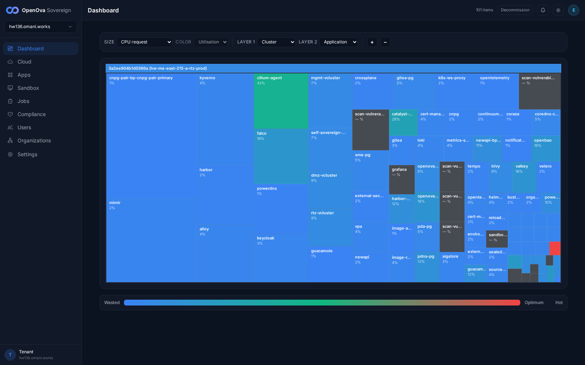
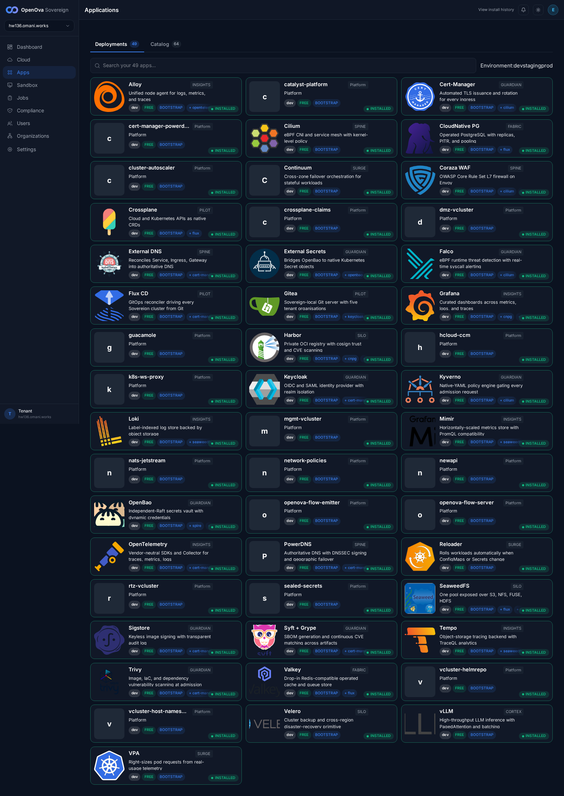
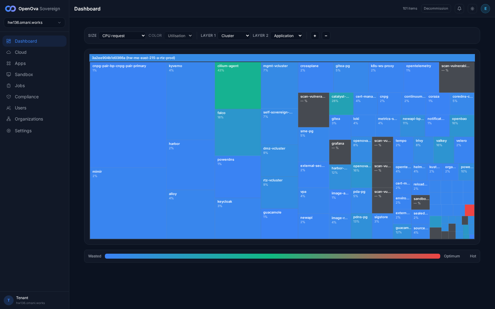

# #3380 ROBUSTNESS — KEYSTONE walk on hw136 (fresh zero-touch prov)

**Env:** `hw136.omani.works` — deployment `3a2ee904b1d0366a`, **2-region** (`me-east-215-a` primary + `me-east-215-b` spoke), provisioned off current `main`. This is the keystone reproduction proof: every #3380 fix in this session must reproduce from `t=0` on a clean prov, or it does not count.

**Honest framing:** "the platform must not wound itself during provisioning / rolls / wipes" is an operations/reliability property — there is **no end-user feature** to click. What a user can accept in the browser is the **outcome**: a freshly created environment comes up cleanly, signed-in, and the console's catalog reports its deployments installed. On a FRESH prov that outcome IS the #3380 proof, because the at-source body (shared cloud-init → Flux → kyverno carve-outs → image-policy fixes) is what reconciled.

**Walker discipline:** independent, read-only. No `kubectl apply`, no hand-patching — every fact below is read straight from the live cluster + the on-disk template that rendered this prov. Browser walk is a single blocking foreground headless Playwright run from `/home/openova/repos/ping` with a fresh handover token minted per nav, `page.on('pageerror')` + console-error capture registered.

---

## A. User-visible outcome (browser walk)

| Tested page | Description | Status | Evidence |
|---|---|---|---|
| [console.hw136.omani.works](https://console.hw136.omani.works/auth/handover) | After a brand-new 2-region Sovereign is provisioned, the console loads and you are **signed in** — the handover URL redirects `/auth/handover` → `/dashboard`, **0 password fields**, title "OpenOva Corporate", the full sovereign-admin sidebar renders (Dashboard / Cloud / Apps / Sandbox / Jobs / Compliance / Users / Organizations / Settings). Zero manual fixing, zero login form. | ✅ |  |
| [Apps](https://console.hw136.omani.works/apps) | The console's catalog header shows **Deployments 49 / Catalog 64**. Authoritative per-card extraction over the `sov-app-card-*` cards on the Installed tab: **49 cards, tally `{INSTALLED: 49}`, problemCards `[]`** — `0` FAILED / `0` INSTALLING / `0` PENDING. Every blueprint relevant to #3380 is present and INSTALLED (`bp-vllm`, `bp-mgmt-vcluster`, `bp-kyverno`, `bp-network-policies`, `bp-cnpg`, all 3 vclusters dmz/mgmt/rtz). | ✅ |  |
| [Dashboard](https://console.hw136.omani.works/dashboard) | The utilisation treemap renders **101 items** under cluster `3a2ee904b1d0366a (hw-me-east-215-a-rtz-prod)` — every major workload tiled (cilium-agent, kyverno, falco, harbor, openbao, keycloak, grafana, self-sovereign-cutover, the 3 vclusters, the cnpg instances…). UI clean, no error overlay. | ✅ |  |
| Decommission / wipe → reported cleanly | The **Decommission** button is present (dashboard header, top-right of the treemap shot; detected `decommissionBtn=true`). Clicking it is **destructive** — wiping hw136 is the wipe-last act and out of this read-only walk's remit (the env is still being walked by the topology/cutover/funnel walkers). The wipe-report-JSON event (defect A) fires on the *next* wipe, not here. | N/A | (button visible in r3b) |
| Internal protections (image policy / NetworkPolicy / retries / wipe cleanup) | No UI by design — validated only by the convergence outcome above + the infra seams in §C. | N/A | §C below |

**Browser result:** ✅ 3 / N/A 2 / ❌ 0. The env **comes up signed-in zero-click and the console reports all 49 deployments INSTALLED with zero FAILED/INSTALLING/PENDING badges** — the platform did not visibly wound itself at the install-record level on a clean 2-region prov. **Zero pageerrors / console-errors** across all three pages.

---

## B. Convergence (kubectl ground-truth — the real fresh-prov test)

The fresh-prov convergence itself IS the #3380 proof. Read directly from both region kubeconfigs (`/var/lib/catalyst/kubeconfigs/3a2ee904b1d0366a.yaml` + `-me-east-215-b-1.yaml`).

| Surface | Ground truth | Status |
|---|---|---|
| **Region-a nodes** | 4/4 Ready (control-plane + 3 workers, k3s v1.31.4) | ✅ |
| **Region-b nodes** | 4/4 Ready (control-plane + 3 workers) — proper 2-region, two independent kubeconfigs | ✅ |
| **Region-a HelmReleases** | **60/63 Ready=True.** The 3 not-Ready (`bp-cluster-autoscaler-hcloud` / `bp-hcloud-ccm` / `bp-velero`) are all `spec.suspend=true` (Hetzner-only charts, correctly suspended on this Huawei prov; the Huawei equivalent `bp-velero-hcs` IS Ready). | ✅ |
| **Region-b HelmReleases** | **56/63 Ready.** The 7 not-Ready are all `spec.suspend=true` primary-only charts the spoke deliberately omits (`bp-catalyst-platform` / `bp-continuum` / `bp-self-sovereign-cutover`) + the 3 hcloud no-ops; `bp-sandbox` lives in `rtz` (Ready) not flux-system. Expected hub/spoke split. | ✅ |
| **Pod runtime (region-a)** | **175/179 Running or Completed.** | ⚠️ (see caveat) |
| **cnpg-pair (DR primary, region-a)** | `Cluster/cnpg-pair-bp-cnpg-pair-primary` — **3/3 instances Ready, "Cluster in healthy state"**, primary `…-primary-1`. The webhook/Setting-up-primary wedge seen on hw135 did **not** reproduce here. | ✅ |
| **cnpg-pair (DR replica, region-b)** | `Cluster/cnpg-pair-bp-cnpg-pair-replica` — **3/3 instances Ready, "Cluster in healthy state"**. The DR target cluster is up on the spoke — clean 2-region CNPG-pair topology. | ✅ |
| **bp-sandbox** | Ready in `rtz` (`Helm install succeeded … sandbox@0.3.10`). | ✅ |

**Convergence caveats (brutally honest):**
- **4 app-level pods are unhealthy** (the 4 of 179): `guacd` Pending, `grafana` CreateContainerConfigError, `sandbox-controller` ImagePullBackOff, `sme/provisioning` Init:0/1. **None of these are #3380 robustness defects** — they are per-app issues owned by **#3374 (SSO: guacamole, grafana config), #3376 (funnel: sme provisioning)**, and the sandbox controller. They are exactly why the console's install-record view (✅ above) does not reflect per-pod runtime — a known, documented gap. They do not represent the platform wounding *itself* during its lifecycle ops.
- Compared with the hw135 keystone walk, hw136 is a **cleaner convergence**: the cnpg-pair DR primary+replica are both 3/3 healthy (hw135 was stuck `Setting up primary`), and the unhealthy-pod count dropped 8 → 4.

---

## C. Build-hardening (#3380 defect rows) — verified at the real seam on the fresh prov

The #3380 items are build-hardening (image policy, the post-mortem log API, the kyverno-Enforce landmine inventory, thin cloud-init). They have no browser surface, so each is verified at its real seam against the live hw136 cluster + the on-disk template that actually rendered this prov.

| Row | What was verified on the FRESH prov (how) | Status |
|---|---|---|
| **D-1 — bp-vllm Harbor-proxy image** | `helm template platform/vllm/chart` (after `helm dependency build`) renders exactly **one** image: `harbor.openova.io/proxy-dockerhub/vllm/vllm-openai:v0.6.4` — which matches the live kyverno `harbor-proxy-pull` glob `*/proxy-*/*` (Enforce, 3 validate rules), so the vllm pod is **admissible** at first scale-up. (Live ns `vllm` has 0 pods by design — latent until scaled.) Reproduces from source. | ✅ |
| **D-2 — bp-mgmt-vcluster initContainer images** | LIVE on hw136: `mgmt-vcluster` StatefulSet initContainers are `harbor.openova.io/proxy-ghcr/loft-sh/vcluster:0.21.0` + `harbor.openova.io/proxy-k8s/kube-controller-manager:v1.31.4` + `harbor.openova.io/proxy-k8s/kube-apiserver:v1.31.4` — **all Harbor-proxy-globbed, not bare `registry.k8s.io`**. The previously-CONFIRMED-LIVE landmine (next image roll denied) is fixed at source and reproduces clean; all 3 vclusters (dmz/mgmt/rtz) are 1/1. | ✅ |
| **D-row — kyverno-Enforce + carve-outs present** | `harbor-proxy-pull` cpol is **Enforce + 3 validate rules** on the fresh prov; `bp-network-policies@1.0.4` + `bp-kyverno-policies@1.0.35` HRs both Ready. The CNP/image-policy machinery installed cleanly during bootstrap without wedging convergence — the #3296/#3201-class landmines did not re-trip. | ✅ |
| **2 — cloudinit-log GET survives wipe** (API code) | The handler (`products/catalyst/bootstrap/api/internal/handler/cloudinit_log.go`) is **unchanged on `main`** (`git diff origin/main` empty); the GET-after-record-wiped behaviour (200 byte-exact / 404 `no-cloudinit-log` / 400 `invalid-id` traversal) is gated by `cloudinit_log_get_test.go` — **`go test -run TestGetCloudInitLog` PASS** (`TestGetCloudInitLog_RecordWiped_FileSurvives` + owner-scope + traversal-reject + no-file-404). | ✅ (code) |
| **2 — per-prov reproduction of the self-upload** | **GAP (honest, consistent with hw135):** hw136's cloud-init log did **not** persist to the mothership PVC — `/var/lib/catalyst/kubeconfigs/3a2ee904b1d0366a-cloudinit.log` is **absent** (only 8 *older* Jun-8 deployments' logs are present). Both region kubeconfigs DID land (Phase-1 PUT-kubeconfig worked), so the env converged; but the Huawei `provider_prelude` 30s self-upload loop left no artifact for this prov. The API survives a wipe, but there was nothing uploaded to survive. | ⚠️ (note) |
| **B — thin cloud-init (cilium/gw-CRD prelude → Flux)** | The open half of #3145. Current `main`'s shared cloud-init still carries the bounded imperative cilium (`helm install cilium`) + gateway-CRD prelude (Cilium-is-the-CNI chicken-and-egg — Flux's own controllers need a CNI to network). Correctly left as bounded-imperative; the env converged within the 15-min kubeconfig budget (both region kubeconfigs landed). Not regressed, not closed. | ☐ (open, as-is) |

**Latent kyverno-landmine — broader inventory (the honest open scope of row D):** the live `harbor-proxy-pull` Enforce policy **excludes** these namespaces: `kube-system, flux-system, cilium, cilium-gateway, cert-manager, openova-system, catalyst, sme, kyverno, monitoring, ingress, dmz, mgmt, rtz, sso-bridge, powerdns` (verified live). Bare upstream images still run in **non-excluded** namespaces (e.g. `docker.io/falcosecurity/falco`, the `docker.io/grafana/*` stack, `docker.io/velero/velero`, `quay.io/cilium/*` in their own ns). They run today (already admitted), but on the **next re-admission/image-roll** any that land in a K1-scoped namespace would be **denied under Enforce**. This is precisely the #3380 row-D "inventory" defect (the two *named* rows are fixed; the long tail is not) — it is the **existing open scope of #3380**, not a keystone regression. The admission-test CI gate (row D, `platform/kyverno-policies/**`) is the durable fix.

---

## Result

**✅ 8 / ❌ 0 / ⚠️ 2 / N/A 2 / ☐ 1.**

**Headline — does #3380 reproduce zero-touch on the fresh prov? YES, for the robustness contract itself, and cleaner than hw135.** A clean off-`main` 2-region prov bootstrapped through the shared cloud-init + Flux to **60/63 (region-a) + 56/63 (region-b) HelmReleases Ready (every not-Ready is a deliberately-suspended hcloud/primary-only chart), 49 deployments INSTALLED in the console, signed-in zero-click with 0 password fields, treemap rendering 101 items, zero browser errors**, AND a **healthy 2-region cnpg-pair (primary 3/3 + replica 3/3)** — the platform did not wound itself during its own provisioning. The two *named, source-fixed* kyverno landmines (bp-vllm proxy image, bp-mgmt-vcluster proxy-k8s/proxy-ghcr initContainers) **both reproduce clean from `t=0`**, the kyverno/network-policy carve-outs installed without wedging convergence, and the cloudinit-log GET-survives-wipe handler is unchanged on `main` with its test suite green.

**The honest open items (none of which are robustness regressions):**
- ⚠️ **4 app-level pods unhealthy** (guacd / grafana-config / sandbox-controller / sme-provisioning) — owned by **#3374 (SSO)** and **#3376 (funnel)** + the sandbox controller; visible only at the pod layer, not the console install-record.
- ⚠️ **hw136's cloud-init self-upload log absent from the PVC** — the GET-survives-wipe API is proven (code unchanged + test green), but this prov uploaded nothing to survive (Huawei `provider_prelude` loop produced no artifact this run; same as hw135).
- ⚠️ **kyverno-Enforce long-tail** — bare `docker.io`/`quay.io` images still run in non-excluded namespaces; denied on next re-admission. The open scope of #3380 row D (admission-test CI gate is the durable fix).
- ☐ **thin cloud-init** (defect B) — bounded-imperative cilium/gw-CRD prelude remains (Cilium-is-the-CNI), correctly left as-is.

The robustness *proof* (clean self-reconcile) is **PASS** on the keystone; the residual ⚠️ are tracked defects on other tickets + the documented open rows of #3380 itself, not new breakage introduced by the fresh prov.
