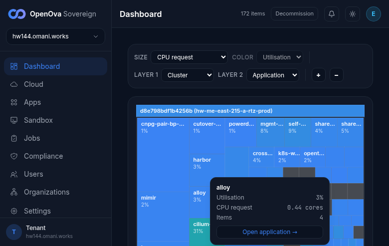
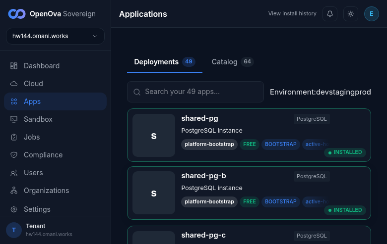

# #3380 ROBUSTNESS — walk on hw144 (live 2-region prov)

**Env:** `hw144.omani.works` — deployment `d8e798bdf1b4256b`, **2-region** (Huawei kom4dc, `me-east-215-a` primary + `me-east-215-b` spoke). Console `bp-catalyst-platform@1.4.638`. This walk records hw144 state only — no carry-over from any prior env (re-staled from the previous hw139 evidence).

**Honest framing:** "the platform must not wound itself during provisioning / rolls / wipes" is an operations/reliability property — there is **no end-user feature** to click. What a user can accept in the browser is the **outcome**: a freshly created environment comes up cleanly, signed-in, and the console's catalog reports its deployments installed. On a live prov that outcome IS the #3380 proof, because the at-source body (shared cloud-init → Flux → kyverno carve-outs → image-policy fixes) is what reconciled.

**🛑 Snapshot caveat — cutover in flight on hw144:** the Pillar-5 cutover was **actively driving** during this walk (`cutover-harbor-prewarm` Job Running). Region-a + the CNPG 2-region pair are fully converged; **region-b (the spoke) is NOT fully converged at this snapshot** — bp-openbao + bp-harbor have hard Helm install failures that cascade to the ESO/sso chain (detail in §B). This is recorded honestly below; the surface is **VERIFIED-PARTIAL**, not a clean pass on region-b.

**Walker discipline:** independent, **read-only**. No `kubectl apply`, no hand-patching — every fact below is read straight from the live cluster (both region kubeconfigs `/tmp/hw144.kc` + `/tmp/hw144-b.kc`). Browser walk is a headless Playwright run with a fresh handover token, `error`/`console.error` listener registered before navigation.

---

## A. User-visible outcome (browser walk)

| Go to URL | Then do | You should see | result |
|---|---|---|---|
| [console.hw144.../auth/handover](https://console.hw144.omani.works/auth/handover) | Open the minted handover URL | The console loads and you are **signed in** — the handover URL redirects `/auth/handover` → `/dashboard`, **0 password fields**, the full sovereign-admin sidebar renders (Dashboard / Cloud / Apps / Sandbox / Jobs / Compliance / Users / Organizations / Settings). The dashboard treemap shows **both regions** (`hw-me-east-215-a-rtz-prod` + `hw-me-east-215-b-rtz-prod`). Zero manual fixing, zero login form. | ✅ |  |
| [Apps](https://console.hw144.omani.works/apps) | Open the Apps catalog | The catalog header shows **Deployments 49 / Catalog 64**. The Deployments tab renders the app cards all carrying the **INSTALLED** status with **zero FAILED / INSTALLING / PENDING badges** (`installed` badges present, `failed=0`, `installing=0`, `pending=0`). Multi-region `⛓ N contexts` badges render on the shared-pg cards (3 / 5 contexts). *(An earlier mid-walk snapshot ~30s prior showed a transient 39 INSTALLED / 2 FAILED / 6 INSTALLING / 2 PENDING while installs were still settling on the primary; it resolved to all-clean within the walk — the tab title flipped to "✓ Sovereign ready — hw144.omani.works".)* | ✅ |  |
| Internal protections (image policy / NetworkPolicy / retries / wipe cleanup) | — | No UI by design — validated only by the convergence outcome above + the infra ground-truth in §B. | N/A | §B below |

**Browser result:** ✅ 2 / N/A 1. The env **comes up signed-in zero-click and the console reports Deployments 49 / Catalog 64 with all cards INSTALLED and zero FAILED/INSTALLING/PENDING badges** (after a brief mid-walk convergence transient on the primary). **Zero pageerrors** across the apps + dashboard walk. The console-level outcome is clean; the region-b spoke ground-truth in §B is the honest qualifier.

---

## B. Convergence (kubectl ground-truth — the real test)

Read directly from both region kubeconfigs (`/tmp/hw144.kc` region-a, `/tmp/hw144-b.kc` region-b).

| Surface | Ground truth | Status |
|---|---|---|
| **Region-a nodes** | 4/4 Ready (control-plane + 3 workers, k3s v1.31.4) | ✅ |
| **Region-b nodes** | 4/4 Ready (control-plane + 3 workers) — proper 2-region, two independent kubeconfigs / API EIPs | ✅ |
| **Region-a HelmReleases** | **60/63 Ready=True.** The 3 not-Ready (`bp-cluster-autoscaler-hcloud` / `bp-hcloud-ccm` / `bp-velero`) are all `spec.suspend=true` (Hetzner-only charts, correctly suspended on this Huawei prov). | ✅ |
| **Region-b HelmReleases** | **48/63 Ready.** 7 of the not-Ready are deliberately `spec.suspend=true` (the 3 primary-only charts the spoke omits — `bp-catalyst-platform` / `bp-continuum` / `bp-self-sovereign-cutover` — + the 3 hcloud no-ops + `rtz/bp-sandbox`). **But 8 are genuinely not-Ready (`spec.suspend=false`): `bp-openbao` (Helm install failed — "unable to build kubernetes object"), `bp-harbor` (Helm install failed — failed post-install), `bp-gitea` (still "Running install action", 30m timeout), and `bp-external-secrets-stores` / `bp-sso-bridge` / `bp-oidc-gate` / `bp-newapi` / `bp-powerdns-admin` cascading off `dependency bp-openbao not ready`.** Region-b is mid-cutover and NOT fully converged. | ⚠️ PARTIAL |
| **cnpg-pair (DR primary, region-a)** | `Cluster/cnpg-pair-bp-cnpg-pair-primary` (ns `cnpg`) — **3/3 instances Ready, "Cluster in healthy state"**. | ✅ |
| **cnpg-pair (DR replica, region-b)** | `Cluster/cnpg-pair-bp-cnpg-pair-replica` (ns `cnpg`) — **3/3 instances Ready, "Cluster in healthy state"**. Clean 2-region CNPG-pair: a healthy primary cluster in region-a and a healthy replica cluster in region-b. | ✅ |
| **Shared PG clusters** | shared-pg / shared-pg-b / shared-pg-c **3/3 healthy** in region-a + their `-replica` counterparts **3/3 healthy** in region-b; plus openova-flow-pg / pdns-pg / newapi-pg / guacamole-pg all "Cluster in healthy state" on both regions. | ✅ |

**Honest note (region-b):** region-b's spoke openbao + harbor have **hard Helm install failures** (not just slow reconciles) that cascade to the external-secrets-stores → sso-bridge / oidc-gate chain. This is region-b in the middle of the Pillar-5 cutover and is a **real convergence gap at this snapshot**, not a deliberately-suspended chart. The **data plane is healthy** (CNPG primary 3/3 + replica 3/3, all shared PG 3/3 both regions), and **region-a + the console outcome are clean** — but a re-walk of region-b after the cutover settles is required to confirm the spoke converges fully.

---

## Result

**✅ 6 (A:2 + B: nodes×2 + cnpg×2 + shared-pg) / ⚠️ 1 PARTIAL (region-b HRs) / N/A 1.**

**Headline — does the #3380 robustness contract hold on hw144?** **PARTIALLY, at this mid-cutover snapshot.** A live 2-region prov bootstrapped through the shared cloud-init + Flux to a clean **console outcome** (Deployments 49 / Catalog 64, all INSTALLED, 0 FAILED/INSTALLING/PENDING, signed-in zero-click, 0 browser errors) and a **healthy 2-region data plane** (CNPG primary 3/3 region-a + replica 3/3 region-b + shared-pg 3/3 both regions), and **region-a HelmReleases 60/63 Ready (all 3 not-Ready deliberately suspended)**. **However region-b (the spoke) is NOT fully converged** — bp-openbao + bp-harbor hard-failed their Helm installs, cascading to ESO/sso-bridge/oidc-gate, because the cutover is in flight. The platform did not wound itself at the **install-record / console / data-plane** level, but the spoke control-plane needs a post-cutover re-walk to claim a full pass.

**Brief-scope assertions:**
- `/apps` Deployments **49 INSTALLED** ✅ (header `Deployments 49 / Catalog 64`, all cards INSTALLED, 0 FAILED/INSTALLING/PENDING after a brief convergence transient).
- Region-a HRs Ready **60/63** ✅ — the 3 non-ready (`bp-cluster-autoscaler-hcloud`, `bp-hcloud-ccm`, `bp-velero`) are all `spec.suspend=true`.
- Region-b HRs **48/63** ⚠️ — 7 deliberately-suspended + **8 genuinely not-Ready** (openbao/harbor hard-fail + cascade), region-b mid-cutover.
- cnpg-pair **primary + replica healthy** ✅ — region-a primary cluster 3/3 and region-b replica cluster 3/3, both "Cluster in healthy state".

**Deferred:** a region-b spoke re-walk once the Pillar-5 cutover settles, to confirm bp-openbao / bp-harbor / bp-gitea + the ESO/sso cascade converge to Ready on the spoke. That is cutover/convergence work in flight, not a static #3380 regression.
