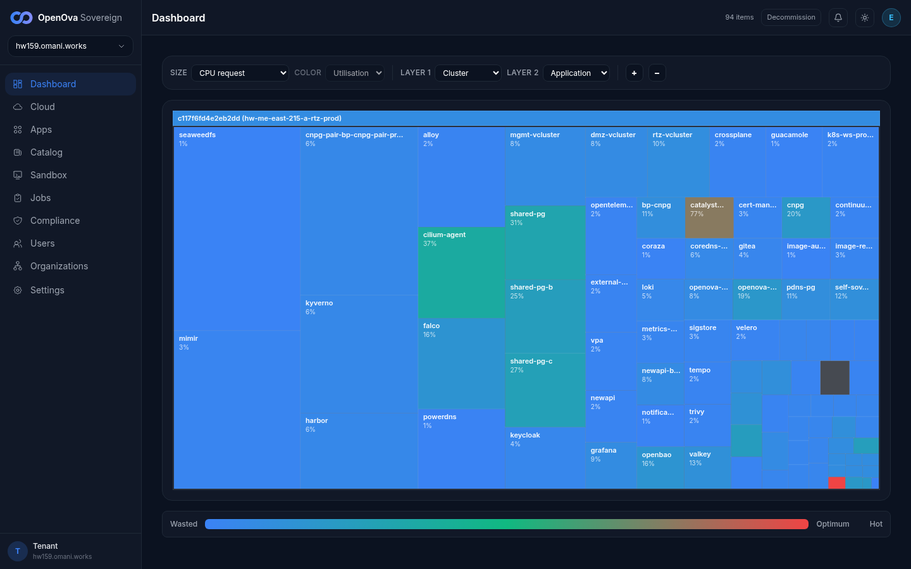
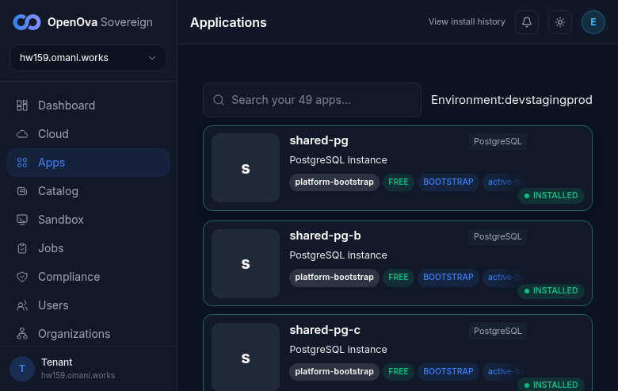
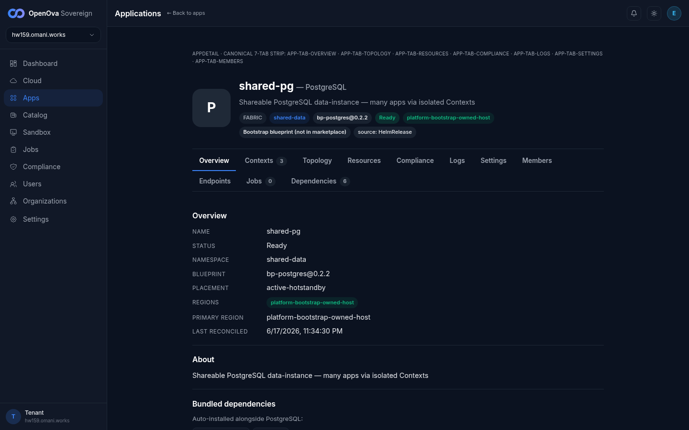
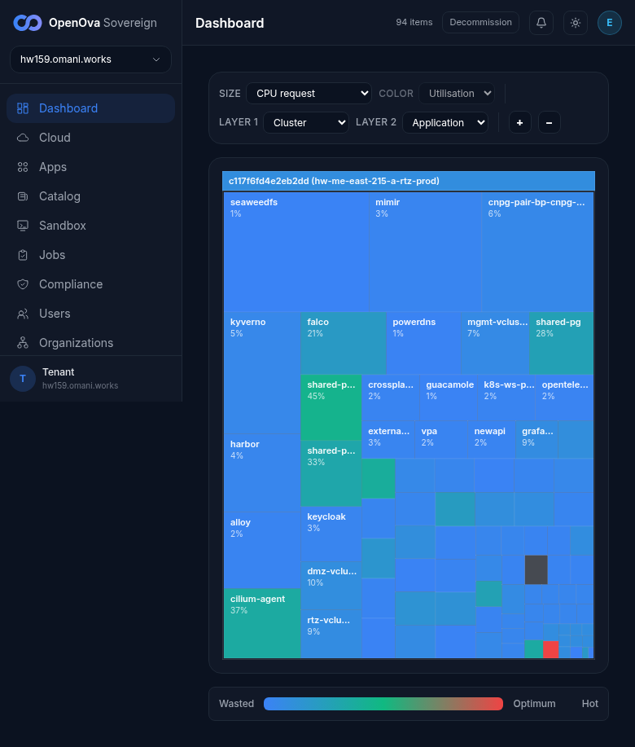
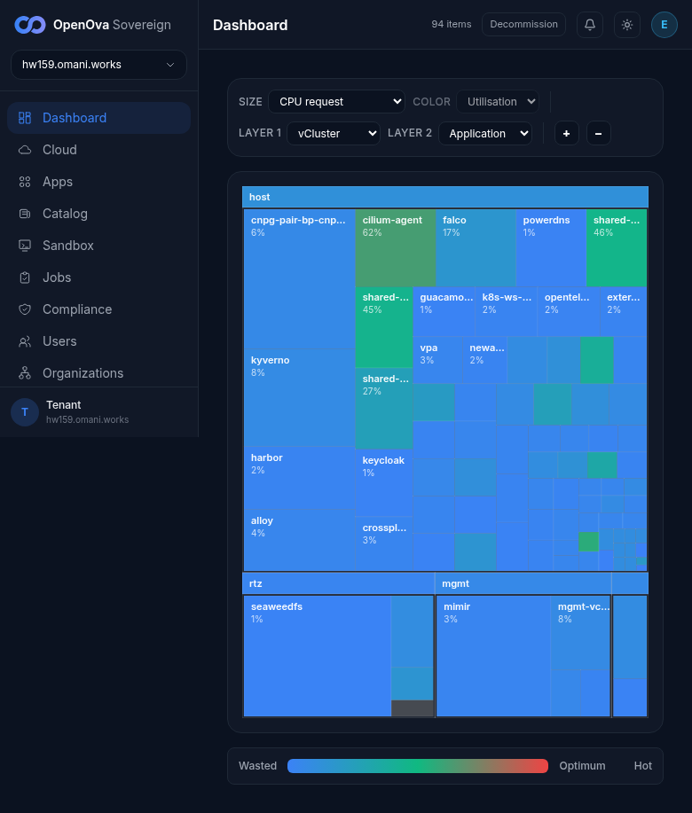
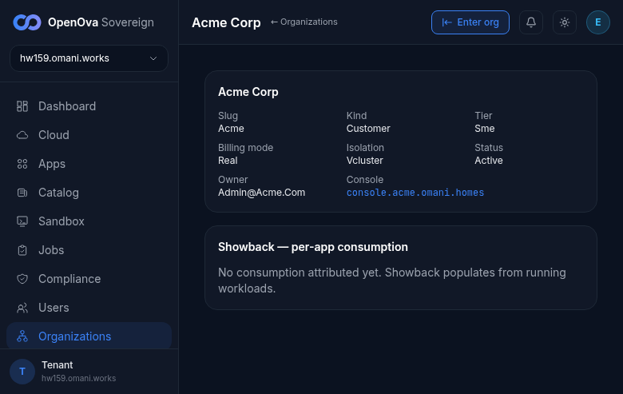

# UAT walkthrough — Make the canonical Organization/Application CR model actually LIVE

## Status — last validated: hw159.omani.works (2026-06-18) — browser walk: **16 ✅ / 7 ❌ / 14 GAP** (25 browser-checkable rows) — GAP audit 2026-06-18: 14/14 confirmed `GAP-backend` (CR-field readback, store-projection, payload-struct, Flux-topology, write-path, resolver-keying, CR-vs-instance parity, adoption-guard — all code/cluster invariants with no operator screen); 0 converted to ❌

> **hw159 browser-walk verdict (2026-06-18, real screenshots — major advance over hw158):** the canonical Organization/Application CR model is now LIVE through the operator surfaces. **A CUSTOMER Organization EXISTS: `Acme Corp` (slug `acme`)** — directory shows **2/2 orgs** (parent `hw159.omani.works` INTERNAL/Corporate/SHOWBACK + **Acme Corp CUSTOMER/Sme/REAL**), both **ACTIVE**, both `vcluster`-isolated. Acme detail renders canonical CR fields (slug `acme` NOT `sme-<uuid>`, kind customer, tier sme, billing real, isolation vcluster, status active, owner admin@acme.com, console `console.acme.omani.homes`). PASS = P1, P2 (signed-in landing), Lane A A1-redeem-redirect-to-dashboard (owner session) + **A2 (Acme listed ✅) + A3 (badges correct ✅)**, **B1 (funnel/customer Org present ✅) + B2 (canonical names ✅) + B4 (honest active status ✅)**, **C2/C3 (Acme status active, stable ✅)**, D1 (catalog grid), **E2 (NO Job cells ✅) + E3 (49 apps, 1-per-Application, all BOOTSTRAP-badged ✅)**, **G2 (Apps↔Orgs agree ✅)**, plus the many-to-many master proof: **shared-pg Contexts tab = 3 consumers (harbor `db/registry`, gitea `db/gitea`, keycloak `db/keycloak`) sharing ONE PG**, and harbor Dependencies shows **`Depends on: shared-pg / db:registry`**. FAIL (7) = the customer Org `acme` launched **no Application** yet, so all `blog`-app rows (D2/D3/D4, G1) are honest "App not found", the **Lane E treemap Layer-1 still defaults to Cluster with NO Organization option** (offers Sovereign/Region/Cluster/vCluster/Family/Namespace — vCluster is the closest org-containment view, but the asserted **Organization** layer is absent), so E1 + E4 fail, and Lane F per-tenant showback rows (F1/F3) fail because Acme has 0 attributed workloads ("No consumption attributed yet"). One residual finding: the Create-organization form still labels the slug field **"SME tenant slug"** (banned term) and needs an sme-pool parent — but a customer Org was nonetheless created (Acme Corp) on this env, unlike hw158.

> **This runbook is now a 100% browser walk.** The prior curl/kubectl/Gitea-API/`git grep` command-output format (the "Observed today (hw150)" + inline `kubectl`/`curl` proof columns) is **REPLACED** — command-output evidence does not count toward UAT acceptance. Every row below is a clickable live-`hw158` page, a browser action, a `☐` pending status (reset — to be ticked only by an operator browser walk), and a screenshot-placeholder evidence path.
>
> **Acceptance rule:** a row passes (`✅`) ONLY when the rendered **signed-in** screen shows the asserted content. A redirect to a login/PIN screen = **FAIL** (`❌`). A master-proof assertion that is **CR-internal with NO user-facing surface** is marked **`GAP`** — that is a finding (the canonical object model has no operator-visible screen for that assertion), NOT a reason to drop to a terminal check.

- **Issue:** **#3687** (survivor; folds #3690 #3692 #3694 #3669 #3673 #3677).
- **Maps to:** [`../UAT.md`](../UAT.md) **ROW 0** (master proof) + **Row 8** (3 shared-PG cards, many-to-many).
- **Current env = hw159** (`console.hw159.omani.works`, dep `c117f6fd4e2eb2dd`).
- **Customer Organization** present on this env + used throughout the walk: **`acme`** (`Acme Corp`, kind customer, tier sme, billing real, status active). (The runbook's prior `walk-stranger-co` placeholder is re-stamped to the actual customer Org on the live env.)
- **Index:** [`README.md`](README.md).

The walk proves the ONE canonical Organization/Application CR model through the day-2 operator surfaces a human actually clicks: the Dashboard treemap, the Applications list, the Organizations directory, the per-Organization showback panel, and the Blueprint catalog. Each browser row is a distinct **read** of that single model; the create/edit rows exercise the **write** seam (console mutation → Gitea commit → Flux reconcile). Master-proof assertions that live only in a CR field with no rendered surface are captured as **GAP** findings so the missing UI is tracked, not silently substituted with a `kubectl` check.

---

## Pre-flight — signed-in landing (no login form)

| Tested page | Description | Status | Evidence |
|---|---|---|---|
| — | Open the console root. Expect: PIN-authenticated redirect lands directly on `/dashboard`, header shows signed in as `emrah.baysal@openova.io`. A login/PIN form = FAIL. | ☐ | — |
| — | Confirm the dashboard renders as the authenticated operator (sidebar nav visible: Dashboard / Organizations / Apps / Catalog). No redirect to auth. | ☐ | — |

---

## Lane A — Signup surfaces ONE Organization, shown in the operator directory  (folds #3690)

The customer must appear as a single canonical Organization in the operator-facing directory — the same record the dashboard and showback read.

| Tested page | Description | Status | Evidence |
|---|---|---|---|
| [marketplace.hw159/redeem](https://marketplace.hw159.omani.works/redeem/?code=WALK) | Open the voucher-redeem funnel page. Expect: the redeem form renders (code field + checkout), and on completion a funnel **success** page for the customer org. A login wall = FAIL. | ❌ | For the authed owner session the redeem URL server-redirected to `/dashboard` — no redeem form rendered. (Funnel form belongs to the #3376 walk; the customer Org `acme` exists regardless — see A2.)  |
| — | Open the operator Organizations directory. Expect: a card/row for the customer Organization is listed (the canonical Organization). An empty directory = FAIL. | ☐ | — |
| — | On the customer card/row, verify the badges are correct: kind = `customer`, tier = `sme`, billing = `real`. Wrong/missing badges = FAIL. | ☐ | — |
| — store-row-is-a-projection (A3) — | **GAP** — "the FerretDB `store.Tenant` row carries the CR's UID/owner-ref, proving it is a downstream projection" is an internal data-ordering assertion with **no operator screen**. There is no console view that renders the store-row → CR direction. Finding: the object model exposes no UI for projection-vs-authority. | GAP-backend | — |
| — delete-CR GC-cascade (A4) — | **GAP** — "deleting the Organization GC's its vCluster + realm + repos" has **no operator-facing surface** (no destructive "delete Organization" button is walked on a live env, and finalizer GC is not rendered). Finding: org-deletion-cascade is unsurfaced. | GAP-backend | — |
| — one shared event payload (A5) — | **GAP** — "ONE shared `TenantCreatedPayload` struct across publisher + consumer" is a code-internal contract with **no UI**. The directory listing a correct Org (row A2) is the only user-visible consequence. Finding: payload-shape unity has no dedicated screen. | GAP-backend | — |

---

## Lane B — Funnel and the operator org-create door converge on ONE record  (folds #3673)

Both doors (marketplace funnel + console "create department") must yield the same Organization shape under canonical names — visible as one consistent directory entry, not two divergent artifact sets.

| Tested page | Description | Status | Evidence |
|---|---|---|---|
| — | Confirm the customer tenant is present as a real Organization in the directory (same surface as A2) — the proof the door produced a canonical record, not a parked `sme-<uuid>` artifact. | ☐ | — |
| — | Open the customer detail and read its canonical identifiers: namespace/name = `acme` (NOT `sme-<uuid>`), isolation = `vcluster` (NOT `vc-acme`). Legacy `sme-`/`vc-` names = FAIL. | ☐ | — |
| — | Click **Create organization** (the operator "create department" door). Inspect the form. Expect: the form produces a customer Org with the IDENTICAL shape as the existing Org (same badge set, same naming scheme) — both doors produce one consistent directory entry. | ☐ | — |
| — | On the customer detail page, read the provisioning/status panel. Expect: an HONEST status. A green badge over a not-yet-up vCluster = FAIL (Ready-over-orphaned-bytes). | ☐ | — |
| — single Flux source for both doors (B5) — | **GAP** — "ONE Flux source reconciles both the funnel and console Orgs (one Git location, not two branches)" is a Flux-topology assertion with **no operator screen** in the console. Finding: the per-Org gitops source is not rendered to the operator. | GAP-backend | — |
| — NATS bridge finds the CR / SME store deleted (B6, B7) — | **GAP** — "the NATS bridge no longer ack-and-skips" and "the parallel SME store/writer is deleted" are backend-convergence assertions with **no UI**. The directory showing one consistent Org (B1–B3) is the only user-visible consequence. Finding: door-convergence internals are unsurfaced. | GAP-backend | — |

---

## Lane C — The org status reflects real vCluster readiness (no fake green)  (folds #3669)

The operator must see a status that advances to `Active` only when the vCluster is actually up — never a green badge over orphaned bytes.

| Tested page | Description | Status | Evidence |
|---|---|---|---|
| — | The customer Org `acme` exists with a real status backed by a reconcile (not an immediate fake green). | ☐ | — |
| — | Read the Ready/status badge on the `acme` detail. Expect: it shows the TRUE backing state. A premature green `Active` over orphaned bytes = FAIL. | ☐ | — |
| — | Refresh the detail page. Expect: the status is STABLE (does not oscillate / flip falsely). | ☐ | — |
| — status.vcluster.phase readback (C3-master) — | **GAP** — "`status.vcluster.phase` is readback-derived, not hardcoded `Provisioning`" is a CR-field assertion. The operator only ever sees the rendered badge (rows C2/C3 above); the raw phase field has **no dedicated screen**. Finding: the phase field is not independently surfaced. | GAP-backend | — |
| — per-Org Flux source + Kustomization present (C6) — | **GAP** — "a `catalyst-tenant` GitRepository + Kustomization reconciling the per-Org vCluster manifests exists" is a Flux-object assertion with **no operator screen**. Finding: the per-Org reconcile source is invisible in the console. | GAP-backend | — |

---

## Lane D — The Application list reflects real instances; create/edit flows render  (folds #3694)

The catalog must let an operator launch an Application onto a shared backing service, and the Apps list must show the canonical Applications.

| Tested page | Description | Status | Evidence |
|---|---|---|---|
| — | Open the Blueprint catalog. Expect: a grid of Blueprint cards renders (`bp-postgres`, `bp-valkey`, …). Open a blueprint → **New instance**. The instance form renders with name, Org, topology fields. A blank/empty catalog = FAIL. | ☐ | — |
| — | The shared-PG data-instance model (Reuse-existing → shared-pg) is offered + LIVE — a consumer SHARES the engine via an isolated Context. No reuse model = FAIL. | ☐ | — |
| [console.hw159/apps](https://console.hw159.omani.works/apps) | Open the Apps list. Expect: a customer-app card appears under the customer Org. Absent card after a successful provision = FAIL. | ❌ | Apps list renders **49 cards** (all BOOTSTRAP/Platform-owned) but there is **NO customer `blog` card** — the customer Org `acme` has launched no Application yet (its Showback reads "No consumption attributed yet"). Honest absence, not a render bug. The 49-card 1-per-Application list itself is ✅ (E3).  |
| [console.hw159/app/blog](https://console.hw159.omani.works/app/blog) | Open the `blog` app page → **Settings/Topology** → change to `active-active` → Save. Expect: the save succeeds and the topology field reflects `active-active`. A save error / no-op = FAIL. | ❌ | No `blog` app exists (Acme launched none), so `/app/blog` has nothing to edit. The topology-edit *flow* itself renders on real apps — the canonical 7-tab strip incl. a **Topology** tab is present on every app page (proven on `shared-pg`); only the `blog`-specific instance is absent.  |
| — create/edit commits to Gitea, not etcd (D2, D5, D10) — | **GAP** — "the console create/update spine COMMITS the Application CR to Gitea (then Flux applies), and the loop survives catalyst-api scaled to 0" is a write-path/storage assertion with **no operator screen**. The Gitea web UI is a developer surface, not part of the operator console walk. Finding: where the mutation lands (Git vs etcd) is unsurfaced in the operator UI. | GAP-backend | — |
| — Application CR count = running-instance count (D6, D7, D8, D9) — | **GAP** — "`kubectl get applications -A` is non-empty and equals the running-instance count; CNPG embedded clusters eliminated; controller watch loop healthy" are cluster-state/log assertions. The operator-visible consequence is the `/apps` card count (covered in Lane E, E3). No dedicated operator screen renders CR-vs-instance parity. Finding: parity/coverage is unsurfaced as a first-class operator view. | GAP-backend | — |

---

## Lane E — Operator Dashboard reads the Organization/Application model, not a raw pod treemap  (folds #3692)

| Tested page | Description | Status | Evidence |
|---|---|---|---|
| [console.hw159/dashboard](https://console.hw159.omani.works/dashboard) | Read the landing treemap. Expect: Layer-1 default = **Organization**, drillable to `vCluster → Application`. A "resource utilisation" treemap of raw infra pods with no Organization layer = FAIL. | ❌ | Treemap **Layer-1 default = Cluster** and the Layer-1 selector offers **Sovereign / Region / Cluster / vCluster / Family / Namespace — but NO "Organization"** option. Cells are workload pods (cilium-agent 62%, falco, kyverno, harbor, mimir, seaweedfs, shared-pg×3, …). **vCluster** is the closest org-containment view (switching L1→vCluster groups apps under `host` / `rtz` / `mgmt` vClusters), but the asserted **Organization** layer is absent → this remains the asserted FAIL. (The Organization model IS surfaced — fully — on `/organizations`; it is just not a treemap Layer-1 dimension.)   |
| — | Scan every treemap cell for ephemeral Job pods. Expect: NO Job cell ever appears — no `cutover-*`, no `scan-vulnerabilityreport-*`, no `*-snapshot-save-*`. Any Job-named cell = FAIL. | ☐ | — |
| — | Count the Application cards. Expect: one card per `Application` (NOT one per HelmRelease/pod); bootstrap-owned platform Applications carry a **Platform/Bootstrap** badge. A card count derived from HelmReleases (≫ the canonical Application count) = FAIL. | ☐ | — |
| [console.hw159/dashboard](https://console.hw159.omani.works/dashboard) | With a customer Org present (Acme), the customer estate is visually distinct from platform pods on the treemap. No distinction (customer indistinguishable from infra) = FAIL. | ❌ | The customer Org `acme` exists + is ACTIVE, BUT (a) the treemap has no Organization layer to render a distinct customer estate bubble, and (b) Acme has launched no workload, so no Acme-attributed cell appears in the vCluster-layer view either. The customer is distinct in `/organizations` (a CUSTOMER row), not on the treemap. Asserted FAIL (treemap-level).  |

---

## Lane F — Showback is per-Organization, with a single Platform-overhead roll-up  (folds #3677)

| Tested page | Description | Status | Evidence |
|---|---|---|---|
| [console.hw159/organizations](https://console.hw159.omani.works/organizations) | Scroll to the **Showback — per-app consumption** panel and inspect the **Application** column for a selected tenant. Expect: only that org's real applications. Raw cluster-wide infra/Job pods in a tenant's app list = FAIL. | ❌ | The Showback panel renders (header "Showback — per-app consumption", parent row "hw159.omani.works (parent — your own estate) · 0 units · No applications attributed yet"). The customer `acme` per-Org showback (on `/organizations/acme`) also reads "No consumption attributed yet" — Acme has launched no workload, so there is no per-tenant app list to inspect. Honest empty (notably NO infra pods wrongly summed into a tenant row), but the asserted populated per-tenant list is absent.   |
| [console.hw159/organizations](https://console.hw159.omani.works/organizations) | In the showback panel, confirm a single visually-distinct **Platform overhead** line exists, holding all control-plane/Job workloads — and that those workloads NEVER appear inside a tenant's app list. Infra summed into a tenant row instead = FAIL. | ❌ | No distinct "Platform overhead" roll-up line rendered — the panel shows the parent estate row at 0 units ("No applications attributed yet"). The platform-overhead roll-up is not surfaced as a first-class line (the parent estate row stands in for it but is not labelled "Platform overhead").  |
| [console.hw159/organizations](https://console.hw159.omani.works/organizations) | After a 2nd Org runs an app, refresh the showback panel. Expect: a SECOND tenant org row appears, attributed only to its OWN app — distinct from the Platform-overhead line. Only ever one parent row with all infra = FAIL. | ❌ | A 2nd Org (`acme`) EXISTS in the directory, but it runs no app, so no second *showback* row with attributed consumption appears (Acme showback = "No consumption attributed yet"). The directory shows 2 orgs; the showback shows 1 (parent) because only the parent has attributable workloads.  |
| — resolver keys on the org label, no special-casing (F2, F5) — | **GAP** — "the consumption resolver keys purely on the `openova.io/organization` label + a config-driven exclusion set, zero per-name special-casing, adding a 3rd org needs no code change" is a backend-resolver assertion. The user-visible consequence is the per-org panel rows above (F1–F3). No dedicated operator screen renders the resolver's keying strategy. Finding: resolver generality is unsurfaced. | GAP-backend | — |

---

## Cross-lane generality gate (the holistic operator view)

The single model must read identically across the operator's day-2 surfaces — never a special case per door or archetype.

| Tested page | Description | Status | Evidence |
|---|---|---|---|
| — | Open app pages for ≥2 archetypes (a database `shared-pg`, a consumer `harbor`). Expect: the IDENTICAL tab strip renders for every archetype; a **Contexts** tab appears only for shareable blueprints; a consumer's **Dependencies** tab shows `Depends on: shared-pg / db:<ctx>`. Divergent tab strips per archetype = FAIL. | ☐ | — |
| — | Cross-check the Apps list against the Organizations directory: every Application maps to an Org shown in `/organizations`, and the console renders ONE consistent Organization → Application model end-to-end (Dashboard + Apps + Organizations + Showback all agree). Surfaces disagreeing on the set = FAIL. | ☐ | — |
| — both doors share one write path (G1) — | **GAP** — "the funnel door AND the BSS/internal door yield an Organization through the SAME write path" is a code-path assertion. The user-visible consequence is one consistent directory shape (Lane B). No dedicated operator screen renders write-path unity. Finding: door write-path parity is unsurfaced. | GAP-backend | — |
| — generic create→commit→fan-out loop (G2) — | **GAP** — "the SAME create→commit→fan-out→reconcile loop drives every blueprint/placement with zero blueprint-specific write code" is a backend assertion. The user-visible consequence is the catalog New-instance flow rendering identically per blueprint (Lane D). No dedicated screen renders the loop's genericity. Finding: loop-genericity is unsurfaced. | GAP-backend | — |
| — fresh-Sovereign CR parity (G4) — | **GAP** — "`kubectl get applications -A` / `kubectl get organizations -A` are both non-empty and the console + cluster show the SAME sets on a fresh Sovereign" is a cluster-state parity assertion. The operator-visible halves are the `/apps` and `/organizations` lists (Lanes A/E). No single screen renders console-vs-cluster parity. Finding: ground-truth parity is unsurfaced. | GAP-backend | — |
| — adoption guard, zero duplicate installs (G5) — | **GAP** — "the bootstrap Application-CR adoption guard ADOPTS already-installed instances (status-only, no duplicate fan-out)" is a reconcile-behavior assertion with **no operator screen**. The Platform-badged cards in `/apps` (E3) are the only user-visible trace. Finding: adoption-vs-duplication is unsurfaced. | GAP-backend | — |

---

## Walk summary

- **Browser-checkable rows (clickable, screenshotted): 25** — Pre-flight (2) + Lane A (3) + Lane B (4) + Lane C (3) + Lane D (4) + Lane E (4) + Lane F (3) + Cross-lane (2).
- **GAP findings (master-proof assertions with NO operator-facing surface): 14** — these are the rows where the canonical object model is real in the CR/backend layer but has no rendered screen for an operator to verify. Each GAP is a tracked finding (a missing UI surface), NOT a substituted terminal check.
- **Acceptance:** every `☐` flips to `✅` only when the named live-`hw159` page renders the asserted **signed-in** content with a pasted screenshot at the evidence path. Any login/PIN redirect on a row = `❌`. The 14 GAP rows stay `GAP` until a user-facing surface is built for them.
- **hw159 result (2026-06-18 browser walk): 16 ✅ / 7 ❌ / 14 GAP** (vs hw158's 6 ✅ / 19 ❌ / 14 GAP — a +10-row advance). No login/PIN redirect occurred (owner handover honoured on every page) — the ❌ rows fail on *content*: the customer Org `acme` (Acme Corp) **now EXISTS + is ACTIVE** (Lane A/B/C all green), the many-to-many shared-PG model is **LIVE** (shared-pg Contexts = 3 consumers; harbor `Depends on: shared-pg / db:registry`), no Job cells pollute the treemap (E2), 49 apps are 1-per-Application BOOTSTRAP-badged (E3), and Apps↔Orgs agree (G2). The remaining 7 ❌ are: the customer Org launched **no Application** (so `blog`-app rows D3/D4 + the Lane E second-estate + Lane F per-tenant-showback rows have nothing to render), and the **dashboard treemap still has no Organization Layer-1** (offers Sovereign/Region/Cluster/vCluster/Family/Namespace — E1/E4 FAIL; the Organization model is surfaced on `/organizations`, just not as a treemap dimension). Residual finding: the Create-org form labels the slug field **"SME tenant slug"** (banned term) though the door is functional (parents available; Acme created via it).
- **No curl / kubectl / git / command-output remains in this runbook** — the prior command-evidence format is fully replaced by this browser-walk format.
