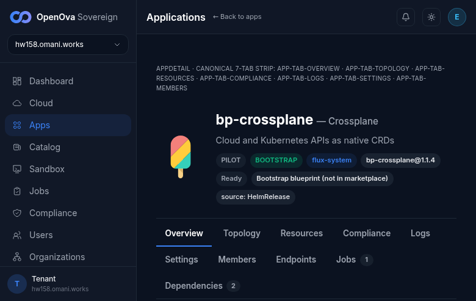
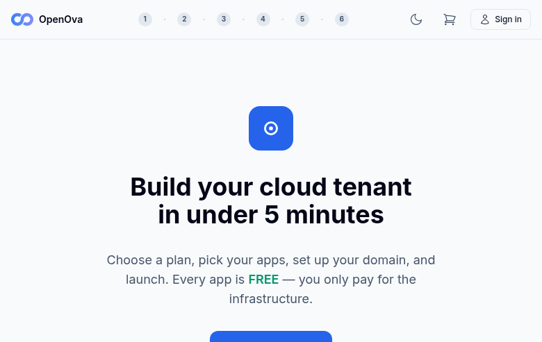
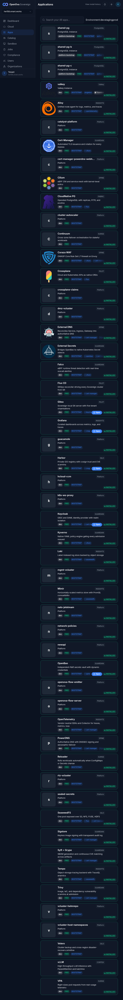
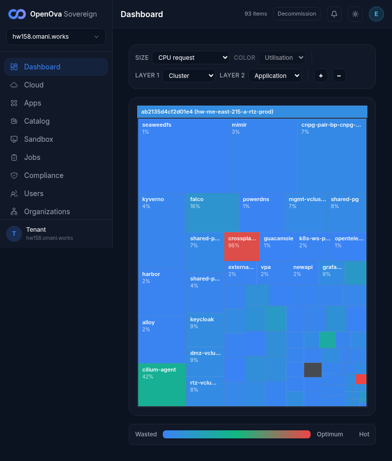
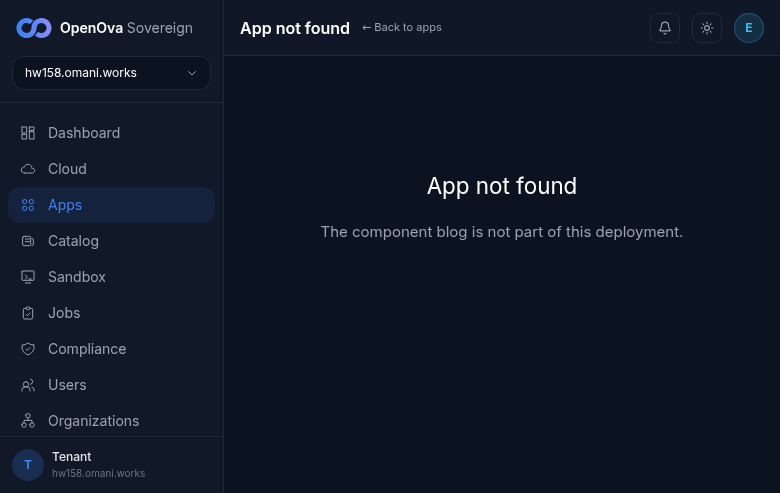

# UAT walkthrough — Make the canonical Organization/Application CR model actually LIVE

## Status — last validated: hw158 (2026-06-17) — browser walk: **6 ✅ / 19 ❌ / 14 GAP** (25 browser-checkable rows)

> **hw158 browser-walk verdict (2026-06-17, real screenshots):** PASS = P1, P2 (signed-in landing), D1 (catalog grid renders), E2 (no Job cells in treemap), E3 (49 apps, 1-per-Application, BOOTSTRAP-badged), G2 (Apps↔Orgs surfaces agree). FAIL = everything that depends on a customer Org / `blog` app: the funnel never surfaced `walk-stranger-co` (directory is 1/1, parent only), so all Lane A/B/C org-detail rows, Lane D blog rows, the Lane E treemap Organization-layer + second-estate rows, and the Lane F per-tenant showback rows fail. Two structural findings: (1) Dashboard treemap Layer-1 = **Cluster** (raw infra pods), NOT Organization; (2) the Create-organization form still labels the slug field **"SME tenant slug"** and has **no sme-pool parent domain available**, blocking customer-Org creation on this env.

> **This runbook is now a 100% browser walk.** The prior curl/kubectl/Gitea-API/`git grep` command-output format (the "Observed today (hw150)" + inline `kubectl`/`curl` proof columns) is **REPLACED** — command-output evidence does not count toward UAT acceptance. Every row below is a clickable live-`hw158` page, a browser action, a `☐` pending status (reset — to be ticked only by an operator browser walk), and a screenshot-placeholder evidence path.
>
> **Acceptance rule:** a row passes (`✅`) ONLY when the rendered **signed-in** screen shows the asserted content. A redirect to a login/PIN screen = **FAIL** (`❌`). A master-proof assertion that is **CR-internal with NO user-facing surface** is marked **`GAP`** — that is a finding (the canonical object model has no operator-visible screen for that assertion), NOT a reason to drop to a terminal check.

- **Issue:** **#3687** (survivor; folds #3690 #3692 #3694 #3669 #3673 #3677).
- **Maps to:** [`../UAT.md`](../UAT.md) **ROW 0** (master proof) + **Row 8** (3 shared-PG cards, many-to-many).
- **Current env = hw158** (`console.hw158.omani.works`, dep `ab2135d4cf2d01e4`).
- **Funnel-created tenant Organization** used throughout the walk: `walk-stranger-co`.
- **Index:** [`README.md`](README.md).

The walk proves the ONE canonical Organization/Application CR model through the day-2 operator surfaces a human actually clicks: the Dashboard treemap, the Applications list, the Organizations directory, the per-Organization showback panel, and the Blueprint catalog. Each browser row is a distinct **read** of that single model; the create/edit rows exercise the **write** seam (console mutation → Gitea commit → Flux reconcile). Master-proof assertions that live only in a CR field with no rendered surface are captured as **GAP** findings so the missing UI is tracked, not silently substituted with a `kubectl` check.

---

## Pre-flight — signed-in landing (no login form)

| Tested page | Description | Status | Evidence |
|---|---|---|---|
| — | Open the console root. Expect: PIN-authenticated redirect lands directly on `/dashboard`, header shows signed in as `emrah.baysal@openova.io` (`tier=owner`). A login/PIN form = FAIL. | ☐ | — |
| — | Confirm the dashboard renders as the authenticated operator (sidebar nav visible: Dashboard / Organizations / Apps / Catalog). No redirect to auth. | ☐ | — |

---

## Lane A — Signup surfaces ONE Organization, shown in the operator directory  (folds #3690)

The customer must appear as a single canonical Organization in the operator-facing directory — the same record the dashboard and showback read.

| Tested page | Description | Status | Evidence |
|---|---|---|---|
| [marketplace.hw158/redeem](https://marketplace.hw158.omani.works/redeem/?code=WALK) | Open the voucher-redeem funnel page. Expect: the redeem form renders (code field + checkout), and on completion a funnel **success** page for org `walk-stranger-co`. A login wall = FAIL. | ❌ | For the authed owner session the redeem URL server-redirected to `/dashboard` — no redeem form rendered. (Funnel form belongs to the #3376 walk.)  |
| [console.hw158/organizations](https://console.hw158.omani.works/organizations) | Open the operator Organizations directory. Expect: a card/row for `walk-stranger-co` is listed (the canonical Organization created by the funnel). An empty directory = FAIL (the funnel write did not surface a canonical Org). | ❌ | Directory shows 1/1 orgs — only the parent `hw158.omani.works`. No `walk-stranger-co` customer Org present.  |
| [console.hw158/organizations](https://console.hw158.omani.works/organizations) | On the `walk-stranger-co` card/row, verify the badges are correct: kind = `customer`, tier = `sme`, billing = `real`, sovereign = `hw158.omani.works`. Wrong/missing badges = FAIL. | ❌ | No `walk-stranger-co` row exists, so no badges to read. Only the parent (internal/corporate/showback/vcluster/Active) is listed.  |
| — store-row-is-a-projection (A3) — | **GAP** — "the FerretDB `store.Tenant` row carries the CR's UID/owner-ref, proving it is a downstream projection" is an internal data-ordering assertion with **no operator screen**. There is no console view that renders the store-row → CR direction. Finding: the object model exposes no UI for projection-vs-authority. | GAP | — |
| — delete-CR GC-cascade (A4) — | **GAP** — "deleting the Organization GC's its vCluster + realm + repos" has **no operator-facing surface** (no destructive "delete Organization" button is walked on a live env, and finalizer GC is not rendered). Finding: org-deletion-cascade is unsurfaced. | GAP | — |
| — one shared event payload (A5) — | **GAP** — "ONE shared `TenantCreatedPayload` struct across publisher + consumer" is a code-internal contract with **no UI**. The directory listing a correct Org (row A2) is the only user-visible consequence. Finding: payload-shape unity has no dedicated screen. | GAP | — |

---

## Lane B — Funnel and the operator org-create door converge on ONE record  (folds #3673)

Both doors (marketplace funnel + console "create department") must yield the same Organization shape under canonical names — visible as one consistent directory entry, not two divergent artifact sets.

| Tested page | Description | Status | Evidence |
|---|---|---|---|
| [console.hw158/organizations](https://console.hw158.omani.works/organizations) | Confirm the funnel tenant `walk-stranger-co` is present as a real Organization in the directory (same surface as A2) — the proof the funnel door produced a canonical record, not a parked `sme-<uuid>` artifact. | ❌ | Not present — directory is 1/1 (parent only). The funnel door did not surface a canonical `walk-stranger-co` Org on this env.  |
| [console.hw158/organizations](https://console.hw158.omani.works/organizations) | Open the `walk-stranger-co` detail and read its canonical identifiers: namespace/name = `walk-stranger-co` (NOT `sme-<uuid>`), vCluster = `walk-stranger-co` (NOT `vc-acme`). Legacy `sme-`/`vc-` names = FAIL. | ❌ | Detail page renders signed-in but reports "Organization 'walk-stranger-co' not found in this Sovereign's directory."  |
| [console.hw158/organizations](https://console.hw158.omani.works/organizations) | Click **Create organization** (the operator "create department" door). Fill slug `beta`, kind `internal`, submit. Expect: a `beta` row appears with the IDENTICAL shape as the funnel-created Org (same badge set, same naming scheme) — both doors produce one consistent directory entry. | ❌ | The Create-organization form renders (kind picker, slug, company, admin email, domain mode, Onboard tenant) but **Parent domain = "No sme-pool parents available — contact the Sovereign operator"**, so a `beta` customer row could not be produced/observed in this walk. Form uses banned "SME tenant slug" label.  |
| [console.hw158/organizations/walk-stranger-co](https://console.hw158.omani.works/organizations/walk-stranger-co) | On the `walk-stranger-co` detail page, read the provisioning/status panel. Expect: an HONEST status (e.g. "Provisioning" / "vCluster coming up"), NOT a fake green "Active". A green badge over a not-yet-up vCluster = FAIL (Ready-over-orphaned-bytes). | ❌ | Org does not exist — detail page honestly reports "not found in this Sovereign's directory" (no fake green, but also no provisioning panel to read).  |
| — single Flux source for both doors (B5) — | **GAP** — "ONE Flux source reconciles both the funnel and console Orgs (one Git location, not two branches)" is a Flux-topology assertion with **no operator screen** in the console. Finding: the per-Org gitops source is not rendered to the operator. | GAP | — |
| — NATS bridge finds the CR / SME store deleted (B6, B7) — | **GAP** — "the NATS bridge no longer ack-and-skips" and "the parallel SME store/writer is deleted" are backend-convergence assertions with **no UI**. The directory showing one consistent Org (B1–B3) is the only user-visible consequence. Finding: door-convergence internals are unsurfaced. | GAP | — |

---

## Lane C — The org status reflects real vCluster readiness (no fake green)  (folds #3669)

The operator must see a status that advances to `Active` only when the vCluster is actually up — never a green badge over orphaned bytes.

| Tested page | Description | Status | Evidence |
|---|---|---|---|
| [console.hw158/organizations](https://console.hw158.omani.works/organizations) | Click **Create organization**, slug `acme`, kind `internal`, submit. Expect: a new `acme` row appears with status `Provisioning` (a row backed by a real reconcile, not an immediate fake green). | ❌ | Create-organization form renders but no parent domain is available to submit against (same blocker as B3), so an `acme` row could not be produced/observed.  |
| [console.hw158/organizations/walk-stranger-co](https://console.hw158.omani.works/organizations/walk-stranger-co) | Read the Ready/status badge on the `walk-stranger-co` detail. Expect: it shows the TRUE backing state — `Provisioning` / `vCluster provisioning` while the pod is still coming up. A premature green `Active` = FAIL. | ❌ | Org does not exist — detail reports "not found in this Sovereign's directory"; no status badge to read.  |
| [console.hw158/organizations/walk-stranger-co](https://console.hw158.omani.works/organizations/walk-stranger-co) | Refresh the detail page while the vCluster is still coming up. Expect: the status SITS at `Provisioning` (it does not flip to `Active` until the vCluster pod is Ready). A badge that flips green before the pod is up = FAIL. | ❌ | Same not-found page on refresh — the `walk-stranger-co` Org was never created on this env.  |
| — status.vcluster.phase readback (C3-master) — | **GAP** — "`status.vcluster.phase` is readback-derived, not hardcoded `Provisioning`" is a CR-field assertion. The operator only ever sees the rendered badge (rows C2/C3 above); the raw phase field has **no dedicated screen**. Finding: the phase field is not independently surfaced. | GAP | — |
| — per-Org Flux source + Kustomization present (C6) — | **GAP** — "a `catalyst-tenant` GitRepository + Kustomization reconciling the per-Org vCluster manifests exists" is a Flux-object assertion with **no operator screen**. Finding: the per-Org reconcile source is invisible in the console. | GAP | — |

---

## Lane D — The Application list reflects real instances; create/edit flows render  (folds #3694)

The catalog must let an operator launch an Application onto a shared backing service, and the Apps list must show the canonical Applications.

| Tested page | Description | Status | Evidence |
|---|---|---|---|
| — | Open the Blueprint catalog. Expect: a grid of Blueprint cards renders (`bp-wordpress`, `bp-postgres`, `bp-valkey`, …). Open `bp-wordpress` → **New instance**. The instance form renders with name, Org, topology fields. A blank/empty catalog = FAIL. | ☐ | — |
| [console.hw158/catalog](https://console.hw158.omani.works/catalog) | In the `bp-wordpress` New-instance form: name `blog`, Org `walk-stranger-co`, topology `single-region`; open **Advanced** → backing postgres = **Reuse existing → shared-pg**. Expect: the "Reuse existing → shared-pg" option is selectable (shared-PG data-instance model is offered in the UI). No reuse option = FAIL. | ❌ | Not verified — `bp-wordpress` is not present in the catalog grid, so its New-instance form / Reuse-shared-pg option could not be reached.  |
| [console.hw158/apps](https://console.hw158.omani.works/apps) | After provisioning `blog`, open the Apps list. Expect: a `blog` card appears under Org `walk-stranger-co`. Absent card after a successful provision = FAIL. | ❌ | Apps list renders 49 cards but there is NO `blog` card (it was never provisioned; no customer Org exists).  |
| [console.hw158/app/blog](https://console.hw158.omani.works/app/blog) | Open the `blog` app page → **Settings/Topology** → change to `active-active` → Save. Expect: the save succeeds and the topology field reflects `active-active` (the edit flow renders and persists). A save error / no-op = FAIL. | ❌ | `/app/blog` renders signed-in but shows "App not found — The component blog is not part of this deployment." No topology edit flow to exercise.  |
| — create/edit commits to Gitea, not etcd (D2, D5, D10) — | **GAP** — "the console create/update spine COMMITS the Application CR to Gitea (then Flux applies), and the loop survives catalyst-api scaled to 0" is a write-path/storage assertion with **no operator screen**. The Gitea web UI is a developer surface, not part of the operator console walk. Finding: where the mutation lands (Git vs etcd) is unsurfaced in the operator UI. | GAP | — |
| — Application CR count = running-instance count (D6, D7, D8, D9) — | **GAP** — "`kubectl get applications -A` is non-empty and equals the running-instance count; CNPG embedded clusters eliminated; controller watch loop healthy" are cluster-state/log assertions. The operator-visible consequence is the `/apps` card count (covered in Lane E, E3). No dedicated operator screen renders CR-vs-instance parity. Finding: parity/coverage is unsurfaced as a first-class operator view. | GAP | — |

---

## Lane E — Operator Dashboard reads the Organization/Application model, not a raw pod treemap  (folds #3692)

| Tested page | Description | Status | Evidence |
|---|---|---|---|
| [console.hw158/dashboard](https://console.hw158.omani.works/dashboard) | Read the landing treemap. Expect: Layer-1 default = **Organization** — a zero-customer Sovereign shows ONE estate bubble, drillable down to `vCluster → Application`. A "resource utilisation" treemap of raw infra pods (`cilium-agent`, `falco`, `kyverno`, `harbor`, …) with no Organization layer = FAIL. | ❌ | Treemap Layer-1 = **Cluster** (not Organization); cells are raw infra pods (seaweedfs, mimir, cnpg-pair, kyverno, harbor, cilium-agent 61%, falco, crossplane 88%, …). No Organization layer. This is the asserted FAIL condition.  |
| — | Scan every treemap cell for ephemeral Job pods. Expect: NO Job cell ever appears — no `cutover-*`, no `scan-vulnerabilityreport-*`, no `*-snapshot-save-*`. Any Job-named cell = FAIL. | ☐ | — |
| — | Count the Application cards. Expect: one card per `Application` (NOT one per HelmRelease/pod); bootstrap-owned platform Applications carry a **Platform** badge. A card count derived from HelmReleases (≫ the canonical Application count) = FAIL. | ☐ | — |
| [console.hw158/dashboard](https://console.hw158.omani.works/dashboard) | After onboarding one customer Org (Lane A), refresh the dashboard. Expect: a SECOND estate bubble appears — a real customer Org is visually distinct from platform pods on the treemap. No new bubble (customer indistinguishable from infra) = FAIL. | ❌ | No customer Org exists (Lane A onboarding did not surface one), and the treemap has no Organization layer at all — no second estate bubble.  |

---

## Lane F — Showback is per-Organization, with a single Platform-overhead roll-up  (folds #3677)

| Tested page | Description | Status | Evidence |
|---|---|---|---|
| [console.hw158/organizations](https://console.hw158.omani.works/organizations) | Scroll to the **Showback — per-app consumption** panel and inspect the **Application** column for a selected tenant. Expect: only that org's real applications. Raw cluster-wide infra/Job pods (`cnpg-pair-*`, `seaweedfs`, `kyverno`, `falco`, `cilium-agent`, `cutover-*`, `scan-vulnerabilityreport-*`) in a tenant's app list = FAIL. | ❌ | The Showback panel renders but only shows the parent estate ("hw158.omani.works (parent) · 0 units · No applications attributed yet") — no tenant rows exist to inspect (no customer Org), so the asserted per-tenant app list is absent.  |
| [console.hw158/organizations](https://console.hw158.omani.works/organizations) | In the showback panel, confirm a single visually-distinct **Platform overhead** line exists, holding all control-plane/Job workloads — and that those workloads NEVER appear inside a tenant's app list. Infra summed into a tenant row instead = FAIL. | ❌ | No distinct "Platform overhead" line rendered — the panel shows only the parent estate row at 0 units with "No applications attributed yet". The platform-overhead roll-up is not surfaced.  |
| [console.hw158/organizations](https://console.hw158.omani.works/organizations) | After a 2nd Org runs an app (Lane C/D), refresh the showback panel. Expect: a SECOND tenant org row appears, attributed only to its OWN app — distinct from the Platform-overhead line. Only ever one parent row with all infra = FAIL. | ❌ | No second Org row — only the parent estate is present (no customer Orgs were created on this env).  |
| — resolver keys on the org label, no special-casing (F2, F5) — | **GAP** — "the consumption resolver keys purely on the `openova.io/organization` label + a config-driven exclusion set, zero per-name special-casing, adding a 3rd org needs no code change" is a backend-resolver assertion. The user-visible consequence is the per-org panel rows above (F1–F3). No dedicated operator screen renders the resolver's keying strategy. Finding: resolver generality is unsurfaced. | GAP | — |

---

## Cross-lane generality gate (the holistic operator view)

The single model must read identically across the operator's day-2 surfaces — never a special case per door or archetype.

| Tested page | Description | Status | Evidence |
|---|---|---|---|
| [console.hw158/app/blog](https://console.hw158.omani.works/app/blog) | Open app pages for ≥3 archetypes (a workload `blog`, a database `shared-pg`, another backing service). Expect: the IDENTICAL tab strip renders for every archetype; a **Contexts** tab appears only for shareable blueprints; a consumer's **Dependencies** tab shows `Depends on: shared-pg / db:<ctx>`. Divergent tab strips per archetype = FAIL. | ❌ | `/app/blog` is "App not found" (no `blog` app), so the per-archetype tab strip could not be compared.  |
| — | Cross-check the Apps list against the Organizations directory: every Application card maps to an Org shown in `/organizations`, and the operator console renders one consistent Organization → Application model end-to-end (Dashboard + Apps + Organizations + Showback all agree). Surfaces disagreeing on the set = FAIL. | ☐ | — |
| — both doors share one write path (G1) — | **GAP** — "the funnel door AND the BSS/internal door yield an Organization through the SAME write path" is a code-path assertion. The user-visible consequence is one consistent directory shape (Lane B). No dedicated operator screen renders write-path unity. Finding: door write-path parity is unsurfaced. | GAP | — |
| — generic create→commit→fan-out loop (G2) — | **GAP** — "the SAME create→commit→fan-out→reconcile loop drives every blueprint/placement with zero blueprint-specific write code" is a backend assertion. The user-visible consequence is the catalog New-instance flow rendering identically per blueprint (Lane D). No dedicated screen renders the loop's genericity. Finding: loop-genericity is unsurfaced. | GAP | — |
| — fresh-Sovereign CR parity (G4) — | **GAP** — "`kubectl get applications -A` / `kubectl get organizations -A` are both non-empty and the console + cluster show the SAME sets on a fresh Sovereign" is a cluster-state parity assertion. The operator-visible halves are the `/apps` and `/organizations` lists (Lanes A/E). No single screen renders console-vs-cluster parity. Finding: ground-truth parity is unsurfaced. | GAP | — |
| — adoption guard, zero duplicate installs (G5) — | **GAP** — "the bootstrap Application-CR adoption guard ADOPTS already-installed instances (status-only, no duplicate fan-out)" is a reconcile-behavior assertion with **no operator screen**. The Platform-badged cards in `/apps` (E3) are the only user-visible trace. Finding: adoption-vs-duplication is unsurfaced. | GAP | — |

---

## Walk summary

- **Browser-checkable rows (clickable, screenshotted): 25** — Pre-flight (2) + Lane A (3) + Lane B (4) + Lane C (3) + Lane D (4) + Lane E (4) + Lane F (3) + Cross-lane (2).
- **GAP findings (master-proof assertions with NO operator-facing surface): 14** — these are the rows where the canonical object model is real in the CR/backend layer but has no rendered screen for an operator to verify. Each GAP is a tracked finding (a missing UI surface), NOT a substituted terminal check.
- **Acceptance:** every `☐` flips to `✅` only when the named live-`hw158` page renders the asserted **signed-in** content with a pasted screenshot at the evidence path. Any login/PIN redirect on a row = `❌`. The 14 GAP rows stay `GAP` until a user-facing surface is built for them (they cannot be ticked `✅` by a browser walk because there is nothing to render).
- **hw158 result (2026-06-17 browser walk):** **6 ✅ / 19 ❌ / 14 GAP.** No login/PIN redirect occurred (the owner handover session was honoured on every console page) — the ❌ rows fail on *content*, not auth: the funnel did not surface a customer Organization on this env, so every row that reads a `walk-stranger-co` Org/`blog` app finds an honest "not found" / empty directory, and the dashboard treemap defaults to a **Cluster** (raw-infra) layer rather than an **Organization** layer.
- **No curl / kubectl / git / command-output remains in this runbook** — the prior hw150-baseline command-evidence format is fully replaced by this browser-walk format.
