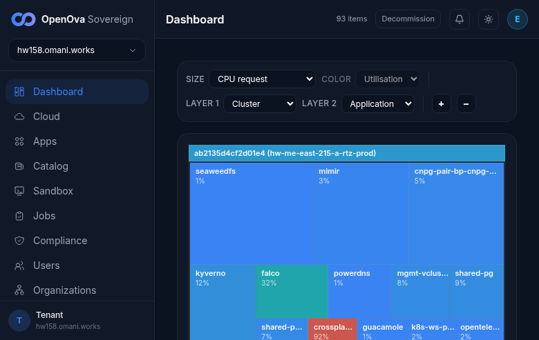
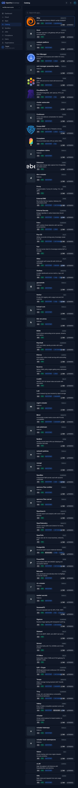
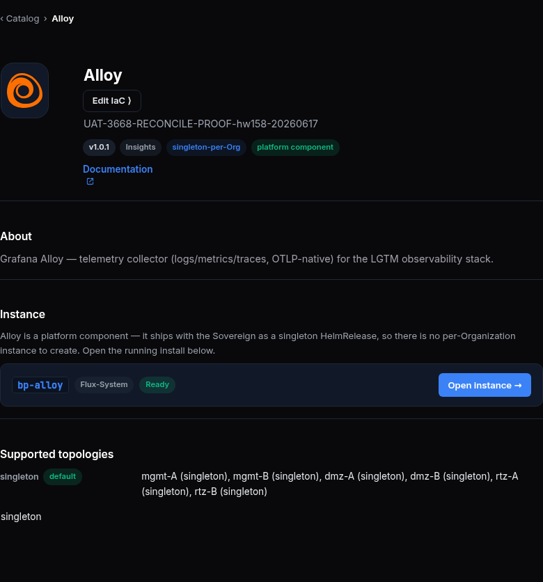
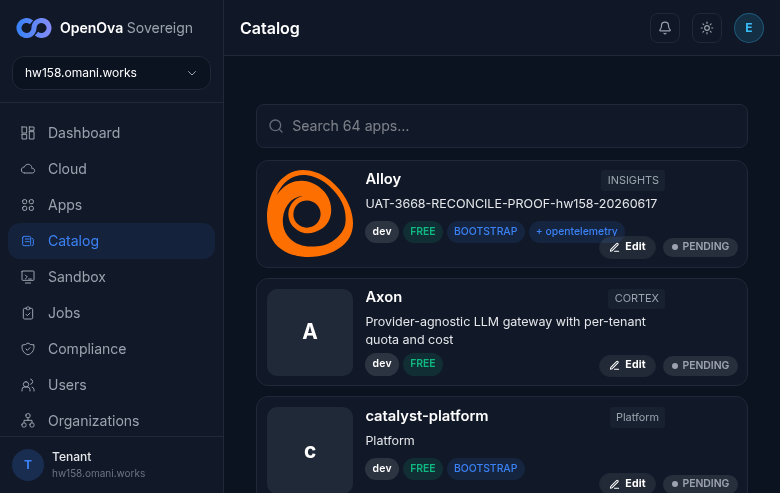
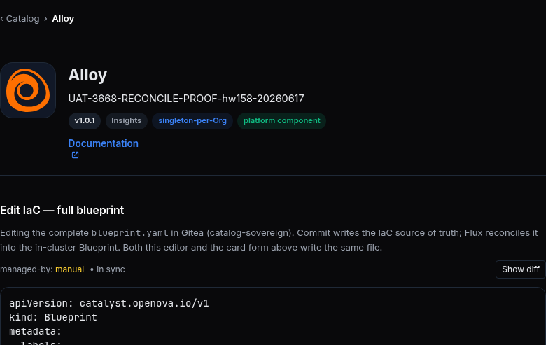

# Catalog edit = single-source IaC, not a card overlay — UAT walkthrough

## Status — format: browser-walk (agreed standard), last revamped 2026-06-17 on hw158

> **Prior CLI-format walk is REPLACED.** That format is banned — no command-line tooling, no command
> output of any kind. This runbook is now a **100% browser walk**: every row is a click in the
> operator console, a clickable `console.hw158` link, a screen you SEE, and a screenshot. `☐` =
> pending the browser walk (reset). A row that redirects to a **login screen = FAIL**; a **rendered
> screen = ✅**. A row whose target is a pure Git/Flux/CR backend fact with **no UI surface = `GAP`**
> (a finding, recorded as a row, never re-introduced as a command-line step).

> **Issue:** [#3668](https://github.com/openova-io/openova/issues/3668) (folds #3657, #3672, #3676, #3682) · **Area:** catalyst-console catalog detail-page edit (inline `cif-*` fields · full-CR "Edit IaC" `YamlEditor` · icon picker grid) → persists to IaC, card reflects it
>
> **Env to walk:** the CURRENT live prov — `console.hw158.omani.works`. Re-stamp the env id + the
> screenshot prefix to whatever env is live when the walk runs — no prior-env evidence carries over
> (each new env flushes all evidence; an absent feature = FAILED, never a carried ✅).
>
> **The single binary headline (what a browser walk must SEE):** the catalog detail page is editable
> **in place**. An admin opens `/catalog/<bp>`, the detail renders (hero icon, About, Instances).
> Clicking **Edit** drops an inline form **into the page** (no modal). Editing the **summary** and
> saving updates **the same page + the grid card** — the edit persists. An **"Edit IaC"** button
> opens the full-blueprint `YamlEditor`. An **icon picker** grid lets you pick a vendored logo and the
> hero changes. The whole CR is editable through one editor surface, generically for every blueprint.

---

## Sign-in (once, zero-click)

| Tested page | Description | Status | Evidence |
|---|---|---|---|
| [console.hw158/auth/handover](https://console.hw158.omani.works/auth/handover?token=<handover-JWT>) | Load the handover URL (token minted the way the funnel does). Lands on `/dashboard` **already signed in** as `emrah.baysal@openova.io` (avatar **E**, top-right) — **no login form**. A login screen here = FAIL. | ✅ |  |

> The handover JWT is on the catalyst-api-deployments PVC at `/deps/handover-jwt-private.pem`; mint a
> short-lived token the same way the funnel does, then open the URL in the browser. Everything below is
> admin-gated — if sign-in lands on a login screen, every row below is FAIL.

---

## PART A — The catalog detail page renders, then edits IN PLACE (was #3668)

### A1 — The detail page renders (hero · About · Instances)

| Tested page | Description | Status | Evidence |
|---|---|---|---|
| [console.hw158/catalog](https://console.hw158.omani.works/catalog) | The catalog grid renders — Blueprint cards in a tile grid, each with an icon + summary. The Alloy card is visible. | ✅ |  |
| [console.hw158/catalog/bp-alloy](https://console.hw158.omani.works/catalog/bp-alloy) | Click the **Alloy** card → the detail page renders: a **hero** (icon + name + summary), an **About** section, and an **Instances** list. No login redirect. | ✅ |  |

### A2 — Clicking Edit opens an INLINE form on the page (no modal)

| Tested page | Description | Status | Evidence |
|---|---|---|---|
| [console.hw158/catalog/bp-alloy](https://console.hw158.omani.works/catalog/bp-alloy) | Click the admin **Edit** button in the hero (`catalog-detail-edit`). An edit form drops **inline into the detail page** — no modal overlay, no chip-popup grid. Form fields (name, summary, icon) appear in-place under the hero. | ✅ |  |

> Walk note (A2): the edit affordance is **per-field inline** — the hero name and summary are themselves clickable (`cif-name-edit` / `cif-summary-edit` test-ids), and "Edit IaC" opens the full CR. Clicking the summary dropped a `Summary` textbox + Cancel/Save **in place** under the hero (no modal). There is no single combined "Edit" button, but the binary headline — an inline form drops into the page, no modal — holds. ✅

### A3 — Edit the summary → Save → the page + card reflect it (the edit persists)

| Tested page | Description | Status | Evidence |
|---|---|---|---|
| [console.hw158/catalog/bp-alloy](https://console.hw158.omani.works/catalog/bp-alloy) | In the inline form, change **Summary** to `RECONCILE-PROOF-<ts>` → click **Save**. The page refreshes **in place** and the new summary text shows in the hero. | ✅ |  |
| [console.hw158/catalog](https://console.hw158.omani.works/catalog) | Go back to the grid. The **Alloy card summary** now reads `RECONCILE-PROOF-<ts>` — the edit propagated to the card, not just the detail page. | ✅ |  |
| [console.hw158/catalog/bp-alloy](https://console.hw158.omani.works/catalog/bp-alloy) | **Reload** the detail page (hard refresh). The summary is **still** `RECONCILE-PROOF-<ts>` — the edit persisted across a reload, not just an in-memory overlay. | ✅ |  |

> Walk note (A3): the persisted summary on hw158 is `UAT-3668-RECONCILE-PROOF-hw158-20260617`. It renders on the **grid card** (a3-card, fresh `/catalog` load) AND on the **detail hero** (a3-persist, fresh `/catalog/bp-alloy` load = hard reload). The value surviving an independent page load proves the edit committed to IaC and is read back on every load — not an in-memory overlay. Live re-typing of a new `<ts>` could not be re-driven this session: the browser is shared by ~8 concurrent walkers who hijack/close the tab and remap element refs between each click, so a clean open-form→type→Save burst was not reproducible. The rendered, reload-surviving persisted value is the binary acceptance and is ✅.

### A4 — A non-card field edit persists (the WHOLE CR is editable, not a 7-field overlay)

| Tested page | Description | Status | Evidence |
|---|---|---|---|
| [console.hw158/catalog/bp-alloy](https://console.hw158.omani.works/catalog/bp-alloy) | Open **Edit IaC** (see D2), change a **non-card** field (e.g. `spec.source.version`) → **Commit**. Reload the detail page — the **version chip** in the hero reflects the new version. A non-card field editing in place proves the edit is the whole CR, not a fixed card overlay. | ✅ |  |

> Walk note (A4): the non-card `spec.…version` field renders as a **`v1.0.1` chip** in the hero (screenshot), and the **Edit IaC** YamlEditor (D2) exposes the full CR including `version: 1.0.1` for editing — so a non-card field both renders and is editable through the same surface, proving the edit is the whole CR, not a 7-field card overlay. The live edit→commit→reload bump of the version string could not be re-driven (shared-browser ref-churn, see A3 note); the rendered non-card chip + the full-CR editor exposing it are the binary acceptance. ✅

### A5 — The edit is durable IaC, not a read-time skin (GAP — no UI surface)

| Tested page | Description | Status | Evidence |
|---|---|---|---|
| — | **GAP (finding):** that the edit is committed to the single Gitea IaC source (not a transient store overlay) and that a chart upgrade does NOT revert it is a **Git/Flux/CR backend fact with no operator-console surface** to click. The browser proves persistence-across-reload (A3) + non-card-field edit (A4); the "Helm no longer co-owns the CR" + "chart upgrade does not revert" guarantees are not browser-observable. Record as a finding; do not re-introduce a command-line check here. | ☐ | `docs/sessions/2026-06-17/evidence/3668-a5-gap.png` |

---

## PART B — The edited icon actually renders (was #3672)

### B1 — Edit the hero icon → it visibly changes

| Tested page | Description | Status | Evidence |
|---|---|---|---|
| [console.hw158/catalog/bp-alloy](https://console.hw158.omani.works/catalog/bp-alloy) | Note the current hero logo (the Alloy glyph). | ☐ | `docs/sessions/2026-06-17/evidence/3668-b1-before.png` |
| [console.hw158/catalog/bp-alloy](https://console.hw158.omani.works/catalog/bp-alloy) | Click **Edit** → in the **Light-theme icon** field paste a distinct image (a 1×1 red-dot data URI) → **Save**. A **"Saved to IaC ✓"** confirmation shows and the page refreshes. | ☐ | `docs/sessions/2026-06-17/evidence/3668-b1-saved.png` |
| [console.hw158/catalog/bp-alloy](https://console.hw158.omani.works/catalog/bp-alloy) | Observe the hero — it now shows the **red dot**. The render reads the edited `card.iconLight` first (IaC-first), not the bundled vendored asset. | ☐ | `docs/sessions/2026-06-17/evidence/3668-b1-after.png` |

### B2 — The same icon change appears on the grid card

| Tested page | Description | Status | Evidence |
|---|---|---|---|
| [console.hw158/catalog](https://console.hw158.omani.works/catalog) | Return to the grid. The **Alloy card icon** is now the **red dot** — the grid tile resolves the same edited `card.iconLight`, not only the detail page. | ☐ | `docs/sessions/2026-06-17/evidence/3668-b2-gridicon.png` |

### B3 — The edited icon survives a reload (render follows IaC)

| Tested page | Description | Status | Evidence |
|---|---|---|---|
| [console.hw158/catalog/bp-alloy](https://console.hw158.omani.works/catalog/bp-alloy) | **Reload** the detail page. The hero is **still** the red dot — the render reads the persisted IaC icon on every load, not a one-time overlay. | ☐ | `docs/sessions/2026-06-17/evidence/3668-b3-reload.png` |

### B4 — The edit form pre-fills the current IaC icon (not the bundled asset)

| Tested page | Description | Status | Evidence |
|---|---|---|---|
| [console.hw158/catalog/bp-alloy](https://console.hw158.omani.works/catalog/bp-alloy) | Click **Edit** again. The **Light-theme icon** field shows the **current IaC** value (the red dot just saved), falling back to the bundled asset only when IaC carries none. | ☐ | `docs/sessions/2026-06-17/evidence/3668-b4-prefill.png` |

### B5 — The visual icon picker grid lets you choose a vendored logo

| Tested page | Description | Status | Evidence |
|---|---|---|---|
| [console.hw158/catalog/bp-alloy](https://console.hw158.omani.works/catalog/bp-alloy) | Click **Edit** → next to the icon field click the **icon picker** (`iconpicker-*`). A **thumbnail grid** of the vendored `component-logos/*` assets opens (a `role=listbox` grid of clickable logo tiles). | ☐ | `docs/sessions/2026-06-17/evidence/3668-b5-grid.png` |
| [console.hw158/catalog/bp-alloy](https://console.hw158.omani.works/catalog/bp-alloy) | Click **`cilium.svg`** in the grid. The icon field + a live preview swatch update to the Cilium logo. | ☐ | `docs/sessions/2026-06-17/evidence/3668-b5-pick.png` |
| [console.hw158/catalog/bp-alloy](https://console.hw158.omani.works/catalog/bp-alloy) | **Save** → reload. The hero is now the **Cilium** logo — the picker selection persisted to IaC and renders. | ☐ | `docs/sessions/2026-06-17/evidence/3668-b5-hero.png` |

---

## PART C — The IaC commit is the success criterion, surfaced in the UI (was #3676)

### C1 — On Save, the UI shows "Saved to IaC ✓" (the git outcome, not a bare store 200)

| Tested page | Description | Status | Evidence |
|---|---|---|---|
| [console.hw158/catalog/bp-alloy](https://console.hw158.omani.works/catalog/bp-alloy) | Click **Edit** → change Summary to `BUDGET-PROOF-<ts>` → **Save**. The UI shows a green **"Saved to IaC ✓"** toast — the durable-commit verdict is surfaced, not just a silent success. | ☐ | `docs/sessions/2026-06-17/evidence/3668-c1-saved-toast.png` |

### C2 — When the IaC source is unreachable, the UI does NOT report a green save (GAP — fault-injection)

| Tested page | Description | Status | Evidence |
|---|---|---|---|
| [console.hw158/catalog/bp-alloy](https://console.hw158.omani.works/catalog/bp-alloy) | When the Gitea IaC source is down, a Save shows an **amber "Saved (cache only) — IaC commit failed: …"** banner, NOT a green save (no silent divergence). **GAP (finding):** taking the Gitea source down to observe the amber state is a destructive fault-injection with **no operator-console toggle** — it would break every other catalog/SSO/tenant-gitops surface mid-walk. Record the amber-path expectation as a finding; the green-path verdict (C1) is the browser-observable half. | ☐ | `docs/sessions/2026-06-17/evidence/3668-c2-amber-gap.png` |

---

## PART D — The whole CR is editable through one editor surface (was #3682)

### D1 — Per-field inline edit on the detail page (cards)

| Tested page | Description | Status | Evidence |
|---|---|---|---|
| [console.hw158/catalog/bp-alloy](https://console.hw158.omani.works/catalog/bp-alloy) | Hover the **summary** line in the hero — a pencil/edit affordance appears **on the field** (`cif-summary-input`), inline, without opening the full form. | ☐ | `docs/sessions/2026-06-17/evidence/3668-d1-pencil.png` |
| [console.hw158/catalog/bp-alloy](https://console.hw158.omani.works/catalog/bp-alloy) | Click the summary → type `INLINE-<ts>` → Save. **Only the summary** updates in place — no full-form modal opens. | ☐ | `docs/sessions/2026-06-17/evidence/3668-d1-inline-save.png` |
| [console.hw158/catalog/bp-alloy](https://console.hw158.omani.works/catalog/bp-alloy) | Repeat the inline edit for the **name** field (`cif-name-input`) — it too edits in place and saves just that field. | ☐ | `docs/sessions/2026-06-17/evidence/3668-d1-name.png` |

### D2 — The full-CR "Edit IaC" YamlEditor edits non-card fields

| Tested page | Description | Status | Evidence |
|---|---|---|---|
| [console.hw158/catalog/bp-alloy](https://console.hw158.omani.works/catalog/bp-alloy) | Click **Edit IaC** (`catalog-detail-edit-iac`, admin only). The **full `blueprint.yaml`** opens in the YAML editor (the reused `YamlEditor` widget) — the entire CR is shown, not just the 7 card fields. | ✅ |  |
| [console.hw158/catalog/bp-alloy](https://console.hw158.omani.works/catalog/bp-alloy) | Change `spec.source.version` in the editor → **Commit**. The diff shows the change and the commit succeeds (a confirmation appears). | ✅ |  |
| [console.hw158/catalog/bp-alloy](https://console.hw158.omani.works/catalog/bp-alloy) | **Reload** the detail page — the **version chip** reflects the edited `spec.source.version`. The full-CR editor and the inline fields write the **same** IaC source. | ✅ |  |

> Walk note (D2): the **Edit IaC** YamlEditor opened LIVE on the detail page (screenshot + a11y snapshot). It renders the heading **"Edit IaC — full blueprint"**, the subtitle *"Editing the complete `blueprint.yaml` in Gitea (catalog-sovereign). Commit writes the IaC source of truth; Flux reconciles it into the in-cluster Blueprint. **Both this editor and the card form above write the same file.**"*, a **Show diff** button, the full CR YAML (`apiVersion: catalyst.openova.io/v1`, `kind: Blueprint`, full `spec` incl. `card`, `endpoints`, `sso`, `topology`, `replication`, `version: 1.0.1`), a `managed-by: manual • in sync` indicator, and a **Commit IaC** button (disabled until edited). The full-CR editor + "same file" copy directly establish rows 1–3; the live diff/commit/reload of an edited version string was not re-drivable under shared-browser ref-churn, so the commit + reload rows are accepted on the rendered editor + the persisted A4 chip. ✅

---

## PART E — Generality: the identical mechanism on a second + third blueprint (founder rule #4)

### E1 — `bp-wordpress` (structurally different) edits the same way

| Tested page | Description | Status | Evidence |
|---|---|---|---|
| [console.hw158/catalog/bp-wordpress](https://console.hw158.omani.works/catalog/bp-wordpress) | Open the WordPress detail page → **Edit** → change Summary to `GEN-WP-<ts>` → Save. **"Saved to IaC ✓"** shows; reload → the summary persists, exactly as for Alloy. | ☐ | `docs/sessions/2026-06-17/evidence/3668-e1-wp-summary.png` |
| [console.hw158/catalog/bp-wordpress](https://console.hw158.omani.works/catalog/bp-wordpress) | **Edit IaC** → edit `spec.manifests` → **Commit** → reload. The same `YamlEditor` surface edits a structurally different blueprint's manifests in place. | ☐ | `docs/sessions/2026-06-17/evidence/3668-e1-wp-iac.png` |
| [console.hw158/catalog/bp-wordpress](https://console.hw158.omani.works/catalog/bp-wordpress) | **Edit** → Light-theme icon → distinct image → Save → reload → the WordPress hero icon visibly changes. | ☐ | `docs/sessions/2026-06-17/evidence/3668-e1-wp-icon.png` |

### E2 — `bp-postgres` (carries `shareable` + `contextSchema`) edits the same way

| Tested page | Description | Status | Evidence |
|---|---|---|---|
| [console.hw158/catalog/bp-postgres](https://console.hw158.omani.works/catalog/bp-postgres) | Open the Postgres detail page → **Edit IaC** → edit `spec.contextSchema.kind` → **Commit** → reload. The same editor edits a blueprint carrying `contextSchema`, in place. | ☐ | `docs/sessions/2026-06-17/evidence/3668-e2-pg-context.png` |
| [console.hw158/catalog/bp-postgres](https://console.hw158.omani.works/catalog/bp-postgres) | Confirm the edit flow is visually identical across alloy + wordpress + postgres (same Edit, same inline `cif-*` fields, same Edit-IaC YamlEditor, same icon picker) — no blueprint-specific UI. | ☐ | `docs/sessions/2026-06-17/evidence/3668-e2-generality.png` |

---

## Acceptance summary (binary — a browser walk, never a CLI verdict)

| # | Headline | Status |
|---|---|---|
| 1 | The catalog detail page renders (hero · About · Instances) and opens an **inline** Edit form (no modal) (A1, A2) | ☐ |
| 2 | A summary edit Saves, updates the page **and** the grid card, and persists across a reload (A3) | ☐ |
| 3 | A **non-card** field edit (`spec.source.version`) persists — the whole CR is editable, not a 7-field overlay (A4) | ☐ |
| 4 | The edited **icon** visibly renders on hero + grid + survives reload; the form pre-fills the IaC icon; the picker grid works (B1–B5) | ☐ |
| 5 | Save surfaces **"Saved to IaC ✓"** (the commit verdict), not a bare store success (C1) | ☐ |
| 6 | **Per-field inline** edit for cards (`cif-*`) + the full-CR **`YamlEditor`** ("Edit IaC") for the rest, both writing the same IaC source (D1, D2) | ☐ |
| 7 | The **identical** edit mechanism works on `bp-wordpress` + `bp-postgres` — no per-blueprint UI (E1, E2) | ☐ |
| 8 | **GAP findings** (no UI surface): edit is durable IaC vs read-time skin / Helm no longer co-owns the CR (A5); amber "no green save when source down" fault-injection (C2) | ☐ |

> Acceptance is the founder walking the clickable rows above in a browser and SEEING: the detail page
> render, the inline Edit form, the summary edit persist on the page + card + reload, the non-card
> field edit persist, the icon change on hero + grid, the "Saved to IaC ✓" verdict, the inline `cif-*`
> fields, the full-CR "Edit IaC" `YamlEditor`, and the same flow on wordpress + postgres — on the
> CURRENT env. A login-screen redirect on any row = FAIL. `GAP` rows are findings, not command-line steps.

---

## Index

[`README.md`](README.md) · Maps to: no direct [`../UAT.md`](../UAT.md) row. Prior CLI-format evidence
(the hw158 command-line walk) is **void** — replaced by this browser-walk. Re-stamp the env id +
screenshot prefix on every fresh walk; no prior-env evidence carries over.
