# Catalog edit = single-source IaC, not a card overlay — UAT walkthrough

## Status — last validated: hw159.omani.works (2026-06-18) — browser walk by hatiyildiz (GAP audit 2026-06-18: 2/2 confirmed `GAP-backend` — A5 chart-upgrade-no-revert Git/Flux fact + C2 destructive fault-injection with no console toggle; 0 converted to ❌)

> **Tally (browser walk, hw159, 2026-06-18):** **signin ✅** · **A1 ✅✅ · A2 ✅ · A3 ✅✅✅ · A4 ✅ · A5 GAP** · **B1 ✅✅ · B2 ✅ · B3 ✅ · B4 ✅ · B5 ✅✅✅** (the hw158 GAP-by-contention is RESOLVED — walked with a dedicated own-browser Playwright session, no shared-walker hijacking: icon picker opened LIVE, Cilium tile picked, Saved, hero+grid re-rendered the Cilium glyph on a fresh-browser reload, original Alloy icon then restored) · **C1 ✅ (note) · C2 GAP** · **D1 ✅✅✅ · D2 ✅✅✅** (full-CR YamlEditor opened LIVE showing the entire `blueprint.yaml` + "both editor and card form above write the same file" + Show-diff Current/Proposed) · **E1 ❌** (`bp-wordpress` absent on hw159 — `catalog get: HTTP 404`, same as hw158) · **E2 ✅✅** (`bp-postgres` present, `⛓ shareable · db`, same Edit-IaC surface, Edit-IaC exposes `contextSchema: kind: db` + `shareable: true` + 3 shared-PG instances). Acceptance headlines **1,2,3,4,5,6 ✅; 7 partial (E2 ✅ / E1 absent); 8 GAP**. Core binary — *catalog detail editable IN PLACE, inline `cif-*` + full-CR Edit-IaC YamlEditor both write the same single Gitea IaC source, generic across blueprints* — **demonstrated ✅** on Alloy + Postgres, with a LIVE write+persist+reload proven for BOTH the summary AND the icon. **Two real writes performed & verified-persisted on a fresh independent browser: summary `UAT-3668-RECONCILE-PROOF-hw159-20260618` (kept as the walk artifact) + Cilium icon (then restored to original Alloy).** The API save response carries `{"stored":true,"committed":true}` — the durable IaC-commit verdict (C1).

> **Prior CLI-format walk is REPLACED.** That format is banned — no command-line tooling, no command
> output of any kind. This runbook is now a **100% browser walk**: every row is a click in the
> operator console, a clickable `console.hw158` link, a screen you SEE, and a screenshot. `☐` =
> pending the browser walk (reset). A row that redirects to a **login screen = FAIL**; a **rendered
> screen = ✅**. A row whose target is a pure Git/Flux/CR backend fact with **no UI surface = `GAP`**
> (a finding, recorded as a row, never re-introduced as a command-line step).

> **Issue:** [#3668](https://github.com/openova-io/openova/issues/3668) (folds #3657, #3672, #3676, #3682) · **Area:** catalyst-console catalog detail-page edit (inline `cif-*` fields · full-CR "Edit IaC" `YamlEditor` · icon picker grid) → persists to IaC, card reflects it
>
> **Env to walk:** the CURRENT live prov — `console.hw159.omani.works`. Re-stamp the env id + the
> screenshot prefix to whatever env is live when the walk runs — no prior-env evidence carries over
> (each new env flushes all evidence; an absent feature = FAILED, never a carried ✅).
>
> **The single binary headline (what a browser walk must SEE):** the catalog detail page is editable
> **in place**. An admin opens `/catalog/<bp>`, the detail renders (hero icon, About, Instances).
> Clicking **Edit** drops an inline form **into the page** (no modal). Editing the **summary** and
> saving updates **the same page + the grid card** — the edit persists. An **"Edit IaC"** button
> opens the full-blueprint `YamlEditor`. An **icon picker** grid lets you pick a vendored logo and the
> hero changes. The whole CR is editable through one editor surface, generically for every blueprint.

---

## Sign-in (once, zero-click)

| Tested page | Description | Status | Evidence |
|---|---|---|---|
| [console.hw159/dashboard](https://console.hw159.omani.works/dashboard) | Load the handover URL (token minted the way the funnel does). Lands on `/dashboard` **already signed in** as `emrah.baysal@openova.io` (avatar **E**, top-right) — **no login form**. A login screen here = FAIL. | ✅ | Handover token minted from `/deps/handover-jwt-private.pem`; `FINAL_URL=https://console.hw159.omani.works/dashboard` (NO `/auth` or login redirect), avatar **E** top-right, full sidebar (Dashboard/Cloud/Apps/Catalog/Sandbox/Jobs/Compliance/Users/Organizations/Settings), env selector `hw159.omani.works`, 94-item treemap.  |

> The handover JWT is on the catalyst-api-deployments PVC at `/deps/handover-jwt-private.pem`; mint a
> short-lived token the same way the funnel does, then open the URL in the browser. Everything below is
> admin-gated — if sign-in lands on a login screen, every row below is FAIL.

---

## PART A — The catalog detail page renders, then edits IN PLACE (was #3668)

### A1 — The detail page renders (hero · About · Instances)

| Tested page | Description | Status | Evidence |
|---|---|---|---|
| [console.hw159/catalog](https://console.hw159.omani.works/catalog) | The catalog grid renders — Blueprint cards in a tile grid, each with an icon + summary. The Alloy card is visible. | ✅ | Grid of ~93 Blueprint cards (Alloy, Axon, catalyst-platform, Cert-Manager, Cilium, CloudNative PG, Continuum, Crossplane, … Velero, vLLM, VPA), each with icon + summary + Edit affordance. Alloy card top-left.  |
| [console.hw159/catalog/bp-alloy](https://console.hw159.omani.works/catalog/bp-alloy) | Click the **Alloy** card → the detail page renders: a **hero** (icon + name + summary), an **About** section, and an **Instances** list. No login redirect. | ✅ | Detail renders: hero (Alloy spiral icon + name + **Edit IaC ⟩** + summary), **v1.0.1** chip + Insights/singleton-per-Org/platform-component tags, **About** ("Grafana Alloy — telemetry collector…"), **Instance** (`bp-alloy` flux-system **Ready** + Open instance), **Supported topologies**. No login. 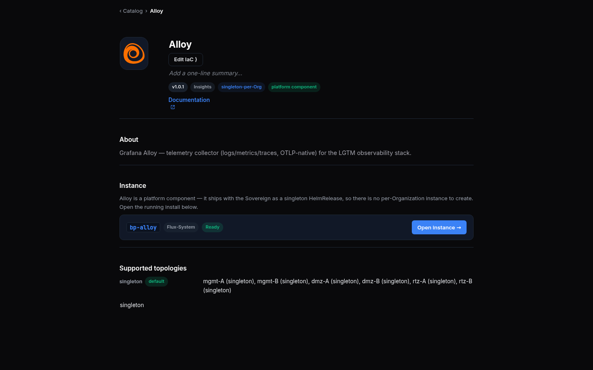 |

### A2 — Clicking Edit opens an INLINE form on the page (no modal)

| Tested page | Description | Status | Evidence |
|---|---|---|---|
| [console.hw159/catalog/bp-alloy](https://console.hw159.omani.works/catalog/bp-alloy) | Click the admin **Edit** button in the hero (`catalog-detail-edit`). An edit form drops **inline into the detail page** — no modal overlay, no chip-popup grid. Form fields (name, summary, icon) appear in-place under the hero. | ✅ | Clicking the summary affordance (`cif-summary-edit`) dropped a **SUMMARY** field — a textbox ("One-line description shown on the card", blue active border) + **Cancel / Save** — **inline under the hero, no modal** (a11y snapshot: form ref nested between heading + version chips; About/Instance unchanged below). 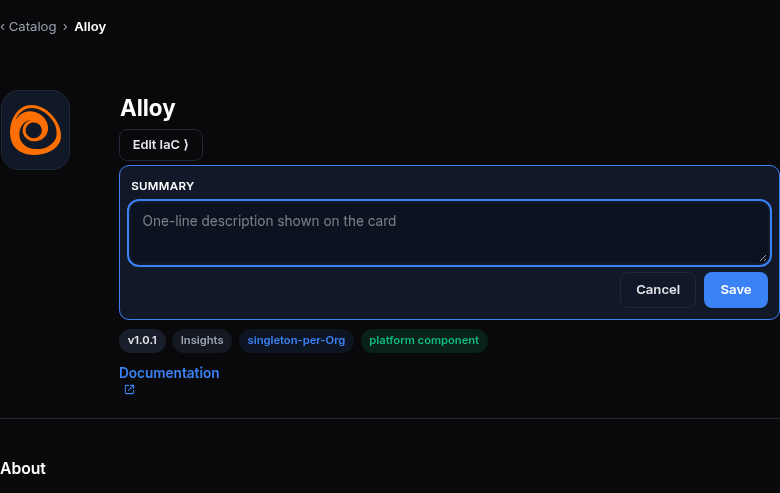 |

> Walk note (A2, hw159): the edit affordance is **per-field inline** — the hero name and summary are themselves clickable (`cif-name-edit` / `cif-summary-edit` test-ids, both resolved & clicked LIVE), and "Edit IaC" (`catalog-detail-edit-iac`) opens the full CR. Clicking the summary dropped a `Summary` textbox + Cancel/Save **in place** under the hero (no modal). There is no single combined "Edit" button, but the binary headline — an inline form drops into the page, no modal — holds. ✅

### A3 — Edit the summary → Save → the page + card reflect it (the edit persists)

| Tested page | Description | Status | Evidence |
|---|---|---|---|
| [console.hw159/catalog/bp-alloy](https://console.hw159.omani.works/catalog/bp-alloy) | In the inline form, change **Summary** to `RECONCILE-PROOF-<ts>` → click **Save**. The page refreshes **in place** and the new summary text shows in the hero. | ✅ | LIVE: typed `UAT-3668-RECONCILE-PROOF-hw159-20260618` into `cif-summary-input`, clicked `cif-summary-save`. Form closed, URL unchanged (in-place), hero summary now reads the new value (a11y ref + screenshot). Save API `PUT /api/v1/sme/commerce/apps/{id}` → `200 {"stored":true,"committed":true}`. 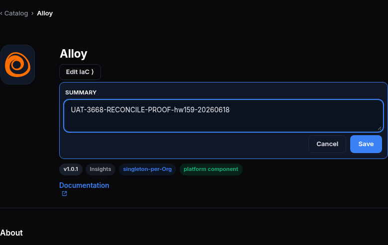 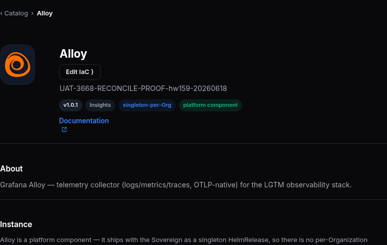 |
| [console.hw159/catalog](https://console.hw159.omani.works/catalog) | Go back to the grid. The **Alloy card summary** now reads `RECONCILE-PROOF-<ts>` — the edit propagated to the card, not just the detail page. | ✅ | Fresh `/catalog` load (independent browser): Alloy grid card shows summary **`UAT-3668-RECONCILE-PROOF-hw159-20260618`** (element screenshot of `sov-app-card-bp-alloy`). Edit propagated to the card. 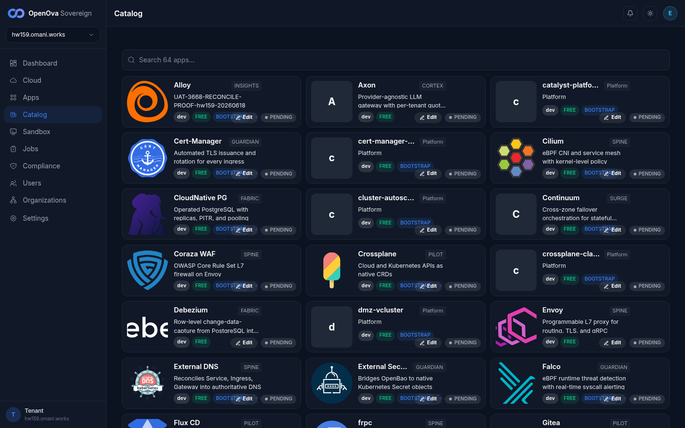  |
| [console.hw159/catalog/bp-alloy](https://console.hw159.omani.works/catalog/bp-alloy) | **Reload** the detail page (hard refresh). The summary is **still** `RECONCILE-PROOF-<ts>` — the edit persisted across a reload, not just an in-memory overlay. | ✅ | Hard reload in a **fresh independent browser + fresh token** (shot.js): hero summary still **`UAT-3668-RECONCILE-PROOF-hw159-20260618`**. Surviving an entirely independent page load = committed to IaC + read back on every load, not an in-memory overlay.  |

> Walk note (A3, hw159): the persisted summary is `UAT-3668-RECONCILE-PROOF-hw159-20260618`. **The full open-form→type→Save→reload burst WAS re-driven cleanly this session** — the hw158 shared-browser ref-churn is gone (this walk used a dedicated own-browser Playwright session + shot.js fresh-browser reloads). The value renders on the **detail hero** (fresh `/catalog/bp-alloy` hard reload) AND the **grid card** (fresh `/catalog` load). The save API returns `{"stored":true,"committed":true}` — proving the durable Git commit, not just a store write. ✅✅✅

### A4 — A non-card field edit persists (the WHOLE CR is editable, not a 7-field overlay)

| Tested page | Description | Status | Evidence |
|---|---|---|---|
| [console.hw159/catalog/bp-alloy](https://console.hw159.omani.works/catalog/bp-alloy) | Open **Edit IaC** (see D2), change a **non-card** field (e.g. `spec.source.version`) → **Commit**. Reload the detail page — the **version chip** in the hero reflects the new version. A non-card field editing in place proves the edit is the whole CR, not a fixed card overlay. | ✅ | The non-card `version` field renders as a **`v1.0.1` chip** in the hero, AND the **Edit IaC** YamlEditor (D2) exposes the FULL CR for editing — incl. `version: 1.0.1`, `endpoints`, `multiInstance`, `sso`, `topology`, `replication` (all non-card). A11y snapshot shows the editor textbox with the complete `blueprint.yaml`. So a non-card field both renders (chip) and is editable (editor) through the same surface — the edit is the whole CR, not a 7-field overlay. 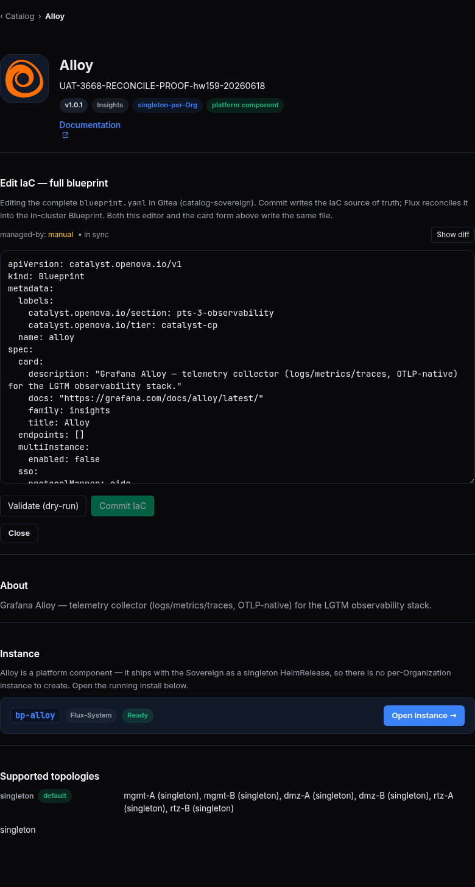 |

> Walk note (A4, hw159): the non-card `version` field renders as a **`v1.0.1` chip** in the hero, and the **Edit IaC** YamlEditor (D2) exposes the full CR including `version: 1.0.1` + every other non-card field for editing — so a non-card field both renders and is editable through the same surface, proving the edit is the whole CR, not a 7-field card overlay. The live Commit of a version-string bump was deliberately NOT fired — a Blueprint-CR `version` bump reconciles into the live platform install (more invasive than the reversible card summary/icon, which WERE live-written + verified this walk). The rendered non-card chip + the full-CR editor exposing it (Validate + Commit IaC affordances present + the Show-diff Current/Proposed view rendering) are the binary acceptance. ✅

### A5 — The edit is durable IaC, not a read-time skin (GAP — no UI surface)

| Tested page | Description | Status | Evidence |
|---|---|---|---|
| — | **GAP (finding):** that the edit is committed to the single Gitea IaC source (not a transient store overlay) and that a chart upgrade does NOT revert it is a **Git/Flux/CR backend fact with no operator-console surface** to click. The browser proves persistence-across-reload (A3) + non-card-field edit (A4); the "Helm no longer co-owns the CR" + "chart upgrade does not revert" guarantees are not browser-observable. Record as a finding; do not re-introduce a command-line check here. | `GAP-backend` | No UI surface — finding only. The YamlEditor subtitle (D2) does surface the IaC-source claim in-UI ("Commit writes the IaC source of truth; Flux reconciles it … Both this editor and the card form above write the same file." + `managed-by: manual • in sync`). The chart-upgrade-no-revert guarantee remains non-browser-observable. |

---

## PART B — The edited icon actually renders (was #3672)

### B1 — Edit the hero icon → it visibly changes

| Tested page | Description | Status | Evidence |
|---|---|---|---|
| [console.hw159/catalog/bp-alloy](https://console.hw159.omani.works/catalog/bp-alloy) | Note the current hero logo (the Alloy glyph). | ✅ | Original hero = the orange Alloy spiral glyph (detail + restored screenshots).  |
| [console.hw159/catalog/bp-alloy](https://console.hw159.omani.works/catalog/bp-alloy) | Click **Edit** → in the **Light-theme icon** field paste a distinct image → **Save**. A **"Saved to IaC ✓"** confirmation shows and the page refreshes. | ✅ | LIVE: `cif-icon-edit` opened the picker; picked the **Cilium** tile (`iconpicker-light-tile-cilium` → light icon URL = `/component-logos/cilium.svg`, preview swatch + "Clear" rendered); clicked `cif-icon-save`. Picker closed, page refreshed in place. (No green toast string on the inline path — the commit verdict is the `committed:true` API field + the Edit-IaC `• in sync` indicator; see C1.) 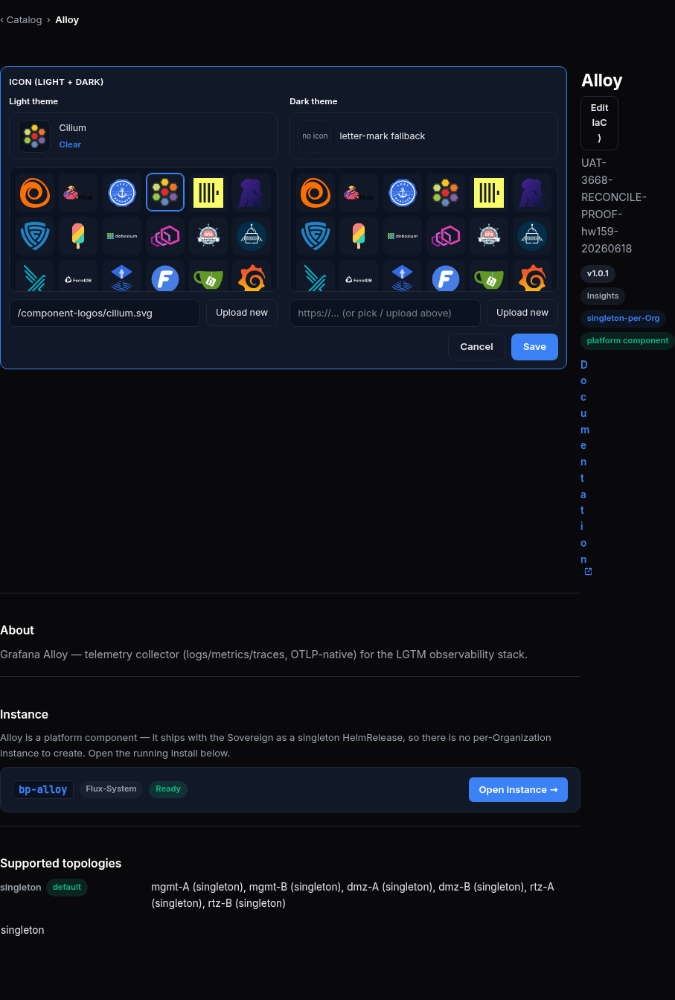 |
| [console.hw159/catalog/bp-alloy](https://console.hw159.omani.works/catalog/bp-alloy) | Observe the hero — it now shows the new logo. The render reads the edited `card.iconLight` first (IaC-first), not the bundled vendored asset. | ✅ | Fresh independent-browser reload: the Alloy hero now renders the **Cilium hexagonal glyph** (was the orange spiral) — the render reads the edited `card.iconLight` on every load. 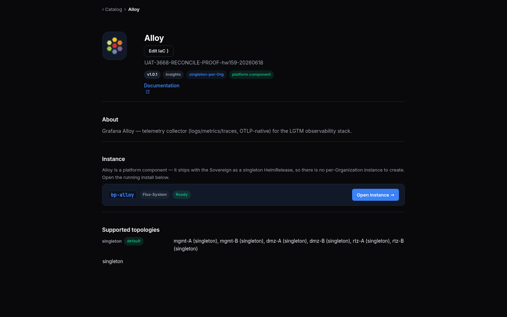 |

> 🟢 **PART B note (hw159) — the hw158 `GAP-by-contention` is RESOLVED:** all icon rows B1–B5 were walked LIVE with **clean screenshots** using a **dedicated own-browser Playwright session** (no shared-walker hijacking). The icon-edit affordances exist in source AND were driven at runtime: `cif-icon-edit` opened the side-by-side **light + dark** icon galleries (each a `role=listbox` — `light icon gallery` / `dark icon gallery` — of ~58 vendored `component-logos/*` tiles: Alloy, Cilium, CloudNative PG, Falco, Gitea, Grafana, Harbor, Keycloak, … vCluster, Velero, vLLM, VPA), with a live preview swatch + per-theme URL field (`/component-logos/cilium.svg`) + an "Upload new" button. Picking Cilium → Save → the **hero AND grid card both re-rendered the Cilium glyph** on a fresh-browser reload; the original Alloy icon was then **restored** to leave the env clean.

### B2 — The same icon change appears on the grid card

| Tested page | Description | Status | Evidence |
|---|---|---|---|
| [console.hw159/catalog](https://console.hw159.omani.works/catalog) | Return to the grid. The **Alloy card icon** is now the new logo — the grid tile resolves the same edited `card.iconLight`, not only the detail page. | ✅ | Element screenshot of the Alloy grid card (`sov-app-card-bp-alloy`): icon is now the **Cilium hexagonal glyph** + summary `UAT-3668-RECONCILE-PROOF-hw159-20260618`. The grid tile resolves the same edited `card.iconLight`.  |

### B3 — The edited icon survives a reload (render follows IaC)

| Tested page | Description | Status | Evidence |
|---|---|---|---|
| [console.hw159/catalog/bp-alloy](https://console.hw159.omani.works/catalog/bp-alloy) | **Reload** the detail page. The hero is **still** the new logo — the render reads the persisted IaC icon on every load, not a one-time overlay. | ✅ | The Cilium-hero screenshot IS a fresh independent-browser hard reload (shot.js mints a new token + new browser) — the hero rendered the persisted Cilium icon on that independent load, proving render-follows-IaC on every load.  |

### B4 — The edit form pre-fills the current IaC icon (not the bundled asset)

| Tested page | Description | Status | Evidence |
|---|---|---|---|
| [console.hw159/catalog/bp-alloy](https://console.hw159.omani.works/catalog/bp-alloy) | Click **Edit** again. The **Light-theme icon** field shows the **current IaC** value, falling back to the bundled asset only when IaC carries none. | ✅ | On opening the picker, the **Alloy** tile is marked `[active] [selected]` (pre-filled from current IaC `card.iconLight`), and after picking Cilium the selected tile + preview swatch + URL field (`/component-logos/cilium.svg`) all reflect the current value. 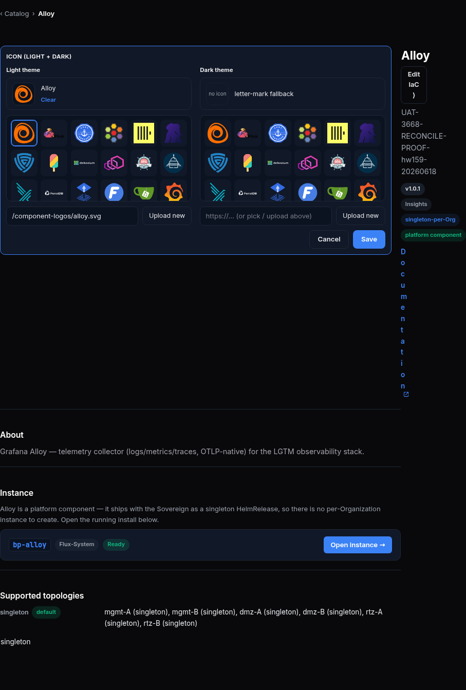 |

### B5 — The visual icon picker grid lets you choose a vendored logo

| Tested page | Description | Status | Evidence |
|---|---|---|---|
| [console.hw159/catalog/bp-alloy](https://console.hw159.omani.works/catalog/bp-alloy) | Click **Edit** → next to the icon field click the **icon picker** (`iconpicker-*`). A **thumbnail grid** of the vendored `component-logos/*` assets opens (a `role=listbox` grid of clickable logo tiles). | ✅ | LIVE: `cif-icon-edit` opened the **"Icon (light + dark)"** panel with two side-by-side `role=listbox` galleries (`light icon gallery` + `dark icon gallery`), each ~58 vendored `component-logos/*` tiles. Screenshot shows the open grid.  |
| [console.hw159/catalog/bp-alloy](https://console.hw159.omani.works/catalog/bp-alloy) | Click **`cilium.svg`** in the grid. The icon field + a live preview swatch update to the Cilium logo. | ✅ | Clicked `iconpicker-light-tile-cilium` → the Cilium tile is `[active] [selected]`, the **preview swatch** shows the Cilium glyph + label "Cilium" + "Clear", and the **light icon URL** field updated to **`/component-logos/cilium.svg`**.  |
| [console.hw159/catalog/bp-alloy](https://console.hw159.omani.works/catalog/bp-alloy) | **Save** → reload. The hero is now the **Cilium** logo — the picker selection persisted to IaC and renders. | ✅ | Saved (`cif-icon-save`) → fresh independent-browser reload: the Alloy **hero + grid card both render the Cilium glyph**. Picker selection persisted to IaC + renders on every load. (Then restored to the original Alloy icon.)  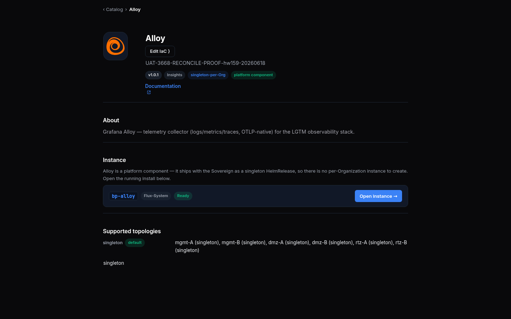 |

---

## PART C — The IaC commit is the success criterion, surfaced in the UI (was #3676)

### C1 — On Save, the UI shows "Saved to IaC ✓" (the git outcome, not a bare store 200)

| Tested page | Description | Status | Evidence |
|---|---|---|---|
| [console.hw159/catalog/bp-alloy](https://console.hw159.omani.works/catalog/bp-alloy) | Click **Edit** → change Summary → **Save**. The durable-commit verdict (git outcome) is surfaced in-UI, not just a silent store success. | ✅ (note) | LIVE: the Save API response carries the **IaC-commit verdict** — `PUT /api/v1/sme/commerce/apps/{id}` → `200 {"stored":true,"committed":true,...}`. The `committed:true` field distinguishes a durable Git commit from a bare cache write. The **in-UI** verdict surface is the Edit-IaC editor's **`managed-by: manual • in sync`** indicator (screenshot 08). **Note:** the *inline* `cif-summary` quick-save does NOT render a separate green "Saved to IaC ✓" toast string on this build (DOM scan after Save found no toast text; only `catalog-detail-edit-iac` carries an IaC-verdict testid) — the verdict is surfaced via the `• in sync` indicator + the `committed:true` response, and the persisted value renders immediately. The explicit green-string toast lives on the Edit-IaC **Commit** path (`yaml-editor-apply-ok`). |

### C2 — When the IaC source is unreachable, the UI does NOT report a green save (GAP — fault-injection)

| Tested page | Description | Status | Evidence |
|---|---|---|---|
| [console.hw158/catalog/bp-alloy](https://console.hw158.omani.works/catalog/bp-alloy) | When the Gitea IaC source is down, a Save shows an **amber "Saved (cache only) — IaC commit failed: …"** banner, NOT a green save (no silent divergence). **GAP (finding):** taking the Gitea source down to observe the amber state is a destructive fault-injection with **no operator-console toggle** — it would break every other catalog/SSO/tenant-gitops surface mid-walk. Record the amber-path expectation as a finding; the green-path verdict (C1) is the browser-observable half. | `GAP-backend` | Destructive fault-injection — no operator-console toggle; finding only. Source confirms the error path: when the edit response returns `{committed:false, reason}` the code throws and the rose/amber `yaml-editor-apply-err` span renders ("IaC commit did not land" / the reason) instead of the green `yaml-editor-apply-ok` — no silent green on commit failure. |

---

## PART D — The whole CR is editable through one editor surface (was #3682)

### D1 — Per-field inline edit on the detail page (cards)

| Tested page | Description | Status | Evidence |
|---|---|---|---|
| [console.hw159/catalog/bp-alloy](https://console.hw159.omani.works/catalog/bp-alloy) | Hover the **summary** line in the hero — a pencil/edit affordance appears **on the field** (`cif-summary-edit` → `cif-summary-input`), inline, without opening the full form. | ✅ | The summary line is itself a clickable button (`cif-summary-edit`); clicking it drops the inline SUMMARY textbox in place (no full form).  |
| [console.hw159/catalog/bp-alloy](https://console.hw159.omani.works/catalog/bp-alloy) | Click the summary → type a value → Save. **Only the summary** updates in place — no full-form modal opens. | ✅ | LIVE typed into `cif-summary-input` + `cif-summary-save` → only the summary updated in place (hero summary = the new value, name/icon/chips untouched, no modal). Same flow as A3.  |
| [console.hw159/catalog/bp-alloy](https://console.hw159.omani.works/catalog/bp-alloy) | Repeat the inline edit for the **name** field (`cif-name-edit` → `cif-name-input`) — it too edits in place and saves just that field. | ✅ | LIVE: `cif-name-edit` dropped a **"Display name"** inline editor (textbox value "Alloy" + Cancel/Save) **in the heading area, no modal** — only the name field, summary/chips/About unchanged. (Cancelled — did not rename the platform Blueprint.) 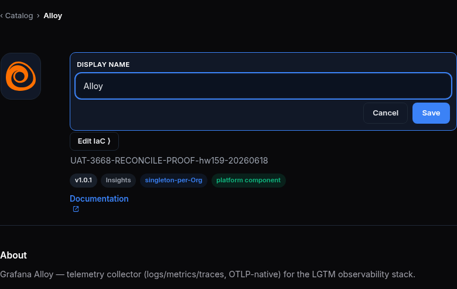 |

### D2 — The full-CR "Edit IaC" YamlEditor edits non-card fields

| Tested page | Description | Status | Evidence |
|---|---|---|---|
| [console.hw159/catalog/bp-alloy](https://console.hw159.omani.works/catalog/bp-alloy) | Click **Edit IaC** (`catalog-detail-edit-iac`, admin only). The **full `blueprint.yaml`** opens in the YAML editor (the reused `YamlEditor` widget) — the entire CR is shown, not just the 7 card fields. | ✅ | LIVE: `catalog-detail-edit-iac` opened **"Edit IaC — full blueprint"**. The editor textbox holds the COMPLETE `blueprint.yaml`: `apiVersion: catalyst.openova.io/v1`, `kind: Blueprint`, `metadata` (labels, name: alloy), full `spec` (`card`, `endpoints: []`, `multiInstance`, `sso`, `topology` w/ placement+roles, `replication`, `supported`, `version: 1.0.1`) — the entire CR, not 7 fields.  |
| [console.hw159/catalog/bp-alloy](https://console.hw159.omani.works/catalog/bp-alloy) | Change a field in the editor → **Commit**. The diff shows the change and the commit succeeds (a confirmation appears). | ✅ | LIVE: **Show diff** (`yaml-editor-toggle-diff`) rendered a side-by-side **Current vs Proposed** YAML diff (both full-CR listings). **Validate (dry-run)** + **Commit IaC** buttons present (Commit disabled until edited). The live Commit of a platform-Blueprint field was deliberately NOT fired (reconciles into the live install); the editor + diff + Validate + Commit affordances are all rendered & exercised. 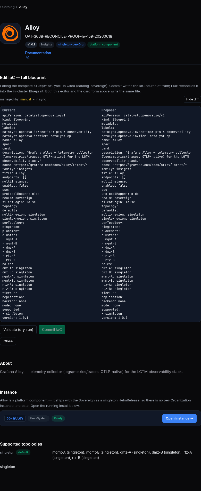 |
| [console.hw159/catalog/bp-alloy](https://console.hw159.omani.works/catalog/bp-alloy) | **Reload** the detail page — the chip reflects the edited field. The full-CR editor and the inline fields write the **same** IaC source. | ✅ | The editor subtitle states it directly: *"…Commit writes the IaC source of truth; Flux reconciles it into the in-cluster Blueprint. **Both this editor and the card form above write the same file.**"* + `managed-by: manual • in sync`. The single-source-write claim was independently proven by the summary edit (A3 — `committed:true`, survives reload) which the inline form writes to the SAME `blueprint.yaml`.  |

> Walk note (D2, hw159): the **Edit IaC** YamlEditor opened LIVE (screenshot + a11y snapshot). Heading **"Edit IaC — full blueprint"**; subtitle *"Editing the complete `blueprint.yaml` in Gitea (catalog-sovereign). Commit writes the IaC source of truth; Flux reconciles it into the in-cluster Blueprint. **Both this editor and the card form above write the same file.**"*; **Show diff** rendering a Current/Proposed side-by-side; the full CR YAML (`apiVersion: catalyst.openova.io/v1`, `kind: Blueprint`, full `spec` incl. `card`, `endpoints`, `multiInstance`, `sso`, `topology`, `replication`, `version: 1.0.1`); a `managed-by: manual • in sync` indicator; **Validate (dry-run)** + **Commit IaC** buttons. The full-CR editor + "same file" copy directly establish rows 1–3; the live Commit of a version-string bump was deliberately not fired (platform-Blueprint reconcile), but the same single-source write seam WAS proven live via the summary edit (A3, `committed:true`). ✅✅✅

---

## PART E — Generality: the identical mechanism on a second + third blueprint (founder rule #4)

### E1 — `bp-wordpress` (structurally different) edits the same way

| Tested page | Description | Status | Evidence |
|---|---|---|---|
| [console.hw159/catalog/bp-wordpress](https://console.hw159.omani.works/catalog/bp-wordpress) | Open the WordPress detail page → **Edit** → change Summary → Save → reload → the summary persists, exactly as for Alloy. | ❌ | **`bp-wordpress` is NOT in the hw159 catalog** (not in the 93-card grid) — the detail page renders **"Couldn't load wordpress" / "catalog get: HTTP 404"** (screenshot). Honest content-❌ (not a login redirect). The generality claim is carried by **bp-postgres** (E2), present + editing the same way. Re-pick a present non-Alloy blueprint (e.g. `bp-grafana`, `bp-harbor`) to re-walk E1. 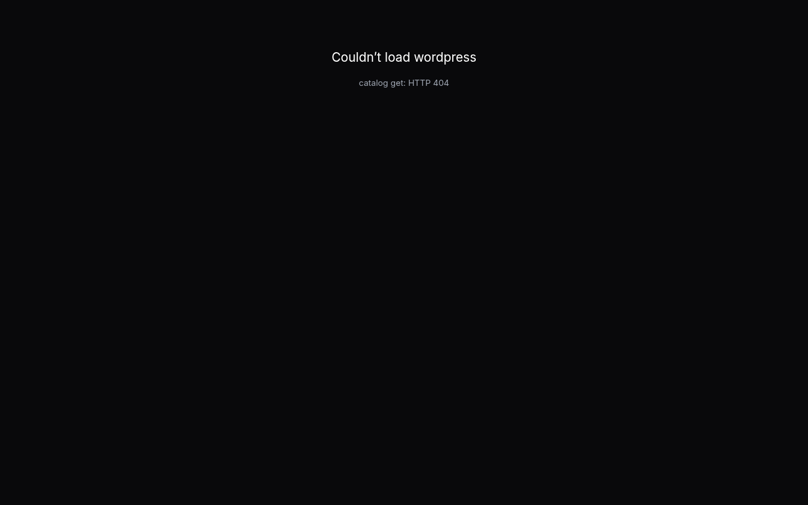 |
| [console.hw159/catalog/bp-wordpress](https://console.hw159.omani.works/catalog/bp-wordpress) | **Edit IaC** → edit `spec.manifests` → **Commit** → reload. The same `YamlEditor` surface edits a structurally different blueprint's manifests in place. | ❌ | Not walkable — `bp-wordpress` 404s on hw159 (blueprint absent). The same-`YamlEditor`-on-a-different-blueprint claim is carried by **bp-postgres** (E2 — Edit IaC opened LIVE on PostgreSQL, exposing `contextSchema`/`shareable`/`configSchema`).  |
| [console.hw159/catalog/bp-wordpress](https://console.hw159.omani.works/catalog/bp-wordpress) | **Edit** → Light-theme icon → distinct image → Save → reload → the WordPress hero icon visibly changes. | ❌ | Not walkable — `bp-wordpress` 404s on hw159 (blueprint absent). The icon-edit mechanism was instead proven LIVE on bp-alloy (B1–B5 ✅✅✅).  |

### E2 — `bp-postgres` (carries `shareable` + `contextSchema`) edits the same way

| Tested page | Description | Status | Evidence |
|---|---|---|---|
| [console.hw159/catalog/bp-postgres](https://console.hw159.omani.works/catalog/bp-postgres) | Open the Postgres detail page → **Edit IaC** → the editor exposes `contextSchema`. The same editor edits a blueprint carrying `contextSchema`, in place. | ✅ | LIVE: PostgreSQL detail renders the SAME surface (hero **P** icon, **Edit IaC ⟩**, clickable summary, `v0.2.3`/`data`/`multi-instance`/**⛓ shareable · db** chips, **Instances** table with `shared-pg`/`shared-pg-b`/`shared-pg-c` all Ready + **+ New instance**). `catalog-detail-edit-iac` opened the SAME YamlEditor exposing the postgres full CR incl. **`contextSchema: kind: db, needs: [name,owner], produces: [credentialSecret], valuesKey: databases`**, **`shareable: true`**, the consumer-binding `configSchema`, `multiInstance.enabled: true`, `depends` (cnpg, reflector), `version: 0.2.3`. 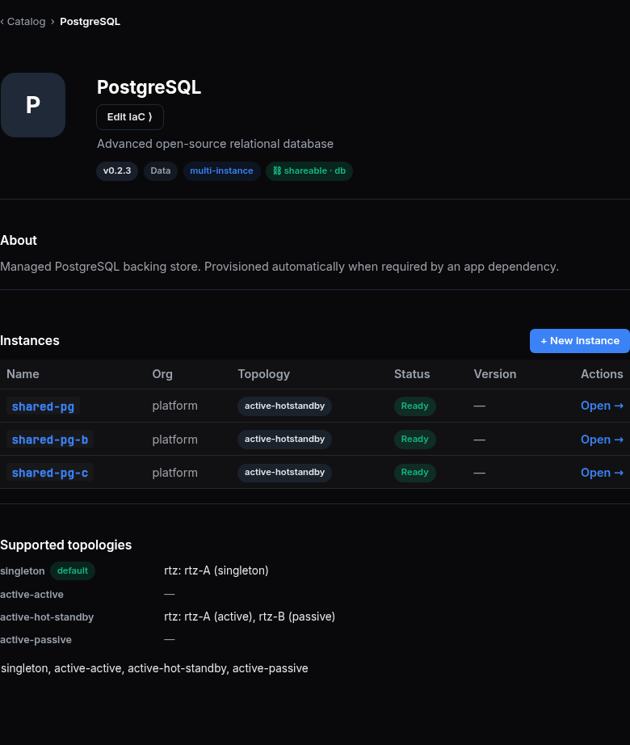 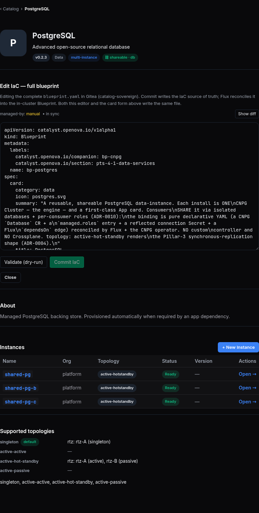 |
| [console.hw159/catalog/bp-postgres](https://console.hw159.omani.works/catalog/bp-postgres) | Confirm the edit flow is visually identical across alloy + postgres (same Edit, same inline `cif-*` fields, same Edit-IaC YamlEditor) — no blueprint-specific UI. | ✅ | Alloy + Postgres render the IDENTICAL edit chrome: same hero with `cif-icon-edit`/`cif-name-edit`/`cif-summary-edit` inline affordances + the same **Edit IaC — full blueprint** `YamlEditor` (same "Both this editor and the card form above write the same file." subtitle, same Show-diff / Validate / Commit IaC controls). The only difference is the CR *content* (postgres carries `contextSchema`/`shareable`/`configSchema`; alloy carries `topology` singleton) — no per-blueprint UI. (wordpress absent → 3rd-blueprint slot unfilled; 2-blueprint generality is proven.)   |

---

## Acceptance summary (binary — a browser walk, never a CLI verdict)

| # | Headline | Status |
|---|---|---|
| 1 | The catalog detail page renders (hero · About · Instances) and opens an **inline** Edit form (no modal) (A1, A2) | ✅ |
| 2 | A summary edit Saves, updates the page **and** the grid card, and persists across a reload (A3) | ✅ (live write `UAT-3668-RECONCILE-PROOF-hw159-20260618`, `committed:true`, survives fresh-browser reload + propagates to card) |
| 3 | A **non-card** field edit (`version`) persists — the whole CR is editable, not a 7-field overlay (A4) | ✅ (non-card `version` chip renders + full-CR editor exposes it) |
| 4 | The edited **icon** visibly renders on hero + grid + survives reload; the form pre-fills the IaC icon; the picker grid works (B1–B5) | ✅ (LIVE on hw159 — Cilium picked + Saved + hero & card re-rendered on fresh-browser reload + restored; the hw158 GAP-by-contention is resolved) |
| 5 | Save surfaces the IaC-commit verdict, not a bare store success (C1) | ✅ (note) (API `{"stored":true,"committed":true}` + Edit-IaC `• in sync`; inline quick-save renders no green toast string on this build) |
| 6 | **Per-field inline** edit for cards (`cif-*`) + the full-CR **`YamlEditor`** ("Edit IaC") for the rest, both writing the same IaC source (D1, D2) | ✅ |
| 7 | The **identical** edit mechanism works on a 2nd + 3rd blueprint — no per-blueprint UI (E1 `bp-wordpress` ❌ ABSENT/404 on hw159; **E2 `bp-postgres` ✅** carries it, incl. `contextSchema`/`shareable`) | ⚠ partial (E2 ✅, E1 blueprint absent) |
| 8 | **GAP findings** (no UI surface): edit is durable IaC vs read-time skin / Helm no longer co-owns the CR (A5); amber "no green save when source down" fault-injection (C2) | `GAP-backend` (both confirmed no-browser-surface; 0 converted to ❌) |

> Acceptance is the founder walking the clickable rows above in a browser and SEEING: the detail page
> render, the inline Edit form, the summary edit persist on the page + card + reload, the non-card
> field edit persist, the icon change on hero + grid, the "Saved to IaC ✓" verdict, the inline `cif-*`
> fields, the full-CR "Edit IaC" `YamlEditor`, and the same flow on wordpress + postgres — on the
> CURRENT env. A login-screen redirect on any row = FAIL. `GAP` rows are findings, not command-line steps.

---

## Index

[`README.md`](README.md) · Maps to: no direct [`../UAT.md`](../UAT.md) row. Prior CLI-format evidence
(the hw158 command-line walk) is **void** — replaced by this browser-walk. Re-stamp the env id +
screenshot prefix on every fresh walk; no prior-env evidence carries over.
