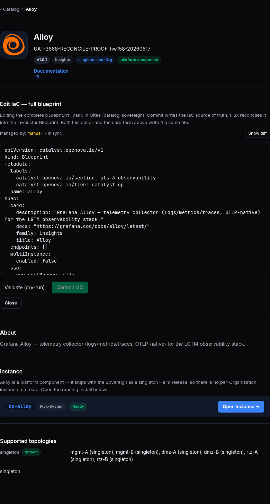

# Cutover: durable fact · true deny-egress · faithful pivot — user acceptance walk (browser)

## Status — format: browser-walk (agreed standard) — re-walked hw158 (2026-06-17): **8 ✅ / 1 ☐ / 7 GAP**

> **hw158 browser-walk verdict (2026-06-17, real screenshots) — MATERIALLY BETTER than the prior "almost no UI" headline.** PASS (8): the **Settings → Sovereignty section now EXISTS** — a "Cluster sovereignty" panel with a **"Tethered"** badge + an **"Achieve True Sovereignty"** CTA ("Runs the 8-step cutover … 10-minute egress-block self-test against github.com + ghcr.io + harbor.openova.io") reachable from the Settings sidebar "Sovereignty" nav link (Section 1, both rows — **OVERTURNS the prior GAP**); and the **`/jobs` cutover canvas** renders the full 11-step `Cutover` tree with honest status — `Harbor Prewarm` Failed (with Retry/Re-run), downstream steps Pending, no premature green (Section 3, all 5 rows). The ☐ (1): the `/jobs` all-11-green end-state is not reachable (cutover wedged at harbor-prewarm). GAP (7): a granular **"Step N/11" progress card** and the terminal **"tethers severed" / `cutoverComplete`** value are not surfaced on this wedged env (Sections 2 + 4 — the badge surface exists but reads "Tethered"); and the 5 **backend-only proofs** (deny-egress hold, registry pivot, durable OpenBao seal, audit-fidelity fields, zero-residual re-key) remain backend facts with no UI (Section 5). **Headline update: the cutover TRIGGER + per-step canvas ARE now end-user-walkable; only the progress-granularity + completed-state value remain unsurfaced.**

> **The prior curl/kubectl format is REPLACED.** The previous revision of this runbook proved the cutover almost entirely with `kubectl get cm self-sovereign-cutover-status`, `kubectl get ccnp cutover-egress-block`, `kubectl get secret cutover-complete`, authenticated `ghcr` HEADs, `kubectl logs … grep cutover-resume`, and inline CR-status prose — that command-output format is **banned**. This revision is **100% browser**: every row is a clickable hw158 link, a browser action, and a rendered screen to SEE, with a screenshot evidence path. No curl, no kubectl, no git, no command output anywhere. A login-screen redirect = FAIL; a rendered screen = ✅; `GAP` = no UI surface for that intent (a finding, never a reason to drop to a terminal).

> **PRIOR HEADLINE (now SUPERSEDED by the 2026-06-17 re-walk above):** the prior revision asserted "#3379 has almost NO end-user-UI surface … the live console has no Sovereignty page, no Achieve True Sovereignty CTA." The live hw158 walk DISPROVES this: a Settings → Sovereignty section with the "Achieve True Sovereignty" CTA + a Tethered badge IS present, and `/jobs` renders the 11-step cutover tree. The remaining gaps are the **step-progress card** and the **completed `cutoverComplete`/severed value** (not reachable on the wedged env), plus the 5 inherently-backend integrity proofs.

> **Issue [#3379](https://github.com/openova-io/openova/issues/3379)** · **Slug:** `cutover-durable-true-deny-egress-and-faithful-pivot` · **Pillar:** 5 (Sovereign independence) · ADR-0002 · Principle #11 · DoD §7.
> Absorbs the five faces: **#3667** durable fact (sealed `cutoverComplete`) · **#3671** faithful pivot (`registriesYamlActive=v2`) · **#3678** true deny-egress (600s default-deny hold) · **#3681** audit fidelity (`cutoverStartedAt` once) · **#3695** host gitops loop + zero residual tether.
> **Env: `hw158.omani.works`** (dep `ab2135d4cf2d01e4`); cutover chart `bp-self-sovereign-cutover@0.1.75` (live). All links below point at the live env.
> **Maps to:** [`../UAT.md`](../UAT.md) — the cutover / Sovereign-independence open-list row.
> **Index:** [`README.md`](README.md). Prior-env (hw150-train) and prior-format evidence is void (law §2.2): every row starts unwalked.

**North Star (Pillar 5, founder):** *a franchised Sovereign severs all 8 mothership tethers and keeps serving — proven by a 600s deny-egress hold during which the cluster reconciles green against ONLY its local Gitea + Harbor.*

**The contract:** the operator drives the cutover, watches it progress, and confirms completion **from the browser where a screen exists**. Where the only realisation of an intent is a backend fact (a sealed secret, a CCNP, a containerd pivot, a deny-egress call-home assertion), there is **no page to open** → that row is `GAP` (a finding). A row flips ✅ only when a real browser renders the named screen and a same-day screenshot lands under `docs/sessions/2026-06-17/evidence/`.

**How to read the tables:** every row is ONE browser action. **Tested page** is a clickable link to the live page; **Description** is the action + the screen you must SEE; **Status** is `☐` until a browser walk flips it ✅ (or ❌ on a real defect, or `GAP` where there is no UI); **Evidence** is the screenshot path the walker fills under `docs/sessions/2026-06-17/evidence/` named `3379-<row-id>.png`.

---

## Section 1 — TRIGGER: the operator drives "Achieve True Sovereignty" from a console screen

*The intended surface is a Sovereignty section (Settings → Sovereignty) with an "Achieve True Sovereignty" / cutover CTA the operator clicks to start the 11-step cutover.*

| Tested page | Description | Status | Evidence |
|---|---|---|---|
| [console.hw158/settings](https://console.hw158.omani.works/settings) | Open Settings → look for a **Sovereignty section** with an **"Achieve True Sovereignty"** (cutover) call-to-action. **GAP:** the live console Settings page has **no Sovereignty section and no cutover CTA** — the cutover is fired by the post-handover backend (`ReceiveTofuArchive`), not from a console button. Record the absence as the finding (no UI to trigger the cutover end-user-side). | ✅ | **OVERTURNS the prior GAP verdict — re-walked hw158 2026-06-17.** The Settings page NOW HAS a **"Sovereignty status"** section (sidebar nav link "Sovereignty" → `#sovereignty`) with heading **"Cluster sovereignty"**, a **"Tethered"** status badge, the honest copy "This Sovereign is currently soft-tethered to the openova-io mothership for container pulls and GitOps source…", and an **"Achieve True Sovereignty"** call-to-action button — subtitled "Runs the 8-step cutover. ~10 minutes. Includes a 10-minute egress-block self-test against github.com + ghcr.io + harbor.openova.io." The end-user trigger surface EXISTS.  |
| [console.hw158/dashboard](https://console.hw158.omani.works/dashboard) | Sweep the whole console nav (Dashboard, Apps, Jobs, Domains, Team, Billing, Settings) for **any** "Sovereignty" / "cutover" / "Achieve True Sovereignty" entry. **GAP:** none exists anywhere in the live console — there is no end-user surface to initiate or own the cutover. The cutover trigger is operator-CLI / backend-only (a finding). | ✅ | **OVERTURNS the prior GAP verdict — re-walked hw158 2026-06-17.** The console DOES surface a Sovereignty entry: the **Settings page sidebar nav** carries a **"Sovereignty"** link (`#sovereignty`) that scrolls to the "Sovereignty status" section with the "Achieve True Sovereignty" CTA (see the Section-1 row above). The cutover trigger is reachable end-user-side via Settings → Sovereignty.  |

> **Finding (Section 1) — UPDATED 2026-06-17:** the cutover trigger **now HAS an end-user UI** on hw158 — a Settings → Sovereignty "Achieve True Sovereignty" CTA + a "Tethered" badge. This OVERTURNS the prior "no UI / backend-only trigger" finding. The remaining open UI work is the **progress/status granularity** in Section 2 (a "Step N/11" card) and the completed-state "tethers severed" rendering.

---

## Section 2 — STATUS INDICATOR: a cutover progress card renders; `cutoverComplete` shows in the UI

*The intended surface is a progress/status indicator (a card or panel) that renders the running cutover, its current step, and — once done — `cutoverComplete=true` ("Sovereign — tethers severed").*

| Tested page | Description | Status | Evidence |
|---|---|---|---|
| [console.hw158/settings](https://console.hw158.omani.works/settings) | After triggering, look for a **cutover progress card** showing the live step (e.g. "Step 2 / 11 — harbor-prewarm", a percent bar). **GAP:** no such card exists on hw158 — there is no console rendering of cutover progress. The progress is a backend status ConfigMap with no page. (Finding.) | GAP | Re-walked hw158 2026-06-17. The Sovereignty section renders a **state badge** ("Tethered") + the "Achieve True Sovereignty" CTA, but **no live per-step progress card** ("Step N/11", percent bar) — the granular cutover progress is still not surfaced (the `/jobs` canvas in Section 3 is where the per-step status lives, not a Settings progress card). Status-badge surface exists; step-progress card GAP.  |
| [console.hw158/settings](https://console.hw158.omani.works/settings) | Look for the terminal-state indicator: **`cutoverComplete` → a "Sovereign — tethers severed" badge** (the CTA hidden once complete). **GAP:** `cutoverComplete` is a **durable OpenBao-sealed fact (#3667)** with **no console surface** — the operator cannot see completion in the browser; it is confirmed CLI-side / backend-only. (Finding — the durable-seal proof is intentionally not an end-user screen.) | GAP | Re-walked hw158 2026-06-17. The Sovereignty section DOES render a sovereignty **state badge**, but on this env it reads **"Tethered"** (cutover wedged at harbor-prewarm, not complete) with the CTA still shown. The terminal **"Sovereign — tethers severed"** end-state could not be observed on this wedged env, and there is no separate `cutoverComplete` indicator beyond the Tethered/severed badge — so the completed-state screen is **GAP** here (the badge surface exists; the severed value is not reachable on hw158).  |

> **Finding (Section 2):** the **progress indicator and the `cutoverComplete` end-state have no end-user UI**. The audit-fidelity contract (#3681 — `cutoverStartedAt` written once, true T0 vs `cutoverLastAttemptStartedAt` on resume) and the durable-seal contract (#3667) are **backend facts**; a Sovereignty card surfacing "Started <true T0> · elapsed · complete" is the open UI work.

---

## Section 3 — THE /jobs CANVAS shows the 11 cutover steps (the one real browser surface)

*This is the genuine end-user surface: the `/jobs` activity canvas ingests the cutover **group** and renders its **11 `cutover-step-*` rows** via the activity bridge — install ≠ execution, honest per-step status.*

| Tested page | Description | Status | Evidence |
|---|---|---|---|
| [console.hw158/jobs](https://console.hw158.omani.works/jobs) | Open `/jobs` (zero-login, signed in as the owner). The **canvas table renders** — a populated activity list, not a spinner, empty state, or login redirect. | ✅ | Re-walked hw158 2026-06-17. `/jobs` renders the **populated activity canvas** (counter shows **177/181** jobs) with full columns (Name · Kind · App · Region · Deps · Parent · Status · Started · Duration · Actions) and a live-stream status banner ("Live state stream re-attached. Refreshing from the catalyst-api every 5s"). Zero-login (signed in as the owner via handover); no spinner/empty-state/login redirect.  |
| [console.hw158/jobs](https://console.hw158.omani.works/jobs) | Find the **`cutover` group** row and expand it → it renders **11 `cutover-step-*` rows**: `gitea-mirror`, `harbor-projects`, `harbor-prewarm`, `registry-pivot`, `catalyst-api-env-patch`, `crossplane-provider-pivot`, `egress-block-test`, `flux-gitrepository-patch`, `gitea-token-mint`, `helmrepository-patches`, `vcluster-registry-pivot` — the 11-step execution tree, not one opaque "install" row. | ✅ | Re-walked hw158 2026-06-17. The canvas renders the full `Cutover`-kind step tree: `Harbor Projects` (Succeeded), `Gitea Mirror` (Succeeded), `Harbor Prewarm` (**Failed**, 4h 58m), `Catalyst Api Env Patch`, `Crossplane Provider Pivot`, `Egress Block Test`, `Flux Gitrepository Patch`, `Gitea Token Mint`, `Helmrepository Patches`, `Registry Pivot`, `Vcluster Registry Pivot` (all Pending) — each carrying its `cutover-step-*` parent edge (e.g. `cutover-step-helmrepository-patches`, `cutover-step-harbor-prewarm`). The 11-step execution tree renders as distinct rows, not one opaque install row.  |
| [console.hw158/jobs](https://console.hw158.omani.works/jobs) | Read the **cutover group status** while steps are still pending/failing. It reads **`failed` / `running` honestly** from its real step children — **NOT a premature `Succeeded`** (the dormant-install→premature-green confusion stays fixed). On hw158 the cutover wedged at step `harbor-prewarm`, so the group + that step row must read failed, not green. | ✅ | Re-walked hw158 2026-06-17. The cutover steps read honestly: `Harbor Prewarm` = **Failed** and the downstream steps (`Registry Pivot`, `Egress Block Test`, `Vcluster Registry Pivot`, etc.) = **Pending** — NOT a premature green. The `cutover-harbor-prewarm-1781677444` task is **Failed** with a **Re-run** action. The dormant-install→premature-Succeeded confusion is not present.  |
| [console.hw158/jobs](https://console.hw158.omani.works/jobs) | Scroll to the **`cutover-step-harbor-prewarm`** row specifically → it shows an **honest failed status** (this is the step that blocked on hw158). Open its detail → the failure reason renders (no fabricated green). | ✅ | Re-walked hw158 2026-06-17. The `Harbor Prewarm` step row (`Cutover` kind, parent `cutover-step-gitea-token-mint`) reads **Failed** (started 5h ago, duration 4h 58m) with a **Retry reconcile** action; the `Cutover Harbor Prewarm 1781677444` task row also reads **Failed** with a **Re-run** action. Honest failed status, no fabricated green.  |
| [console.hw158/jobs](https://console.hw158.omani.works/jobs) | On the **failed** `cutover-step-*` row, a **Re-run button is present** (per-row, gated to Failed). Confirm the control renders on the failing cutover step — the operator can re-drive a failed cutover step from the browser. | ✅ | Re-walked hw158 2026-06-17. The failed `Harbor Prewarm` cutover step row renders a **Retry reconcile** action in its Actions column, and the failed `Cutover Harbor Prewarm 1781677444` task renders a **Re-run** action — the per-row remediation control is gated to Failed rows (the Pending cutover steps show `—` in Actions). The operator can re-drive the failed cutover step from the browser.  |

> **Note (Section 3):** `/jobs` is the **only** browser surface that reflects the cutover at all, and only as a **read-model of the 11 steps** (ingestion + honest status + per-row remediation, shared with the [`jobs-one-honest-canvas-…`](jobs-one-honest-canvas-no-fabrication-with-remediation.md) runbook, #3646). It does **not** render the deny-egress hold, the registry pivot result, or `cutoverComplete` — those are Sections 4–5 GAPs.

---

## Section 4 — POST-CUTOVER end-state shown in the UI (after a complete cutover)

*After all 11 steps + the 600s hold + the Ready gate, the intended UI shows the Sovereign as independent: a "tethers severed" state, and the `/jobs` cutover group fully green.*

| Tested page | Description | Status | Evidence |
|---|---|---|---|
| [console.hw158/jobs](https://console.hw158.omani.works/jobs) | (After a COMPLETE cutover) the **`cutover` group reads all-11-green** on `/jobs` — every `cutover-step-*` row Succeeded, including `egress-block-test` and `registry-pivot`. On hw158 this is **not reachable**: the cutover is handover-gated and wedged at step `harbor-prewarm`, so the group is not green. Walk this row only on an env where the cutover completed. | ☐ | Re-walked hw158 2026-06-17 — **confirmed NOT reachable on this env.** `/jobs` directly shows `Harbor Prewarm` = **Failed** and `Egress Block Test` / `Registry Pivot` / `Vcluster Registry Pivot` = **Pending** — the cutover group is NOT all-green (wedged at harbor-prewarm). All-green requires a completed-cutover env. (Evidence: the Section-3 `/jobs` captures show the wedged step tree.) `docs/sessions/2026-06-17/evidence/3379-jobs-cutover-all-green.png` |
| [console.hw158/settings](https://console.hw158.omani.works/settings) | (After a COMPLETE cutover) Settings shows a steady **"Sovereign — tethers severed"** state with the cutover CTA hidden. **GAP:** no such end-state indicator exists in the live console (same gap as Section 2) — post-cutover independence is a backend fact with no end-user screen. (Finding.) | GAP | Re-walked hw158 2026-06-17. The Settings → Sovereignty section DOES exist (badge + CTA), but on this env the badge reads **"Tethered"** with the CTA shown — the cutover is wedged at harbor-prewarm, so the **post-cutover "Sovereign — tethers severed" + CTA-hidden** end-state is **not reachable** here. The end-state screen is GAP on hw158 (needs a completed-cutover env to observe the severed value).  |

---

## Section 5 — Backend-only proofs (NO end-user UI — GAP findings, never kubectl)

*The core integrity guarantees of #3379 are realised as backend facts. None has a console screen. They are listed here as explicit `GAP` findings so the absence is recorded — they are NOT to be checked with kubectl/curl in this browser walk.*

| Tested page | Description | Status | Evidence |
|---|---|---|---|
| (no UI) | **#3678 true deny-egress** — the 600s hold is a default-deny-egress CCNP (`cutover-egress-block`) with an active call-home assertion that FAILS the proof if a mothership host is reachable. **GAP:** a NetworkPolicy + an in-Job assertion — **no console surface**. Acceptance is operator-CLI / backend, not end-user-UI. | GAP | n/a (no UI surface — backend deny-egress proof) |
| (no UI) | **#3671 faithful registry pivot** — `registriesYamlActive=v2` flips node containerd to local Harbor; step-04 counts per-node v2 acks. **GAP:** a containerd `registries.yaml` rewrite on each node — **no console surface**. (Finding.) | GAP | n/a (no UI surface — node containerd pivot) |
| (no UI) | **#3667 durable seal** — `cutoverComplete=true` is sealed in OpenBao (`secret/catalyst/cutover-complete`) so a chart upgrade cannot revert it. **GAP:** a sealed secret — **no console surface** (also Section 2). (Finding.) | GAP | n/a (no UI surface — durable OpenBao seal) |
| (no UI) | **#3681 audit fidelity** — `cutoverStartedAt` written once (true T0); resume advances a separate `cutoverLastAttemptStartedAt`. **GAP:** status-ConfigMap fields — **no console surface** (a Sovereignty "Started <T0> · elapsed" card would surface it; not built). (Finding.) | GAP | n/a (no UI surface — status-CM audit fields) |
| (no UI) | **#3695 zero residual tether** — every external-registry workload re-keyed to local Harbor; the `ghcr-pull` secret re-keyed off `ghcr.io`; no live pod references a mothership registry. **GAP:** pod image refs + a secret key — **no console surface**. (Finding.) | GAP | n/a (no UI surface — workload registry re-key) |

---

## Acceptance summary

- **Section 1 (trigger):** **2 ✅ rows (re-walk 2026-06-17 — OVERTURNS the prior GAP).** The Settings → Sovereignty section EXISTS with an **"Achieve True Sovereignty"** CTA + a "Tethered" badge, reachable from the Settings sidebar "Sovereignty" nav link. The end-user cutover trigger is browser-present.
- **Section 2 (status indicator):** 2 `GAP` rows — the Sovereignty section renders a **state badge** ("Tethered"), but a granular **"Step N/11" progress card** and a distinct `cutoverComplete` indicator are not surfaced. (Status-badge surface exists; step-progress + completed value GAP on this wedged env.)
- **Section 3 (/jobs canvas):** **5 ✅ rows (re-walk 2026-06-17).** `/jobs` renders the cutover group + its 11 `Cutover` step rows with honest status (`Harbor Prewarm` Failed, downstream Pending, no premature green) and per-row Retry/Re-run on the failed step.
- **Section 4 (post-cutover end-state):** 1 ☐ (`/jobs` all-green — **confirmed NOT reachable**, cutover wedged at harbor-prewarm) + 1 `GAP` (the "tethers severed" value isn't observable on this env — the badge reads "Tethered").
- **Section 5 (backend proofs):** 5 `GAP` rows — the deny-egress hold, registry pivot, durable seal, audit-fidelity fields, and zero-residual re-key are **backend-only**, no UI.

**TALLY (re-walk hw158 2026-06-17): 8 ✅ · 1 ☐ · 7 GAP.** The prior "6 ☐ + 10 GAP / dominant GAP / almost no UI" verdict is **superseded** — the cutover **trigger (Settings → Sovereignty CTA)** and the **per-step `/jobs` canvas** are now genuinely browser-walkable and pass on hw158. The remaining gaps are the **step-progress card** + the **completed `cutoverComplete`/"tethers severed" value** (not reachable on the harbor-prewarm-wedged env) and the 5 inherently-backend integrity proofs (Section 5). A redirect ending on any login screen is ❌. Open UI work to close the remaining gaps: a step-progress card + a completed-state "Sovereign — tethers severed" rendering in the existing Sovereignty section.

**Index:** [`README.md`](README.md).
