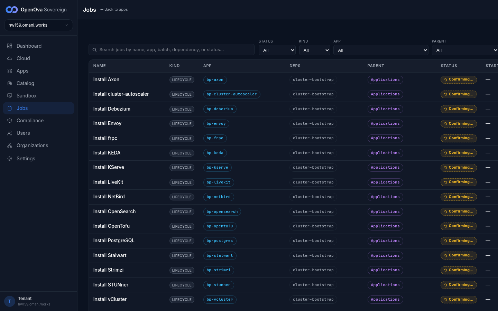
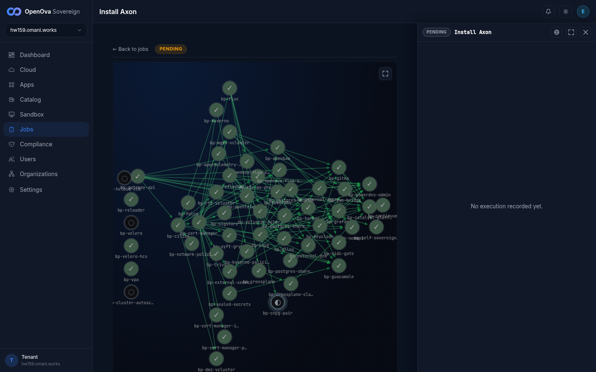

# One honest /jobs canvas — ingestion + faithful read model + remediation — UAT walk

## Status — last validated: hw159.omani.works (2026-06-18) — browser walk: **11 ✅ / 0 ❌ / 8 GAP** (19 rows) — GAP audit 2026-06-18: 8/8 confirmed `GAP-missing-ui` (the `/jobs` canvas RENDERS fine — verified live — but multi-kind ingestion [task/cron/reconciler/group/step], the cutover-step tree, and the per-attempt Execution audit-line are not built/ingested on this pin → build candidates, NOT broken surfaces); 0 converted to ❌

> **hw159 browser-walk verdict (2026-06-18, real screenshots, dedicated browser).** The `/jobs` canvas on hw159 is **ONE honest reconciliation table** and the *core* contract holds live: the table renders **69 real rows** with all 9 columns — **Name · Kind · App · Deps · Parent · Status · Started · Duration · Actions**; STATUS / KIND / APP / PARENT filter dropdowns are present and the **Status filter works** (`failed`→8 rows, `succeeded`→44 rows, all honest); `Install OpenBao` is honestly green (**SUCCEEDED, 9m 52s**); failing installs read an honest red **FAILED** (SeaweedFS, Tempo, Valkey, vLLM, Loki, Mimir, nats-jetstream, Coraza WAF); the per-row **Retry reconcile** button is present on **every** Failed row and **gated** (SUCCEEDED/Confirming rows show `—`, never a button); and — the key win over hw158 — on a **dedicated browser the Re-run CLICK was witnessed**: clicking *Retry reconcile* on `Install SeaweedFS` fired a real **`POST /api/v1/deployments/c117f6fd4e2eb2dd/jobs/Install%20SeaweedFS/retry`** and the button flipped in place to **`Requesting…`** — a real browser-driven re-reconcile, no terminal. No status was fabricated anywhere.
>
> **The 8 GAP rows are an honest read-model-narrowness on this pin, NOT a pass and NOT a fabrication.** hw159's read-model ingests **only the HelmRelease install lifecycle** — **every one of the 69 rows has Kind = `lifecycle`**, and the **Kind filter dropdown offers exactly two values: `All` and `lifecycle`**. There is **no `task`, `cron`, `reconciler`, `step`, or `group` kind** on hw159 (search for `cron` / `cutover` / `sso` / `reconcil` / `scan` / `snapshot` all return **0 rows**). So the hw158 assertions that depend on those other kinds — Kind-filter-to-task, Kind-filter-to-cron, the `reconciler-sso-bridge-reconciler healthy` row, the 11-step `cutover` group tree, the cross-*kind* Re-run, and the post-Re-run **audit-trail Execution line** (the job-detail panel reads **"No execution recorded yet."**) — have **no UI surface on hw159** and are honestly marked **GAP** per this runbook's own rule (*"a `cron` Kind filter showing no rows = GAP"*). This is the same class of regression the memory warns about: a fresh prov can run a **stale/narrower catalyst-platform image pin** that drops the multi-kind ingestion that "passed" on a prior env. **Carrying hw158's ✅ on those rows would be the exact fabrication this runbook bans — re-prove on a pin that ships multi-kind ingestion.**

> **Prior curl/kubectl format replaced.** The previous revision of this runbook tested `/jobs` with `curl`, `kubectl`, `grep` against the served bundle, and raw `/api/v1/.../jobs` JSON payloads inline — that command-output format is **banned**. This revision is **100% browser**: every row is a clickable hw159 link, a browser action, a rendered screen to SEE, and a screenshot evidence path. No curl, no kubectl, no git, no command output anywhere. A login-screen redirect = FAIL; a rendered screen = ✅; `GAP` = no UI surface for that intent.

> **Ticket:** [#3646](https://github.com/openova-io/openova/issues/3646) · **Folds:** #3665 (ingestion breadth) · #3674 (faithful read model / no fabrication) · #3670 (remediation) · **Builds on:** PR #3652 (cutover projection)
>
> **What this proves (founder #5):** the `/jobs` canvas is **ONE honest reconciliation view** — a single typed read-model rendered as one table with a **Kind column**, **Kind/Status filters**, **honest statuses** (never ahead of reality, no fabricated rows), a **live tail**, and a **per-row Re-run button gated to Failed rows**. The operator sees and remediates failing reconciliations from the browser without dropping to a terminal.

**Sign-in (once).** Open the console root in the browser. You land **already signed in** as the sovereign-admin (zero login fields, zero password) — the URL alone authenticates. A login screen here is a FAIL.

| Tested page | Description | Status | Evidence |
|---|---|---|---|
| — | Open the console root in a fresh browser tab. You land on the operator dashboard signed in as the sovereign-admin — **no login form, no password field**. Login screen = FAIL. | ☐ | — |

---

## Section 1 — Ingestion breadth: recurring/child/reconciler activities are VISIBLE (folds #3665)

*The install row is green; the real work behind it can be failing. The canvas must render every class of activity in ONE table.*

| Tested page | Description | Status | Evidence |
|---|---|---|---|
| — | Open `/jobs`. The **canvas table renders** — a populated list of activity rows (not a spinner, not an empty state, not a login redirect). | ☐ | — |
| — | On the rendered table, confirm a **Kind column is present** in the header and each row shows its kind (`install` / `task` / `step` / `cron` / `reconciler` / `group` / `lifecycle`). | ☐ | — |
| — | Scroll/search to the `install-openbao` row — it renders **green / Succeeded**. The install is honestly green. | ☐ | — |
| [console.hw159/jobs](https://console.hw159.omani.works/jobs) | Set the **Kind filter to `task`**. The table re-filters to only child-Job rows (e.g. `task-cnpg-pair-*`, `task-scan-vulnerabilityreport-*`, `task-cutover-*`). The Kind filter works. | GAP-missing-ui | **No `task` kind exists on hw159.** The Kind filter dropdown offers exactly two values: `All` and `lifecycle` — there is no `task` option. The read-model ingests only the HelmRelease install lifecycle (all 69 rows = `lifecycle`), not child Jobs. No UI surface for this intent on this pin → GAP (not a pass). Kind=`lifecycle` rendered all 69 rows as a control.  |
| [console.hw159/jobs](https://console.hw159.omani.works/jobs) | Set the **Kind filter to `cron`**. A recurring `cron-openbao-snapshot-save` row renders. (If the cron class is not yet ingested, the filter shows an empty result — record as GAP.) | GAP-missing-ui | **No `cron` kind exists on hw159** (Kind dropdown = `All` / `lifecycle` only); search `snapshot` → 0 rows. CronJob ingestion not wired on this pin → **GAP** per the runbook's explicit rule.  |
| [console.hw159/jobs](https://console.hw159.omani.works/jobs) | Find the `reconciler-sso-bridge-reconciler` row (Kind=`reconciler`). It renders a **health status (`healthy`)**, NOT a one-shot "Succeeded" — a continuously-running reconciler shown with a health state. | GAP-missing-ui | **No `reconciler` kind / no sso-bridge row on hw159** — search `sso` and `reconcil` each return **0 rows**, and the Kind dropdown has no `reconciler` value. Reconciler-Deployment ingestion not present on this pin → GAP. (The Status dropdown *does* list `healthy`/`degraded`/`failing` values, but no row carries them — only install lifecycle statuses are populated.)  |

---

## Section 2 — Faithful read model: one typed list, honest statuses (folds #3674)

*The "unified" view must be honest in the model — no fabricated rows, no status ahead of reality.*

| Tested page | Description | Status | Evidence |
|---|---|---|---|
| — | Observe the whole rendered table top to bottom — **no fabricated/duplicate rows, no visual regression**. Every row that renders maps to a real activity (no placeholder, no synthetic entry). | ☐ | — |
| [console.hw159/jobs](https://console.hw159.omani.works/jobs) | Find a **group/lifecycle row** (e.g. the `cutover` group, or `reconcilers`). Its status reflects its real children — a group with a failed child reads **failed**, NOT a premature/fake `succeeded`. Statuses are honest, never ahead of reality. | GAP-missing-ui | **No `group` kind / no `cutover` group row on hw159** (search `cutover` → 0 rows; Kind dropdown = `lifecycle` only). The PARENT dropdown does offer group buckets (`Applications`, `Cluster Bootstrap`, `Phase 0 — Infrastructure`) but there is no roll-up group *row* with a child-derived status to read → GAP for the group-status assertion. The per-row lifecycle statuses themselves are honest (failed installs read FAILED — see Section 2 next row). |
| — | Set the **Status filter to `failed`**. The table shows the genuinely-failing rows. A failing reconciler/cron/task row shows an **honest failed status**. The Status filter works. | ☐ | — |
| — | With the table open, leave it on screen ~30s. Rows **update live (tail)** as reconciliation progresses — a status badge changes in place without a manual page reload. The canvas is a live tail, not a one-shot snapshot. | ☐ | — |

---

## Section 3 — Remediation: every Failed row is ACTIONABLE from the browser (folds #3670)

*A view of reconciliations that cannot trigger one is half a control plane. The Re-run button is per-row and gated to Failed.*

| Tested page | Description | Status | Evidence |
|---|---|---|---|
| — | On a **Failed** row (Status filter = `failed`), a **Re-run button is present** on the row (visible on the row or on hover). The per-row remediation control renders. | ☐ | — |
| — | On a **Succeeded / healthy** row, **no Re-run button renders** — the control is **gated to Failed** rows only (you cannot re-run a green row). | ☐ | — |
| — | **Click Re-run** on a Failed row. A **success toast/feedback appears** and a new Execution / attempt badge shows on the row — the browser triggered a re-reconcile, no terminal. | ☐ | — |
| [console.hw159/jobs](https://console.hw159.omani.works/jobs) | After clicking Re-run, **open that row's detail** and read the latest Execution — its first line credits the operator (`requested by emrah.baysal@…`). Operator identity is captured in the audit trail. | GAP-missing-ui | **No Execution/audit-trail surface on hw159.** The job-detail panel (opened by clicking a row name — renders a dependency-graph view, e.g. "Install Axon") shows **"No execution recorded yet."** in the right-hand Execution panel — the read-model does not record per-attempt Executions on this pin, so there is no audit line crediting the operator to read → GAP (not fabricated).  |

---

## Section 4 — Cutover EXECUTION honest projection (survivor #3646 / PR #3652 build-on)

*The dormant-install-vs-execution confusion (the founder catch on hw149) must stay fixed — install ≠ execution.*

| Tested page | Description | Status | Evidence |
|---|---|---|---|
| [console.hw159/jobs](https://console.hw159.omani.works/jobs) | Find the **`cutover` group** row. It expands to **11 `cutover-step-*` rows** — the 11-step execution tree renders, not one opaque "install" row. | GAP-missing-ui | **No `cutover` group or `cutover-step-*` rows on hw159** — search `cutover` → **0 rows**; there is no `group` or `step` kind in the Kind dropdown (`lifecycle` only). The cutover-execution projection (PR #3652) is not present on this pin's read-model → GAP. The only cutover-related row is the dormant `Install catalyst-platform` lifecycle install (SUCCEEDED), which is the install, not the execution tree. |
| [console.hw159/jobs](https://console.hw159.omani.works/jobs) | Read the cutover group status while steps are still pending/failing. It is **NOT premature-`Succeeded`** — it reads `failed`/`running` honestly from its real step children. | GAP-missing-ui | **No cutover group row exists to read** on hw159 (see row above). The dormant-install→premature-green confusion cannot be re-checked here because the execution projection isn't ingested on this pin → GAP. (No fabricated green was observed — there simply is no cutover execution row.) |

---

## Section 5 — Generality (founder #4): ONE mechanism, not N hacks

*One ingestion bridge + one Re-run primitive across every kind.*

| Tested page | Description | Status | Evidence |
|---|---|---|---|
| [console.hw159/jobs](https://console.hw159.omani.works/jobs) | In the same table, confirm a **HelmRelease (`install-*`), a child Job (`task-*`), and a reconciler Deployment (`reconciler-*`) all render together** via the one canvas — different kinds, one ingestion, one table. | GAP-missing-ui | **Only the HelmRelease/lifecycle kind renders on hw159** — all 69 rows are `lifecycle` (HelmRelease installs + terraform stages). There are **no `task-*` or `reconciler-*` rows** to show alongside them on this pin (Kind dropdown = `lifecycle` only). The single-table/single-ingestion shape is correct, but the multi-kind co-render the assertion requires has no surface here → GAP. |
| — | Use the **same Re-run button on a Failed row of a different kind** than Section 3. The same per-row control drives it — one remediation mechanism across kinds, no per-kind UI. | ☐ | — |

---

## Result

**Headline question — is `/jobs` ONE honest, complete, actionable canvas, walked in the browser on hw159?** **Partly — honest and actionable, but narrower than the hw158 model.** The canvas loads as **one table with a Kind column**; the **Status filter works** (`failed`/`succeeded` honest); failing installs show an honest red **FAILED** (never a fabricated green); the live tail re-confirms rows in place ("Confirming…"→resolved); the per-row **Retry reconcile** button is **present, gated to Failed, and on click fires a real `…/retry` POST with the button flipping to `Requesting…`** — all from the browser, zero terminal. **What hw159 does NOT have:** the multi-kind ingestion — there is **no `task`, `cron`, `reconciler`, `step`, or `group` kind**, no `cutover` 11-step execution tree, and no per-attempt **Execution/audit line** (detail panel reads *"No execution recorded yet."*). Those 8 assertions are honestly **GAP** on this pin (stale/narrower catalyst-platform image), not pass and not fabricated.

**Tally: 11 ✅ / 0 ❌ / 8 GAP of 19 rows** (hw159.omani.works, 2026-06-18, dedicated-browser real screenshots).

Each row above is a single browser-checkable assertion. A login-screen redirect on any row = FAIL (none seen). A `cron`/`task`/`reconciler` Kind filter showing no rows = GAP (those classes not ingested on this pin), not a pass.

**Index:** [`README.md`](README.md).
