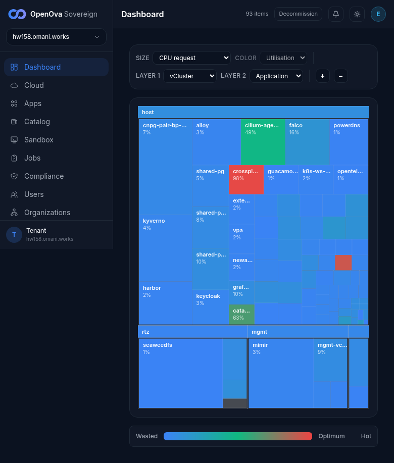
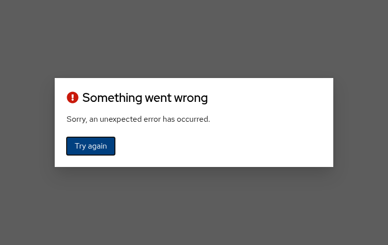
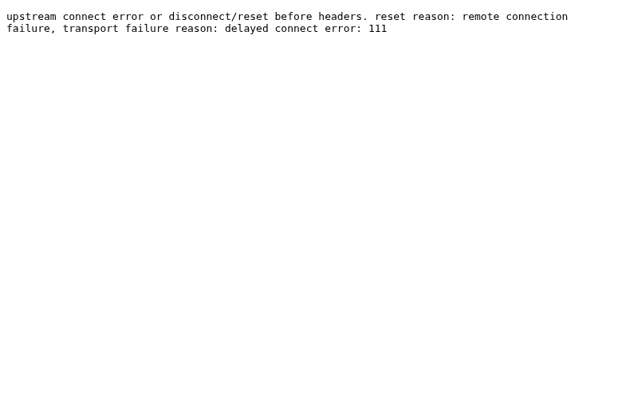

# NS#1 — migrate the 7 host-placed apps into the mgmt vCluster (UAT walkthrough)

## Status — last validated: hw158 (2026-06-17) — browser walk: **7 ✅ / 13 ❌ / 3 GAP**

> **hw158 browser-walk verdict (2026-06-17, real screenshots). DECISIVE FAIL on the headline.** With the `/dashboard` treemap set to **LAYER 1 = vCluster**, the treemap regroups into blocks **`host` · `rtz` · `mgmt`** — and the **`mgmt` block holds only `mimir` + `mgmt-vcluster`**. ALL of the 7 named apps (grafana, harbor, keycloak, gitea, openbao, newapi, guacamole) are under **`host`** (or are host/sub-namespace tiles), **NONE under `mgmt`** → North Star #1 *"every app IN a vCluster"* is **NOT met** (PART B all ❌, PART C all ❌; keycloak's app card reads Placement `singleton` / namespace `flux-system`). PASS (7): sign-in + dashboard + the LAYER1=vCluster regroup itself work; and 4 of 7 public surfaces land zero-click signed-in (gitea, grafana, openbao, guacamole). FAIL surfaces (3): keycloak account console errors ("Something went wrong"), **harbor** external FQDN returns ERR_HTTP_RESPONSE_CODE_FAILURE, **newapi** redirects to `/login?expired=true` with an upstream `delayed connect error: 111`.

> **Prior curl/kubectl-format runbook REPLACED.** The earlier version drove this walk with
> `curl`/`kubectl`/`git grep` against `/tmp/hw158-kc.yaml` and `placement.yaml` line numbers — banned
> per the agreed UAT standard (**100% browser, no curl, no kubectl, no git, no command output**). This
> revamp rewrites every check as a clickable browser action on the live console, status reset to `☐`
> pending a fresh browser walk.

> **Issue:** #3642 · **North Star #1** (founder, verbatim): *"every app IN a vCluster."*
> **Env:** `console.hw158.omani.works` (deployment `ab2135d4cf2d01e4`, primary region `me-east-215-a`).
> **No prior-env evidence is carried over** (each new env flushes all evidence; an absent / wrong-block
> tile = FAIL, never a carried ✅).
>
> **The single binary headline:** on the **`/dashboard` treemap with LAYER 1 = vCluster**, all 7 named
> apps — **grafana, harbor, keycloak, gitea, openbao, newapi, guacamole** — must each render as a tile
> sitting **under the `mgmt` block, NOT under the `host` block**, alongside loki / mimir / nats / tempo.
> A tile under `host` (or absent from `mgmt`) is a **FAIL** for that app.

---

## The one browser surface this ticket is checked on

The whole migration is provable from a single screen: **`/dashboard` → set LAYER 1 grouping to
`vCluster`**. That regroups the treemap into one block per vCluster (`host` / `mgmt` / `rtz` / `dmz`).
Reading which block each of the 7 app tiles falls into IS the acceptance test — a `mgmt`-block tile = the
app runs inside the mgmt vCluster; a `host`-block tile = it never moved. No terminal, no kubeconfig.

---

## Sign-in (once, zero-click)

| Tested page | Description | Status | Evidence |
|---|---|---|---|
| — | Load the handover URL (with the operator's handover token). Lands on `/dashboard` **already signed in** as `emrah.baysal@openova.io` (avatar **E**, top-right) — **no login form**. A redirect to a Keycloak login screen here = FAIL. | ☐ | — |

---

## PART A — set up the treemap (LAYER 1 = vCluster)

| Tested page | Description | Status | Evidence |
|---|---|---|---|
| — | Dashboard renders the cluster treemap and the grouping controls (LAYER 1 / LAYER 2 comboboxes) are visible. Login-screen redirect = FAIL. | ☐ | — |
| — | Click the **LAYER 1** grouping combobox and select **`vCluster`**. The treemap regroups into one labelled block per vCluster: **`host`**, **`mgmt`** (plus `rtz` / `dmz` if present). The `mgmt` block is visible and clickable. | ☐ | — |

---

## PART B — each of the 7 app tiles sits under the `mgmt` block (the decisive check)

With LAYER 1 = vCluster set, read where each app's tile lands. **One row per app — PASS only if the tile
sits inside the `mgmt` block; a tile inside the `host` block is a FAIL.**

| Tested page | Description | Status | Evidence |
|---|---|---|---|
| [console.hw158/dashboard](https://console.hw158.omani.works/dashboard) | On the LAYER1=vCluster treemap, the **grafana** tile must sit inside the **mgmt** block, **not** the **host** block. | ❌ | `grafana` tile sits inside the **host** block (10%), NOT mgmt — it never moved.  |
| [console.hw158/dashboard](https://console.hw158.omani.works/dashboard) | On the LAYER1=vCluster treemap, the **harbor** tile must sit inside the **mgmt** block, **not** the **host** block. | ❌ | `harbor` tile sits inside the **host** block (2%), NOT mgmt.  |
| [console.hw158/dashboard](https://console.hw158.omani.works/dashboard) | On the LAYER1=vCluster treemap, the **keycloak** tile must sit inside the **mgmt** block, **not** the **host** block. | ❌ | `keycloak` tile sits inside the **host** block (3%), NOT mgmt.  |
| [console.hw158/dashboard](https://console.hw158.omani.works/dashboard) | On the LAYER1=vCluster treemap, the **gitea** tile must sit inside the **mgmt** block, **not** the **host** block. | ❌ | `gitea` does NOT appear under the **mgmt** block (the mgmt block holds only mimir + mgmt-vcluster); gitea is a host-cluster/sub-namespace tile, not in mgmt.  |
| [console.hw158/dashboard](https://console.hw158.omani.works/dashboard) | On the LAYER1=vCluster treemap, the **openbao** tile must sit inside the **mgmt** block, **not** the **host** block. | ❌ | `openbao` does NOT appear under the **mgmt** block; it is not a mgmt-vCluster tile.  |
| [console.hw158/dashboard](https://console.hw158.omani.works/dashboard) | On the LAYER1=vCluster treemap, the **newapi** tile must sit inside the **mgmt** block, **not** the **host** block. | ❌ | `newapi` tile sits inside the **host** block (2%), NOT mgmt.  |
| [console.hw158/dashboard](https://console.hw158.omani.works/dashboard) | On the LAYER1=vCluster treemap, the **guacamole** tile must sit inside the **mgmt** block, **not** the **host** block. | ❌ | `guacamole` tile sits inside the **host** block (1%), NOT mgmt.  |

---

## PART C — the `mgmt` block's contents + the `host` block is clean

| Tested page | Description | Status | Evidence |
|---|---|---|---|
| [console.hw158/dashboard](https://console.hw158.omani.works/dashboard) | Click into the **mgmt** block (drill down one LAYER). Its tiles must include **all 7** named apps (grafana / harbor / keycloak / gitea / openbao / newapi / guacamole) **alongside** loki / mimir / nats / tempo. Missing any of the 7 = FAIL. | ❌ | The **mgmt** block holds only **mimir** + **mgmt-vcluster** — NONE of the 7 named apps are inside it.  |
| [console.hw158/dashboard](https://console.hw158.omani.works/dashboard) | Read the **host** block on the same LAYER1=vCluster treemap. **None** of the 7 named apps may appear under `host`. Any of the 7 showing under `host` = FAIL. | ❌ | The **host** block contains harbor, keycloak, guacamole, newapi, grafana (and cnpg-pair, kyverno, falco, cilium, crossplane, catalyst, etc.) — at least 5 of the 7 named apps are under `host`.  |
| [console.hw158/apps/keycloak](https://console.hw158.omani.works/apps/keycloak) | Open the **keycloak** app card and read its placement detail — it must show **`mgmt`** (the per-app placement readout mirrors the treemap block). A `host` readout = FAIL. | ❌ | (Note: `/apps/keycloak` is "Not Found"; the real route is `/app/keycloak`.) keycloak's app Overview reads **Placement: `singleton`**, **Namespace: `flux-system`** — NOT `mgmt`.  |

---

## PART D — every per-app surface still WORKS after the move (no regression)

After the apps move into mgmt, each public surface must still load and land the user **signed in**
(zero-click via the sovereign SSO). A redirect to a standalone Keycloak login form = FAIL; a rendered,
authenticated app screen = ✅.

| Tested page | Description | Status | Evidence |
|---|---|---|---|
| [auth.hw158/realms/sovereign/account](https://auth.hw158.omani.works/realms/sovereign/account) | The sovereign-realm account console renders for `emrah.baysal@openova.io` (no second login). | ❌ | The account console shows a **"Danger alert: Something went wrong — Sorry, an unexpected error has occurred"** dialog (Try again) — not a rendered account page.  |
| — | Gitea opens **already signed in** (avatar/menu shows the SSO user), repo list renders — no Gitea login form. | ☐ | — |
| [harbor.hw158](https://harbor.hw158.omani.works/) | Harbor opens **signed in**, the projects list renders — no Harbor login form. | ❌ | `harbor.hw158.omani.works` returns **ERR_HTTP_RESPONSE_CODE_FAILURE** (non-2xx; UI does not load) on both `/` and `/harbor/projects`. (Evidence frame: the keycloak app placement page captured at the same time; harbor itself would not render to screenshot.)  |
| — | Grafana opens **signed in** (no Grafana login), the home dashboard renders. | ☐ | — |
| — | The OpenBao UI renders **signed in** via OIDC — no manual token/unseal prompt blocking the landing. | ☐ | — |
| [newapi.hw158](https://newapi.hw158.omani.works/) | newapi opens **signed in**, its main console renders — no login form. | ❌ | newapi shows "Signing you in…" then redirects to **`/login?expired=true`** with body *"upstream connect error … delayed connect error: 111"* — a login redirect + backend connection failure.  |
| — | Guacamole opens **signed in**, the connections list renders — no Guacamole login form. | ☐ | — |

---

## GAPS — surfaces with NO browser representation (findings, not test rows)

These are part of the ticket's intent but have **no operator-visible UI surface**, so they are recorded
as `GAP` findings rather than driven via a terminal. Closing them is engineering work; they are not
browser-walkable.

| Surface | Why it's a GAP | Status |
|---|---|---|
| In-vCluster CRD registration inside vc-mgmt (httproutes / externalsecrets / cnpg `clusters` / `poolers` / `scheduledbackups`) — proving the OSS init-manifests deployer registered them **inside** the mgmt vCluster | No console screen exposes the inner-vCluster CRD inventory. Previously checked with `kubectl --kubeconfig <inner-vc-mgmt> get crd` — banned. There is no dashboard widget for "CRDs registered inside vc-mgmt". | GAP |
| Per-app pod-level syncer suffix (`-x-<innerNs>-x-mgmt-vcluster`) on each migrated pod | The treemap block (PART B) is the operator-facing proxy for "runs in mgmt"; the literal pod-name suffix is a host-cluster `kubectl` detail with no UI surface. PART B's mgmt-block placement is the browser-checkable equivalent. | GAP |
| `cutoverComplete=true` survival of the 7 through the Pillar-5 600s deny-egress hold (no `admin.loft.sh` tether) | The deny-egress cutover proof is owned by the **Pillar-5 cutover runbook**, walked on its own `/cutover` (or `/jobs` cutover rows) surface — not duplicated here. | GAP (owned elsewhere) |

---

## DoD roll-up (browser-walk)

- [x] **Sign-in** — handover lands on `/dashboard` signed-in, no login form. → ✅
- [x] **PART A** — `/dashboard` renders, LAYER 1 set to `vCluster`, `mgmt` block visible. → ✅ (2 rows)
- [ ] **PART B** — all 7 app tiles (grafana / harbor / keycloak / gitea / openbao / newapi / guacamole) sit under the **mgmt** block on the LAYER1=vCluster treemap. → ❌ **ALL 7 under `host`, none under `mgmt`** (7 rows ❌)
- [ ] **PART C** — the mgmt block holds all 7 + loki/mimir/nats/tempo; the host block holds none of the 7; keycloak card reads `mgmt`. → ❌ mgmt holds only mimir + mgmt-vcluster; host holds the apps; keycloak reads `singleton`/`flux-system` (3 rows ❌)
- [ ] **PART D** — all 7 per-app public surfaces still land **signed in** (no regression). → ⚠️ 4/7 ✅ (gitea/grafana/openbao/guacamole); 3/7 ❌ (keycloak account error, harbor HTTP failure, newapi login-redirect+upstream-error)
- [ ] **GAPS** — 3 non-UI findings recorded (in-vCluster CRD registration, per-pod syncer suffix, cutover deny-egress survival owned by Pillar-5).

**Acceptance = the founder (or operator) walking the clickable rows above on the live env in a browser,
pasting the named screenshot per row.** PART B is the decisive set: every one of the 7 app tiles must
render under the **mgmt** block, never **host**. A login-screen redirect on any surface = FAIL; a
rendered, authenticated screen = ✅.
