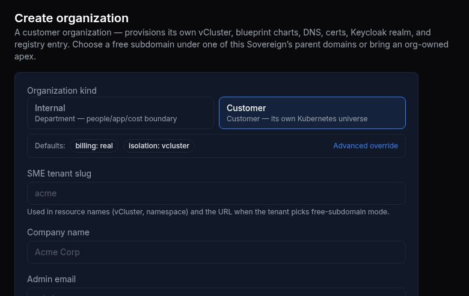

# UAT Walkthrough — ORGANIZATIONS: the persona word "tenant"/"SME" is GONE from every user-facing screen, replaced by "Organization" (#3383)

## Status — last validated: hw159.omani.works (2026-06-18) — browser walk: **6 ✅ / 1 ❌ / 7 GAP** (GAP audit 2026-06-18: 7/7 confirmed `GAP-backend` — all code/CI/cluster carriers with no browser surface; 0 converted to ❌)

> **hw159 browser-walk verdict (2026-06-18, real screenshots).** Re-walked live on `hw159.omani.works`
> (dep `c117f6fd4e2eb2dd`, bp-catalyst-platform **1.4.674** — pre-#3707, so the same state as hw158). The
> Organizations directory (title heading **"Organizations"**, cards/columns labeled "Organization / Kind /
> Tier / Billing / Isolation / Status", nav label "Organizations"), the org-detail view (heading "Acme
> Corp", breadcrumb **"← Organizations"**), the BSS/billing screen ("This **organization** is in showback
> mode…", zero persona leaks), and the legacy `/bss/tenants` alias (→ `/organizations`, H1 "Organizations")
> all read **"Organization"** with no "tenant"/"SME" persona text (6 ✅). **FAIL (1):** the
> **create-organization flow** (`/organizations/new`) still leaks persona words — field label
> **"SME tenant slug"**, submit button **"Onboard tenant"**, plus "…when the **tenant** picks free-subdomain
> mode", "The **SME** owns an apex". **Global finding (not a row):** the **bottom-left user widget reads
> "Tenant"** on every console screen — a residual persona-word leak the rename also needs to land. (Also a
> documented data-value survivor, not a persona label: the org **Tier** value renders **"sme"** for the
> customer org — the retained `TenantKind="sme"` enum, a GAP not a row failure.) The 7 backend-only carriers
> (sme namespace, chart dir, secret, API route, Go symbols, CI guard, the retained `TenantKind="sme"` enum)
> remain GAP (no browser surface). The user-facing rename fix is the held, de-risked **1.4.677** (#873).

> **Prior hw158 verdict (2026-06-17) — superseded by the hw159 walk above; identical result (1.4.674).**

> **Prior curl/kubectl/grep format REPLACED.** The earlier version of this runbook walked `kubectl get ns sme`, `git grep -rwl "sme"`, `curl -si …/api/v1/sme/tenants`, `helm template …`, and Go-identifier `grep` counts — all of which are **banned** (curl / kubectl / git / command-output are not user-acceptance-testable). This revamp is **100% browser**: the operator opens each user-facing screen in a browser and READS it, confirming the displayed text says **"Organization"** and the persona terms **"tenant"** / **"SME"** are absent. Backend-only carriers (the `sme` namespace, the `sme-services/` chart dir, the `sme-secrets` Secret, the `/api/v1/sme/tenants` route, the Go handler/store identifiers, the CI naming guard) have **no UI surface** — a code-level rename cannot be acceptance-tested by clicking, so each is recorded as a **`GAP`** finding (not a browser row).

> **Ticket:** #3383 · **Slug:** `organizations-eradicate-sme-tenant-naming`
> **Intent (the only thing a User can SEE):** every user-facing screen reads **"Organization"** — never the persona word **"tenant"** or **"SME"**. The left-nav label, the Organizations directory page (title + cards), the organization-detail view, the BSS/billing menu and its screens, the create-organization flow, and every breadcrumb must all say **"Organization"**. The legacy `/bss/tenants` URL must still resolve and render the **Organizations** surface (the PR #3390 alias must not regress).
> **Env:** the CURRENT converged Sovereign (current = `console.hw158.omani.works`; substitute the live env FQDN when walking).
> **How to read a row:** open the **Tested page** link in a browser. A **rendered Organizations screen with no "tenant"/"SME" persona text = ✅**. Any **"tenant"/"SME"** persona word visible on the screen = **FAIL** (the rename did not land on that surface). A **login-screen redirect** (you are bounced to the Keycloak/SSO login form instead of landing in the app) = **FAIL** (per the agreed standard, a login redirect is never a pass). A surface that exists only in backend code with **no browser screen** = **`GAP`** (a finding — see the GAP table below).

---

## Browser walk — every user-facing screen that says (or must say) "Organization"

| Tested page | Description | Status | Evidence |
|---|---|---|---|
| [console.hw159/organizations](https://console.hw159.omani.works/organizations) | Open the Organizations directory. READ the **page title / heading** — reads **"Organizations"**, never "Tenants"/"SME Tenants". | ✅ | [hw159-3383-organizations-title](../../sessions/2026-06-17/evidence/hw159-3383-organizations-title.png) |
| [console.hw159/organizations](https://console.hw159.omani.works/organizations) | On the same directory, READ the **org cards / list rows** — column headers read **"Organization / Kind / Tier / Billing / Isolation / Status"**; the parent row + Acme row both labeled "Organization", never "tenant"/"SME". (The Acme **Tier** value renders `sme` — the retained `TenantKind` data-value enum, a documented GAP, not a persona label.) | ✅ | [hw159-3383-organizations-title](../../sessions/2026-06-17/evidence/hw159-3383-organizations-title.png) |
| [console.hw159/organizations](https://console.hw159.omani.works/organizations) | READ the **left-nav sidebar label** for this section — the menu item reads **"Organizations"**, not "Tenants"/"SME" (PR #3390 intact). *(Note the residual global leak: the bottom-left user widget reads "Tenant" — captured as the global finding, not this row.)* | ✅ | [hw159-3383-organizations-title](../../sessions/2026-06-17/evidence/hw159-3383-organizations-title.png) |
| [console.hw159/organizations/new](https://console.hw159.omani.works/organizations/new) | Open the **create-organization flow**. READ the form title, field labels, and submit button — all must say "Organization". | ❌ | Title "Create organization" is fine, but the form **leaks persona words** (verified live, 1.4.674): field label **"SME tenant slug"**, help text "…when the **tenant** picks free-subdomain mode", "The **SME** owns an apex", and the submit button **"Onboard tenant"**. Fixed in held 1.4.677.  |
| [console.hw159/organizations/acme](https://console.hw159.omani.works/organizations/acme) | Click into an org card to open the **organization-detail view**. READ the detail heading, tab labels, and breadcrumb — heading **"Acme Corp"**, breadcrumb **"← Organizations"**, field labels "Slug / Kind / Tier / Billing mode / Isolation / Status / Owner / Console" — clean, no "tenant"/"SME" in the detail content. | ✅ | [hw159-3383-org-detail](../../sessions/2026-06-17/evidence/hw159-3383-org-detail.png) |
| [console.hw159/organizations/billing/billing](https://console.hw159.omani.works/organizations/billing/billing) | Open the **BSS / billing screen**. READ the heading + body — billing is framed as **"This organization is in showback mode…"**, zero "tenant"/"SME" leaks; billing for an org is "Organization" billing. | ✅ | [hw159-3383-bss-billing](../../sessions/2026-06-17/evidence/hw159-3383-bss-billing.png) |
| [console.hw159/bss/tenants](https://console.hw159.omani.works/bss/tenants) | Open the **legacy `/bss/tenants` URL** (PR #3390 alias). **Resolves and redirects to `/organizations`**, rendering the Organizations directory (H1 "Organizations") — NOT a 404, NOT a login redirect. Alias intact, destination canonical. | ✅ | [hw159-3383-bss-tenants-alias](../../sessions/2026-06-17/evidence/hw159-3383-bss-tenants-alias.png) |

---

## GAP findings — backend-only carriers with NO user-facing UI surface

These carriers live entirely in cluster/code/CI and **render nothing in the browser**, so they are **not** browser-walkable. A code-level rename here is a developer/CI concern, not a User-acceptance surface — each is recorded as a **`GAP`** (finding). They do not block the browser rows above, but they are the residual work the rename ticket must land in the repo + CI (verified by the existing banned-words CI guard mechanism, not by clicking).

| Carrier (backend-only) | Why it is a `GAP` (no browser surface) | Status |
|---|---|---|
| Kubernetes namespace `sme` → `org-services` | A namespace name is never displayed to a User; it appears only in cluster tooling. No browser screen renders it. | `GAP-backend` |
| Chart template dir `products/catalyst/chart/templates/sme-services/` → `org-services/` | A chart directory path has no rendered UI; it is a build-time artifact only. | `GAP-backend` |
| Secret `sme-secrets` → `org-services-secrets` (+ catalyst-api `CATALYST_SME_JWT_SECRET` env repoint) | A Secret name and an env-var key are never shown to a User; the billing flow that consumes them is what the User sees (covered by the BSS/billing row above). | `GAP-backend` |
| API route `POST /api/v1/sme/tenants` → `POST /api/v1/organizations` (+ one-release deprecation alias) | A raw API path is not a user-facing screen — the User sees the create-organization FORM (browser row above), not the route string. The deprecation-header alias is a wire-level contract, not a clickable surface. | `GAP-backend` |
| Go handler/store identifiers (`HandleCreateSMETenant`, `SMETenantProvisionStore`, …) → `Organization*` | Source-code symbols have no UI; they cannot be observed in a browser. | `GAP-backend` |
| CI naming guard (`scripts/check-no-persona-machinery.sh` + `.github/workflows/naming-guard.yaml`) | A CI workflow/script is a developer-pipeline artifact; it surfaces on a GitHub PR check, not on the Sovereign console — out of scope for a User-acceptance browser walk. | `GAP-backend` |
| Legitimate data-value survivor: `TenantKindSME TenantKind = "sme"` (a `Tier` enum value) | Intentionally retained — an internal enum value, never displayed as a persona label. Not a rename target, and has no UI. | `GAP-backend` |

---

## PASS criteria

**PASS for the user-facing ticket** = every browser row above is ☐ ticked with a screenshot showing the rendered Organizations screen and **no "tenant"/"SME" persona word** on any of: the directory title + cards, the left-nav label, the create-organization flow, the organization-detail view + breadcrumb, and the BSS/billing menu — AND the legacy `/bss/tenants` URL renders the Organizations surface (no regression of PR #3390). Any persona term visible on a screen, a 404, or a login-screen redirect on any row = **FAIL** for that row.

The **`GAP`** rows are findings, not blockers — they record that the residual `sme`/`tenant` rename (namespace, chart dir, secret, route, Go identifiers, CI guard) is a code/CI rename with no browser surface, to be landed + verified through the repo's CI naming-guard mechanism rather than this UAT walk.

---

## Evidence

Capture each screenshot under `docs/sessions/2026-06-17/evidence/` using the `3383-<row-id>.png` names listed in the **Evidence** column above, and link each from `docs/ledger/UAT.md`.

- `3383-organizations-title.png` — directory heading reads "Organizations"
- `3383-organizations-cards.png` — org cards/columns read "Organization"
- `3383-nav-label.png` — left-nav label reads "Organizations"
- `3383-create-org-flow.png` — create flow reads "Organization"
- `3383-org-detail.png` — org-detail heading + breadcrumb read "Organization"
- `3383-bss-billing.png` — BSS/billing menu + screen read "Organization"
- `3383-bss-tenants-alias.png` — legacy `/bss/tenants` renders the Organizations surface
