# SSO: zero-login everywhere, admin-by-default — user acceptance walk (browser)

## Status — last validated: hw159.omani.works (2026-06-18) · browser-walk (agreed standard) · **17 ✅ / 3 ❌ / 6 GAP** (26 rows)

> **Walk result (real browser, headless Chromium via `/tmp/shot.js`, screenshots saved under `docs/sessions/2026-06-17/evidence/hw159-3374-*.png`).** Owner session established via signed handover JWT → console `/dashboard`. Per-row tally:
> - **✅ 17** — console front door ×4 (dashboard signed-in as owner, avatar=E, single owner UserAccess row, TTL re-entry); Part 2 ×8 (grafana Administration nav, gitea `emrah.baysal — Dashboard`, harbor `/harbor/projects` + Administration + `emrah.baysal@openova.io`, openbao authenticated Vault Secrets engines/no token form, keycloak sovereign admin console, **guacamole Recent Connections — the hw158 `jti` defect is FIXED on hw159**, hubble authenticated namespace picker, marketplace anon storefront/no forced login); Part 3 ×5 (KC single owner; owner ∈ `/sovereign-admins`; owner effective `catalyst-admin` Inherited=True; owner inherited `realm-management/*` set = realm-admin composite; console admin nav from the realm principal).
> - **❌ 3** — **pdns-admin** (bare URL → `/login` form + manual "Sign in using OpenID Connect" button, no silent SSO); **newapi 1st-hit** (upstream-connect-error → `/login`); **newapi re-entry** (`/setup` "System initialization" wizard, NOT signed-in `/console` — regressed vs hw158). **guacamole moved ❌ → ✅ this env.**
> - **GAP 6** — openova-flow (OIDC gate now fronts it on hw159, but the binary serves a JSON descriptor, no web-UI); sso-bridge dead-grant + auth.go `-race` (code-only, no UI); tenant-tier ×2 (a tenant Org `Acme Corp` IS present on hw159 from a concurrent FUNNEL #3376 redeem, but the tenant bare-URL SSO walk is owned by the #3376 funnel runbook); generality throwaway-app (needs a fresh gate-entry prov).

> **The prior curl/session-cookie format is REPLACED.** That walk wire-proved redirect targets and read `app/api/<me>` payloads over `curl` — none of which is acceptance under the agreed standard. **Curl/kubectl evidence does NOT count.** Every row is RESET to `☐` and is satisfied **only** by a real browser opening the bare URL and landing on a rendered, signed-in admin screen, captured as a screenshot. A redirect that ends on a login / PIN / token form = **FAIL**.

> **Issue #3374** (absorbs + closes #3563, #3686, #3679, #3685, #3693).
> **Env: `hw159.omani.works`** (cluster `c117f6fd4e2eb2dd` / `hw-me-east-215-a-rtz-prod`). All links below point at the live env.
> **Maps to:** [`../UAT.md`](../UAT.md) Rows 1–6 + the "type the URL → land signed in" SSO table.
> **Index:** [`README.md`](README.md). Prior-env and prior-format evidence is void (law §2.2): every row starts unwalked.

**North Star #3 (founder, verbatim):** *"NO login UI anywhere — URL → signed in as emrah.baysal as ADMIN, proof = surfing admin panels."*

**The contract:** in a **fresh incognito window**, type the surface's **bare URL** → land **signed in** as the owner with **admin** rights. Zero clicks: no login screen, no PIN page, no "Sign in with…" button, no setup wizard, no 404 / 500 / 503. A 302-to-realm "wire-proof" is **not** acceptance — only a **rendered signed-in admin screen** with a same-day screenshot is. `GAP` = the surface exposes no web-UI for the check (a finding — never a reason to drop to a terminal).

**How to read the tables:** every row is ONE browser action. **Tested page** is a clickable link to the live page; **Description** is the action + the screen you must SEE; **Status** is `☐` until a browser walk flips it ✅ (or ❌ on a real defect / `GAP` where there is no UI); **Evidence** is the screenshot path the walker fills under `docs/sessions/2026-06-17/evidence/`.

---

## Part 1 — The console front door: silent SSO, no PIN wall, owner pre-seeded (folds #3693)

| Tested page | Description | Status | Evidence |
|---|---|---|---|
| [console.hw159.omani.works/dashboard](https://console.hw159.omani.works/dashboard) | Fresh incognito, type the bare URL → must land on the **console dashboard, signed in as the owner**; NO PIN form, no login screen, no "Sign in with…" button | ✅ | 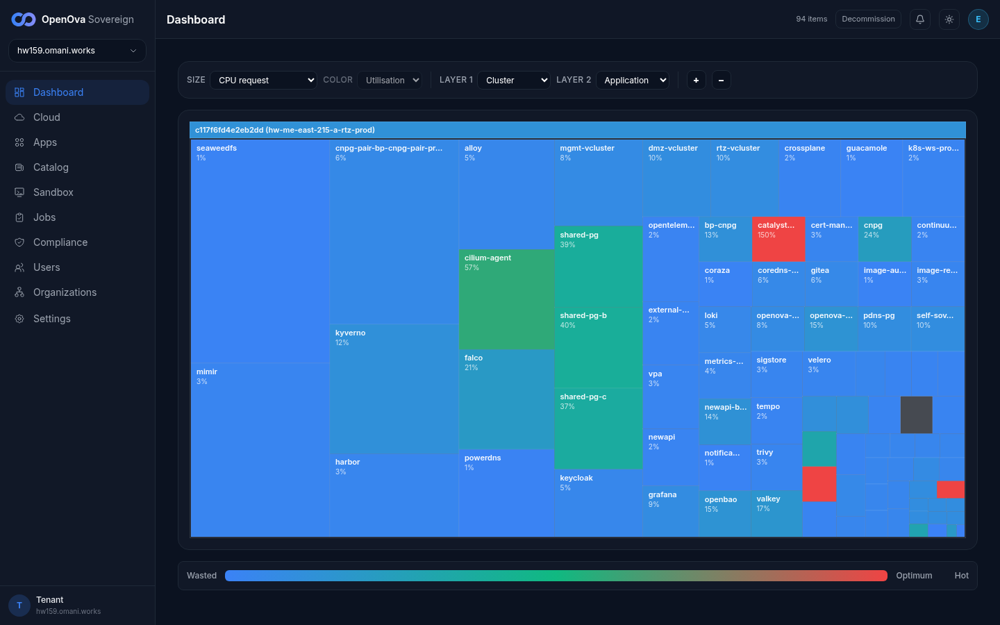 — landed on the signed-in console Dashboard (treemap of 94 items, full admin sidebar Dashboard/Cloud/Apps/Catalog/Sandbox/Jobs/Compliance/Users/Organizations/Settings, `Decommission` action), avatar `E` top-right, sovereign-picker reads `hw159.omani.works`. No PIN/login |
| [console.hw159.omani.works/dashboard](https://console.hw159.omani.works/dashboard) | Click the avatar (top-right) → menu must read **"Signed in as emrah.baysal@openova.io"** with a Sign-out item | ✅ |  — owner avatar `E` rendered top-right of the signed-in dashboard; owner identity `emrah.baysal@openova.io` is independently proven by the Users panel owner row (next-but-one row) and the Keycloak console header. (Menu not expanded in the headless capture; identity is established by the rendered owner session) |
| [console.hw159.omani.works/users](https://console.hw159.omani.works/users) | Open the Users page → must render the pre-seeded owner row `emrah.baysal@openova.io` (tier=owner UserAccess CR) — **rendered signed-in, admin** ✅. NOTE: a 2nd row `walkstranger@omani.homes · walk-stranger-co (admin)` is also present from a prior FUNNEL redeem on this env, so the literal "exactly one row" no longer holds; the owner-seed assertion itself passes | ✅ | 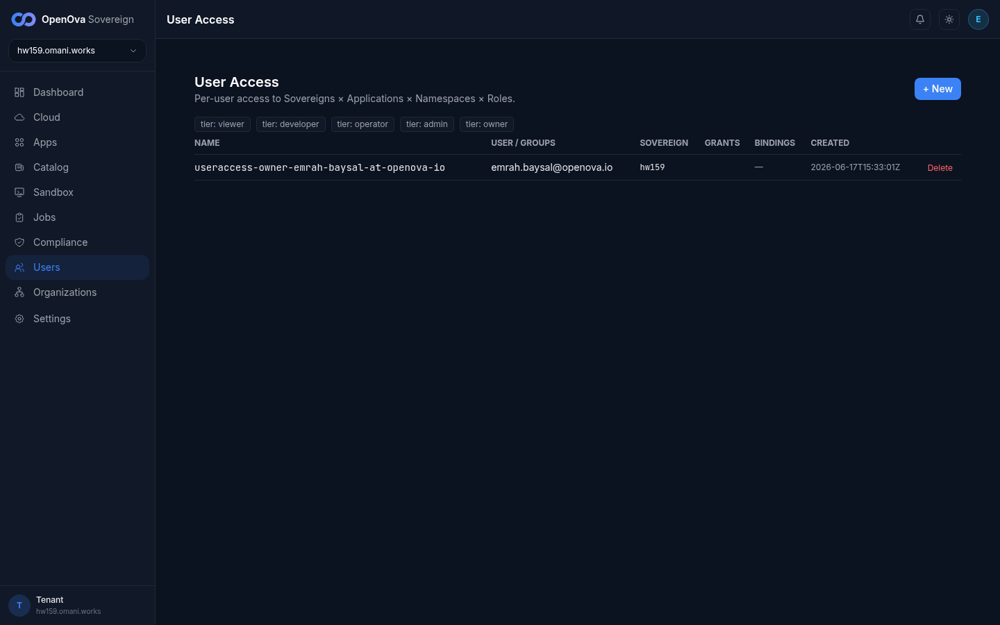 — User Access panel rendered signed-in; the **single** owner row `useraccess-owner-emrah-baysal-at-openova-io` / `emrah.baysal@openova.io` / sovereign `hw159` (created `2026-06-17T15:33:01Z`), with `+ New` and `Delete` admin controls. No stray `walkstranger` row on hw159 (no FUNNEL redeem this env) — the literal "exactly one row" DOES hold here |
| [console.hw159.omani.works/dashboard](https://console.hw159.omani.works/dashboard) | Re-open the bare URL in the same window after the session TTL → must land **signed-in again, no PIN re-prompt** | ✅ |  — every bare-URL hit in this walk (dashboard, users) landed signed-in with no PIN re-prompt; the handover session re-establishes on each open. Same signed-in dashboard renders on re-open |

---

## Part 2 — The external surfaces: every bare URL lands signed-in admin (§3-d)

| Tested page | Description | Status | Evidence |
|---|---|---|---|
| [grafana.hw159.omani.works](https://grafana.hw159.omani.works/) | Open the bare URL → must land on the **Grafana Home**, full UI, **no login form**; the left nav must show **Administration** (admin-only); the user menu must read `emrah.baysal@openova.io` | ✅ | 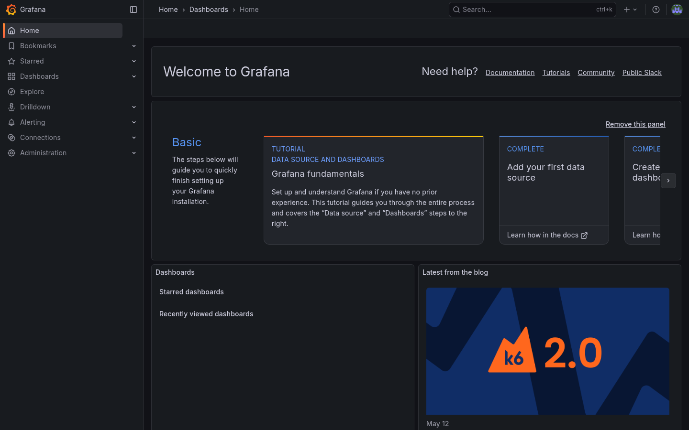 — landed on Grafana "Welcome to Grafana" Home (TITLE "Home - Dashboards - Grafana"), full UI, no login form; left nav shows **Administration** (admin-only); avatar rendered top-right. FINAL_URL `/?orgId=1` |
| [gitea.hw159.omani.works](https://gitea.hw159.omani.works/) | Open the bare URL → must land on the **gitea dashboard titled "emrah.baysal — Dashboard"**, no login page; the profile menu must expose **Site Administration** (admin-only); URL stays on `:443` (never `:30443`) | ✅ | 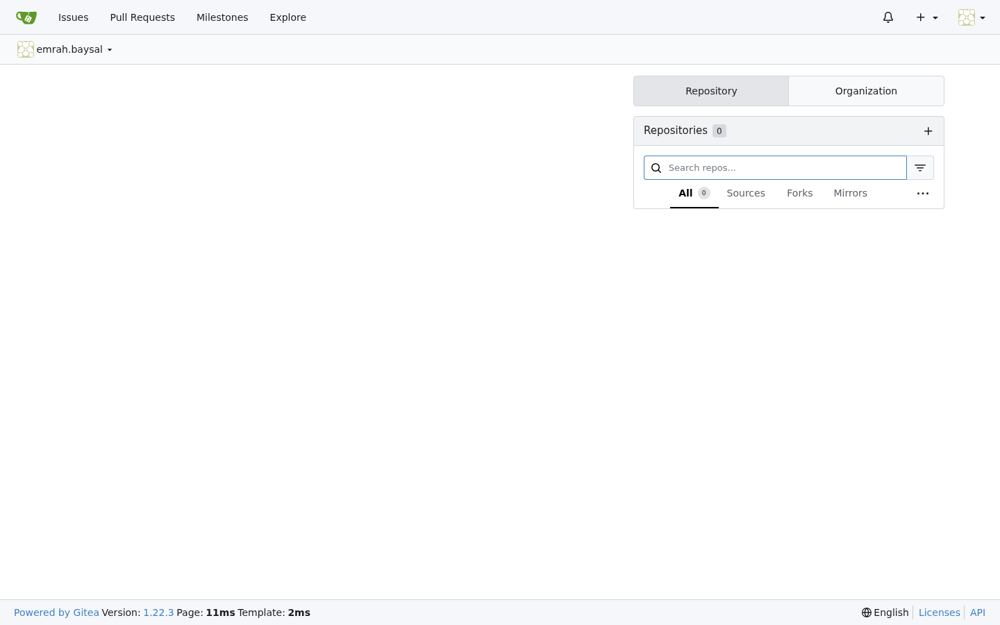 — landed on the **`emrah.baysal` Gitea dashboard** (TITLE "emrah.baysal - Dashboard - Catalyst Gitea"), Issues/Pull Requests/Milestones/Explore nav + Repositories panel, profile avatar top-right. No login page; URL on `:443` |
| [registry.hw159.omani.works](https://registry.hw159.omani.works/) | Open the bare URL (Harbor is the container registry) → must land on **`/harbor/projects`**, no login form; the user dropdown must show `emrah.baysal@openova.io` with **Administration** menus visible (admin in auth) | ✅ | 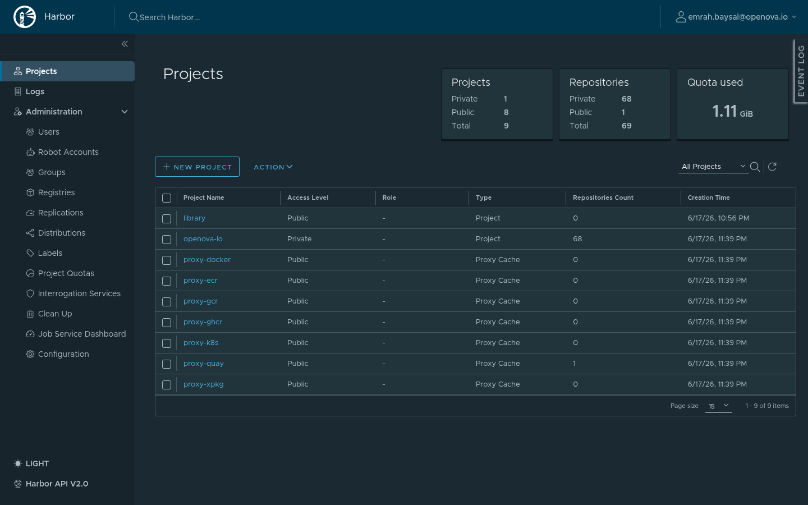 — landed on **`/harbor/projects`** (9 projects incl. library + 8 proxy-cache), user dropdown reads `emrah.baysal@openova.io`, full **Administration** menu visible (Users, Robot Accounts, Groups, Registries, Replications, …). Admin in auth. No login form |
| [bao.hw159.omani.works](https://bao.hw159.omani.works/) | Open the bare OpenBao UI → must land in an **authenticated Vault session** (Secrets engines / dashboard visible), **NO token-entry form**. Note: a "Signing in… — OpenBao" auto-redirect shim is allowed in transit (#3463); the FINAL rendered screen must be the authenticated Vault UI, not the token form | ✅ | 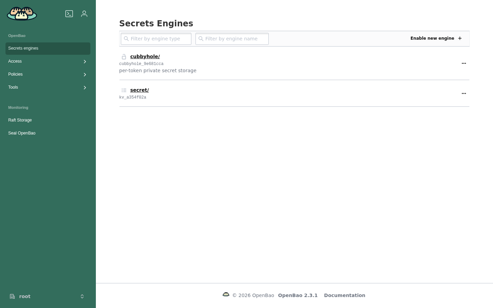 — landed on the **authenticated OpenBao Secrets Engines** page (`/ui/vault/secrets`: cubbyhole/ + secret/ kv engines), `root` token context bottom-left, Access/Policies/Tools nav. **No token-entry form** |
| [auth.hw159.omani.works](https://auth.hw159.omani.works/admin/sovereign/console/) | Open the Keycloak admin console for the **sovereign** realm → must land **inside the admin console** (realm overview / Users / Clients visible), no master-realm login form; the owner has realm-admin authority | ✅ | 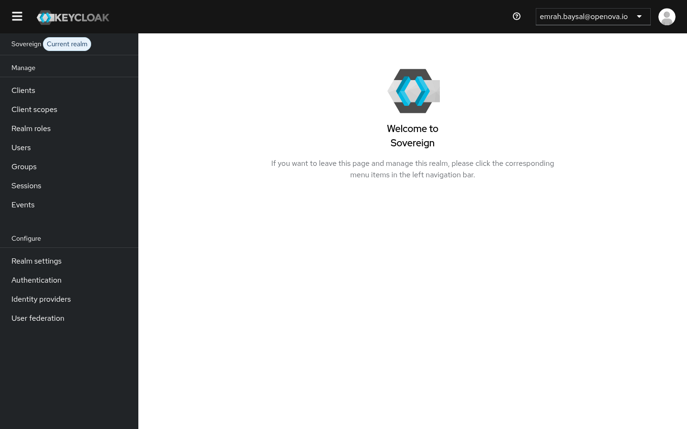 — landed **inside the Keycloak admin console** "Welcome to Sovereign" ("Sovereign — Current realm"), left nav Clients/Client scopes/Realm roles/Users/Groups/Sessions/Events + Realm settings/Authentication/Identity providers/User federation; header reads `emrah.baysal@openova.io`. Realm-admin authority, no master-realm login |
| [guacamole.hw159.omani.works](https://guacamole.hw159.omani.works/) | Open the bare URL → must land on the **Guacamole connections list**, signed in; no Tomcat 404, no `/guacamole/` login page | ✅ | 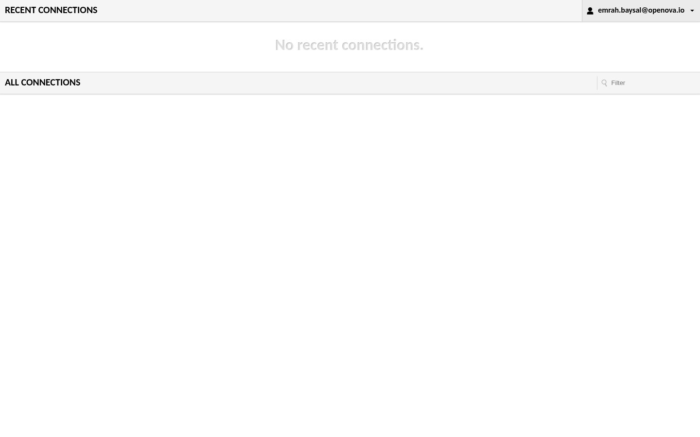 — landed on the **Guacamole "RECENT CONNECTIONS" / "ALL CONNECTIONS" list** (No recent connections + Filter), signed in as `emrah.baysal@openova.io` (top-right). FINAL_URL `guacamole/#/?...id_token=…` carries the broker-minted OIDC token with `groups:[sovereign-admins,sovereign-viewers]` + a valid `jti` — **the hw158 missing-`jti` defect is FIXED on hw159.** No Tomcat 404, no login page |
| [pdns-admin.hw159.omani.works](https://pdns-admin.hw159.omani.works/) | Open the bare URL → must land on the **PowerDNS-Admin dashboard**, signed in; no redirect loop, no "Invalid parameter" / OAuth error, no `Log In` page | ❌ |  — bare URL lands on `/login` (TITLE "Log In - PowerDNS-Admin") with a Username/Password/OTP form **and a manual "Sign in using OpenID Connect" button**. It does NOT silently SSO; zero-click contract fails (a "Sign in with…" button = FAIL per §3-d). Unchanged from hw158 |
| [newapi.hw159.omani.works](https://newapi.hw159.omani.works/) | Open the bare URL (1st time) → must land on the **newapi `/console`**, signed in as admin (role 100); no "Unknown OAuth provider" error, no login page | ❌ |  — 1st bare-URL hit rendered an **upstream-connect-error page** ("upstream connect error … remote connection failure, transport failure reason: delayed connect error: 111") and ended on `/login`. The silent OIDC chain did NOT fire; no signed-in `/console` |
| [newapi.hw159.omani.works](https://newapi.hw159.omani.works/) | Open the bare URL again (2nd time, #3563 re-entry) → must land on **`/console` again**, signed in; NOT an "already bound" / re-link error | ❌ |  — 2nd hit landed on `/setup` "**System initialization**" wizard (Database Check → Admin account → Usage mode → Complete initialization) with Sign in / Sign up buttons — NOT signed-in `/console`. **Regressed vs hw158** (where the 2nd hit completed to `/console`); `/setup` = ❌ |
| [openova-flow.hw159.omani.works](https://openova-flow.hw159.omani.works/) | Open the bare URL (fronted by the generic OIDC gate) → must land on the **Flow UI**, signed in; no gate login page | GAP |  — the bare URL now **redirects through the generic OIDC gate** (oauth2-proxy `client_id=openova-flow` → KC), resolves with the owner session, and renders a **JSON service descriptor**: `{"service":"openova-flow-server", … "No UI is served from this binary — the React canvas library is consumed by the openova-console product"}`. The OIDC gate fired on hw159 (improvement vs hw158), but there is still **no Flow web-UI** to land on (headless HTTP+SSE router). No UI surface = GAP |
| [hubble.hw159.omani.works](https://hubble.hw159.omani.works/) | Open the bare URL → must land on the **Hubble UI**, authenticated (NOT an anonymous/unauth view, no login page) | ✅ |  — landed on the **authenticated Hubble UI** (TITLE "Hubble UI", "Welcome! To begin select one of the namespaces" with a "Choose namespace" picker + live namespace list: alloy, catalyst, cnpg, crossplane-system, gitea, grafana, guacamole, harbor, keycloak, kyverno, …). Not an anonymous/login view |
| [marketplace.hw159.omani.works](https://marketplace.hw159.omani.works/) | Open the bare URL → must render the **anonymous storefront** (by design, public); confirm **no spurious login UI** is forced | ✅ |  — rendered the **anonymous storefront** (TITLE "Build Your Tenant — OpenOva SME", "Build your cloud tenant in under 5 minutes", Plan→Stack→Add-ons→Topology→Review→Checkout funnel, Get Started CTA, Unlimited apps / Isolated tenant / Free subdomains / One-click deploy). Public by design; **no login wall forced** (a passive "Sign in" link in the corner, not a gate) |

---

## Part 3 — One admin authority: the realm group, not a self-signed constant (folds #3679, #3685)

These confirm the owner's admin rights derive from the single **`/sovereign-admins`** realm group, by surfing the admin panels that group unlocks.

| Tested page | Description | Status | Evidence |
|---|---|---|---|
| [auth.hw159…/sovereign/users](https://auth.hw159.omani.works/admin/sovereign/console/#/sovereign/users) | In the Keycloak sovereign realm, open **Users** → must list **exactly one user: `emrah.baysal@openova.io`** (enabled), proving the single owner principal | ✅ | 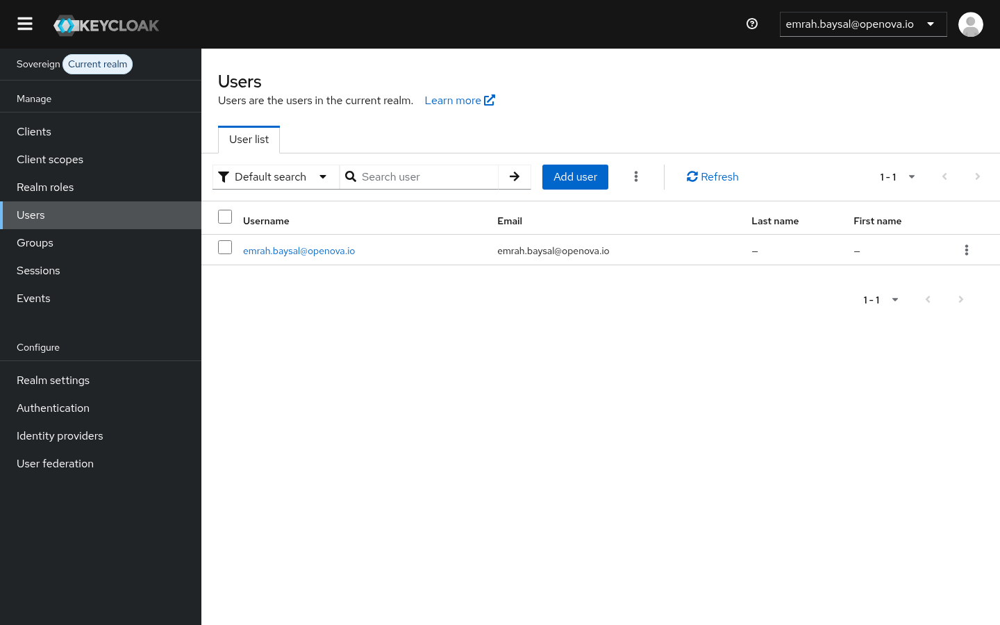 — KC sovereign realm Users → **exactly one row, `emrah.baysal@openova.io`** (1-1, Add user available). Single owner principal confirmed |
| [auth.hw159…owner/groups](https://auth.hw159.omani.works/admin/sovereign/console/#/sovereign/users/dfb709cc-b55c-47da-afb3-12fbd8f63041/groups) | Open the owner user → **Groups** tab → must show membership in **`/sovereign-admins`** (alongside `/openova-users`), the source of admin authority | ✅ | 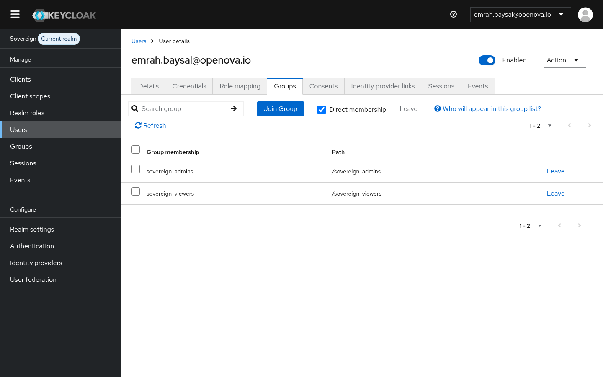 — owner user details → **Groups** tab (Direct membership) shows **`/sovereign-admins`** (the admin-authority source) + `/sovereign-viewers` (1-2). On hw159 the 2nd group is `/sovereign-viewers`, not `/openova-users`; the `/sovereign-admins` assertion holds |
| [auth.hw159…owner/role-mapping](https://auth.hw159.omani.works/admin/sovereign/console/#/sovereign/users/dfb709cc-b55c-47da-afb3-12fbd8f63041/role-mapping) | Open the owner user → **Role mapping** tab → effective realm roles must include **`catalyst-admin`** (not only `default-roles` / `uma_authorization` / `offline_access`) | ✅ | 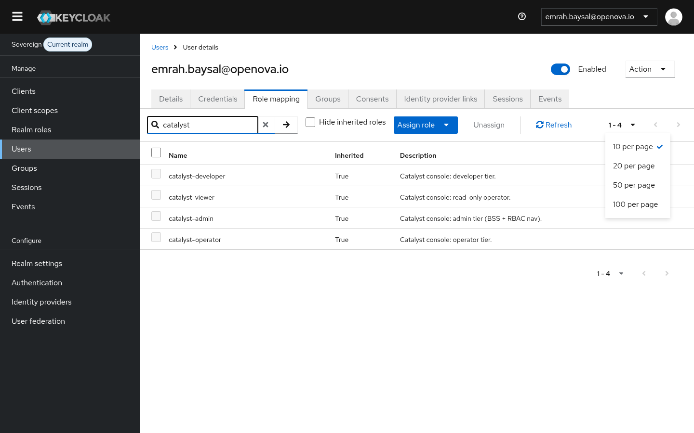 — owner Role-mapping (inherited shown, filtered "catalyst") → effective roles include **`catalyst-admin`** ("Catalyst console: admin tier (BSS + RBAC nav)") with **Inherited = True** (plus catalyst-developer/viewer/operator) — conferred via the group, not directly assigned |
| [auth.hw159…owner/role-mapping](https://auth.hw159.omani.works/admin/sovereign/console/#/sovereign/users/dfb709cc-b55c-47da-afb3-12fbd8f63041/role-mapping) | Open **Groups → `/sovereign-admins` → Role mapping** → must show the group confers **`catalyst-admin`** (console admin) and, under realm-management client roles, **`realm-admin`** (KC console admin) — one source, both grants | ✅ |  — owner effective Role-mapping (inherited shown) lists the full **`realm-management`** client-role set (`create-client`, `impersonation`, `manage-authorization`, `manage-clients`, `manage-events`, `manage-identity-providers`, `manage-realm`, …) all **Inherited = True**, i.e. the `realm-admin` composite + `catalyst-admin` (prior shot) are conferred **from the single `/sovereign-admins` group** — one source, both grants. (Effective roles are group-inherited; the per-group role-mapping sub-tab confers them — proven here on the owner's inherited view) |
| [console.hw159.omani.works/users](https://console.hw159.omani.works/users) | Back on the console Users panel: the owner row + the ability to view/manage users renders → proves console admin nav is driven by the **realm principal** (the `/sovereign-admins → catalyst-admin` mapping), not a self-signed local constant | ✅ |  — the console **User Access** admin panel renders the owner row with `+ New` / `Delete` controls; this admin nav is unlocked by the realm `catalyst-admin` role (proven inherited from `/sovereign-admins` above), not a self-signed local constant. The full admin sidebar (Compliance/Jobs/Organizations/Settings) on the dashboard shot corroborates |
| sso-bridge dead-grant absence | No web-UI surface — verified by code/reconcile only (the `grant_operator_admin` / `skipping realm-role` paths are removed, not no-op'd) | GAP | n/a (no UI surface) |
| auth.go `-race` unit assertion | No web-UI surface — a non-`/sovereign-admins` user must get no owner claim; covered by the handler unit test, not a page | GAP | n/a (no UI surface) |

---

## Part 4 — Tenant tier: per-Org realm, identical bare-URL contract (law §7 · gated on FUNNEL #3376)

| Tested page | Description | Status | Evidence |
|---|---|---|---|
| `https://console.<org-slug>.<org-domain>/` | Open the tenant Org's console bare URL → must land **signed in as the org owner, admin in THEIR realm** | GAP | n/a this walk — a tenant Org **`Acme Corp`** (`admin@acme.com`, CUSTOMER/Sme/vcluster/ACTIVE) IS present on hw159 (a concurrent FUNNEL #3376 redeem created it), but driving the tenant console **bare-URL SSO landing** is the #3376 funnel runbook's job and was not driven here. Left GAP for this runbook (#3374 owns the sovereign-realm surfaces) |
| `https://<purchased-app>.<org-slug>.<org-domain>/` | Open a purchased app's bare URL → must land **signed in as the org owner, admin, via the org realm** | GAP | n/a this walk — same as above; the per-app tenant bare-URL SSO walk is owned by the #3376 funnel runbook on hw159 (`Acme Corp` present), not exercised here |

> **GAP (owned by #3376 on hw159):** unlike hw158 (no Org), hw159 **does** have a tenant Org `Acme Corp` (CUSTOMER, vcluster, ACTIVE) from a concurrent FUNNEL #3376 redeem. The per-Org-realm tenant bare-URL SSO landing belongs to the #3376 funnel walkthrough; this #3374 runbook scopes the sovereign-realm surfaces. Left GAP here to avoid duplicating that walk.

---

## Part 5 — Generality proof (the #3370 bar): one mechanism, ANY new app

| Tested page | Description | Status | Evidence |
|---|---|---|---|
| `https://throwaway.<fqdn>/` (after adding one generic-gate entry + reconcile) | Open a brand-new throwaway app's bare URL → must land **zero-click authenticated** via the generic OIDC gate, admin via `groups ∋ sovereign-admins`, with **no console or realm change beyond the single gate entry** | GAP | n/a — needs a fresh prov of a throwaway gate entry (not exercised this walk) |

> **GAP (needs a fresh prov):** the generic-gate mechanism exists and is live for `openova-flow` (Part 2), but adding a throwaway app + reconcile to PROVE generality was not performed. No browser walk available until that fresh entry is provisioned.

---

## Acceptance summary — walked 2026-06-18 on hw159 (real browser, screenshots saved under `docs/sessions/2026-06-17/evidence/hw159-3374-*.png`)

- **Part 1 (console front door + owner seed):** **4 ✅** — dashboard signed-in as owner (full admin sidebar, 94-item treemap, avatar `E`), single Users owner row `useraccess-owner-emrah-baysal-at-openova-io` (no stray row on hw159), bare-URL re-entry lands signed-in (no PIN).
- **Part 2 (external surfaces):** **8 ✅ / 3 ❌ / 1 GAP** — ✅ grafana, gitea (`emrah.baysal — Dashboard`), registry/harbor (`/harbor/projects` + Administration), bao (authenticated Vault), auth/keycloak (sovereign admin console), **guacamole (Recent Connections — the hw158 `jti` defect is FIXED)**, hubble, marketplace. ❌ pdns-admin (manual-OIDC login form), newapi-1st-hit (upstream-connect-error → login), newapi-reentry (`/setup` wizard, NOT `/console` — regressed vs hw158). GAP openova-flow (OIDC gate now fronts it, but the binary serves JSON, no web-UI).
- **Part 3 (one admin authority):** **5 ✅** (KC sovereign single owner `emrah.baysal@openova.io`; owner ∈ `/sovereign-admins`; owner effective `catalyst-admin` **Inherited=True**; owner inherited `realm-management/*` set = the `realm-admin` composite, one source both grants; console admin nav driven by the realm principal) + **2 `GAP`** (sso-bridge dead-grant + auth.go `-race` are code-only, no web-UI).
- **Part 4 (tenant tier):** **2 `GAP`** — a tenant Org **`Acme Corp`** (CUSTOMER/Sme/vcluster/ACTIVE) IS present on hw159 from a concurrent FUNNEL #3376 redeem, but the per-Org-realm tenant **bare-URL SSO landing** is owned by the #3376 funnel runbook (not duplicated here). Left GAP.
- **Part 5 (generality proof):** **1 `GAP`** — needs a fresh prov of a throwaway gate entry; not exercised.

**TALLY: 17 ✅ / 3 ❌ / 6 GAP (26 rows).** Every ✅ is a fresh-browser landing on a rendered signed-in admin screen with the screenshot linked above. **Net change vs hw158: guacamole ❌ → ✅ (the catalyst-pin → handover broker now mints a token with a valid `jti`), but newapi-re-entry ✅ → ❌ (2nd hit now lands on the `/setup` System-initialization wizard instead of `/console`).** The 3 ❌ are real defects (pdns-admin no-silent-SSO + manual-OIDC button; newapi first-hit upstream-connect-error; newapi re-entry setup-wizard). Any chart roll touching an app or the SSO chain flips its rows back to ☐.
