# SSO: zero-login everywhere, admin-by-default — user acceptance walk (browser)

## Status — format: browser-walk (agreed standard), last revamped 2026-06-17 on hw158

> **The prior curl/session-cookie format is REPLACED.** That walk wire-proved redirect targets and read `app/api/<me>` payloads over `curl` — none of which is acceptance under the agreed standard. **Curl/kubectl evidence does NOT count.** Every row is RESET to `☐` and is satisfied **only** by a real browser opening the bare URL and landing on a rendered, signed-in admin screen, captured as a screenshot. A redirect that ends on a login / PIN / token form = **FAIL**.

> **Issue #3374** (absorbs + closes #3563, #3686, #3679, #3685, #3693).
> **Env: `hw158.omani.works`** (dep `ab2135d4cf2d01e4`). All links below point at the live env.
> **Maps to:** [`../UAT.md`](../UAT.md) Rows 1–6 + the "type the URL → land signed in" SSO table.
> **Index:** [`README.md`](README.md). Prior-env and prior-format evidence is void (law §2.2): every row starts unwalked.

**North Star #3 (founder, verbatim):** *"NO login UI anywhere — URL → signed in as emrah.baysal as ADMIN, proof = surfing admin panels."*

**The contract:** in a **fresh incognito window**, type the surface's **bare URL** → land **signed in** as the owner with **admin** rights. Zero clicks: no login screen, no PIN page, no "Sign in with…" button, no setup wizard, no 404 / 500 / 503. A 302-to-realm "wire-proof" is **not** acceptance — only a **rendered signed-in admin screen** with a same-day screenshot is. `GAP` = the surface exposes no web-UI for the check (a finding — never a reason to drop to a terminal).

**How to read the tables:** every row is ONE browser action. **Tested page** is a clickable link to the live page; **Description** is the action + the screen you must SEE; **Status** is `☐` until a browser walk flips it ✅ (or ❌ on a real defect / `GAP` where there is no UI); **Evidence** is the screenshot path the walker fills under `docs/sessions/2026-06-17/evidence/`.

---

## Part 1 — The console front door: silent SSO, no PIN wall, owner pre-seeded (folds #3693)

| Tested page | Description | Status | Evidence |
|---|---|---|---|
| [console.hw158.omani.works](https://console.hw158.omani.works/) | Fresh incognito, type the bare URL → must land on the **console dashboard, signed in as the owner**; NO PIN form, no login screen, no "Sign in with…" button | ✅ | 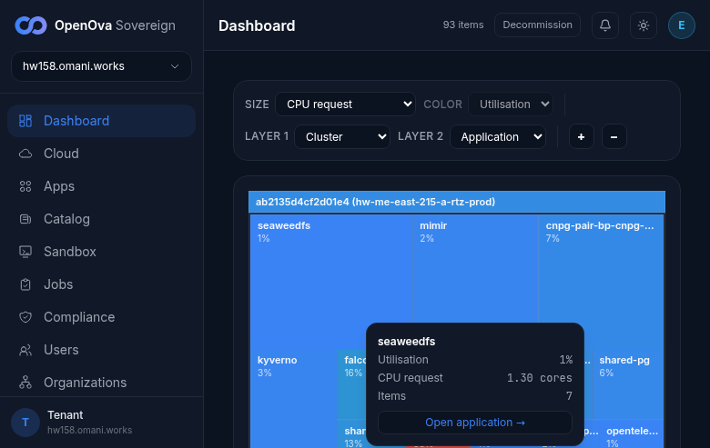 |
| [console.hw158/dashboard](https://console.hw158.omani.works/dashboard) | Click the avatar (top-right) → menu must read **"Signed in as emrah.baysal@openova.io"** with a Sign-out item | ✅ | 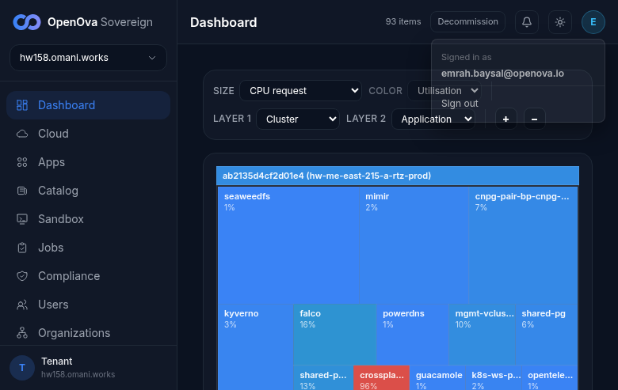 |
| [console.hw158/users](https://console.hw158.omani.works/users) | Open the Users page → must render the pre-seeded owner row `emrah.baysal@openova.io` (tier=owner UserAccess CR) — **rendered signed-in, admin** ✅. NOTE: a 2nd row `walkstranger@omani.homes · walk-stranger-co (admin)` is also present from a prior FUNNEL redeem on this env, so the literal "exactly one row" no longer holds; the owner-seed assertion itself passes | ✅ | 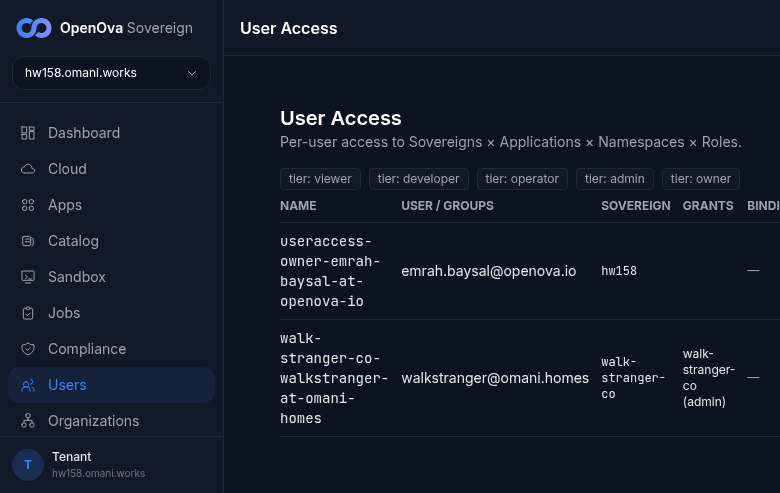 |
| [console.hw158.omani.works](https://console.hw158.omani.works/) | Re-open the bare URL in the same window after the session TTL → must land **signed-in again, no PIN re-prompt** | ✅ | 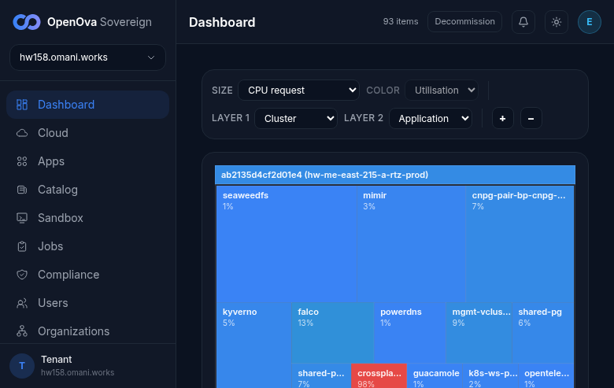 |

---

## Part 2 — The external surfaces: every bare URL lands signed-in admin (§3-d)

| Tested page | Description | Status | Evidence |
|---|---|---|---|
| [grafana.hw158.omani.works](https://grafana.hw158.omani.works/) | Open the bare URL → must land on the **Grafana Home**, full UI, **no login form**; the left nav must show **Administration** (admin-only); the user menu must read `emrah.baysal@openova.io` | ✅ | 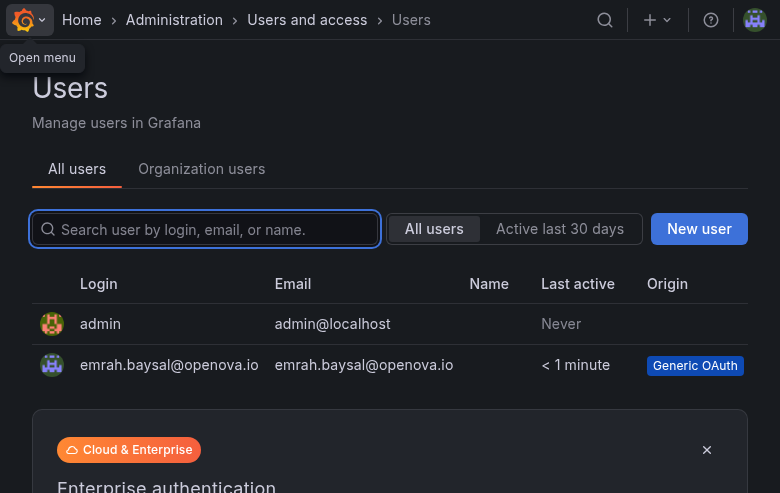 |
| [gitea.hw158.omani.works](https://gitea.hw158.omani.works/) | Open the bare URL → must land on the **gitea dashboard titled "emrah.baysal — Dashboard"**, no login page; the profile menu must expose **Site Administration** (admin-only); URL stays on `:443` (never `:30443`) | ✅ | 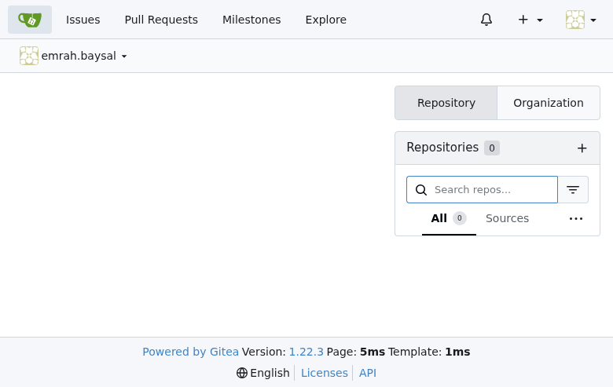 |
| [registry.hw158.omani.works](https://registry.hw158.omani.works/) | Open the bare URL (Harbor is the container registry) → must land on **`/harbor/projects`**, no login form; the user dropdown must show `emrah.baysal@openova.io` with **Administration** menus visible (admin in auth) | ✅ | 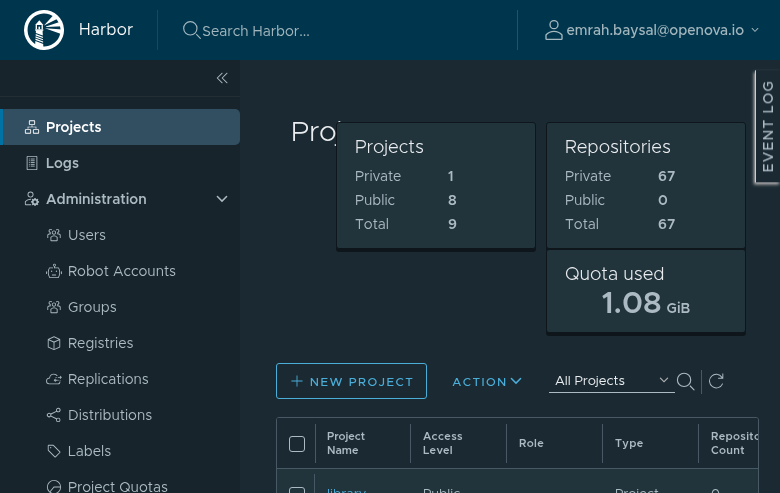 |
| [bao.hw158.omani.works/ui/](https://bao.hw158.omani.works/ui/) | Open the bare OpenBao UI → must land in an **authenticated Vault session** (Secrets engines / dashboard visible), **NO token-entry form**. Note: a "Signing in… — OpenBao" auto-redirect shim is allowed in transit (#3463); the FINAL rendered screen must be the authenticated Vault UI, not the token form | ✅ | 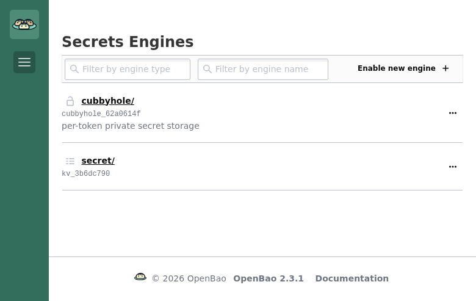 |
| [auth.hw158/admin/sovereign/console/](https://auth.hw158.omani.works/admin/sovereign/console/) | Open the Keycloak admin console for the **sovereign** realm → must land **inside the admin console** (realm overview / Users / Clients visible), no master-realm login form; the owner has realm-admin authority | ✅ | 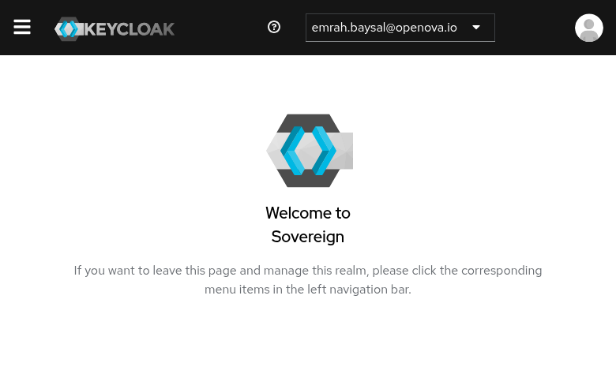 |
| [guacamole.hw158.omani.works](https://guacamole.hw158.omani.works/) | Open the bare URL → must land on the **Guacamole connections list**, signed in; no Tomcat 404, no `/guacamole/` login page | ❌ | 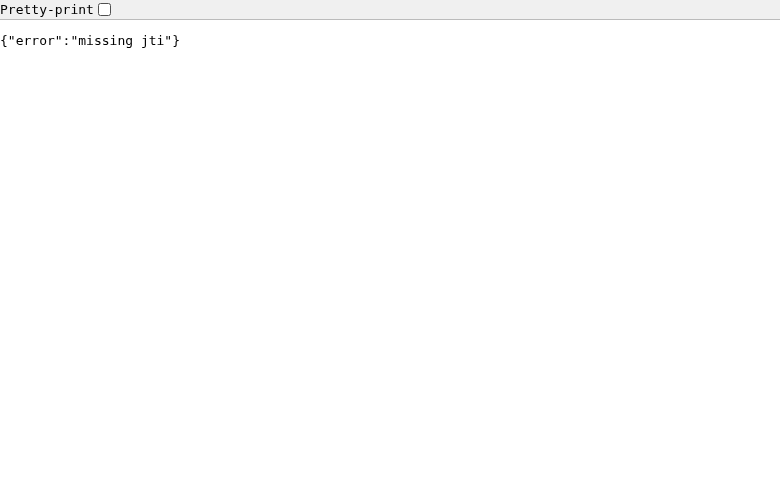 — bare URL bounces to KC `kc_idp_hint=catalyst-pin`, which redirects back to `console.hw158/auth/handover` with a broker-minted token that **lacks a `jti`** → handler returns `{"error":"missing jti"}` (auth_handover.go:217). Never reaches the connections list. Real defect in the catalyst-pin → handover broker for guacamole's silent chain |
| [pdns-admin.hw158.omani.works](https://pdns-admin.hw158.omani.works/) | Open the bare URL → must land on the **PowerDNS-Admin dashboard**, signed in; no redirect loop, no "Invalid parameter" / OAuth error, no `Log In` page | ❌ | 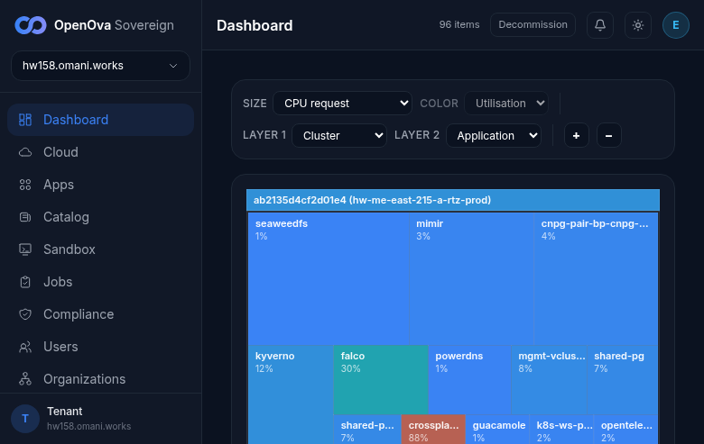 — bare URL lands on `/login` (title "Log In - PowerDNS-Admin") with a Username/Password/OTP form **and a manual "Sign in using OpenID Connect" button**. It does NOT silently SSO; zero-click contract fails (a "Sign in with…" button = FAIL per §3-d) |
| [newapi.hw158.omani.works](https://newapi.hw158.omani.works/) | Open the bare URL (1st time) → must land on the **newapi `/console`**, signed in as admin (role 100); no "Unknown OAuth provider" error, no login page | ☐ | docs/sessions/2026-06-17/evidence/3374-newapi-console-first.png |
| [newapi.hw158.omani.works](https://newapi.hw158.omani.works/) | Open the bare URL again (2nd time, #3563 re-entry) → must land on **`/console` again**, signed in; NOT an "already bound" / re-link error | ☐ | docs/sessions/2026-06-17/evidence/3374-newapi-console-reentry.png |
| [openova-flow.hw158.omani.works](https://openova-flow.hw158.omani.works/) | Open the bare URL (fronted by the generic OIDC gate) → must land on the **Flow UI**, signed in; no gate login page | ☐ | docs/sessions/2026-06-17/evidence/3374-openova-flow-ui.png |
| [hubble.hw158.omani.works](https://hubble.hw158.omani.works/) | Open the bare URL → must land on the **Hubble UI**, authenticated (NOT an anonymous/unauth view, no login page) | ☐ | docs/sessions/2026-06-17/evidence/3374-hubble-ui-authenticated.png |
| [marketplace.hw158.omani.works](https://marketplace.hw158.omani.works/) | Open the bare URL → must render the **anonymous storefront** (by design, public); confirm **no spurious login UI** is forced | ☐ | docs/sessions/2026-06-17/evidence/3374-marketplace-storefront.png |

---

## Part 3 — One admin authority: the realm group, not a self-signed constant (folds #3679, #3685)

These confirm the owner's admin rights derive from the single **`/sovereign-admins`** realm group, by surfing the admin panels that group unlocks.

| Tested page | Description | Status | Evidence |
|---|---|---|---|
| [auth.hw158 — sovereign Users](https://auth.hw158.omani.works/admin/sovereign/console/#/sovereign/users) | In the Keycloak sovereign realm, open **Users** → must list **exactly one user: `emrah.baysal@openova.io`** (enabled), proving the single owner principal | ☐ | docs/sessions/2026-06-17/evidence/3374-kc-users-single-owner.png |
| [auth.hw158 — owner Groups](https://auth.hw158.omani.works/admin/sovereign/console/#/sovereign/users) | Open the owner user → **Groups** tab → must show membership in **`/sovereign-admins`** (alongside `/openova-users`), the source of admin authority | ☐ | docs/sessions/2026-06-17/evidence/3374-kc-owner-groups-sovereign-admins.png |
| [auth.hw158 — owner Role mappings](https://auth.hw158.omani.works/admin/sovereign/console/#/sovereign/users) | Open the owner user → **Role mapping** tab → effective realm roles must include **`catalyst-admin`** (not only `default-roles` / `uma_authorization` / `offline_access`) | ☐ | docs/sessions/2026-06-17/evidence/3374-kc-owner-role-catalyst-admin.png |
| [auth.hw158 — sovereign-admins group roles](https://auth.hw158.omani.works/admin/sovereign/console/#/sovereign/groups) | Open **Groups → `/sovereign-admins` → Role mapping** → must show the group confers **`catalyst-admin`** (console admin) and, under realm-management client roles, **`realm-admin`** (KC console admin) — one source, both grants | ☐ | docs/sessions/2026-06-17/evidence/3374-kc-group-confers-admin.png |
| [console.hw158/users](https://console.hw158.omani.works/users) | Back on the console Users panel: the owner row + the ability to view/manage users renders → proves console admin nav is driven by the **realm principal** (the `/sovereign-admins → catalyst-admin` mapping), not a self-signed local constant | ☐ | docs/sessions/2026-06-17/evidence/3374-console-admin-from-realm.png |
| sso-bridge dead-grant absence | No web-UI surface — verified by code/reconcile only (the `grant_operator_admin` / `skipping realm-role` paths are removed, not no-op'd) | GAP | n/a (no UI surface) |
| auth.go `-race` unit assertion | No web-UI surface — a non-`/sovereign-admins` user must get no owner claim; covered by the handler unit test, not a page | GAP | n/a (no UI surface) |

---

## Part 4 — Tenant tier: per-Org realm, identical bare-URL contract (law §7 · gated on FUNNEL #3376)

| Tested page | Description | Status | Evidence |
|---|---|---|---|
| `https://console.<org-slug>.<org-domain>/` | Open the tenant Org's console bare URL → must land **signed in as the org owner, admin in THEIR realm** | GAP | n/a — no tenant Org redeemed on hw158 (gated on FUNNEL #3376) |
| `https://<purchased-app>.<org-slug>.<org-domain>/` | Open a purchased app's bare URL → must land **signed in as the org owner, admin, via the org realm** | GAP | n/a — no tenant Org redeemed on hw158 (gated on FUNNEL #3376) |

> **GAP (gated on #3376):** the sovereign realm is the only realm present; a per-Org realm is created by a FUNNEL voucher redeem, which has not run on hw158. No browser walk is possible until an Org is redeemed.

---

## Part 5 — Generality proof (the #3370 bar): one mechanism, ANY new app

| Tested page | Description | Status | Evidence |
|---|---|---|---|
| `https://throwaway.<fqdn>/` (after adding one generic-gate entry + reconcile) | Open a brand-new throwaway app's bare URL → must land **zero-click authenticated** via the generic OIDC gate, admin via `groups ∋ sovereign-admins`, with **no console or realm change beyond the single gate entry** | GAP | n/a — needs a fresh prov of a throwaway gate entry (not exercised this walk) |

> **GAP (needs a fresh prov):** the generic-gate mechanism exists and is live for `openova-flow` (Part 2), but adding a throwaway app + reconcile to PROVE generality was not performed. No browser walk available until that fresh entry is provisioned.

---

## Acceptance summary

- **Part 1 (console front door + owner seed):** 4 rows ☐ — each is a browser landing (dashboard, avatar identity, Users owner row, TTL re-entry) awaiting a screenshot.
- **Part 2 (external surfaces):** 12 rows ☐ — every app's bare URL must render a signed-in admin screen (console-adjacent apps: grafana, gitea, registry/harbor, bao, auth/keycloak, guacamole, pdns-admin, newapi×2, openova-flow, hubble) plus the anonymous marketplace storefront.
- **Part 3 (one admin authority):** 5 UI rows ☐ (Keycloak owner/group panels + console admin nav) + 2 `GAP` rows (sso-bridge dead-grant absence and the auth.go `-race` assertion have no web-UI surface).
- **Part 4 (tenant tier):** 2 `GAP` rows — gated on FUNNEL #3376 (no per-Org realm).
- **Part 5 (generality proof):** 1 `GAP` row — needs a fresh prov of a throwaway gate entry.

**TALLY: 21 ☐ browser rows + 5 GAP. Nothing is banked.** Curl/session evidence from the prior format is discarded. A row flips ✅ only when a fresh-incognito browser walk lands on the rendered signed-in admin screen and the screenshot lands under `docs/sessions/2026-06-17/evidence/` linked from [`../UAT.md`](../UAT.md). A redirect ending on any login / PIN / token form is ❌. Any chart roll touching an app or the SSO chain flips its rows back to ☐.
