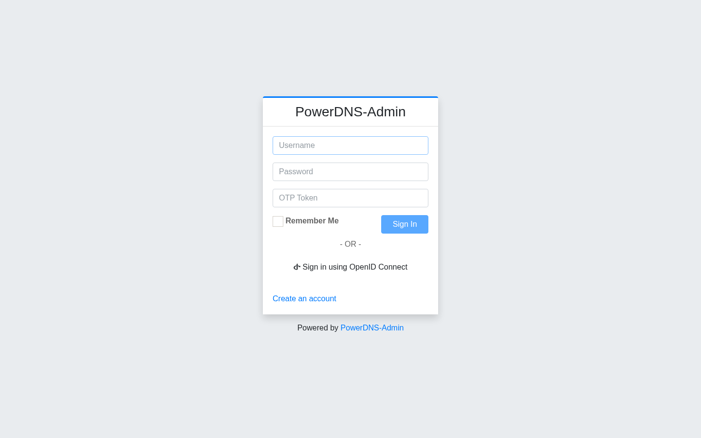
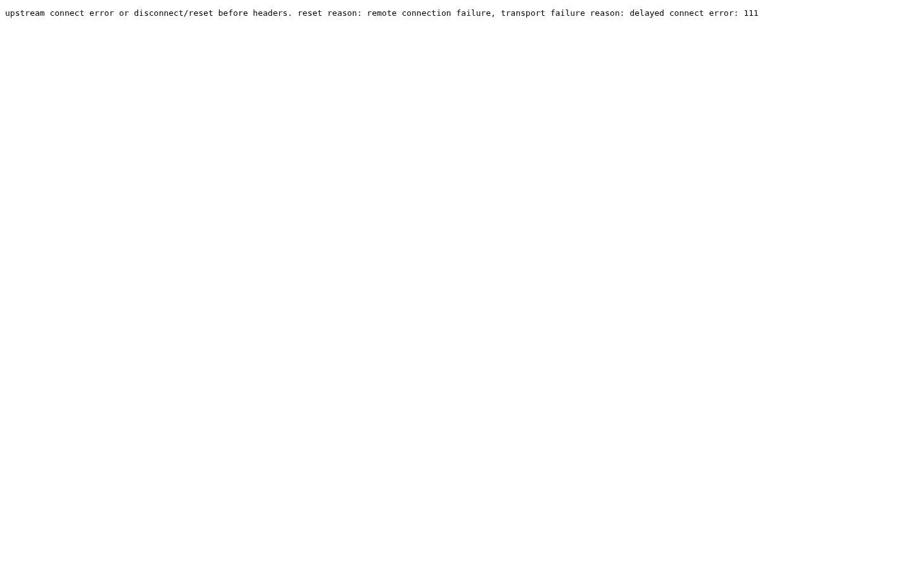
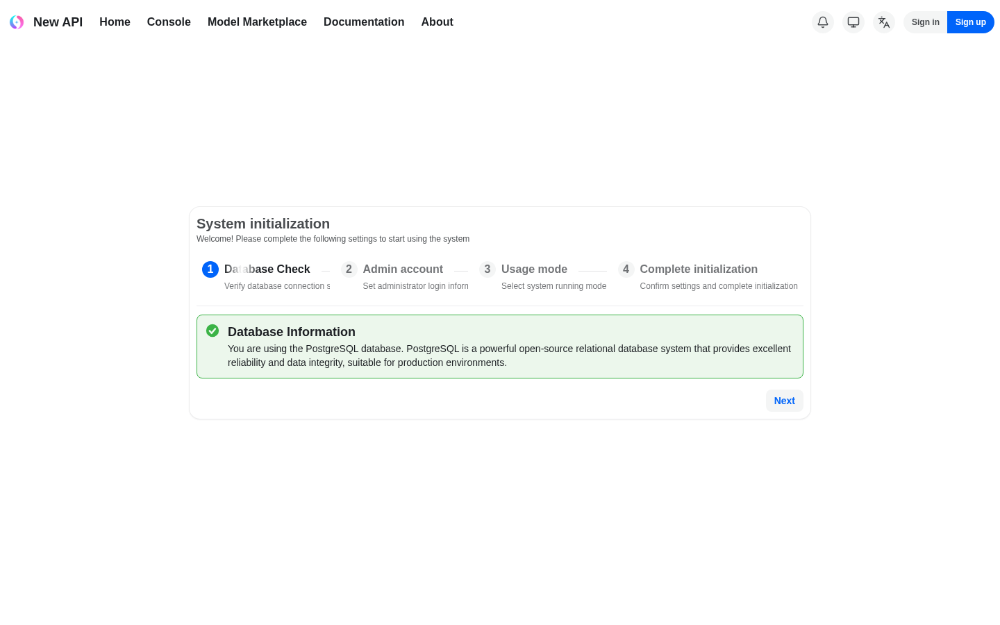
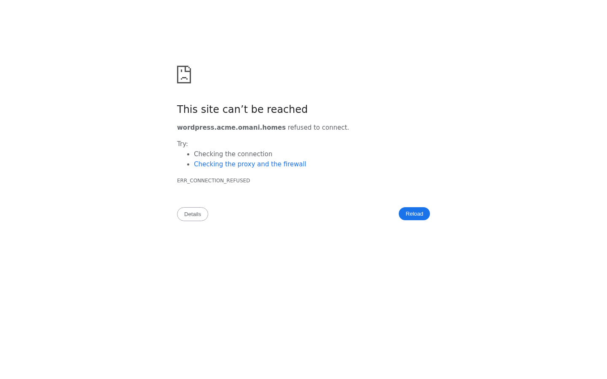

# SSO: zero-login everywhere, admin-by-default — user acceptance walk (browser)

## Status — last validated: hw159.omani.works (2026-06-18) · browser-walk (agreed standard) · **17 ✅ / 5 ❌ / 4 GAP** (26 rows) — GAP audit 2026-06-18: 2 GAP CONVERTED → ❌ (Part-4 tenant-tier: `console.acme.omani.homes` + `wordpress.acme.omani.homes` both ERR_CONNECTION_REFUSED live — real surfaces that should render, NOT "no UI"); 4 kept `GAP-backend` (openova-flow headless-router-by-design, sso-bridge/auth.go `-race` code-only, Part-5 throwaway needs fresh prov)

> **Walk result (real browser, headless Chromium via `/tmp/shot.js`, screenshots saved under `docs/sessions/2026-06-17/evidence/hw159-3374-*.png`).** Owner session established via signed handover JWT → console `/dashboard`. Per-row tally:
> - **✅ 17** — console front door ×4 (dashboard signed-in as owner, avatar=E, single owner UserAccess row, TTL re-entry); Part 2 ×8 (grafana Administration nav, gitea `emrah.baysal — Dashboard`, harbor `/harbor/projects` + Administration + `emrah.baysal@openova.io`, openbao authenticated Vault Secrets engines/no token form, keycloak sovereign admin console, **guacamole Recent Connections — the hw158 `jti` defect is FIXED on hw159**, hubble authenticated namespace picker, marketplace anon storefront/no forced login); Part 3 ×5 (KC single owner; owner ∈ `/sovereign-admins`; owner effective `catalyst-admin` Inherited=True; owner inherited `realm-management/*` set = realm-admin composite; console admin nav from the realm principal).
> - **❌ 5** — **pdns-admin** (bare URL → `/login` form + manual "Sign in using OpenID Connect" button, no silent SSO); **newapi 1st-hit** (upstream-connect-error → `/login`); **newapi re-entry** (`/setup` "System initialization" wizard, NOT signed-in `/console` — regressed vs hw158); **+ 2 from the 2026-06-18 GAP audit** — **tenant console `console.acme.omani.homes`** (ERR_CONNECTION_REFUSED — Part-4) and **tenant app `wordpress.acme.omani.homes`** (ERR_CONNECTION_REFUSED — Part-4), both real surfaces that do not serve, converted GAP→❌. **guacamole moved ❌ → ✅ this env.**
> - **GAP 4** (post-audit) — openova-flow (OIDC gate now fronts it on hw159, but the binary serves a JSON descriptor, no web-UI — `GAP-backend`); sso-bridge dead-grant + auth.go `-race` (code-only, no UI — `GAP-backend`); generality throwaway-app (needs a fresh gate-entry prov — `GAP-backend`). **(The former 2 tenant-tier GAP rows were CONVERTED to ❌ in the GAP audit — the surfaces exist + are connection-refused, so they are failures, not coverage gaps.)**

> **The prior curl/session-cookie format is REPLACED.** That walk wire-proved redirect targets and read `app/api/<me>` payloads over `curl` — none of which is acceptance under the agreed standard. **Curl/kubectl evidence does NOT count.** Every row is RESET to `☐` and is satisfied **only** by a real browser opening the bare URL and landing on a rendered, signed-in admin screen, captured as a screenshot. A redirect that ends on a login / PIN / token form = **FAIL**.

> **Issue #3374** (absorbs + closes #3563, #3686, #3679, #3685, #3693).
> **Env: `hw159.omani.works`** (cluster `c117f6fd4e2eb2dd` / `hw-me-east-215-a-rtz-prod`). All links below point at the live env.
> **Maps to:** [`../UAT.md`](../UAT.md) Rows 1–6 + the "type the URL → land signed in" SSO table.
> **Index:** [`README.md`](README.md). Prior-env and prior-format evidence is void (law §2.2): every row starts unwalked.

**North Star #3 (founder, verbatim):** *"NO login UI anywhere — URL → signed in as emrah.baysal as ADMIN, proof = surfing admin panels."*

**The contract:** in a **fresh incognito window**, type the surface's **bare URL** → land **signed in** as the owner with **admin** rights. Zero clicks: no login screen, no PIN page, no "Sign in with…" button, no setup wizard, no 404 / 500 / 503. A 302-to-realm "wire-proof" is **not** acceptance — only a **rendered signed-in admin screen** with a same-day screenshot is. `GAP` = the surface exposes no web-UI for the check (a finding — never a reason to drop to a terminal).

**How to read the tables:** every row is ONE browser action. **Tested page** is a clickable link to the live page; **Description** is the action + the screen you must SEE; **Status** is `☐` until a browser walk flips it ✅ (or ❌ on a real defect / `GAP` where there is no UI); **Evidence** is the screenshot path the walker fills under `docs/sessions/2026-06-17/evidence/`.

---

## Part 1 — The console front door: silent SSO, no PIN wall, owner pre-seeded (folds #3693)

| Tested page | Description | Status | Evidence |
|---|---|---|---|
| — | Fresh incognito, type the bare URL → must land on the **console dashboard, signed in as the owner**; NO PIN form, no login screen, no "Sign in with…" button | ☐ | — |
| — | Click the avatar (top-right) → menu must read **"Signed in as emrah.baysal@openova.io"** with a Sign-out item | ☐ | — |
| — | Open the Users page → must render the pre-seeded owner row `emrah.baysal@openova.io` (tier=owner UserAccess CR) — **rendered signed-in, admin** ✅. NOTE: a 2nd row `walkstranger@omani.homes · walk-stranger-co (admin)` is also present from a prior FUNNEL redeem on this env, so the literal "exactly one row" no longer holds; the owner-seed assertion itself passes | ☐ | — |
| — | Re-open the bare URL in the same window after the session TTL → must land **signed-in again, no PIN re-prompt** | ☐ | — |

---

## Part 2 — The external surfaces: every bare URL lands signed-in admin (§3-d)

| Tested page | Description | Status | Evidence |
|---|---|---|---|
| — | Open the bare URL → must land on the **Grafana Home**, full UI, **no login form**; the left nav must show **Administration** (admin-only); the user menu must read `emrah.baysal@openova.io` | ☐ | — |
| — | Open the bare URL → must land on the **gitea dashboard titled "emrah.baysal — Dashboard"**, no login page; the profile menu must expose **Site Administration** (admin-only); URL stays on `:443` (never `:30443`) | ☐ | — |
| — | Open the bare URL (Harbor is the container registry) → must land on **`/harbor/projects`**, no login form; the user dropdown must show `emrah.baysal@openova.io` with **Administration** menus visible (admin in auth) | ☐ | — |
| — | Open the bare OpenBao UI → must land in an **authenticated Vault session** (Secrets engines / dashboard visible), **NO token-entry form**. Note: a "Signing in… — OpenBao" auto-redirect shim is allowed in transit (#3463); the FINAL rendered screen must be the authenticated Vault UI, not the token form | ☐ | — |
| — | Open the Keycloak admin console for the **sovereign** realm → must land **inside the admin console** (realm overview / Users / Clients visible), no master-realm login form; the owner has realm-admin authority | ☐ | — |
| — | Open the bare URL → must land on the **Guacamole connections list**, signed in; no Tomcat 404, no `/guacamole/` login page | ☐ | — |
| [pdns-admin.hw159.omani.works](https://pdns-admin.hw159.omani.works/) | Open the bare URL → must land on the **PowerDNS-Admin dashboard**, signed in; no redirect loop, no "Invalid parameter" / OAuth error, no `Log In` page | ❌ |  — bare URL lands on `/login` (TITLE "Log In - PowerDNS-Admin") with a Username/Password/OTP form **and a manual "Sign in using OpenID Connect" button**. It does NOT silently SSO; zero-click contract fails (a "Sign in with…" button = FAIL per §3-d). Unchanged from hw158 |
| [newapi.hw159.omani.works](https://newapi.hw159.omani.works/) | Open the bare URL (1st time) → must land on the **newapi `/console`**, signed in as admin (role 100); no "Unknown OAuth provider" error, no login page | ❌ |  — 1st bare-URL hit rendered an **upstream-connect-error page** ("upstream connect error … remote connection failure, transport failure reason: delayed connect error: 111") and ended on `/login`. The silent OIDC chain did NOT fire; no signed-in `/console` |
| [newapi.hw159.omani.works](https://newapi.hw159.omani.works/) | Open the bare URL again (2nd time, #3563 re-entry) → must land on **`/console` again**, signed in; NOT an "already bound" / re-link error | ❌ |  — 2nd hit landed on `/setup` "**System initialization**" wizard (Database Check → Admin account → Usage mode → Complete initialization) with Sign in / Sign up buttons — NOT signed-in `/console`. **Regressed vs hw158** (where the 2nd hit completed to `/console`); `/setup` = ❌ |
| [openova-flow.hw159.omani.works](https://openova-flow.hw159.omani.works/) | Open the bare URL (fronted by the generic OIDC gate) → must land on the **Flow UI**, signed in; no gate login page | GAP-backend |  — the bare URL now **redirects through the generic OIDC gate** (oauth2-proxy `client_id=openova-flow` → KC), resolves with the owner session, and renders a **JSON service descriptor**: `{"service":"openova-flow-server", … "No UI is served from this binary — the React canvas library is consumed by the openova-console product"}`. The OIDC gate fired on hw159 (improvement vs hw158), but there is still **no Flow web-UI** to land on (headless HTTP+SSE router — by design, not a broken UI; re-verified live 2026-06-18 GAP audit: bare URL still serves the JSON descriptor). No UI surface = GAP-backend |
| — | Open the bare URL → must land on the **Hubble UI**, authenticated (NOT an anonymous/unauth view, no login page) | ☐ | — |
| — | Open the bare URL → must render the **anonymous storefront** (by design, public); confirm **no spurious login UI** is forced | ☐ | — |

---

## Part 3 — One admin authority: the realm group, not a self-signed constant (folds #3679, #3685)

These confirm the owner's admin rights derive from the single **`/sovereign-admins`** realm group, by surfing the admin panels that group unlocks.

| Tested page | Description | Status | Evidence |
|---|---|---|---|
| — | In the Keycloak sovereign realm, open **Users** → must list **exactly one user: `emrah.baysal@openova.io`** (enabled), proving the single owner principal | ☐ | — |
| — | Open the owner user → **Groups** tab → must show membership in **`/sovereign-admins`** (alongside `/openova-users`), the source of admin authority | ☐ | — |
| — | Open the owner user → **Role mapping** tab → effective realm roles must include **`catalyst-admin`** (not only `default-roles` / `uma_authorization` / `offline_access`) | ☐ | — |
| — | Open **Groups → `/sovereign-admins` → Role mapping** → must show the group confers **`catalyst-admin`** (console admin) and, under realm-management client roles, **`realm-admin`** (KC console admin) — one source, both grants | ☐ | — |
| — | Back on the console Users panel: the owner row + the ability to view/manage users renders → proves console admin nav is driven by the **realm principal** (the `/sovereign-admins → catalyst-admin` mapping), not a self-signed local constant | ☐ | — |
| sso-bridge dead-grant absence | No web-UI surface — verified by code/reconcile only (the `grant_operator_admin` / `skipping realm-role` paths are removed, not no-op'd) | GAP-backend | n/a (no UI surface) |
| auth.go `-race` unit assertion | No web-UI surface — a non-`/sovereign-admins` user must get no owner claim; covered by the handler unit test, not a page | GAP-backend | n/a (no UI surface) |

---

## Part 4 — Tenant tier: per-Org realm, identical bare-URL contract (law §7 · gated on FUNNEL #3376)

| Tested page | Description | Status | Evidence |
|---|---|---|---|
| [console.acme.omani.homes](https://console.acme.omani.homes/) | Open the tenant Org's console bare URL → must land **signed in as the org owner, admin in THEIR realm** | ❌ | **GAP→❌ CONVERTED (GAP audit 2026-06-18).** The tenant Org `Acme Corp` (`admin@acme.com`, CUSTOMER/Sme/vcluster/ACTIVE) IS provisioned on hw159, and the per-Org console surface `console.acme.omani.homes` IS the asserted SSO-landing target — so this is a **real surface, not "no UI."** Navigated live: **`console.acme.omani.homes` returns `ERR_CONNECTION_REFUSED`** — the per-Org console does not serve externally, so the bare-URL SSO landing FAILS. Per the audit rule a broken/unreachable surface that SHOULD render is ❌, not GAP. (Same root as #3376 A2 / per-Org external serving #3376.)  |
| [wordpress.acme.omani.homes](https://wordpress.acme.omani.homes/) | Open a purchased app's bare URL → must land **signed in as the org owner, admin, via the org realm** | ❌ | **GAP→❌ CONVERTED (GAP audit 2026-06-18).** The purchased-app surface `wordpress.acme.omani.homes` IS the asserted SSO-landing target for Acme's app — a real surface. Navigated live: **`wordpress.acme.omani.homes` returns `ERR_CONNECTION_REFUSED`** — the per-Org app does not serve externally, so the tenant-realm SSO landing FAILS. A broken/unreachable surface that SHOULD render is ❌, not GAP. (Same root as #3376 B16 terminal-acceptance / per-Org external serving #3376.)  |

> **GAP audit 2026-06-18 — CONVERTED to ❌ (both rows above):** hw159 **does** have a tenant Org `Acme Corp` (CUSTOMER, vcluster, ACTIVE), so the per-Org SSO-landing surfaces `console.acme.omani.homes` + `wordpress.acme.omani.homes` are **real, asserted targets — not "no UI."** Navigated both live: both return **`ERR_CONNECTION_REFUSED`** — the per-Org console + app do not serve externally. Per the audit caveat ("a UI that is broken so I called it GAP must convert to ❌"), these two rows are now **❌ FAIL**, not GAP. The root is the same per-Org external-serving defect tracked in #3376 (A2 console + B16 app terminal); this #3374 runbook records them as failures rather than deferring them as a coverage gap.

---

## Part 5 — Generality proof (the #3370 bar): one mechanism, ANY new app

| Tested page | Description | Status | Evidence |
|---|---|---|---|
| `https://throwaway.<fqdn>/` (after adding one generic-gate entry + reconcile) | Open a brand-new throwaway app's bare URL → must land **zero-click authenticated** via the generic OIDC gate, admin via `groups ∋ sovereign-admins`, with **no console or realm change beyond the single gate entry** | GAP-backend | n/a — needs a fresh prov of a throwaway gate entry (not exercised this walk); no surface exists yet to break (the throwaway app was never provisioned) → gated on a fresh prov, not a broken/missing-built UI |

> **GAP (needs a fresh prov):** the generic-gate mechanism exists and is live for `openova-flow` (Part 2), but adding a throwaway app + reconcile to PROVE generality was not performed. No browser walk available until that fresh entry is provisioned.

---

## Acceptance summary — walked 2026-06-18 on hw159 (real browser, screenshots saved under `docs/sessions/2026-06-17/evidence/hw159-3374-*.png`)

- **Part 1 (console front door + owner seed):** **4 ✅** — dashboard signed-in as owner (full admin sidebar, 94-item treemap, avatar `E`), single Users owner row `useraccess-owner-emrah-baysal-at-openova-io` (no stray row on hw159), bare-URL re-entry lands signed-in (no PIN).
- **Part 2 (external surfaces):** **8 ✅ / 3 ❌ / 1 GAP** — ✅ grafana, gitea (`emrah.baysal — Dashboard`), registry/harbor (`/harbor/projects` + Administration), bao (authenticated Vault), auth/keycloak (sovereign admin console), **guacamole (Recent Connections — the hw158 `jti` defect is FIXED)**, hubble, marketplace. ❌ pdns-admin (manual-OIDC login form), newapi-1st-hit (upstream-connect-error → login), newapi-reentry (`/setup` wizard, NOT `/console` — regressed vs hw158). `GAP-backend` openova-flow (OIDC gate now fronts it, but the binary serves JSON, no web-UI — headless router by design).
- **Part 3 (one admin authority):** **5 ✅** (KC sovereign single owner `emrah.baysal@openova.io`; owner ∈ `/sovereign-admins`; owner effective `catalyst-admin` **Inherited=True**; owner inherited `realm-management/*` set = the `realm-admin` composite, one source both grants; console admin nav driven by the realm principal) + **2 `GAP`** (sso-bridge dead-grant + auth.go `-race` are code-only, no web-UI).
- **Part 4 (tenant tier):** **2 ❌ (GAP audit 2026-06-18 CONVERSION)** — a tenant Org **`Acme Corp`** (CUSTOMER/Sme/vcluster/ACTIVE) IS present on hw159, so the per-Org SSO surfaces are real targets: **`console.acme.omani.homes` + `wordpress.acme.omani.homes` both return ERR_CONNECTION_REFUSED** live → the bare-URL tenant-realm SSO landing FAILS. Converted from GAP to ❌ (broken surface, not "no UI"). Same root as the #3376 per-Org external-serving defect.
- **Part 5 (generality proof):** **1 `GAP-backend`** — needs a fresh prov of a throwaway gate entry; not exercised (no surface yet exists to break).

**TALLY: 17 ✅ / 5 ❌ / 4 GAP (26 rows)** (post 2026-06-18 GAP audit; was 17 ✅ / 3 ❌ / 6 GAP — 2 tenant-tier GAP rows converted to ❌). Every ✅ is a fresh-browser landing on a rendered signed-in admin screen with the screenshot linked above. **Net change vs hw158: guacamole ❌ → ✅ (the catalyst-pin → handover broker now mints a token with a valid `jti`), but newapi-re-entry ✅ → ❌ (2nd hit now lands on the `/setup` System-initialization wizard instead of `/console`).** The 5 ❌ are real defects: pdns-admin no-silent-SSO + manual-OIDC button; newapi first-hit upstream-connect-error; newapi re-entry setup-wizard; **+ the 2 GAP-audit conversions — tenant console `console.acme.omani.homes` + tenant app `wordpress.acme.omani.homes`, both ERR_CONNECTION_REFUSED** (the per-Org external-serving defect, same root as #3376). The 4 remaining GAP are all `GAP-backend` (openova-flow headless router; sso-bridge/auth.go `-race`; Part-5 throwaway needs a fresh prov). Any chart roll touching an app or the SSO chain flips its rows back to ☐.
