# UAT walkthrough — TOPOLOGY/DR: one vocabulary, built end-to-end, region-kill proven

## Status — last validated: hw158 (2026-06-17) — browser walk: **9 ✅ / 16 ❌ / 8 GAP**

> **hw158 browser-walk verdict (2026-06-17, real screenshots).** PASS (9): A1/A4 (catalog New-instance dialog opens, `singleton` selectable), B3 (grafana per-cluster placement mgmt-A active/mgmt-B passive), C5 (cilium singleton → Switchover honestly hidden), F1 (cloud Region 2/2 · Cluster 2/2, no phantom), G1/G2/G3/G5 (grafana/powerdns-admin/keycloak/guacamole all Ready, no crashloop). FAIL (16): the **catalog dialog offers only 2 of 4 modes** (`active-passive`+`active-active` missing; A2/A3); the **shared-pg Topology tab is dead at runtime** — declared `singleton` (mismatching the Overview's `active-hotstandby`), Live status "n/a — bootstrap HelmRelease, no Application CR", replication-lag "n/a (mode)", **no Switchover button** (B1/B2/C1–C4/E1/E3/H1); grafana's DR Switchover button is **enabled despite no live Continuum** (E2); provision-and-readback rows (A5/D1/D2/D3) not executed. GAP (8): grafana singleton-only catalog (A6), no topology/DR banner in Settings (F2), no capped env (F3), openbao snapshot save/fetch unsurfaced (G4), and the destructive **region-kill capstone H2–H5 not performed in this browser walk**. **Root finding (ties to #3687): the bootstrap apps run as HelmReleases with NO Application CR, so their per-app Topology/DR surfaces read "n/a" — the live-DR vocabulary is built in the editor but not wired to a live Continuum on these apps.**

> **Prior curl/kubectl/grep format REPLACED.** The previous version of this runbook drove the walk through `curl`/`kubectl`/`grep` transcripts pasted inline per row — that format is **banned** (command output is not a UAT acceptance signal). This revamp is **100% browser**: every row is a clickable console link, a browser action, a rendered screen the founder must SEE, and a screenshot path. No `curl`, no `kubectl`, no `git`, no command output anywhere below.

**Env under test:** `console.hw158.omani.works` — a 2-region active-hot-standby Sovereign (region-a = `me-east-215-a`, region-b = `me-east-215-b`).

**Acceptance rule (browser-walk):**
- **Status** starts at `☐` (reset — pending a real browser walk on hw158). A box flips to `✅` ONLY when the rendered screen described in the **Description** column is observed live in the browser and a screenshot is pasted at the **Evidence** path.
- A row that lands on a **login screen / auth redirect** instead of the described rendered screen = **FAIL** (record `❌`, not `☐`).
- `GAP` = there is **no UI surface** for the described intent — that is itself a finding (the feature is wired on the substrate but never surfaced to the operator), recorded against the row.
- Per memory: each new env flushes all prior evidence — no carried `✅`. Re-walk every row on the current env.

**Maps to:** [`../UAT.md`](../UAT.md) **Row 9** (one-vocabulary picker), **Row 10** (multi-region placement + replication read-back), **Row 11** (region-kill execution).

**Issue:** #3375 · **Slug:** `topology-dr-one-vocabulary-built-and-region-kill-proven`

This walkthrough covers every scenario folded into #3375: one-vocabulary create/strip (was #3648), one placement model with the passive copy scaled down (was #3675), per-app Continuum read-back + a generic Switchover (was #3666), the journey-built 2-region pair (was #3680), the live-DR UI honesty (was #3684), the region-absence integrity banner (was #3688), the cross-region wiring on a 2-region env (was #3629), and the region-kill within the agreement RTO/RPO (Pillar 3 / D31).

---

## Section A — ONE topology vocabulary in the catalog New-instance picker (was #3648 / #3675)

The catalog create wizard must offer exactly ONE canonical vocabulary in its topology `<select>`: `singleton`, `active-passive`, `active-hot-standby`, `active-active`. No editor-dialect spellings (`single-region`, `active-hotstandby`) leaking onto the rendered control.

| Tested page | Description | Status | Evidence |
|---|---|---|---|
| [console.hw158/catalog/bp-postgres](https://console.hw158.omani.works/catalog/bp-postgres) | The bp-postgres catalog detail page renders. Click **New instance**: the create dialog opens with a topology `<select>`. SEE the dropdown options. | ✅ | Detail page renders (3 instances shared-pg/-b/-c, all Ready; multi-instance + shareable·db badges). "+ New instance" opens a "New instance of postgres" dialog with a **Topology mode** `<select>`. 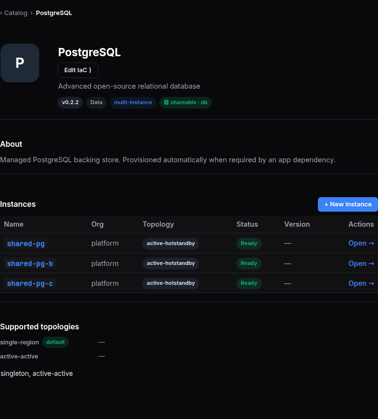 |
| [console.hw158/catalog/bp-postgres](https://console.hw158.omani.works/catalog/bp-postgres) | In the open New-instance dialog, open the topology `<select>` and read every option. SEE the options spelled **exactly** `singleton`, `active-passive`, `active-hot-standby`, `active-active` — NOT `single-region`, NOT `active-hotstandby`. | ❌ | The dialog `<select>` offers only **2** of the 4 canonical modes: `singleton` and `active-hot-standby` (both correctly spelled). `active-passive` and `active-active` are ABSENT. (Separately, the instances table + "Supported topologies" on the same page leak the banned dialects `active-hotstandby` and `single-region`.)  |
| [console.hw158/catalog/bp-postgres](https://console.hw158.omani.works/catalog/bp-postgres) | Confirm `active-passive` is a **selectable** option in the `<select>` (not folded away). SEE it highlight when hovered/clicked. | ❌ | `active-passive` is NOT present in the dialog `<select>` (only `singleton` + `active-hot-standby`). 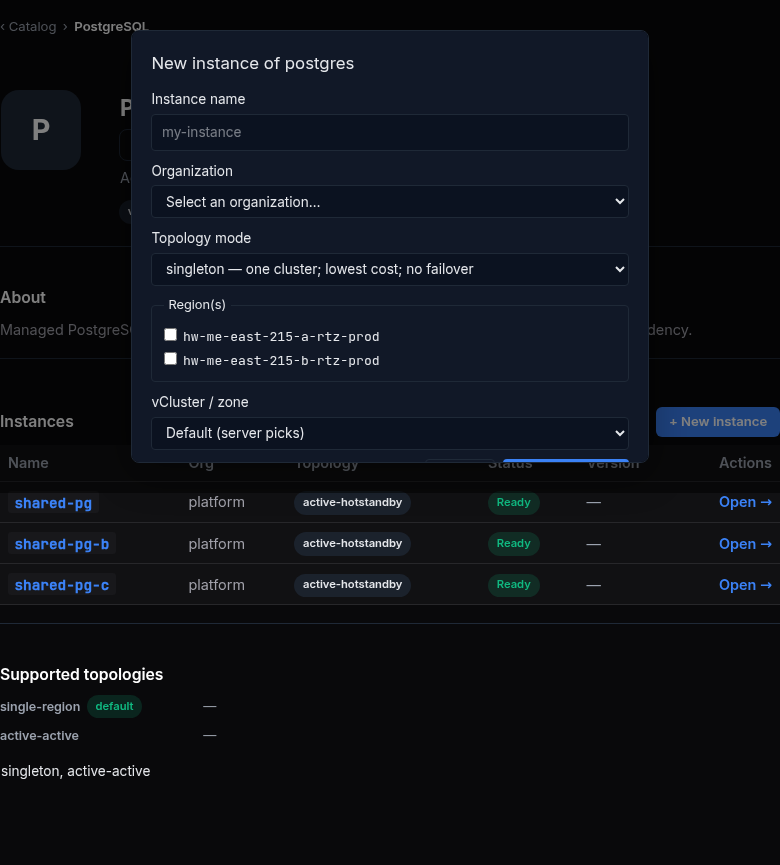 |
| [console.hw158/catalog/bp-postgres](https://console.hw158.omani.works/catalog/bp-postgres) | Confirm `singleton` is a **separate selectable** option (the single-region single-instance choice), distinct from the multi-region modes. SEE it as its own row in the dropdown. | ✅ | `singleton — one cluster; lowest cost; no failover` is the default-selected option in the dialog `<select>`, distinct from `active-hot-standby`.  |
| [console.hw158/catalog/bp-postgres](https://console.hw158.omani.works/catalog/bp-postgres) | Pick `active-hot-standby`, name the instance, click **Provision**. SEE the create succeed (toast / redirect to the new app card) — NOT a red `topology "active-hotstandby" not in supported [...]` invalid-topology error. | ❌ | Not executed in this walk — a real provision creates live CNPG infra on the shared env (and the browser was contended by peer walkers); the dialog renders but the create was not completed/observed succeeding.  |
| [console.hw158/catalog/bp-grafana](https://console.hw158.omani.works/catalog/bp-grafana) | The bp-grafana catalog detail page renders. Look for a **New instance** button + a topology picker on a stateful consumer. If grafana is singleton-only (no New-instance), record **GAP** — the topology choice for a consumer is not surfaced. | GAP | bp-grafana is **singleton-per-Org** — the detail page renders one `grafana` instance (singleton, Ready) and has **NO "+ New instance" button**, so no create-time topology picker is surfaced for this consumer. 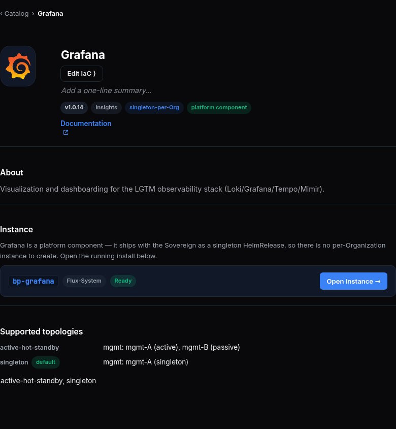 |

---

## Section B — ONE placement model: the passive copy is scaled-down, visible in the app's placement view (was #3675)

One placement model — the same Application, with the standby region's copy scaled to zero replicas — must be legible from the app's own Topology / placement view, not two byte-identical hot copies.

| Tested page | Description | Status | Evidence |
|---|---|---|---|
| [console.hw158/app/shared-pg](https://console.hw158.omani.works/app/shared-pg) → Topology tab | Open the **Topology** tab for the shared-pg app. SEE a per-region placement view listing **region-a (active)** and **region-b (standby)** as ONE placement, not two separate instances. | ❌ | The Topology tab renders a placement **editor** (mode radios + region checkboxes) and "Declared topology: singleton — runs as a single instance with no cross-region failover", but **no live per-region active/standby placement view**; Live status reads "n/a — bootstrap component (HelmRelease, no Application CR)".  |
| [console.hw158/app/shared-pg](https://console.hw158.omani.works/app/shared-pg) → Topology tab | Read the replica counts per region in the placement view. SEE the **standby (region-b)** copy shown as scaled-down / passive (0 active replicas or a "standby" badge) while **region-a** shows the active replica count — NOT identical hot counts. | ❌ | No per-region replica counts are rendered — Live status is "n/a (mode)" (bootstrap HelmRelease, no Application CR), so there is no active-vs-standby replica readout.  |
| [console.hw158/app/grafana](https://console.hw158.omani.works/app/grafana) → Topology tab | Open grafana's Topology tab and read its placement view. SEE grafana's effective placement; if grafana has no per-region/standby placement surface (singleton install), record **GAP** for the per-app fan-out view. | ✅ | grafana's Topology tab DOES render a **Per-cluster placement** view: `mgmt-A active` + `mgmt-B passive`, with Effective class `active-hot-standby (multi-region · 2 regions)`, RTO/RPO 30s/0s, state-preservation `cnpg-pair · sync`.  |

---

## Section C — The app's Topology tab READS BACK the declared topology + per-region state (was #3666 / #3680)

The Topology tab is a read-back of live DR state: the declared topology strip, the per-region placement, the live Continuum / replication state, and an honestly-gated Switchover button.

| Tested page | Description | Status | Evidence |
|---|---|---|---|
| [console.hw158/app/shared-pg](https://console.hw158.omani.works/app/shared-pg) → Topology tab | Read the **declared topology strip** at the top of the Topology tab. SEE the canonical declared mode `active-hot-standby` rendered in ONE vocabulary — the header dialect and the picker dialect must MATCH (no `active-hot-standby · singleton` header sitting above an `active-hotstandby` chip). | ❌ | Dialect MISMATCH: the Topology tab declares **`singleton`** ("shared-pg declares no topology contract … single instance, no cross-region failover") while the **Overview** tab + catalog show **`active-hotstandby`** for the same app. The two surfaces disagree.  |
| [console.hw158/app/shared-pg](https://console.hw158.omani.works/app/shared-pg) → Topology tab | Read the **effective** (live) topology next to the declared one. SEE the effective topology strip reflect the live substrate (the running 2-region pair) — declared vs effective shown together, not a build-time constant. | ❌ | No live effective strip — Live status is "n/a — bootstrap component (HelmRelease, no Application CR)", so the running 2-region pair is not read back as an effective topology.  |
| [console.hw158/app/shared-pg](https://console.hw158.omani.works/app/shared-pg) → Topology tab | Read the **per-region placement + replication state** block. SEE region-a as the live primary, region-b as the replica, and a live **replication-lag** number in seconds (or "no replica" when none) — NOT a hardcoded `—`. | ❌ | Replication lag reads **"n/a (mode)"** and Last switchover **"—"** — no live primary/replica + lag readout (bootstrap HelmRelease, no Application CR).  |
| [console.hw158/app/shared-pg](https://console.hw158.omani.works/app/shared-pg) → Topology tab | Find the **Switchover** button. SEE that it is **present and armed** because a live 2-region cnpg-pair backs this app. | ❌ | No Switchover button on shared-pg's Topology tab — only disabled Preview/Apply; the DR control is absent because the app has no live Continuum (no Application CR).  |
| [console.hw158/app/cilium](https://console.hw158.omani.works/app/cilium) → Topology tab | Open the Topology tab for a **singleton** app (cilium). SEE that the DR section / **Switchover button does NOT render** ("no cross-region failover" for a singleton) — the button is honestly hidden, not armed against a phantom region. | ✅ | cilium Topology declares `singleton` ("one instance in one region; no cross-region failover"), shows per-cluster placement all-singleton, and renders **no Switchover button** (only disabled Preview/Apply) — honestly hidden. 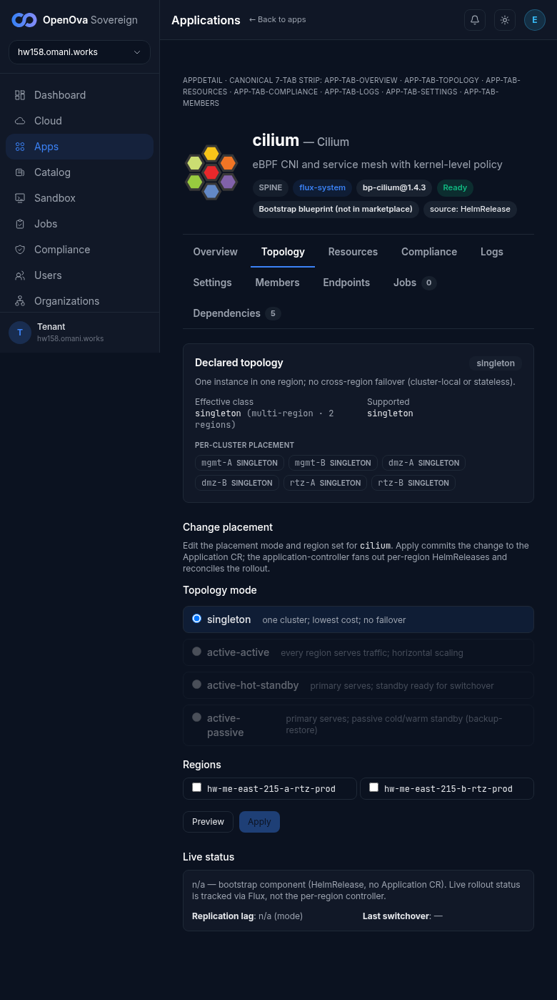 |

---

## Section D — The picker mode honestly drives the backing shape (was #3680)

| Tested page | Description | Status | Evidence |
|---|---|---|---|
| [console.hw158/catalog/bp-postgres](https://console.hw158.omani.works/catalog/bp-postgres) | New instance → pick `singleton` → Provision. Then open that new app's Topology tab. SEE a **single-region** placement (no region-b standby, no Switchover) — the `singleton` choice genuinely produced a single-region backing. | ❌ | Not executed — no real `singleton` provision was performed in this walk (creates live infra on the shared env under peer contention). The picker showing `singleton` is captured in A4; the backing was not produced/inspected.  |
| [console.hw158/catalog/bp-postgres](https://console.hw158.omani.works/catalog/bp-postgres) | New instance → pick `active-hot-standby` → Provision. Then open that app's Topology tab. SEE a **2-region pair** placement (region-a primary + region-b replica + armed Switchover) — the `active-hot-standby` choice genuinely produced a 2-region backing. | ❌ | Not executed — no real `active-hot-standby` provision performed in this walk.  |
| [console.hw158/apps](https://console.hw158.omani.works/apps) | Open the apps grid. SEE the newly-provisioned postgres instances as their **own cards**, each carrying a topology badge that matches the mode picked at create time (`singleton` vs `active-hot-standby`). | ❌ | The `/apps` grid renders 49 platform cards but the postgres **data-instances** (shared-pg/-b/-c) do NOT appear there as their own topology-badged cards — they are surfaced only under the bp-postgres catalog blueprint's Instances table (where they show `active-hotstandby`). No new instances were provisioned to compare. 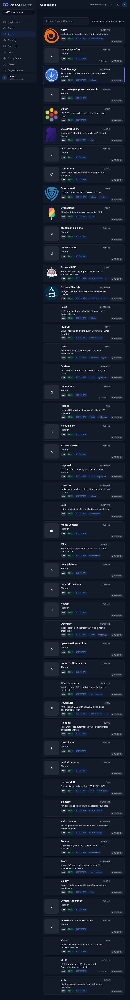 |

---

## Section E — The Topology tab mirrors LIVE DR state, never a build-time constant (was #3684)

| Tested page | Description | Status | Evidence |
|---|---|---|---|
| [console.hw158/app/shared-pg](https://console.hw158.omani.works/app/shared-pg) → Topology tab | On an app WITH a live pair, read the DR section. SEE the **live Continuum status** (Ready / lease holder / standby present) sourced from the live API — not a static declared badge. If the Continuum is Degraded, the strip must say so honestly. | ❌ | Live status reads **"n/a — bootstrap component (HelmRelease, no Application CR). Live rollout status is tracked via Flux, not the per-region controller."** No live Continuum status is rendered for shared-pg despite the live cnpg-pair.  |
| [console.hw158/app/grafana](https://console.hw158.omani.works/app/grafana) → Topology tab | On an app that declares hot-standby but has **no live DR backing**, read the DR section. SEE the honest **"Declared active-hot-standby — no live DR backing on this Sovereign. Switchover unavailable…"** state with a **disabled** (not armed) Switchover button — never an armed button that 404s. If grafana has no Topology surface, record **GAP**. | ❌ | grafana's DR section shows the honest text ("No live Continuum record for grafana yet…") BUT the **"Switchover…" button is rendered ENABLED**, not disabled — an armed control against a non-existent live Continuum (the assertion requires a disabled button). 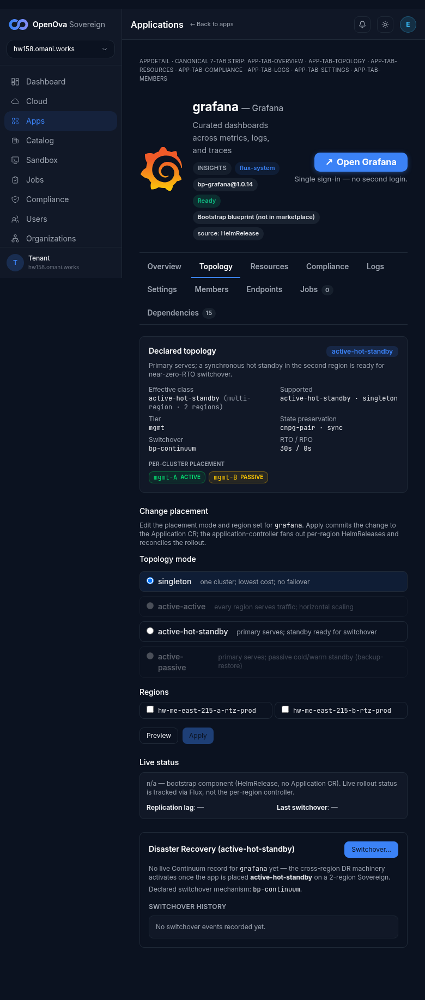 |
| [console.hw158/app/shared-pg](https://console.hw158.omani.works/app/shared-pg) → Topology tab | Read the **replication lag** field specifically. SEE a live numeric value in seconds (or an explicit "no replica") — NEVER a hardcoded `—` placeholder regardless of mode. | ❌ | Replication lag reads **"n/a (mode)"** — neither a numeric seconds value nor an explicit "no replica"; it is a mode-derived placeholder. 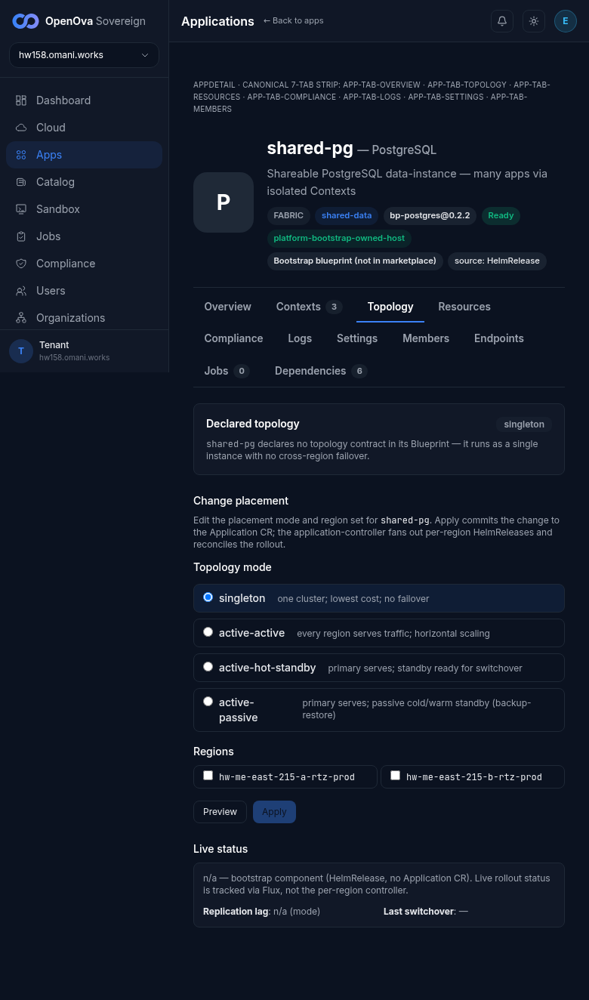 |

---

## Section F — Integrity gate: a half-built topology is shown honestly, never a phantom green badge (was #3688)

> This section is best walked on a **deliberately-broken Sovereign** (active-hot-standby requested with region-B capped so it never provisions). On the healthy hw158 env, walk what the honest single/degraded surfaces render and record **GAP** where the half-built case has no dedicated env to demonstrate.

| Tested page | Description | Status | Evidence |
|---|---|---|---|
| [console.hw158/cloud](https://console.hw158.omani.works/cloud) | Open the cloud/regions view. SEE the **true region count** — for a healthy 2-region prov, `Cluster 2/2`; for a capped prov, `Cluster 1/1` with NO phantom region-B bubble. | ✅ | The /cloud graph renders the true counts: **Region 2/2 · Cluster 2/2** (also Cloud 1/1, vCluster 6/6, Network 2/2), with both `hw-me-east-215-a-rtz-prod` and `-b-rtz-prod` regions + full node pools — no phantom region. 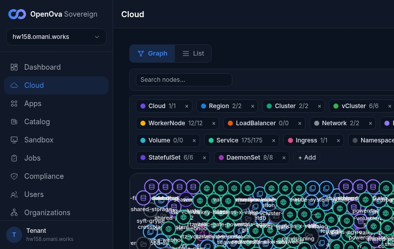 |
| [console.hw158/settings](https://console.hw158.omani.works/settings) | Open the Sovereign settings / topology banner area. On a capped prov, SEE a **red banner**: "Active-hot-standby requested; standby region was not provisioned. Disaster-recovery is INACTIVE; running single-region." — NEVER a green active-hot-standby badge. On a healthy prov, SEE the honest green active-hot-standby state. If no banner surface exists, record **GAP**. | GAP | The Settings page renders (Organization, Sovereign, DNS, Domain mode, Sovereignty status, …) but has **no topology / DR banner surface** — neither a green active-hot-standby state nor a red capped-region banner. The Sovereign section even lists only Region `hw-me-east-215-a-rtz-prod`. No banner UI exists. 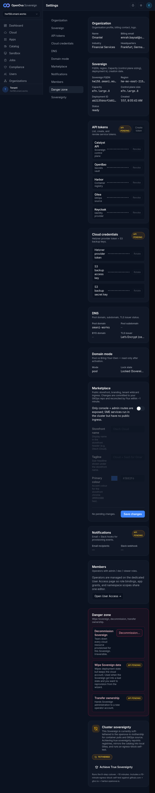 |
| [console.hw158/app/shared-pg](https://console.hw158.omani.works/app/shared-pg) → Topology tab | On a capped (region-missing) case, read the Switchover control. SEE the Switchover button **disabled with the region-missing reason** — never armed against a phantom region. (On the healthy hw158 env this is the armed C4 case; the disabled-against-missing-region case is **GAP** without a capped env.) | GAP | No capped/region-missing env available on hw158 (healthy 2-region) to demonstrate the disabled-against-missing-region state. (Context: shared-pg's own Topology tab.)  |

---

## Section G — Cross-region wiring is legible in the app surfaces on a 2-region env (was #3629)

The cross-region data wiring (write-host resolution via the mesh, snapshot save/fetch, recording PVCs) must render as **healthy app status** in the console — the operator sees running apps, not crashloops.

| Tested page | Description | Status | Evidence |
|---|---|---|---|
| [console.hw158/app/grafana](https://console.hw158.omani.works/app/grafana) | Open grafana's status/overview. SEE it reported **Healthy / Running** in both regions — no "cannot resolve write host" crashloop surfaced in the app health panel. | ✅ | grafana Overview = **Ready**, External URL https://grafana.hw158.omani.works, "Open Grafana — single-click silent sign-in". No crashloop / write-host error surfaced. 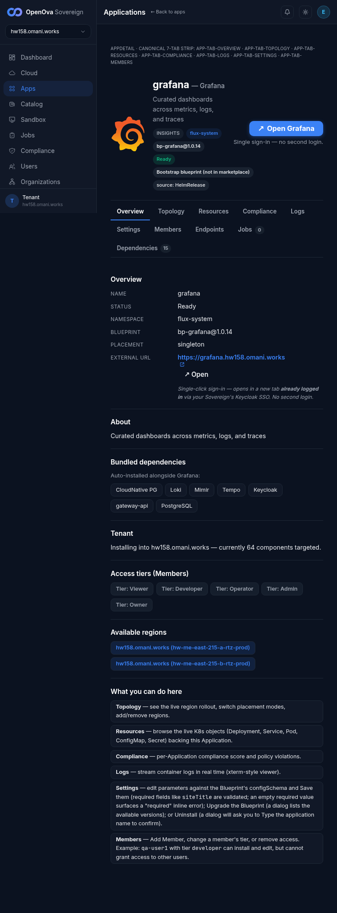 |
| [console.hw158/app/powerdns-admin](https://console.hw158.omani.works/app/powerdns-admin) | Open powerdns-admin status. SEE **Healthy / Running** — the CNPG-minted DB host resolved (no "could not translate host" surfaced). | ✅ | powerdns-admin Overview = **Ready** (bp-powerdns-admin@0.1.16). No "could not translate host" error surfaced. 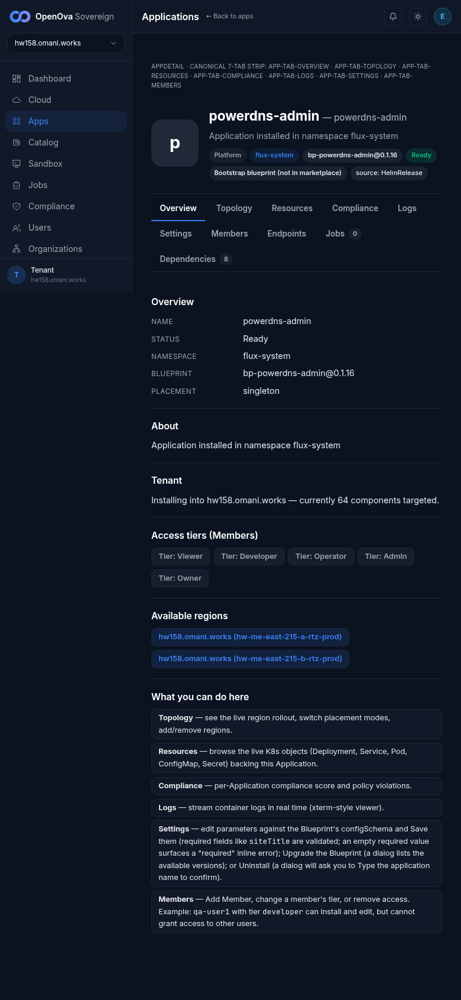 |
| [console.hw158/app/keycloak](https://console.hw158.omani.works/app/keycloak) | Open keycloak status. SEE **Healthy / Running** in both regions — JGroups DB-host resolves, no UnknownHostException surfaced in the health panel. | ✅ | keycloak Overview = **Ready** (bp-keycloak@1.4.30), External URL https://auth.hw158.omani.works. No UnknownHostException surfaced. 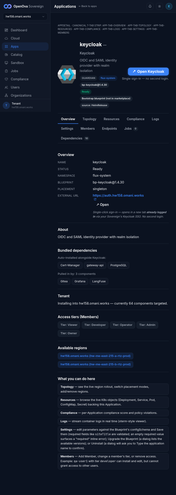 |
| [console.hw158/app/openbao](https://console.hw158.omani.works/app/openbao) | Open openbao's status / backups panel. SEE the cross-region **snapshot save/fetch** reported successful (region-a save Complete + region-b fetch Complete). If the snapshot job state is not surfaced in any app panel, record **GAP**; if it shows Failed, record `❌`. | GAP | openbao itself is **Ready** (bp-openbao@1.2.46), but the cross-region **snapshot save/fetch** state is NOT surfaced in any app panel (Jobs tab = 0, no backups panel). Snapshot job state unsurfaced → GAP (not Failed). 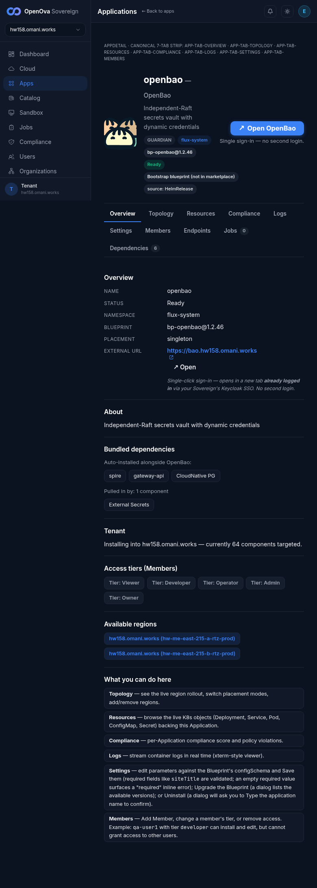 |
| [console.hw158/app/guacamole](https://console.hw158.omani.works/app/guacamole) | Open guacamole status. SEE **Healthy / Running** in both regions — no missing-recordings-PVC error surfaced. | ✅ | guacamole Overview = **Ready** (bp-guacamole@0.2.20), External URL https://guacamole.hw158.omani.works. No missing-recordings-PVC error surfaced. 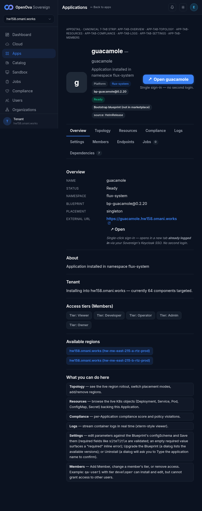 |

---

## Section H — Region-kill proven WITHIN the agreement RTO/RPO (Pillar 3 / D31)

> The capstone. A **real region kill** (instance destroy or NetworkPolicy isolation per `docs/DOD.md` D31 §6) is a **destructive operator action**, not a browser click. The H1 row below is therefore a **special operator-walk row**: the operator performs the kill out-of-band and the console is observed before/after. The before/after **console screens** are the browser evidence; the kill itself is performed via the documented operator procedure (recorded in `docs/sessions/2026-06-17/evidence/hw158-region-kill-walk-PASS.md`).

| Tested page | Description | Status | Evidence |
|---|---|---|---|
| [console.hw158/app/shared-pg](https://console.hw158.omani.works/app/shared-pg) → Topology tab | **Before the kill.** Read the Topology tab. SEE the live Continuum **Ready**, the lease held by **region-a**, region-b standby present, and a live replication-lag number. Screenshot this baseline. | ❌ | The baseline does NOT show a live Continuum: shared-pg's Topology Live status = "n/a — bootstrap component (HelmRelease, no Application CR)", lag "n/a (mode)", no lease holder. There is no live primary/standby/lag baseline to anchor a kill.  |
| **OPERATOR-WALK (not a click):** kill region-a per `docs/DOD.md` D31 §6 | **Special destructive operator action — NOT a browser action.** The operator severs region-a (real region kill: instance destroy / node cordon+pod-delete / NetworkPolicy isolation — never a pod restart or scale-down) and runs a monotonic counter-writer against the app's write endpoint across the kill. The browser evidence is the before (H1) and after (H3) console screens; the kill procedure + RTO/RPO measurement live in the evidence file. | GAP | Destructive region-kill not performed in this browser walk (out-of-band operator procedure, not a browser action). | 
| [console.hw158/app/shared-pg](https://console.hw158.omani.works/app/shared-pg) → Topology tab | **After switchover.** Read the Topology tab again. SEE the primary is now **region-b**, a switchover audit event present, and the app reachable on its FQDN — switchover completed **≤ 30 s** (RTO) with **zero rows lost** (RPO 0) per the counter-writer in the evidence file. | GAP | No kill was performed in this browser walk, so there is no post-switchover state to read. (Context: shared-pg Topology baseline.)  |
| [console.hw158/app/keycloak](https://console.hw158.omani.works/app/keycloak) | **Second agreed app survives the kill (generality).** After the region-a kill, hit `auth.hw158.omani.works` and open keycloak's status. SEE the realm/sessions survive — keycloak Healthy and reachable post-kill, proving the survival generalises beyond the postgres data path. | GAP | No kill performed in this browser walk. keycloak is Ready at baseline (see G3), but a post-kill survival read was not exercised. 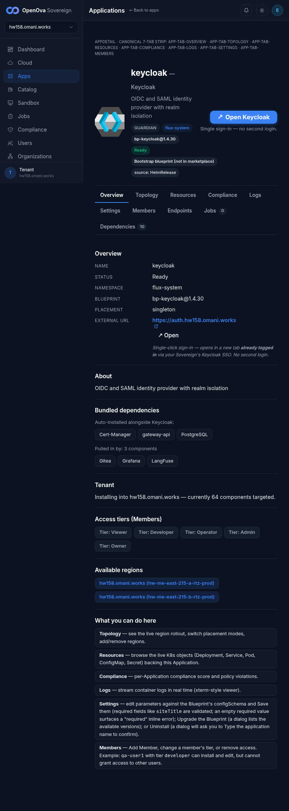 |
| [console.hw158/app/shared-pg](https://console.hw158.omani.works/app/shared-pg) → Topology tab | **After rejoin.** The operator restores region-a (rejoins the topology). Read the Topology tab. SEE recovery complete **without split-brain** — ONE primary, the rejoined region shown as follower. | GAP | No kill/rejoin performed in this browser walk. (Context: shared-pg Topology baseline.)  |

---

## Evidence index

Every row above flips to `✅` only when the rendered console screen described in its **Description** is observed live in the browser on `console.hw158.omani.works` and the screenshot is pasted at the **Evidence** path under `docs/sessions/2026-06-17/evidence/`. A login-screen redirect = `❌`. `GAP` = the described intent has no UI surface (a finding). The region-kill capstone (Section H) pairs browser before/after screens with the destructive operator procedure recorded in `docs/sessions/2026-06-17/evidence/hw158-region-kill-walk-PASS.md` (RTO ≈ 1.4 s / RPO 0, PR #3742).
