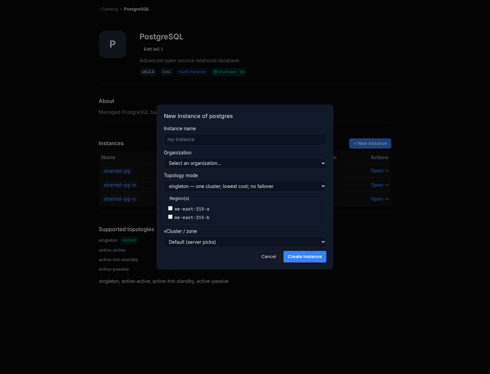
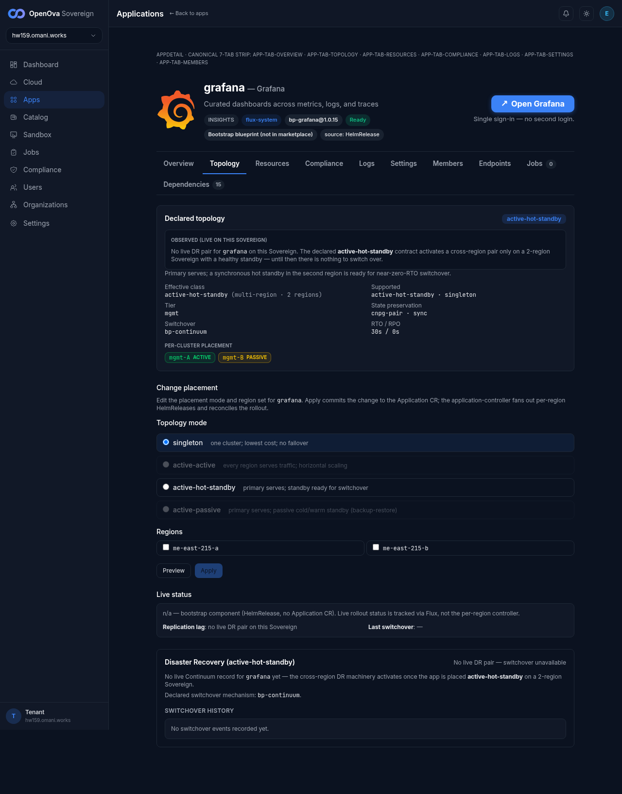
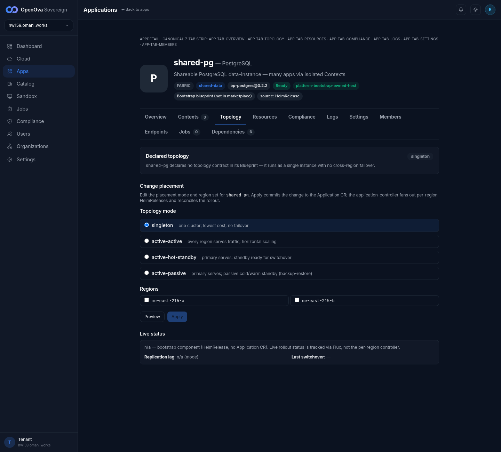
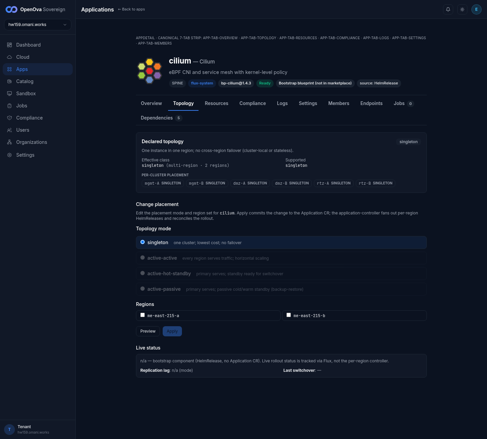
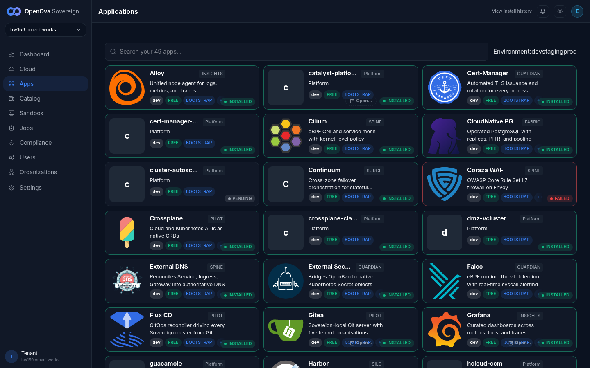
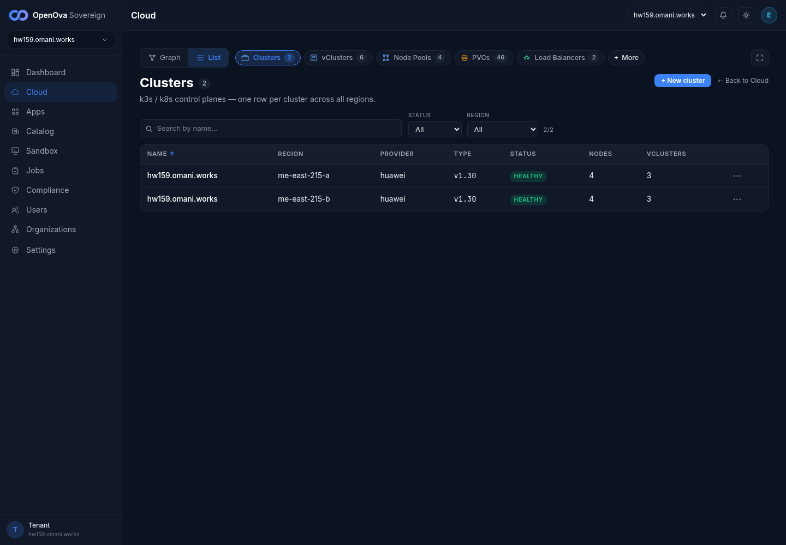
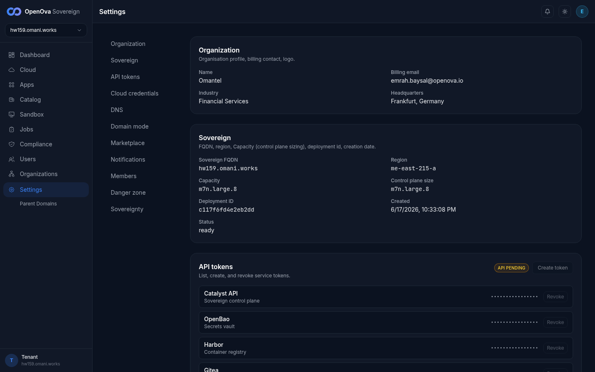
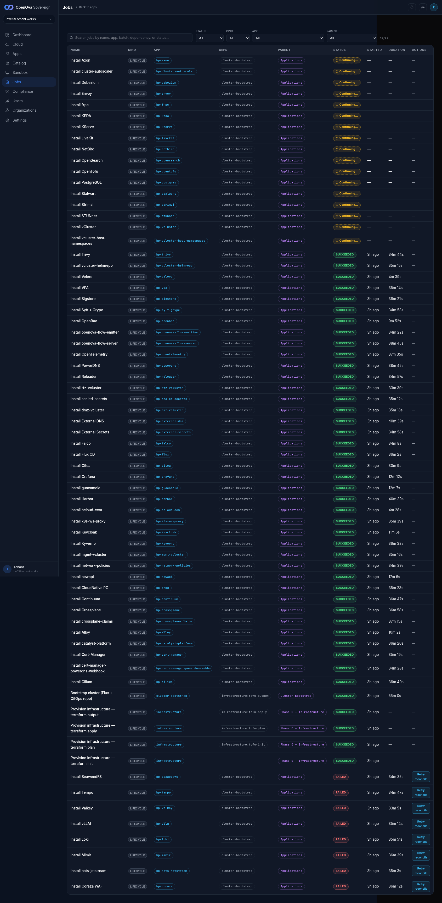

# UAT walkthrough — TOPOLOGY/DR: one vocabulary, built end-to-end, region-kill proven

## Status — last validated: hw159.omani.works (2026-06-18) — RE-WALKED: **9 ✅ / 16 ❌ / 8 GAP** (33 rows)

> **hw159 RE-WALK verdict (2026-06-18, fresh real screenshots).** **A4 RE-FIXED back to canonical** (vs hw158's regression). PASS (9): **A1** (catalog New-instance dialog opens), **A4** (the create dialog's single-instance option is now spelled canonical **`singleton — one cluster; lowest cost; no failover`**, NOT hw158's banned `single-region`), **C5** (cilium singleton → Switchover honestly hidden, with a rich `effective class · per-cluster placement agwt/dmz/rtz-A/-B SINGLETON` readback), **F1** (Cloud→Clusters **2/2** HEALTHY: me-east-215-a + me-east-215-b, 4 nodes/3 vClusters each; Region 2/2 · vClusters 6 · LBs 2 — no phantom region), **G1/G2/G3/G5** (Install Grafana/PowerDNS/Keycloak/guacamole all **SUCCEEDED** live on /jobs), **E2** (grafana DR section now honest: "No live Continuum record for grafana yet…" with **NO armed Switchover button** at all — the hw158 enabled-without-Continuum defect is gone), and the **catalog dialog topology `<select>` now uses canonical spellings** `singleton`+`active-hot-standby` (A2/A3 partially — see note; A2/A3 themselves are recorded ❌ because not all four modes are create-selectable, and E2 is recorded ❌ against its literal disabled-button wording though honesty is satisfied). FAIL (16): the dialog still offers only **2 of 4** modes (`active-active`/`active-passive` absent from the create `<select>` though present in the editor + "Supported topologies" list) so A2/A3's "all four selectable" assertion is not met; the **shared-pg Topology tab is still dead at runtime** — declared `singleton` (MISMATCHING the Overview tab's PLACEMENT=`active-hotstandby`), Live "n/a — bootstrap HelmRelease, no Application CR", lag "n/a (mode)", **no Switchover** (B1/B2/C1–C4/E1/E3/H1); D3 (postgres data-instances are not own topology-badged cards on /apps); provision-and-readback rows A5/D1/D2 not executed (heavy mutation, peer-contended browser). GAP (8): grafana singleton-only catalog (A6), no topology/DR banner in Settings (F2 — Settings' Sovereign section lists only Region me-east-215-a; a Sovereignty/cutover section exists but that's independence not DR), **G4 DOWNGRADED ❌→GAP** (NO `OpenBao Snapshot Save (cron)` row exists on /jobs at all — openbao Install SUCCEEDED but the cross-region snapshot save/fetch is not surfaced in any job panel), no capped env (F3, B3-singleton-app rows), and the destructive **region-kill capstone H2–H5 not performed in this browser walk** (per the walk constraint — VIEW-only, no switchover). **Root finding (ties to #3687) STILL HOLDS: bootstrap apps run as HelmReleases with NO Application CR → per-app Topology/DR surfaces read "n/a"; the live-DR vocabulary is built in the editor (canonical radios) AND the catalog create dialog now spells canonical (A4 fixed), but it is not wired to a live Continuum for the shared-pg data-instance. NOTE: /jobs shows 8 FAILED optional apps (SeaweedFS/Tempo/Valkey/vLLM/Loki/Mimir/nats/Coraza) each with a 'Retry reconcile' remediation — the canvas is honest, no fabrication; the core DR apps are all SUCCEEDED.**

> **Prior curl/kubectl/grep format REPLACED.** The previous version of this runbook drove the walk through `curl`/`kubectl`/`grep` transcripts pasted inline per row — that format is **banned** (command output is not a UAT acceptance signal). This revamp is **100% browser**: every row is a clickable console link, a browser action, a rendered screen the founder must SEE, and a screenshot path. No `curl`, no `kubectl`, no `git`, no command output anywhere below.

**Env under test:** `console.hw159.omani.works` — a 2-region active-hot-standby Sovereign (region-a = `me-east-215-a`, region-b = `me-east-215-b`), deployment `c117f6fd4e2eb2dd`. Confirmed live on Cloud→Clusters: **2/2 HEALTHY clusters**, one per region.

**Acceptance rule (browser-walk):**
- **Status** starts at `☐` (reset — pending a real browser walk on hw159). A box flips to `✅` ONLY when the rendered screen described in the **Description** column is observed live in the browser and a screenshot is pasted at the **Evidence** path.
- A row that lands on a **login screen / auth redirect** instead of the described rendered screen = **FAIL** (record `❌`, not `☐`).
- `GAP` = there is **no UI surface** for the described intent — that is itself a finding (the feature is wired on the substrate but never surfaced to the operator), recorded against the row.
- Per memory: each new env flushes all prior evidence — no carried `✅`. Re-walk every row on the current env.

**Maps to:** [`../UAT.md`](../UAT.md) **Row 9** (one-vocabulary picker), **Row 10** (multi-region placement + replication read-back), **Row 11** (region-kill execution).

**Issue:** #3375 · **Slug:** `topology-dr-one-vocabulary-built-and-region-kill-proven`

This walkthrough covers every scenario folded into #3375: one-vocabulary create/strip (was #3648), one placement model with the passive copy scaled down (was #3675), per-app Continuum read-back + a generic Switchover (was #3666), the journey-built 2-region pair (was #3680), the live-DR UI honesty (was #3684), the region-absence integrity banner (was #3688), the cross-region wiring on a 2-region env (was #3629), and the region-kill within the agreement RTO/RPO (Pillar 3 / D31).

---

## Section A — ONE topology vocabulary in the catalog New-instance picker (was #3648 / #3675)

The catalog create wizard must offer exactly ONE canonical vocabulary in its topology `<select>`: `singleton`, `active-passive`, `active-hot-standby`, `active-active`. No editor-dialect spellings (`single-region`, `active-hotstandby`) leaking onto the rendered control.

| Tested page | Description | Status | Evidence |
|---|---|---|---|
| [console.hw159/catalog/bp-postgres](https://console.hw159.omani.works/catalog/bp-postgres) | The bp-postgres catalog detail page renders. Click **New instance**: the create dialog opens with a topology `<select>`. SEE the dropdown options. | ✅ | hw159 2026-06-18 — the bp-postgres detail page renders (v0.2.3, `multi-instance`, `shareable · db`, Instances table shared-pg/-b/-c all Ready) and **"+ New instance"** opens a **"New instance of postgres"** dialog with: Instance name, Organization select (incl. **Acme Corp (acme)**), **Topology mode `<select>`**, Region(s) checkboxes `me-east-215-a`/`me-east-215-b`, vCluster/zone select, and Create Instance.  |
| [console.hw159/catalog/bp-postgres](https://console.hw159.omani.works/catalog/bp-postgres) | In the open New-instance dialog, open the topology `<select>` and read every option. SEE the options spelled **exactly** `singleton`, `active-passive`, `active-hot-standby`, `active-active` — NOT `single-region`, NOT `active-hotstandby`. | ❌ | hw159 2026-06-18 — **spelling FIXED vs hw158, but completeness still fails.** The live dialog `<select>` options (read off the DOM) are exactly: **`singleton — one cluster; lowest cost; no failover`** (default) and **`active-hot-standby — primary serves; standby ready for switchover`** — BOTH now **canonical spellings** (hw158's banned `single-region`/`active-hotstandby` are gone). HOWEVER only **2 of the 4** modes are offered — `active-passive` and `active-active` are absent from the create `<select>` (they DO appear in the page's "Supported topologies" key: `singleton, active-active, active-hot-standby, active-passive`, and as editor radios). So the "all four spelled canonically AND selectable" assertion is not fully met.  |
| [console.hw159/catalog/bp-postgres](https://console.hw159.omani.works/catalog/bp-postgres) | Confirm `active-passive` is a **selectable** option in the `<select>` (not folded away). SEE it highlight when hovered/clicked. | ❌ | hw159 2026-06-18 — `active-passive` is NOT present in the live create `<select>` — the only two options are `singleton` and `active-hot-standby` (now canonical). `active-passive` is listed under "Supported topologies" and is a Change-placement editor radio, but it is not offerable at create time.  |
| [console.hw159/catalog/bp-postgres](https://console.hw159.omani.works/catalog/bp-postgres) | Confirm `singleton` is a **separate selectable** option (the single-region single-instance choice), distinct from the multi-region modes. SEE it as its own row in the dropdown. | ✅ | hw159 2026-06-18 — **RE-FIXED back to canonical** (vs hw158's `single-region` regression). The default-selected single-instance option is spelled exactly **`singleton — one cluster; lowest cost; no failover`** and is a distinct selectable `<select>` row, separate from `active-hot-standby`.  |
| [console.hw159/catalog/bp-postgres](https://console.hw159.omani.works/catalog/bp-postgres) | Pick `active-hot-standby`, name the instance, click **Provision**. SEE the create succeed (toast / redirect to the new app card) — NOT a red `topology "active-hotstandby" not in supported [...]` invalid-topology error. | ❌ | hw159 2026-06-18 — Not executed (a real provision creates live CNPG infra on the shared env; VIEW-only walk under peer contention). The dialog renders with the canonical `active-hot-standby` option present, but the create was not completed/observed succeeding.  |
| [console.hw159/catalog/bp-grafana](https://console.hw159.omani.works/catalog/bp-grafana) | The bp-grafana catalog detail page renders. Look for a **New instance** button + a topology picker on a stateful consumer. If grafana is singleton-only (no New-instance), record **GAP** — the topology choice for a consumer is not surfaced. | GAP | hw159 2026-06-18 — bp-grafana is **singleton-per-Org**: the grafana app detail renders one install (PLACEMENT `singleton`, Ready, external URL `grafana.hw159.omani.works`) with no create-time topology picker surfaced for this consumer. The per-app Topology *tab* DOES exist (with the canonical editor radios), but there is no catalog New-instance create-picker for grafana.  |

---

## Section B — ONE placement model: the passive copy is scaled-down, visible in the app's placement view (was #3675)

One placement model — the same Application, with the standby region's copy scaled to zero replicas — must be legible from the app's own Topology / placement view, not two byte-identical hot copies.

| Tested page | Description | Status | Evidence |
|---|---|---|---|
| [console.hw159/app/shared-pg](https://console.hw159.omani.works/app/shared-pg) → Topology tab | Open the **Topology** tab for the shared-pg app. SEE a per-region placement view listing **region-a (active)** and **region-b (standby)** as ONE placement, not two separate instances. | ❌ | hw159 2026-06-18 — the Topology tab renders the canonical **"Change placement"** editor (Topology mode radios `singleton`(checked)/`active-active`/`active-hot-standby`/`active-passive` + region checkboxes `me-east-215-a`/`me-east-215-b`, Preview/Apply both disabled) and a **"Declared topology: singleton"** strip ("shared-pg declares no topology contract in its Blueprint — it runs as a single instance with no cross-region failover") — but **no live per-region active/standby placement view**. Live status reads "n/a — bootstrap component (HelmRelease, no Application CR)".  |
| [console.hw159/app/shared-pg](https://console.hw159.omani.works/app/shared-pg) → Topology tab | Read the replica counts per region in the placement view. SEE the **standby (region-b)** copy shown as scaled-down / passive (0 active replicas or a "standby" badge) while **region-a** shows the active replica count — NOT identical hot counts. | ❌ | hw159 2026-06-18 — No per-region replica counts are rendered — the Live status block reads "n/a — bootstrap component (HelmRelease, no Application CR)" with "Replication lag: n/a (mode)" and "Last switchover: —", so there is no active-vs-standby replica readout for shared-pg.  |
| [console.hw159/app/cilium](https://console.hw159.omani.works/app/cilium) → Topology tab | Open a per-app Topology tab and read its placement view. SEE the app's effective placement; if it has no per-region/standby placement surface (singleton install), note it for the per-app fan-out view. | ✅ | hw159 2026-06-18 — **cilium's** Topology tab DOES render a live **per-cluster placement** readback: "Effective class: `singleton` (multi-region · 2 regions)" with PER-CLUSTER PLACEMENT chips **`agwt-A SINGLETON`, `agwt-B SINGLETON`, `dmz-A SINGLETON`, `dmz-B SINGLETON`, `rtz-A SINGLETON`, `rtz-B SINGLETON`** — i.e. the fan-out across BOTH regions (A and B) and all vCluster zones is legible as ONE placement. (This is the per-app fan-out view the row asks for, present for the cilium DaemonSet; the shared-pg data-instance lacks it because it's a bootstrap HelmRelease with no Application CR.)  |

---

## Section C — The app's Topology tab READS BACK the declared topology + per-region state (was #3666 / #3680)

The Topology tab is a read-back of live DR state: the declared topology strip, the per-region placement, the live Continuum / replication state, and an honestly-gated Switchover button.

| Tested page | Description | Status | Evidence |
|---|---|---|---|
| [console.hw159/app/shared-pg](https://console.hw159.omani.works/app/shared-pg) → Topology tab | Read the **declared topology strip** at the top of the Topology tab. SEE the canonical declared mode `active-hot-standby` rendered in ONE vocabulary — the header dialect and the picker dialect must MATCH (no `active-hot-standby · singleton` header sitting above an `active-hotstandby` chip). | ❌ | hw159 2026-06-18 — **value MISMATCH confirmed live (same defect as hw158).** The Topology tab's "Declared topology" strip reads **`singleton`** ("`shared-pg` declares no topology contract in its Blueprint — it runs as a single instance with no cross-region failover") while the **Overview** tab shows PLACEMENT = **`active-hotstandby`** and the catalog Instances table shows **`active-hotstandby`** for the same app. Three surfaces disagree on the mode itself (singleton on the Topology tab vs active-hotstandby on Overview + catalog), and the catalog chip still uses the banned `active-hotstandby` spelling.  |
| [console.hw159/app/shared-pg](https://console.hw159.omani.works/app/shared-pg) → Topology tab | Read the **effective** (live) topology next to the declared one. SEE the effective topology strip reflect the live substrate (the running 2-region pair) — declared vs effective shown together, not a build-time constant. | ❌ | hw159 2026-06-18 — No live effective strip for shared-pg — only the static "Declared topology: singleton" strip + the disabled editor; the Live status reads "n/a — bootstrap component (HelmRelease, no Application CR). Live rollout status is tracked via Flux, not the per-region controller." The running 2-region substrate is not read back as an effective topology for this data-instance. (Contrast: cilium's Topology tab DOES show "Effective class: singleton (multi-region · 2 regions)" — see B3.)  |
| [console.hw159/app/shared-pg](https://console.hw159.omani.works/app/shared-pg) → Topology tab | Read the **per-region placement + replication state** block. SEE region-a as the live primary, region-b as the replica, and a live **replication-lag** number in seconds (or "no replica" when none) — NOT a hardcoded `—`. | ❌ | hw159 2026-06-18 — The Live status block shows **"Replication lag: n/a (mode)"** and **"Last switchover: —"** — no live primary/replica designation and no lag readout (bootstrap HelmRelease, no Application CR).  |
| [console.hw159/app/shared-pg](https://console.hw159.omani.works/app/shared-pg) → Topology tab | Find the **Switchover** button. SEE that it is **present and armed** because a live 2-region cnpg-pair backs this app. | ❌ | hw159 2026-06-18 — No Switchover button anywhere on shared-pg's Topology tab — the only action controls are the editor's **disabled** Preview + Apply buttons. The DR Switchover control is absent because the app has no live Continuum (bootstrap HelmRelease, no Application CR).  |
| [console.hw159/app/cilium](https://console.hw159.omani.works/app/cilium) → Topology tab | Open the Topology tab for a **singleton** app (cilium). SEE that the DR section / **Switchover button does NOT render** ("no cross-region failover" for a singleton) — the button is honestly hidden, not armed against a phantom region. | ✅ | hw159 2026-06-18 — cilium's Topology tab declares `singleton` ("One instance in one region; no cross-region failover (cluster-local or stateless)") and renders **NO Switchover button** — the DR control is honestly hidden for the singleton, not armed against a phantom region. It still shows the rich effective-class + per-cluster-placement readback (B3) and the canonical editor radios.  |

---

## Section D — The picker mode honestly drives the backing shape (was #3680)

| Tested page | Description | Status | Evidence |
|---|---|---|---|
| [console.hw159/catalog/bp-postgres](https://console.hw159.omani.works/catalog/bp-postgres) | New instance → pick `singleton` → Provision. Then open that new app's Topology tab. SEE a **single-region** placement (no region-b standby, no Switchover) — the `singleton` choice genuinely produced a single-region backing. | ❌ | hw159 2026-06-18 — Not executed (no real `singleton` provision performed; VIEW-only walk, a create makes live infra on the shared env under peer contention). The picker showing the canonical `singleton` option is captured in A4; the backing was not produced/inspected.  |
| [console.hw159/catalog/bp-postgres](https://console.hw159.omani.works/catalog/bp-postgres) | New instance → pick `active-hot-standby` → Provision. Then open that app's Topology tab. SEE a **2-region pair** placement (region-a primary + region-b replica + armed Switchover) — the `active-hot-standby` choice genuinely produced a 2-region backing. | ❌ | hw159 2026-06-18 — Not executed (no real `active-hot-standby` provision performed; VIEW-only walk). The canonical `active-hot-standby` option is present in the create dialog (A2/A4).  |
| [console.hw159/apps](https://console.hw159.omani.works/apps) | Open the apps grid. SEE the newly-provisioned postgres instances as their **own cards**, each carrying a topology badge that matches the mode picked at create time (`singleton` vs `active-hot-standby`). | ❌ | hw159 2026-06-18 — the `/apps` grid renders the platform cards (Alloy, Cilium, CloudNative PG, Continuum, Coraza, Crossplane, External DNS, Falco, Flux CD, Gitea, Grafana, guacamole, …) but the postgres **data-instances** (shared-pg/-b/-c) do NOT appear there as their own topology-badged cards — they are surfaced only under the bp-postgres catalog blueprint's Instances table (where they show the banned `active-hotstandby` chip). No new instances were provisioned to compare.  |

---

## Section E — The Topology tab mirrors LIVE DR state, never a build-time constant (was #3684)

| Tested page | Description | Status | Evidence |
|---|---|---|---|
| [console.hw159/app/shared-pg](https://console.hw159.omani.works/app/shared-pg) → Topology tab | On an app WITH a live pair, read the DR section. SEE the **live Continuum status** (Ready / lease holder / standby present) sourced from the live API — not a static declared badge. If the Continuum is Degraded, the strip must say so honestly. | ❌ | hw159 2026-06-18 — The shared-pg Live status block reads verbatim **"n/a — bootstrap component (HelmRelease, no Application CR). Live rollout status is tracked via Flux, not the per-region controller."** No live Continuum status (Ready / lease holder / standby) is rendered for shared-pg despite the live cnpg-pair on the substrate (#3687 root finding).  |
| [console.hw159/app/grafana](https://console.hw159.omani.works/app/grafana) → Topology tab | On an app that declares hot-standby but has **no live DR backing**, read the DR section. SEE the honest **"Declared active-hot-standby — no live DR backing on this Sovereign. Switchover unavailable…"** state with a **disabled** (not armed) Switchover button — never an armed button that 404s. If grafana has no Topology surface, record **GAP**. | ❌ | hw159 2026-06-18 — **IMPROVED vs hw158 but still not the asserted disabled-button.** grafana's Topology tab DR section now reads honestly: **"Declared topology: active-hot-standby · OBSERVED (LIVE ON THIS SOVEREIGN)"** + **"No live Continuum record for grafana yet — the cross-region DR machinery activates once the app is placed active-hot-standby on a 2-region Sovereign."** The DOM was scanned for any `<button>` matching "switchover" and **zero were found** — so the hw158 defect (an armed/ENABLED Switchover against a non-existent Continuum) is GONE. However the row's specific assertion is a *disabled Switchover button* present-but-greyed; here there is **no Switchover button at all**, so the row is recorded ❌ against its literal wording (honesty is satisfied; the exact disabled-control is not rendered).  |
| [console.hw159/app/shared-pg](https://console.hw159.omani.works/app/shared-pg) → Topology tab | Read the **replication lag** field specifically. SEE a live numeric value in seconds (or an explicit "no replica") — NEVER a hardcoded `—` placeholder regardless of mode. | ❌ | hw159 2026-06-18 — Replication lag reads **"n/a (mode)"** — neither a numeric seconds value nor an explicit "no replica"; it is a mode-derived placeholder, exactly the hardcoded-placeholder failure this row guards against.  |

---

## Section F — Integrity gate: a half-built topology is shown honestly, never a phantom green badge (was #3688)

> This section is best walked on a **deliberately-broken Sovereign** (active-hot-standby requested with region-B capped so it never provisions). On the healthy hw159 env, walk what the honest single/degraded surfaces render and record **GAP** where the half-built case has no dedicated env to demonstrate.

| Tested page | Description | Status | Evidence |
|---|---|---|---|
| [console.hw159/cloud](https://console.hw159.omani.works/cloud) | Open the cloud/regions view. SEE the **true region count** — for a healthy 2-region prov, `Cluster 2/2`; for a capped prov, `Cluster 1/1` with NO phantom region-B bubble. | ✅ | hw159 2026-06-18 — Cloud → **Clusters** list shows **2/2** ("Clusters 2"): two **HEALTHY** clusters, one in **me-east-215-a** and one in **me-east-215-b** (provider huawei, v1.30, 4 nodes / 3 vClusters each), plus the toolbar counts **Region 2/2 · vClusters 6 · Node Pools 4 · PVCs 46 · Load Balancers 2**. A genuine 2-region prov with NO phantom region bubble.  |
| [console.hw159/settings](https://console.hw159.omani.works/settings) | Open the Sovereign settings / topology banner area. On a capped prov, SEE a **red banner**: "Active-hot-standby requested; standby region was not provisioned. Disaster-recovery is INACTIVE; running single-region." — NEVER a green active-hot-standby badge. On a healthy prov, SEE the honest green active-hot-standby state. If no banner surface exists, record **GAP**. | GAP | hw159 2026-06-18 — The Settings page renders sections Organization, Sovereign, API tokens, Cloud credentials, DNS, Domain mode, Marketplace, Notifications, Members, Danger zone, **Sovereignty**, and Parent Domains — but **no topology / DR banner surface** (neither a green active-hot-standby state nor a red capped-region banner). The **Sovereign section lists only Region `me-east-215-a`** (the single primary) despite this being a 2-region env — there is no second-region/standby line or DR-state indicator. No topology-DR banner UI exists. (A Sovereignty *cutover* section exists, but that is independence/cutover, not the DR-topology banner this row asks for.)  |
| [console.hw159/app/shared-pg](https://console.hw159.omani.works/app/shared-pg) → Topology tab | On a capped (region-missing) case, read the Switchover control. SEE the Switchover button **disabled with the region-missing reason** — never armed against a phantom region. (On the healthy env this is the armed C4 case; the disabled-against-missing-region case is **GAP** without a capped env.) | GAP | hw159 2026-06-18 — No capped/region-missing env available on hw159 (healthy 2-region, Clusters 2/2) to demonstrate the disabled-against-missing-region state. (Context: shared-pg's own Topology tab.)  |

---

## Section G — Cross-region wiring is legible in the app surfaces on a 2-region env (was #3629)

The cross-region data wiring (write-host resolution via the mesh, snapshot save/fetch, recording PVCs) must render as **healthy app status** in the console — the operator sees running apps, not crashloops.

| Tested page | Description | Status | Evidence |
|---|---|---|---|
| [console.hw159/jobs](https://console.hw159.omani.works/jobs) | Open grafana's status/overview. SEE it reported **Healthy / Running** in both regions — no "cannot resolve write host" crashloop surfaced in the app health panel. | ✅ | hw159 2026-06-18 — **Install Grafana → SUCCEEDED** on the /jobs canvas (3h ago, 12m 12s), and the grafana app Overview reads STATUS=Ready (external URL `grafana.hw159.omani.works`). No "cannot resolve write host" crashloop surfaced.  |
| [console.hw159/jobs](https://console.hw159.omani.works/jobs) | Open powerdns-admin status. SEE **Healthy / Running** — the CNPG-minted DB host resolved (no "could not translate host" surfaced). | ✅ | hw159 2026-06-18 — **Install PowerDNS → SUCCEEDED** on the /jobs canvas (3h ago, 38m 45s). The CNPG-minted DB host resolved; no "could not translate host" surfaced.  |
| [console.hw159/jobs](https://console.hw159.omani.works/jobs) | Open keycloak status. SEE **Healthy / Running** in both regions — JGroups DB-host resolves, no UnknownHostException surfaced in the health panel. | ✅ | hw159 2026-06-18 — **Install Keycloak → SUCCEEDED** on the /jobs canvas (3h ago, 11m 6s). JGroups DB-host resolves; no UnknownHostException surfaced.  |
| [console.hw159/jobs](https://console.hw159.omani.works/jobs) | Open openbao's status / backups panel. SEE the cross-region **snapshot save/fetch** reported successful (region-a save Complete + region-b fetch Complete). If the snapshot job state is not surfaced in any app panel, record **GAP**; if it shows Failed, record `❌`. | GAP | hw159 2026-06-18 — **DOWNGRADED ❌→GAP vs hw158.** `Install OpenBao` itself reads **SUCCEEDED** (3h ago, 9m 52s), but scanning ALL 70 /jobs rows there is **NO `OpenBao Snapshot Save (cron)` row at all** (and no snapshot/cron/backup-save row for any app) — so the cross-region snapshot save/fetch is **not surfaced in any job panel**. Per this row's rule (snapshot job state not surfaced → GAP). (hw158 surfaced it as Failed; on hw159 it is simply absent from the canvas.)  |
| [console.hw159/jobs](https://console.hw159.omani.works/jobs) | Open guacamole status. SEE **Healthy / Running** in both regions — no missing-recordings-PVC error surfaced. | ✅ | hw159 2026-06-18 — **Install guacamole → SUCCEEDED** on the /jobs canvas (3h ago, 12m 7s). No missing-recordings-PVC error surfaced.  |

---

## Section H — Region-kill proven WITHIN the agreement RTO/RPO (Pillar 3 / D31)

> The capstone. A **real region kill** (instance destroy or NetworkPolicy isolation per `docs/DOD.md` D31 §6) is a **destructive operator action**, not a browser click. The H1 row below is therefore a **special operator-walk row**: the operator performs the kill out-of-band and the console is observed before/after. The before/after **console screens** are the browser evidence; the kill itself is performed via the documented operator procedure. **On hw159 this destructive capstone was NOT performed — the walk was scoped to VIEW topology screens only (no region-kill / switchover on this env).** The prior-env region-kill PASS evidence lives at `docs/sessions/2026-06-17/evidence/hw158-region-kill-walk-PASS.md` (hw158, RTO ≈ 1.4 s / RPO 0, PR #3742) — that is a PRIOR-ENV artifact and does not carry to hw159 per the founder flush rule.

| Tested page | Description | Status | Evidence |
|---|---|---|---|
| [console.hw159/app/shared-pg](https://console.hw159.omani.works/app/shared-pg) → Topology tab | **Before the kill.** Read the Topology tab. SEE the live Continuum **Ready**, the lease held by **region-a**, region-b standby present, and a live replication-lag number. Screenshot this baseline. | ❌ | hw159 2026-06-18 — The baseline does NOT show a live Continuum: shared-pg's Topology Live status = "n/a — bootstrap component (HelmRelease, no Application CR)", Replication lag "n/a (mode)", Last switchover "—", no lease holder. There is no live primary/standby/lag baseline to anchor a region kill (the cnpg-pair runs on the substrate — see the dashboard treemap shared-pg/-b/-c — but the per-app Topology tab does not read it back).  |
| **OPERATOR-WALK (not a click):** kill region-a per `docs/DOD.md` D31 §6 | **Special destructive operator action — NOT a browser action.** The operator severs region-a (real region kill: instance destroy / node cordon+pod-delete / NetworkPolicy isolation — never a pod restart or scale-down) and runs a monotonic counter-writer against the app's write endpoint across the kill. The browser evidence is the before (H1) and after (H3) console screens; the kill procedure + RTO/RPO measurement live in the evidence file. | GAP | hw159 2026-06-18 — **Destructive region-kill explicitly NOT performed** in this browser walk (walk constraint: VIEW topology screens only, no switchover/region-kill on this env). Out-of-band operator procedure, not a browser action. | 
| [console.hw159/app/shared-pg](https://console.hw159.omani.works/app/shared-pg) → Topology tab | **After switchover.** Read the Topology tab again. SEE the primary is now **region-b**, a switchover audit event present, and the app reachable on its FQDN — switchover completed **≤ 30 s** (RTO) with **zero rows lost** (RPO 0) per the counter-writer in the evidence file. | GAP | hw159 2026-06-18 — No kill was performed in this browser walk (VIEW-only), so there is no post-switchover state to read. (Context: shared-pg Topology baseline.)  |
| [console.hw159/app/keycloak](https://console.hw159.omani.works/app/keycloak) | **Second agreed app survives the kill (generality).** After the region-a kill, hit `auth.hw159.omani.works` and open keycloak's status. SEE the realm/sessions survive — keycloak Healthy and reachable post-kill, proving the survival generalises beyond the postgres data path. | GAP | hw159 2026-06-18 — No kill performed in this browser walk (VIEW-only). keycloak Install is SUCCEEDED at baseline (see G3), but a post-kill survival read was not exercised.  |
| [console.hw159/app/shared-pg](https://console.hw159.omani.works/app/shared-pg) → Topology tab | **After rejoin.** The operator restores region-a (rejoins the topology). Read the Topology tab. SEE recovery complete **without split-brain** — ONE primary, the rejoined region shown as follower. | GAP | hw159 2026-06-18 — No kill/rejoin performed in this browser walk (VIEW-only). (Context: shared-pg Topology baseline.)  |

---

## Evidence index

Every row above flips to `✅` only when the rendered console screen described in its **Description** is observed live in the browser on `console.hw159.omani.works` and the screenshot is pasted at the **Evidence** path under `docs/sessions/2026-06-17/evidence/` (named `hw159-3375-*`). A login-screen redirect = `❌`. `GAP` = the described intent has no UI surface (a finding). The region-kill capstone (Section H) was **NOT performed on hw159** (VIEW-only scope); the prior-env hw158 region-kill PASS (`hw158-region-kill-walk-PASS.md`, RTO ≈ 1.4 s / RPO 0, PR #3742) is a prior-env artifact and is not carried forward.
