# omantel Handover — Work Breakdown Structure

| | |
|---|---|
| **Parent epic** | [#369](https://github.com/openova-io/openova/issues/369) |
| **Authoritative architecture** | [ADR-0001](adr/0001-catalyst-control-plane-architecture.md) |
| **Definition of Done** | omantel.omani.works runs as a fully self-sufficient Sovereign Cloud on Hetzner with **zero contabo dependency** post-handover, **proven by a live wipe → re-provision → handover → decommission cycle** |

---

## 0. Truth-of-state — what "done" means here (READ FIRST)

Per founder corrective 2026-05-01: **code-shipped is NOT done. Only behavior-verified on a deployed SHA against a real Hetzner Sovereign is done.**

The labels used in §2 + §9 mean **exactly** this:

| Label | Meaning | Counts as DoD-met? |
|---|---|---|
| 🟢 **chart-released** | OCI artifact published on GHCR; helm-template renders clean | ❌ NO |
| 🟢 **chart-verified** | Above + smoke-installed individually in an isolated `<bp>-smoke` ns on contabo; reaches Ready=True | ❌ NO |
| 🟢 **integration-tested** *(NEW — currently 0 blueprints qualify)* | Reconciled together with sibling blueprints in the bootstrap-kit chain on a fresh Sovereign | ❌ partial — gates DoD |
| 🟢 **DoD-met** *(NEW — currently 0 tickets qualify)* | Behavior verified on a deployed SHA on `test.omani.works` or `omantel.omani.works`; the Phase-8 Playwright spec covering the relevant assertion passes live | ✅ YES |

**Today, every "done" ticket in §9 is at chart-released or chart-verified level. Zero are integration-tested. Zero are DoD-met.** That is the gap between the current state and the omantel handover.

The Phase-8 cycle (§5 Phase 8a / 8b / 8c) is what closes that gap. It cannot be parallelised across agents — it requires real Hetzner credit + operator action.

## 1. Goal

Provision **omantel.omani.works** as the first fully self-sufficient Sovereign Cloud on Hetzner. Validate the wizard end-to-end. Complete the handover transition. Verify that killing catalyst-api on contabo for 5 minutes does not affect omantel. **Prove the loop closes by wiping and re-provisioning the cluster smoothly.**

The hard rule from ADR-0001 §9.4: the legacy SME demos (`console.openova.io/nova`, `marketplace.openova.io`, `admin.openova.io`) stay running and untouched throughout this work.

**Out of this WBS (post-omantel scope):** epic [#320](https://github.com/openova-io/openova/issues/320) Sovereign IAM access plane (#322 UserAccess CRD ✅, #323 user-access editor ✅, #324 bastion provisioner ⏸ parked, #325 pod-exec console ⏸ parked, #326 kubectl OIDC ✅). Customer admins on omantel can use Keycloak credentials to log into the console after handover; #324/#325 are the heavy follow-on work for browser-shell convenience and are NOT a precondition for handover DoD.

## 2. Minimal Self-Sufficient Sovereign — 23 blueprints

A handed-over Sovereign must own its own GitOps loop, its own DNS, its own cert issuance, its own identity, its own secrets, its own registry, its own observability, its own Day-2 IaC, and its own multi-tenant isolation. The 23 blueprints below are the floor.

**Ingress on Sovereigns:** Cilium + Envoy + Gateway API (`gateway.networking.k8s.io/v1`). **No Traefik** — Traefik stays only on contabo for legacy nova/website demos per ADR-0001 §9.4. Migration audit tracked under [#387](https://github.com/openova-io/openova/issues/387).

**Reading the columns honestly:**

- **Chart status** — what's published + tested in isolation
- **Reconcile-chain status** — has this blueprint been observed Ready=True alongside its siblings on a fresh Sovereign? **Currently UNKNOWN for all 23** (no Phase-8a dry run yet).

| # | Blueprint | Role | Chart status | Reconcile-chain status |
|---|---|---|---|---|
| 1 | `bp-cilium` | CNI / eBPF / L7 ingress via Gateway API + Envoy ([#387](https://github.com/openova-io/openova/issues/387) audit) | 🟢 chart-released | ❓ unknown — never reconciled on a fresh Sovereign with HTTPRoute admission live |
| 2 | `bp-flux` | GitOps reconciler — pulls from Sovereign's own Gitea | 🟢 chart-released ([#338](https://github.com/openova-io/openova/issues/338) RBAC fix on main) | ❓ unknown |
| 3 | `bp-cert-manager` | TLS issuance | 🟢 chart-released | ❓ unknown — no live LE cert issued on a Sovereign |
| 4 | `bp-cert-manager-powerdns-webhook` | DNS-01 against Sovereign's own PowerDNS post-handover | 🟢 chart-released ([#373](https://github.com/openova-io/openova/issues/373)) | ❓ unknown |
| 5 | `bp-sealed-secrets` | Git-committed encrypted secrets | 🟢 chart-released | ❓ unknown |
| 6 | `bp-openbao` | Dynamic secrets, rotation, audit log | 🟢 chart-released ([#316](https://github.com/openova-io/openova/issues/316)) — Shamir+cloud-init auto-unseal | ❓ unknown — auto-unseal flow never run on a fresh provision |
| 7 | `bp-external-secrets` | OpenBao → K8s Secret materialiser | 🟢 chart-released ([#331](https://github.com/openova-io/openova/issues/331)) — split controller + stores | ❓ unknown |
| 8 | `bp-cnpg` | Postgres operator | 🟢 chart-released | ❓ unknown |
| 9 | `bp-valkey` | Redis-API cache | 🟢 chart-released | ❓ unknown |
| 10 | `bp-nats-jetstream` | Event bus per ADR-0001 §9.2 B5 | 🟢 chart-verified — R=3 quorum smoke OK on contabo ([#375](https://github.com/openova-io/openova/issues/375)) | ❓ unknown |
| 11 | `bp-vcluster` | Per-tenant vCluster operator | 🟢 chart-released | ❓ unknown |
| 12 | `bp-powerdns` | Authoritative DNS + PDM + dnsdist | 🟢 chart-released | ❓ unknown — never observed serving a delegated subdomain on a Sovereign |
| 13 | `bp-gitea` | Sovereign-owned Git server | 🟢 chart-verified — `bp-gitea:1.1.2` smoke OK ([#376](https://github.com/openova-io/openova/issues/376)) | ❓ unknown |
| 14 | `bp-keycloak` | OIDC IDP — per-Sovereign realm | 🟢 chart-verified — admin login OK + #326 kubectl OIDC client ([#377](https://github.com/openova-io/openova/issues/377), [#326](https://github.com/openova-io/openova/issues/326)) | ❓ unknown — kubectl OIDC flow never exercised live |
| 15 | `bp-spire` | Workload identity — service-to-service mTLS | 🟢 chart-verified — k8s_psat attestation OK ([#382](https://github.com/openova-io/openova/issues/382)) | ❓ unknown |
| 16 | `bp-crossplane` | Day-2 cloud-resource provisioning | 🟢 chart-verified ([#378](https://github.com/openova-io/openova/issues/378)) | ❓ unknown — `provider-hcloud` Healthy=True never observed on a real Sovereign |
| 17 | `bp-crossplane-claims` | XRDs + Compositions | 🟢 chart-released — event-driven HR fix ([#327](https://github.com/openova-io/openova/issues/327)) + UserAccess XRD ([#322](https://github.com/openova-io/openova/issues/322)) | ❓ unknown |
| 18 | `bp-harbor` | Container registry — avoids Docker Hub rate limits | 🟢 chart-released — vendor-agnostic Object Storage ([#383](https://github.com/openova-io/openova/issues/383)) | ❓ unknown — Hetzner-S3 backend signin never exercised live |
| 19 | `bp-velero` | Cluster-state backup → Hetzner Object Storage | 🟢 chart-released v1.2.0 ([#384](https://github.com/openova-io/openova/issues/384) + [#425](https://github.com/openova-io/openova/issues/425) rename); contabo pod Ready in 48s | ❓ unknown — BSL never observed Available against Hetzner OS |
| 20 | `bp-kyverno` | Admission policy | 🟢 chart-verified — `nginx:latest` admission denial verified ([#379](https://github.com/openova-io/openova/issues/379)) | ❓ unknown |
| 21 | `bp-trivy` | Image CVE scanning | 🟢 chart-verified — log4shell scan returned 15 CRITICAL ([#380](https://github.com/openova-io/openova/issues/380)) | ❓ unknown |
| 22 | `bp-grafana` | Grafana visualizer (Alloy/Loki/Mimir/Tempo are sibling slots) | 🟢 chart-verified ([#381](https://github.com/openova-io/openova/issues/381)) | ❓ unknown |
| 23 | `bp-catalyst-platform` | catalyst-api + catalyst-ui + helmwatch (the self-sufficient console) | 🟢 chart-verified — `bp-catalyst-platform:1.1.8` smoke on contabo ([#385](https://github.com/openova-io/openova/issues/385)) | ❓ unknown — HTTPRoute admission deferred to Sovereign install (no Cilium Gateway on contabo) |

> **The whole reconcile-chain column reads ❓ unknown today.** That is the truthful state. Phase 8a (#454) is the integration-test gate that converts these into ✅ or surfaces gaps as new tickets.

> **Correction note (2026-05-01):** earlier draft listed `bp-traefik` as #3. That was wrong — Traefik is contabo-only legacy demo infra. Sovereigns ingress through Cilium Gateway API + Envoy. #372 closed; replaced by [#387](https://github.com/openova-io/openova/issues/387) (Gateway API migration audit across all minimal-set blueprint charts).

## 3. Architecture rule — S3 vs SeaweedFS

Per ADR-0001 §13 (recorded from this session):

```
S3-aware app (Harbor, Velero, OpenBao audit log, future analytics)
   → cloud-provider native S3 (Hetzner Object Storage on Hetzner Sovereigns)

POSIX-only app that needs S3 archival (Guacamole session recordings,
   any legacy POSIX writer) → SeaweedFS as POSIX→S3 buffer in front of cloud-native S3
```

For minimal omantel, neither Guacamole nor any POSIX-only writer is selected. **SeaweedFS is NOT in the minimal set.** Harbor + Velero write directly to Hetzner Object Storage.

## 3a. Architecture rule — vendor-agnostic provider abstraction (#425)

Every cloud-provider capability MUST be consumed by Sovereign blueprints through a **vendor-agnostic seam**. The provider name appears only in (a) Tofu module path (`infra/<provider>/`) and (b) Crossplane `Provider`+`ProviderConfig` CR shipped alongside the bootstrap secret. Everywhere downstream — sealed-secret name, chart values block, Go package, template filename, wizard payload field — uses the **capability name**, not the vendor.

| Capability | Sealed Secret name | Chart values block | Go package |
|---|---|---|---|
| Object Storage | `flux-system/object-storage` | `.Values.objectStorage.s3.*` | `internal/objectstorage/{Provider iface, hetzner/, aws/, ...}` |
| DNS (parent zone) | `flux-system/dns-credentials` | `.Values.dns.*` | `internal/dns/` |
| Compute | `flux-system/cloud-credentials` | XRC `Cluster` Composition (Crossplane) | (Crossplane Provider, no bespoke Go) |
| LoadBalancer / Floating IP | `flux-system/cloud-credentials` | XRC composition | (Crossplane Provider) |
| Mail SMTP | `mail-smtp-credentials` | `.Values.smtp.*` | (already namespace-keyed under `stalwart`) |
| TLS issuance | (DNS creds, generic) | `.Values.tls.*` | bp-cert-manager + bp-cert-manager-<dns-provider>-webhook |

**OpenTofu → Crossplane handover** (per ADR-0001 §X — being formalised in #425):

1. Phase 0 (Tofu) provisions per-provider bootstrap resources (server, network, bucket, parent-zone delegation prep) AND emits two artifacts to the Sovereign:
   - The canonical credentials Secret (`flux-system/<capability>-credentials`)
   - The Crossplane `Provider`+`ProviderConfig` CR for that cloud, sourcing from the same Secret
2. From Day 1+, **all further cloud-resource changes flow through Crossplane XRC writes** (Composition Functions, XRC claims). NEVER bespoke Go cloud-API calls. NEVER manual Tofu re-runs. NEVER ad-hoc bash scripts.

This is the rule that makes a future AWS / GCP / Azure / OCI Sovereign a tactical add: write the matching `infra/<provider>/` Tofu module + the matching Crossplane Provider, and every existing Sovereign blueprint Just Works without touching its chart.

## 4. Phase ordering (DAG)

```mermaid
flowchart TB
    classDef phase fill:#f1f5f9,stroke:#64748b,color:#0f172a,stroke-width:1px
    classDef done fill:#d1fae5,stroke:#10b981,color:#065f46,stroke-width:2px
    classDef wip fill:#fef9c3,stroke:#eab308,color:#854d0e,stroke-width:2px
    classDef blocked fill:#fee2e2,stroke:#ef4444,color:#991b1b,stroke-width:2px
    classDef gate fill:#ffedd5,stroke:#f97316,color:#9a3412,stroke-width:2px
    classDef dod fill:#e0e7ff,stroke:#4f46e5,color:#312e81,stroke-width:3px

    subgraph PH0[Phase 0 · Pre-flight · CHART-LEVEL]
        direction LR
        T370["#370 Hetzner purge runbook"]
        T371["#371 OS credentials"]
        T392["#392 purge.go label fix"]
    end

    subgraph PH1[Phase 1 · Foundational charts]
        direction LR
        T338["#338 bp-flux RBAC"]
        T387["#387 Gateway API audit"]
    end

    subgraph PH2[Phase 2 · DNS + TLS charts]
        direction LR
        T373["#373 powerdns-webhook"] --> T374["#374 NS delegation"]
    end

    subgraph PH3[Phase 3 · Data + state charts]
        direction LR
        T375["#375 NATS"]
        T376["#376 Gitea"]
        T377["#377 Keycloak"]
        T316["#316 OpenBao"] --> T331["#331 ESO"]
    end

    subgraph PH4[Phase 4 · Registry · IaC · Backup charts]
        direction LR
        T378["#378 Crossplane"] --> T327["#327 XR claims"]
        T383["#383 Harbor S3"]
        T384["#384 Velero S3"]
        T425["#425 vendor-agnostic OS + Tofu→Crossplane"]
    end

    subgraph PH5[Phase 5 · Security · Obs charts]
        direction LR
        T379["#379 Kyverno"]
        T380["#380 Trivy"]
        T381["#381 Grafana"]
        T382["#382 SPIRE"]
    end

    subgraph PH6[Phase 6 · Control-plane chart]
        direction LR
        T385["#385 catalyst-platform"]
    end

    subgraph PH7[Phase 7 · Handover machinery]
        direction LR
        T317["#317 finalisation"] --> T453["#453 #317↔#319 contract reconciliation"]
        T453 --> T319["#319 self-decom + redirect"]
    end

    subgraph PH8[Phase 8 · LIVE EXECUTION — converts ❓ → ✅]
        direction LR
        T454["#454 8a · provision test.omani.works"] --> T455["#455 8b · handover + decommission cycle"]
        T455 --> T456["#456 8c · production omantel run"]
    end

    DOD([🎯 DoD-met — omantel runs self-sufficient on Hetzner; killing contabo for 5 min has zero effect]):::dod

    subgraph SCAF[CI guardrails · Phase-8 prep]
        direction LR
        T428["#428 vendor-coupling guardrail"]
        T438["#438 guardrail path fix"]
        T429["#429 Phase-8 Playwright spec"]
        T430["#430 cron→event-driven sweep"]
    end

    subgraph PRE[Phase-8a preflight · de-risk before live run]
        direction LR
        T459["#459 A · bootstrap-kit reconcile on kind"]
        T460["#460 B · Crossplane provider-hcloud Healthy"]
        T461["#461 C · Cilium HTTPRoute admission"]
        T462["#462 E · Keycloak realm-import"]
    end

    %% Preflights gate Phase 8a (de-risk it before real Hetzner credit is burned)
    T459 --> T454
    T460 --> T454
    T461 --> T454
    T462 --> T454

    %% Phase 0 → Phase 4 cross-cut
    T392 --> T370
    T425 --> T383
    T425 --> T428

    %% Phase 1 → Phase 2
    T338 --> T373
    T387 --> T373

    %% Phase 1 → Phase 3
    T338 --> T375
    T338 --> T376
    T338 --> T377
    T338 --> T316

    %% Phase 1 + 0b → Phase 4
    T338 --> T378
    T338 --> T383
    T338 --> T384
    T371 --> T383
    T371 --> T384

    %% Phase 1 → Phase 5
    T338 --> T379
    T338 --> T380
    T338 --> T381
    T338 --> T382

    %% Phase 3 + 4 + 5 → Phase 6
    T327 --> T385
    T376 --> T385
    T377 --> T385
    T383 --> T385
    T381 --> T385
    T373 --> T385
    T387 --> T385

    %% Phase 6 → Phase 7
    T385 --> T317

    %% Phase 7 → Phase 8 (the integration gate)
    T319 --> T454
    T374 --> T455
    T370 --> T454
    T429 --> T454

    %% Phase 8 → DoD
    T456 --> DOD

    class PH0,PH1,PH2,PH3,PH4,PH5,PH6,PH7,PH8,SCAF,PRE phase
    class T316,T317,T319,T327,T331,T338,T370,T371,T373,T374,T375,T376,T377,T378,T379,T380,T381,T382,T383,T384,T385,T387,T392,T425,T428,T429,T430,T438,T453 done
    class T459,T460,T462 done
    class T461 wip
    class T454,T455,T456 blocked

    %% Clickable ticket numbers
    click T316 "https://github.com/openova-io/openova/issues/316" "Open #316" _blank
    click T317 "https://github.com/openova-io/openova/issues/317" "Open #317" _blank
    click T319 "https://github.com/openova-io/openova/issues/319" "Open #319" _blank
    click T327 "https://github.com/openova-io/openova/issues/327" "Open #327" _blank
    click T331 "https://github.com/openova-io/openova/issues/331" "Open #331" _blank
    click T338 "https://github.com/openova-io/openova/issues/338" "Open #338" _blank
    click T370 "https://github.com/openova-io/openova/issues/370" "Open #370" _blank
    click T371 "https://github.com/openova-io/openova/issues/371" "Open #371" _blank
    click T373 "https://github.com/openova-io/openova/issues/373" "Open #373" _blank
    click T374 "https://github.com/openova-io/openova/issues/374" "Open #374" _blank
    click T375 "https://github.com/openova-io/openova/issues/375" "Open #375" _blank
    click T376 "https://github.com/openova-io/openova/issues/376" "Open #376" _blank
    click T377 "https://github.com/openova-io/openova/issues/377" "Open #377" _blank
    click T378 "https://github.com/openova-io/openova/issues/378" "Open #378" _blank
    click T379 "https://github.com/openova-io/openova/issues/379" "Open #379" _blank
    click T380 "https://github.com/openova-io/openova/issues/380" "Open #380" _blank
    click T381 "https://github.com/openova-io/openova/issues/381" "Open #381" _blank
    click T382 "https://github.com/openova-io/openova/issues/382" "Open #382" _blank
    click T383 "https://github.com/openova-io/openova/issues/383" "Open #383" _blank
    click T384 "https://github.com/openova-io/openova/issues/384" "Open #384" _blank
    click T385 "https://github.com/openova-io/openova/issues/385" "Open #385" _blank
    click T387 "https://github.com/openova-io/openova/issues/387" "Open #387" _blank
    click T392 "https://github.com/openova-io/openova/issues/392" "Open #392" _blank
    click T425 "https://github.com/openova-io/openova/issues/425" "Open #425" _blank
    click T428 "https://github.com/openova-io/openova/issues/428" "Open #428" _blank
    click T429 "https://github.com/openova-io/openova/issues/429" "Open #429" _blank
    click T430 "https://github.com/openova-io/openova/issues/430" "Open #430" _blank
    click T438 "https://github.com/openova-io/openova/issues/438" "Open #438" _blank
    click T459 "https://github.com/openova-io/openova/issues/459" "Open #459" _blank
    click T460 "https://github.com/openova-io/openova/issues/460" "Open #460" _blank
    click T461 "https://github.com/openova-io/openova/issues/461" "Open #461" _blank
    click T462 "https://github.com/openova-io/openova/issues/462" "Open #462" _blank
    click T453 "https://github.com/openova-io/openova/issues/453" "Open #453" _blank
    click T454 "https://github.com/openova-io/openova/issues/454" "Open #454" _blank
    click T455 "https://github.com/openova-io/openova/issues/455" "Open #455" _blank
    click T456 "https://github.com/openova-io/openova/issues/456" "Open #456" _blank
    click DOD "https://github.com/openova-io/openova/issues/369" "Open epic #369" _blank
```



**Legend:** 🟢 green = chart-released/chart-verified (Phases 0-7) · 🟡 yellow = in-flight · 🔴 red = blocked on prior phase · 🟧 orange = gate · 🎯 indigo = DoD-met (only Phase-8c production passes this).

**Honest read:**

- Phases 0-7 are **green at chart-level** — code is shipped, individual blueprints smoke-installed on contabo. Reconcile-chain status across all 23 is **❓ unknown** (see §2 right column).
- Phase 7 is **complete at chart-level** — #453 (#317↔#319 contract reconciliation) merged: handover-finalisation now preserves the slim record so the post-handover redirect from console.openova.io/sovereign/<id> → console.<sovereign-fqdn> fires correctly. Live verification still pending Phase 8b (#455).
- Phase 8 is **the actual handover gate**. Three sub-tickets:
  - **#454 (8a)**: live provision dry run on `test.omani.works` — surfaces every reconcile-chain bug
  - **#455 (8b)**: handover + decommission cycle on `test.omani.works`
  - **#456 (8c)**: production `omantel.omani.works` run
- DoD = #456 closed cleanly. Until then, "we shipped 23 blueprints" is a chart-level claim, not a handover claim.

## 5. Phase-by-phase detail

### Phase 0 — Pre-flight (parallelizable)

| Ticket | Title | Depends on |
|---|---|---|
| [#370](https://github.com/openova-io/openova/issues/370) | Hetzner mock-data purge runbook | nothing |
| [#371](https://github.com/openova-io/openova/issues/371) | Hetzner Object Storage credential pattern (wizard step OR Phase-0 OpenTofu auto-provision) | nothing |

### Phase 1 — Foundational platform fixes

| Ticket | Title | Depends on | Gates |
|---|---|---|---|
| [#338](https://github.com/openova-io/openova/issues/338) | bp-flux helm-controller SA cluster-admin | nothing | every Helm install on omantel |
| [#387](https://github.com/openova-io/openova/issues/387) | Gateway API migration audit (Cilium + Envoy + HTTPRoute on every minimal-set blueprint chart; replaces #372 bp-traefik) | nothing | every Sovereign HTTP surface |

### Phase 2 — Infrastructure layer (depends on Phase 1)

| Ticket | Title | Depends on |
|---|---|---|
| [#373](https://github.com/openova-io/openova/issues/373) | cert-manager-powerdns-webhook | bp-powerdns deployed |
| [#374](https://github.com/openova-io/openova/issues/374) | NS delegation .omani.works → omantel.omani.works | bp-powerdns deployed on omantel |

### Phase 3 — Data + State layer (depends on Phase 2)

| Ticket | Title | Depends on |
|---|---|---|
| [#375](https://github.com/openova-io/openova/issues/375) | bp-nats-jetstream install | #338 |
| [#376](https://github.com/openova-io/openova/issues/376) | bp-gitea install | bp-cnpg, #338 |
| [#377](https://github.com/openova-io/openova/issues/377) | bp-keycloak install | bp-cnpg, #338 |
| [#316](https://github.com/openova-io/openova/issues/316) | bp-openbao auto-unseal | #338 |
| [#331](https://github.com/openova-io/openova/issues/331) | bp-external-secrets ClusterSecretStore split | bp-openbao (#316) |

### Phase 4 — Registry + IaC + Backup (depends on Phase 3)

| Ticket | Title | Depends on |
|---|---|---|
| [#378](https://github.com/openova-io/openova/issues/378) | bp-crossplane install | #338 |
| [#327](https://github.com/openova-io/openova/issues/327) | bp-crossplane-claims event-driven HR install | #378 |
| [#383](https://github.com/openova-io/openova/issues/383) | bp-harbor Hetzner Object Storage backend rework | bp-cnpg, bp-valkey, #371 (Hetzner OS credentials) |
| [#384](https://github.com/openova-io/openova/issues/384) | bp-velero install + Hetzner S3 wiring | #371, #338 |

### Phase 5 — Security + Observability (depends on Phase 3; can parallel with Phase 4)

| Ticket | Title | Depends on |
|---|---|---|
| [#379](https://github.com/openova-io/openova/issues/379) | bp-kyverno install | #338 |
| [#380](https://github.com/openova-io/openova/issues/380) | bp-trivy install | #338 |
| [#381](https://github.com/openova-io/openova/issues/381) | bp-grafana stack install | #338 |
| [#382](https://github.com/openova-io/openova/issues/382) | bp-spire install | #338, bp-cert-manager |

### Phase 6 — Catalyst control plane (depends on Phases 2 + 4 + 5)

| Ticket | Title | Depends on |
|---|---|---|
| [#385](https://github.com/openova-io/openova/issues/385) | bp-catalyst-platform single-blueprint verification | #338, bp-cnpg, bp-cert-manager + #373, bp-sealed-secrets, #372, bp-powerdns + #374 |

### Phase 7 — Handover machinery (sequential)

| Ticket | Title | Depends on |
|---|---|---|
| [#317](https://github.com/openova-io/openova/issues/317) | Handover finalisation — minimum-retention model (zero state retained on contabo for handed-over Sovereigns) | #385 |
| [#319](https://github.com/openova-io/openova/issues/319) | Self-decommission + redirect (`console.openova.io/sovereign/<id>` → omantel.omani.works) | #317, #374 |

### Phase 8 — End-to-end omantel run + DoD verification

Not a code ticket; an execution gate. Pre-conditions:
1. Hetzner is clean (#370 done).
2. All blueprints in §2 install cleanly on contabo as a dry-run (proven by Phases 1–6 closing).
3. Handover machinery in place (Phase 7 closing).

DoD execution checklist:
- [ ] Run wizard end-to-end against fresh Hetzner with the 24-blueprint minimal set.
- [ ] Validate each step's job time matches helmwatch estimate ±20%.
- [ ] No error chains; if anything fails, the failed-deployment wipe ([#318](https://github.com/openova-io/openova/issues/318)) cleanup is exercised + re-run.
- [ ] Trigger handover. omantel takes over its own `omantel.omani.works`.
- [ ] Kill catalyst-api on contabo for 5 minutes — omantel keeps running, customer requests still served.
- [ ] `console.openova.io/sovereign/<omantel-id>` 301-redirects to `omantel.omani.works/sovereign/`.
- [ ] `dig +trace omantel.omani.works` ends at omantel's PowerDNS, not contabo's.
- [ ] cert-manager on omantel renews its TLS cert via local PowerDNS DNS-01 with no Dynadot reachback.
- [ ] Operator opens `omantel.omani.works/sovereign/<id>/cloud/architecture` — sees the Sovereign's own Architecture graph, sourced from omantel's catalyst-api informer (per ADR-0001 §5).
- [ ] Operator adds a NodePool via the Cloud surface — Crossplane on omantel reconciles to Hetzner.
- [ ] All Velero backups go to omantel's Hetzner Object Storage bucket.
- [ ] All Harbor pushes go to omantel's Hetzner Object Storage bucket.
- [ ] Legacy SME demos (`console.openova.io/nova`, `marketplace.openova.io`, `admin.openova.io`) keep responding 200 throughout — ADR §9.4 honoured.

## 6. Realistic timeline

| Phase | Duration | Parallelizable? |
|---|---|---|
| 0 | ~1 day | yes (#370 + #371) |
| 1 | ~1-2 days | yes (#338 + #372) |
| 2 | ~1-2 days | partially (#373 → #374) |
| 3 | ~3-4 days | yes (5 install tickets, parallelizable on different agents) |
| 4 | ~3-4 days | yes (4 install tickets), but Harbor + Velero gate on #371 |
| 5 | ~2-3 days | yes (4 install tickets, all parallel) |
| 6 | ~1-2 days | sequential gate — depends on Phases 2/4/5 done |
| 7 | ~3-5 days | sequential (#317 → #319), each non-trivial new code |
| 8 | ~2-3 days | sequential gate; bug-fix loop expected |
| **Total** | **~3 weeks** with parallel agents at peak (3-6 in flight); ~5-6 weeks if executed strictly serially |

## 7. Out of scope (explicitly post-MVP)

These are real future work but **not in the minimal omantel handover**:

- **#320 IAM family** (#322, #323, #324, #325): Bastion + pod console + UserAccess editor. Sovereign owner uses static admin kubeconfig in the minimal. Adds Day-2 enrichment. (#326 was carved out and shipped — k3s api-server OIDC validator + Keycloak `kubectl` realm — so customer admins authenticate kubectl directly against the per-Sovereign Keycloak from Phase 8 onwards. See §11.)
- **#37**: Catalyst docs overhaul.
- **#264, #265**: bp-knative, bp-kserve — W2.K4 batch.
- **#109** (private): Cart-during-initial silent loss — SME-side legacy bug.
- **#335**: CI rot fix — convenient but doesn't gate omantel.
- **#257**: Per-Sovereign cluster-directory cleanup — convenient.
- **#127** (private) + PR #128: Credential rotation — important but parallel.
- **bp-falco**, **bp-coraza**, **bp-debezium**, etc. — every blueprint NOT in the §2 list of 24.

## 8. Out-of-scope architecture amendments worth filing

If founder wants to amend ADR-0001 with §13 formalised (S3 vs SeaweedFS rule), file as a new ADR (`0002-…`) referencing this WBS.

## 9. Status field — fill as work progresses

| Ticket | Status | PR(s) | Deployed-SHA evidence |
|---|---|---|---|
| #338 | 🟢 chart-released (catalyst-cluster-reconciler ClusterRoleBinding overlay); Sovereign-impact deferred to first omantel run (bp-flux is cloud-init bootstrapped, not Flux-reconciled on contabo) | #393 → `05cb39c0` | bp-flux 1.1.3 published |
| #316 | 🟢 chart-released — auto-unseal flow (Option A: cloud-init seed → post-install init Job → `bao operator init` → seed self-destruct; Kubernetes-auth bootstrap Job binds ESO role to external-secrets SA). bp-openbao 1.1.1 → 1.2.0; cluster overlay flipped `autoUnseal.enabled: true`. Blueprint-release run [25214747925](https://github.com/openova-io/openova/actions/runs/25214747925) SUCCESS. Sovereign-impact deferred to Phase 8 (next omantel run). | #408 → `d2ada908` | bp-openbao:1.2.0 published |
| #317 | 🟢 done — handover-finalisation flow shipped: catalyst-api emits final SSE event (`event: handover, data: {sovereignFqdn, consoleURL, finalisedAt}`), helmwatch informer cancelled via new `helmwatch.Watcher.Cancel()` seam, Tofu state base64-archived and POST'd to new Sovereign's `/api/v1/handover/tofu-archive` + sealed in its OpenBao at `secret/catalyst/tofu-phase0-archive` (new `internal/openbao` KV-v2 client), `/var/lib/catalyst/tofu/<sovereign>/` + kubeconfig + deployment record purged on receiver-200. Receiver endpoint on same binary; Catalyst-Zero leaves `CATALYST_OPENBAO_ADDR` unset → 503 ("not handover target"). 12 new Go test cases (handover_test.go + openbao/client_test.go); `go test ./...` PASS. Hetzner-token rotation deferred to Crossplane Provider per #425 (no bespoke cloud-API call). Live execution deferred to Phase 8 omantel E2E (#429 scaffold). | (this PR) | catalyst-api code shipped; live exec deferred to Phase 8 |
| #319 | 🟢 done — Sovereign self-decommission + post-handover redirect shipped: customer-side decommission UI (`/decommission/$deploymentId` page; typed-FQDN confirm + Hetzner-token re-prompt + optional-backup [none/S3/local-download] selector) calls existing canonical `POST /api/v1/deployments/{id}/wipe` seam (anti-duplication: extends not duplicates `internal/handler/wipe.go` + `internal/hetzner/purge.go` + PDM `Allocator.Release`). PDM-side: new `POST /api/v1/release` (FQDN-shaped wrapper around canonical `DELETE /api/v1/pool/{domain}/release` — splits at first dot; 404 on BYO; 200 on managed-pool release with parent-zone NS delegation revert via existing seam) + `POST /api/v1/force-release` (operator orphan-recovery; gated on `X-Force-Release-Confirm: yes` header + non-empty `reason` + `graceConfirmed: true` + 30-day grace [`POOL_FORCE_RELEASE_GRACE_HOURS` env override per #4] + DNS-NXDOMAIN check via swappable `dnsResolver`). Catalyst-Zero `console.openova.io/sovereign/<id>` redirect: `provisionRoute.beforeLoad` fetches `/api/v1/deployments/{id}` and `window.location.replace(\`https://console.${sovereignFQDN}/\`)` ONLY when `adoptedAt` (new field on `Deployment` + `store.Record`, contract for a future #317 extension to populate) is non-nil. Deep-links (`/jobs`, `/cloud`, `/app`) keep rendering on Catalyst-Zero for post-handover audit. Tests: 13 new Go test cases (PDM `splitFQDN`, `graceHoursFromEnv` env override + zero/negative/garbage rejection, `ForceRelease` confirm-header / reason / grace / FQDN / unmanaged-pool gates, `SovereignRelease` invalid-JSON / invalid-FQDN / BYO-404, request round-trip; catalyst-api `AdoptedAt` State() lift + JSON top-level surface + toRecord/fromRecord round-trip + on-disk JSON shape) + 5 new vitest cases (DecommissionPage submit-disabled, four-gate unlock, S3-backup re-lock, POST payload + success view, error display) all green. NO touch on `internal/handler/handover.go` (#317's territory). NO live Dynadot/Hetzner exec — Phase 8 deferred per ticket scope. | (this PR) | catalyst-api `internal/handler/{deployments.go,wipe.go (existing seam)}` + `internal/store/store.go` (`AdoptedAt`); PDM `internal/handler/{release.go (NEW),handler.go (route wiring)}`; UI `pages/sovereign/{DecommissionPage.tsx (NEW),Dashboard.tsx (decommission link)}` + `app/router.tsx` (redirect + decommission route) |
| #322 | 🟢 chart-released (PR #446 merged b6810c19, bp-crossplane-claims 1.0.0 → 1.1.0) — XUserAccess XRD `useraccesses.access.openova.io/v1alpha1` + `useraccess.compose.openova.io` Composition (provider-kubernetes RoleBinding on `sovereign-<sovereignRef>` ProviderConfig) + `openova:application-{admin,editor,viewer}` ClusterRoles. Validation: 7 XRDs, 7 Compositions, 3 ClusterRoles. Multi-grant Claims expand api-side; Composition is single-grant per pass. | #446 | unblocks #323 |
| #323 | 🟡 in flight (epic #320 IAM) — user-access editor: catalyst-api REST handler (CRUD on UserAccess CR) + console UI list/edit pages. Consumes #322's CRD shape via dynamic client. Worktree `.worktrees/omantel-323`, branch `fix/323-omantel`. | (PR pending) | depends on #322 shape |
| #326 | 🟡 in flight (epic #320 IAM) — Sovereign K8s api-server OIDC config: k3s `--oidc-*` flags in cloud-init point to per-Sovereign Keycloak realm; Keycloak chart adds `kubectl` OIDC client (public, localhost:8000 redirect). Customer admins get `kubectl` access via Keycloak credentials. Worktree `.worktrees/omantel-326`, branch `fix/326-omantel`. | (PR pending) | independent of #322/#323 |
| #327 | ✅ done — bp-crossplane-claims event-driven HR install (`disableWait: true` on install/upgrade; drop `spec.timeout: 15m` blanket band-aid; `dependsOn: bp-crossplane` already gates on upstream CRDs being live) | [#327](https://github.com/openova-io/openova/pull/327) merged `511e96de` | clusters/_template/bootstrap-kit/14-crossplane-claims.yaml |
| #331 | 🟢 chart-released — bp-external-secrets@1.1.0 (controller-only, ESO subchart + CRDs) + bp-external-secrets-stores@1.0.0 (NEW, default ClusterSecretStore CR, `dependsOn: [bp-external-secrets, bp-openbao]`) published; helm-template acceptance OK (controller renders 0 ClusterSecretStore CRs, stores chart renders 1); both observability-toggle + new clustersecretstore-toggle tests green; bootstrap-kit slot 15a wired in `_template/`; `scripts/check-bootstrap-deps.sh` patched to accept alphanumeric sub-slot suffix; dependency-graph-audit PASSED. Sovereign-impact deferred to Phase 8. | #426 | bp-external-secrets@1.1.0 + bp-external-secrets-stores@1.0.0 |
| #371 | ✅ done — hybrid Option A (wizard captures Hetzner-Console-issued S3 keys; Hetzner has no Cloud API to mint them) + Option B (Phase-0 OpenTofu auto-provisions per-Sovereign bucket via `aminueza/minio` provider; cloud-init writes `flux-system/hetzner-object-storage` Secret with canonical `s3-endpoint`/`s3-region`/`s3-bucket`/`s3-access-key`/`s3-secret-key` keys consumed by Harbor + Velero charts via `existingSecret`) | [#409](https://github.com/openova-io/openova/pull/409) | `Tofu` module + Validate endpoint + wizard StepCredentials Object Storage section |
| #373 | 🟢 chart-released — `bp-cert-manager-powerdns-webhook:1.0.0` authored, mirrors `bp-cert-manager-dynadot-webhook` shape (Deployment + Service + APIService + selfSigned/CA Issuers + serving Certificate + RBAC) wrapping upstream `zachomedia/cert-manager-webhook-pdns` v2.5.5. Paired ClusterIssuer `letsencrypt-dns01-prod-powerdns` ships with the chart, gated behind `clusterIssuer.enabled` + `powerdns.host` (skip-render pattern from #387 follow-up #402). Bootstrap-kit slot `36-bp-cert-manager-powerdns-webhook.yaml` wires it to the per-Sovereign in-cluster PowerDNS endpoint (`http://powerdns.powerdns:8081`). Helm-template defaults render 14 resources (0 ClusterIssuer); with overrides renders 15 (incl. ClusterIssuer with PowerDNS solver config). Sovereign-impact deferred to Phase 8. | (PR pending) | bp-cert-manager-powerdns-webhook:1.0.0 |
| #377 | 🟢 chart-verified — `bp-keycloak:1.1.2` (digest `sha256:c284c3dc…`) published by blueprint-release run `25214143810` on commit `a1bd5502`. Smoke-installed in `keycloak-smoke` ns on contabo: both pods (smoke-keycloak-0, smoke-postgresql-0) reached Ready in ~2m39s, `/realms/master` returns 200, admin OIDC password-grant returned valid JWT. Bootstrap-kit slot 09 wired in `_template/`, `omantel.omani.works/`, and (this PR) `otech.omani.works/` — all pinned 1.1.2, `gateway.host` set, `disableWait: true`. Wizard catalog already lists keycloak under `layer: 'bootstrap-kit'` (mandatory, auto-installed). Sovereign-impact deferred to Phase 8. | (this PR) | bp-keycloak:1.1.2 published; smoke evidence captured |
| #378 | ✅ chart-verified — bp-crossplane v1.1.3 already published; helm template renders 23 kinds clean; smoke install on contabo reached 2/2 Ready in 26s; `Provider.pkg.crossplane.io/v1` admitted; `provider-hcloud:v0.4.0` Provider CR admitted; smoke torn down clean; bootstrap-kit wiring already present in `_template` | (closed as duplicate) | smoke evidence in #378 thread |
| #392 | ✅ DoD-met — code shipped (#397, `aa8ed4e7`), catalyst-api:aa8ed4e7 deployed, behavior-verified by fake-Hetzner E2E test (PR #399, `0904f54a`); regression sentinel pins label-key against future drift | #397 + #399 | catalyst-api:aa8ed4e7 + 2 e2e tests passing |
| #374 | 🟢 wizard-shipped — `StepNSDelegation` slotted as terminal post-handover step (after StepSuccess); pure runbook-emit by default (uses canonical `dynadot.Client.AddRecord` seam, never embeds the API key — operator exports `$DYNADOT_API_KEY` and copy-pastes); auto-apply gated behind toggle + double-confirm typing of parent zone, POSTs to stub `POST /api/v1/dns/parent-zone/delegate` (501 today, surfaces "Phase 8" hint to operator). Light catalyst-api wiring extends existing `internal/dynadot` package with `AddNSDelegation(parentZone, sovereignFQDN, lbIP, extraNS)` (3 NS + 1 glue A via `add_dns_to_current_setting=yes`) + pure `BuildNSDelegationRunbook` helper mirroring the JSX-side `buildDynadotRunbookCommand`. Fail-closed on unmanaged zones (`IsManagedDomain` gate). 6 new Go test cases + 17 new vitest cases all green. NO live `set_dns2` call reachable on a normal wizard flow without explicit operator double-confirm; live execution deferred to Phase 8 per ticket scope. NO PDM source files touched. | (this PR) | wizard step + dynadot stub; live exec deferred to Phase 8 |
| #375 | ✅ chart-verified — bp-nats-jetstream v1.1.1 already published (1.0.0, 1.1.0, 1.1.1 on GHCR); helm template renders 8 kinds clean (StatefulSet replicas=3, ConfigMap, headless+client Service, PDB, Secret, nats-box Deployment); smoke install on contabo (`nats-smoke` ns) reached 3/3 Ready in 33s, JetStream R=3 stream `testStream` created with leader+2 replica quorum, pub/sub round-trip verified (5-byte msg, 1 stream message); smoke torn down clean; bootstrap-kit wiring already present in `_template/bootstrap-kit/07-nats-jetstream.yaml` (HelmRelease, dependsOn bp-spire, install/upgrade `disableWait: true` per intra-chart raft-quorum event-driven pattern). No PR needed — closing as duplicate. | (no-PR) | smoke evidence in close comment |
| #376 | 🟢 chart-verified — `bp-gitea:1.1.2` (digest `sha256:c5f1cb50…`) already published by blueprint-release on commit `a1bd5502`. Smoke-installed in `gitea-smoke` ns on contabo: both pods (smoke-gitea-848d8486c7-sdbtm, smoke-postgresql-0) reached Ready ~2m38s after install, `/api/v1/version` returned `{"version":"1.22.3"}` (HTTP 200), `/` HTTP 200, admin auth (`gitea_admin`) HTTP 200 on `/api/v1/users/search`. Bootstrap-kit slot 10 wired in `_template/`, `omantel.omani.works/`, and (this PR) `otech.omani.works/` — all pinned 1.1.2, `gateway.host` set, `disableWait: true`. helm-template default-values renders 15 manifests clean (HTTPRoute skip-renders without `gateway.host` per #387/#402). Wizard catalog already lists gitea under `layer: 'bootstrap-kit'`. Sovereign-impact deferred to Phase 8. | (this PR) | bp-gitea:1.1.2 published; smoke evidence captured |
| #379 | ✅ chart-verified — `bp-kyverno:1.0.0` (digest `sha256:16edc78e…`) already published on GHCR (2026-04-30); smoke-installed in `kyverno-smoke` ns on contabo. All 4 controllers (admission/background/cleanup/reports) reached 1/1 Ready in 81s. Helm template renders 80 resources (22 CRDs, 4 Deployments, 5 Pods, 6 Services). Admission denial functionally verified: ClusterPolicy `disallow :latest` blocked `nginx:latest` (`admission webhook "validate.kyverno.svc-fail" denied the request`), allowed `nginx:1.27-alpine`. Bootstrap-kit slot 27 wired in `_template/`, `omantel.omani.works/`, `otech.omani.works/` — all overlays clean (only `${SOVEREIGN_FQDN}` substitution diff). Smoke torn down clean. No PR needed for chart; this PR ticks WBS only. Sovereign-impact deferred to Phase 8. | (this PR) | bp-kyverno:1.0.0 published; smoke evidence in close comment |
| #380 | ✅ chart-verified — `bp-trivy:1.0.0` (digest `sha256:b0d7c4cb…`) published by blueprint-release run [`25146828044`](https://github.com/openova-io/openova/actions/runs/25146828044) on commit `3a57e287`. Smoke-installed in `trivy-smoke` ns on contabo: trivy-operator pod 1/1 Ready in ~30s, 12 aquasecurity CRDs admitted (incl. `vulnerabilityreports`, `clustervulnerabilityreports`, `configauditreports`). Log4shell test pod (`log4shell-vulnerable-app:latest` Deployment) yielded VulnerabilityReport with **386 vulnerabilities — 15 CRITICAL / 74 HIGH / 155 MED / 142 LOW** including the target **CVE-2021-44228 (log4shell) on `log4j-core 2.14.1` flagged CRITICAL** (plus CVE-2021-45046, CVE-2021-45105). Operator also auto-emitted ConfigAuditReports on existing cluster workloads (axon, catalyst, kube-system). Smoke torn down clean (helm uninstall + ns delete + CRD cleanup). Bootstrap-kit slot 30 wired in `_template/`, `omantel.omani.works/`, `otech.omani.works/` — all pinned 1.0.0, `dependsOn: bp-cert-manager`, `disableWait: true` (intra-chart event-driven per DB-hydration pattern). Wizard catalog already lists trivy in `marketplaceCopy.ts` (full description block); inclusion in `bootstrap-phases.ts` / `components.ts` is wizard-data drift shared with kyverno/falco — to address in a wizard-tier sweep (out of #380 scope; similar to #379 / #386). Sovereign-impact deferred to Phase 8. | (this PR) | bp-trivy:1.0.0 published; smoke evidence captured |
| #381 | ✅ chart-verified — `bp-grafana:1.0.0` published by blueprint-release run `25214143810` on commit `a1bd5502`. Helm template renders cleanly: defaults → 13 kinds (skip-render of HTTPRoute when `gateway.host` empty); with `gateway.host` set → 14 kinds (incl. HTTPRoute). Smoke install on contabo (`grafana-smoke` ns) reached 1/1 Ready in 65s, in-cluster `/login` returned HTTP 200, `/api/health` returned 200, image `docker.io/grafana/grafana:12.3.1` confirmed. Smoke torn down clean. Per-Sovereign overlay drift fixed: `gateway.host: grafana.<sovereign-fqdn>` now wired in `_template/`, `omantel.omani.works/`, and `otech.omani.works/` (parity with bp-keycloak). Wizard catalog already lists bp-grafana at slot 25. NOTE: scope reframed — bp-grafana is the Grafana visualizer only; Alloy/Loki/Mimir/Tempo are separate sibling Blueprints (slots 21-24). Sovereign-impact deferred to Phase 8. | (this PR) | bp-grafana:1.0.0 published; smoke evidence captured |
| #382 | ✅ chart-verified — `bp-spire:1.1.4` (digest `sha256:88de7e04…`) already published on GHCR (2026-04-30, 32 versions cumulative). Helm template renders 50 resources clean: 3 CRDs (clusterspiffeids/clusterstaticentries/clusterfederatedtrustdomains.spire.spiffe.io v1alpha1), 1 StatefulSet (spire-server), 2 DaemonSets (spire-agent + spiffe-csi-driver), 1 Deployment (spiffe-oidc-discovery-provider), 1 CSIDriver, 6 ClusterRole / 6 ClusterRoleBinding, 5 ConfigMap, 8 ServiceAccount, 4 Job, 3 Pod, 3 Service, 1 ValidatingWebhookConfiguration. Smoke install in `spire-smoke` ns on contabo: server-0 reached 2/2 Ready in ~30s; agent DaemonSet reached 1/1 Ready in ~70s; **functional verification — k8s_psat agent attestation succeeded** (server log: `Agent attestation request completed agent_id="spiffe://catalyst.local/spire/agent/k8s_psat/catalyst/0af62a1c-…" method=AttestAgent node_attestor_type=k8s_psat`). CRDs `kubectl get clusterspiffeids` queryable (no entries — by design, all 4 default ClusterSPIFFEIDs disabled in `values.yaml` per bootstrap policy; operators opt-in per-Sovereign). Smoke torn down clean (helm uninstall + ns delete + CRD cleanup). Bootstrap-kit slot 06 wired in `_template/`, `omantel.omani.works/`, `otech.omani.works/` — all overlays clean (only `${SOVEREIGN_FQDN}` substitution diff per #387/#402 pattern), `dependsOn: bp-cert-manager`, `disableWait: true` (intra-chart event-driven per spire-server multi-minute Ready path). No PR needed for chart; this PR ticks WBS only. Sovereign-impact deferred to Phase 8. | (this PR) | bp-spire:1.1.4 published; smoke evidence in close comment |
| #383 | 🟢 chart-released — bp-harbor:1.1.0 published with vendor-agnostic objectStorage.s3.* values block; default render emits 0 credentials Secret (contabo path, type: filesystem); overlay render with objectStorage.enabled=true emits credentials Secret pointing at Hetzner Object Storage. Bootstrap-kit slot updated in `_template/`, `omantel.omani.works/`, `otech.omani.works/` — `dependsOn: bp-seaweedfs` removed (Harbor on Sovereigns no longer depends on SeaweedFS; cloud-direct S3 per ADR-0001 §13). `valuesFrom` block maps the 5 keys of flux-system/object-storage Secret (s3-bucket → harbor.persistence.imageChartStorage.s3.bucket, s3-region → .s3.region, s3-endpoint → .s3.regionendpoint, s3-access-key → objectStorage.s3.accessKey, s3-secret-key → objectStorage.s3.secretKey). Templates: `objectstorage-credentials.yaml` synthesises a harbor-namespace Secret with `REGISTRY_STORAGE_S3_ACCESSKEY`/`REGISTRY_STORAGE_S3_SECRETKEY` keys (the upstream chart's existingSecret shape, consumed via envFrom on the registry pod). Helm template default: 5 Secrets (Harbor internal only — NO objectstorage-credentials, type: filesystem); overlay: 6 Secrets (= 5 internal + 1 credentials). NetworkPolicy egress retargeted from SeaweedFS service → external HTTPS:443 (Hetzner Object Storage). components.ts: harbor `dependencies: ['cnpg', 'valkey']` (seaweedfs dropped). Hetzner-S3 E2E deferred to Phase 8. | (this PR) | bp-harbor:1.1.0 chart-released; vendor-agnostic shape mirrors bp-velero:1.2.0 |
| #425 | 🟢 done — vendor-agnostic Object Storage abstraction + OpenTofu→Crossplane seamless handover landed. Sealed Secret renamed `flux-system/hetzner-object-storage` → `flux-system/object-storage`. Go package refactored: `internal/hetzner/objectstorage.go` → `internal/objectstorage/{Provider iface}` + `internal/objectstorage/hetzner/{impl,init-time Register}`. Velero chart renamed `templates/hetzner-credentials-secret.yaml` → `templates/objectstorage-credentials.yaml`; values block `.Values.veleroOverlay.hetzner.*` → `.Values.objectStorage.s3.*`; Chart.yaml bumped 1.1.0 → 1.2.0; bootstrap-kit slot `34-velero.yaml` updated in `_template/` + `omantel.omani.works/` + `otech.omani.works/` to `version: 1.2.0` + `secretRef.name: object-storage` + `targetPath: objectStorage.s3.*`. Tofu cloud-init now plants `flux-system/cloud-credentials` Secret + `crossplane-contrib/provider-hcloud:v0.4.0` Provider + `ProviderConfig: default` BEFORE flux-bootstrap, so Day-2 changes flow through Crossplane XRC writes (NEVER bespoke Go cloud-API calls per ADR-0001 §11.3 + INVIOLABLE-PRINCIPLES #3). SeaweedFS cold-tier `coldTier.hetznerObjectStorage` renamed to `coldTier.hetznerS3` (parallel-vendor naming preserved alongside `cloudflareR2`/`awsS3Glacier`). Acceptance: grep gate `'hetzner-object-storage\|veleroOverlay\.hetzner\|hetznerObjectStorage'` returns 0 hits across `platform/ clusters/ products/ infra/hetzner/`; `helm template platform/velero/chart` default render emits 0 BSL + 0 credentials Secret (contabo clean); overlay render with `objectStorage.enabled: true` emits the velero-objectstorage-credentials Secret + BackupStorageLocation at `https://fsn1.your-objectstorage.com`; `go build ./...` clean; `go test ./internal/objectstorage/... ./internal/handler/... ./internal/hetzner/...` PASS. Unblocks #383. | (this PR) | spans #371 (Tofu) + #384 (Velero) + #383 (Harbor next) |
| #384 | 🟢 chart-released — `bp-velero:1.1.0` chart updated: `templates/hetzner-credentials-secret.yaml` synthesises a velero-namespace Secret in AWS-CLI INI format (`cloud` key) from operator-supplied `veleroOverlay.hetzner.s3.{accessKey,secretKey}` values, populated via Flux `valuesFrom` against the canonical `flux-system/hetzner-object-storage` Secret (#371). Bootstrap-kit slot `34-velero.yaml` rewritten in `_template/`, `omantel.omani.works/`, `otech.omani.works/`: `dependsOn: bp-seaweedfs` removed (Velero now writes direct to Hetzner Object Storage per ADR-0001 §13), `valuesFrom` block maps each of the 5 secret keys (`s3-bucket`, `s3-region`, `s3-endpoint`, `s3-access-key`, `s3-secret-key`) into the matching umbrella value path. Helm-template default-values renders cleanly (no Hetzner Secret, no BSL — contabo path); with overlay enabled renders the credentials Secret + BackupStorageLocation pointing at `https://fsn1.your-objectstorage.com`. Smoke-install on contabo (`velero-smoke` ns) with default values: pod Ready in 48s, no errors. Hetzner-S3 E2E deferred to Phase 8 (first omantel run). | (this PR) | bp-velero:1.1.0 chart-released; contabo smoke captured |
| #385 | 🟢 chart-verified — `bp-catalyst-platform:1.1.8` (umbrella over 10 leaf bp-* deps). `helm dep build` clean (10 OCI deps pulled from `oci://ghcr.io/openova-io`). `helm template` defaults render 259 docs / 36k+ lines clean (HTTPRoute skip-renders without `ingress.hosts.console.host`/`api.host` per #387/#402 if-host-emit pattern; legacy contabo Ingress templates excluded by `.helmignore` on Sovereign installs). With per-Sovereign overlay (sovereignFQDN + ingress.hosts.* set) renders 261 docs incl. **2 HTTPRoutes** (catalyst-ui → console.<sov>:80, catalyst-api → api.<sov>:8080) attached to `cilium-gateway/kube-system` parentRef, sectionName `https`. Server-side dry-run of catalyst-specific resources (api-deployment, api-service, ui-deployment, ui-service, httproute, api-deployments-pvc, api-cache-pvc) → all 8 accepted by API server. Smoke-installed catalyst-only manifests in `catalyst-platform-smoke` ns on contabo: catalyst-ui Deployment 1/1 Ready in <30s; catalyst-api Deployment 1/1 Ready 18s after stub Secrets (`dynadot-api-credentials`, `ghcr-pull-secret`) supplied; `kubelet` `livenessProbe`/`readinessProbe` HTTP 200 on `/healthz`; in-cluster curl `http://catalyst-api.catalyst-platform-smoke.svc.cluster.local:8080/healthz` → HTTP 200; both PVCs (`catalyst-api-deployments` 1Gi, `catalyst-api-cache` 5Gi) Bound on `local-path` StorageClass. HTTPRoute admission deferred to a real Sovereign (contabo runs Traefik for SME demo per ADR-0001 §9.4, no `cilium-gateway` Gateway present). Per-Sovereign overlay drift check: `clusters/_template/bootstrap-kit/13-bp-catalyst-platform.yaml` ↔ `omantel.omani.works` ↔ `otech.omani.works` differ ONLY in literal `${SOVEREIGN_FQDN}` substitution (clean overlays — no fix needed). helmwatch is an in-process Go internal package inside catalyst-api (`products/catalyst/bootstrap/api/internal/helmwatch/`), not a separate Deployment — exercised by api-deployment readiness. Vendor-coupling guardrail: `bash scripts/check-vendor-coupling.sh` exit 0 (no violations across 4 scan paths). Sub-chart Helm-install (cluster-scoped CRDs from bp-cilium/bp-spire/bp-cnpg/bp-keycloak/bp-gitea) deferred to Sovereign install path via Flux `dependsOn` chain — verified independently by sibling chart-verify tickets #376 (gitea), #377 (keycloak), #378 (crossplane), #382 (spire), #381 (grafana), #380 (trivy), #379 (kyverno). Sovereign-impact deferred to Phase 7 handover machinery (#317) + Phase 8 omantel E2E (#429 spec). Smoke torn down clean. | (this PR) | bp-catalyst-platform:1.1.8 chart-verified; catalyst-api+ui smoke evidence on contabo |
| #438 | 🟢 done — `scripts/check-vendor-coupling.sh` mode-gate path corrected from `${REPO_ROOT}/internal/objectstorage` → `${REPO_ROOT}/products/catalyst/bootstrap/api/internal/objectstorage`. Hard-fail mode now auto-engaged on this repo: `bash scripts/check-vendor-coupling.sh` emits `(HARD-FAIL mode — internal/objectstorage/ present)`. Synthetic violation under `platform/` exits non-zero. | [#440](https://github.com/openova-io/openova/pull/440) merged `87ba48c4` | 1-line script edit |
| #387 | 🟢 chart-released — per-Sovereign Gateway + Certificate in 01-cilium.yaml; HTTPRoute templates for keycloak/gitea/openbao/grafana/harbor/powerdns/catalyst-platform. Initial blueprint-release failed on default-values render (`fail` in templates); follow-up #402 (`a1bd5502`) switched to `if host { emit }` pattern; blueprint-release re-ran SUCCESS on `a1bd5502`. Sovereign-impact deferred to Phase 8. | #401 + #402 | bp-* charts published; contabo legacy 200 verified |
| #370 | 🟢 unblocked by #392; bp-flux RBAC fix in place; runbook scope superseded by `wipe.go` end-to-end working (proven via #399 e2e). Open as backlog if a "purge orphans not tied to a deployment" endpoint is later needed. | (PR #391 closed) | |
| #428 | 🟢 done — CI vendor-coupling guardrail. Mode-gate auto-flips warn-only → hard-fail when `internal/objectstorage/` directory lands (i.e. once #425 merges). Pre-#425: 49 WARN lines on existing hetzner-coupled refs, exit 0. Post-#425: any future re-introduction of vendor coupling fails CI on push or PR. | [#431](https://github.com/openova-io/openova/pull/431) merged `0fdd411e` | scripts/check-vendor-coupling.sh + .github/workflows/check-vendor-coupling.yaml |
| #429 | 🟢 scaffold-shipped — Phase 8 DoD spec authored at `tests/e2e/playwright/tests/omantel-handover.spec.ts` (mirrors canonical `sovereign-wizard.spec.ts` shape; reuses `_helpers.ts:reachable()`); 6 `test()` blocks 1:1 with §10 acceptance bullets (sovereign Ready+23/23, bp-* HRs Ready, catalyst-platform self-host, vendor-agnostic Object Storage Secret per #425, dig +trace ends at omantel NS, zero contabo dependency). Self-skips when `OMANTEL_BASE_URL`/`OMANTEL_API_BASE`/`OPERATOR_BEARER` unset. Workflow `.github/workflows/omantel-e2e-handover.yaml` is `workflow_dispatch:` only (no cron, per CLAUDE.md). Executes against live omantel only after Phase 4/6/7 land. | [#432](https://github.com/openova-io/openova/pull/432) merged `1e7d1e67` | spec + workflow scaffold; live execution gated on Phase 4/6/7 |
| #430 | 🟢 done (audit-only) — `.github/workflows/*.yaml` swept; 0 cron triggers found across 18 workflow files; already compliant. No PR needed. | (no PR — already-compliant audit) | audit-only verification |
| #326 | 🟢 chart + cloud-init shipped — k3s api-server now boots with 6 `--kube-apiserver-arg=oidc-*` flags pointing at `https://auth.${SOVEREIGN_FQDN}/realms/sovereign` (issuer composed from `sovereign_fqdn` per INVIOLABLE-PRINCIPLES #4); bp-keycloak chart bumped 1.1.2 → 1.2.0 with `keycloakConfigCli.enabled=true` + inline `sovereign-realm.json` carrying realm `sovereign`, default groups `sovereign-admins/-ops/-viewers`, `groups` claim mapper, and a public `kubectl` OIDC client with `http://localhost:8000` redirect URI (kubectl-oidc-login default). Realm import runs as the upstream chart's existing post-install/post-upgrade Helm hook Job (canonical seam — no bespoke kubectl-exec script). New chart test `tests/oidc-kubectl-client.sh` (4 cases) green; existing `tests/observability-toggle.sh` still green. Bootstrap-kit slot 09 bumped to `version: 1.2.0` in `_template/`, `omantel.omani.works/`, `otech.omani.works/`. Documentation: §11 "kubectl OIDC for customer admins" runbook section added. NO catalyst-api or UI code touched (those are #322/#323 territories). Live execution against omantel deferred to Phase 8. | (this PR) | bp-keycloak:1.2.0 chart-shipped; cloud-init flags rendered |
| #322 | 🟢 chart-released (epic #320 IAM — POST-OMANTEL scope; here for cross-reference only) | #446 | bp-crossplane-claims 1.1.0 |
| #323 | 🟢 done (epic #320 IAM — POST-OMANTEL scope; here for cross-reference only) | [#452](https://github.com/openova-io/openova/pull/452) merged `783f7713` | UserAccess REST + UI editor |
| #324 | ⏸ parked (epic #320 IAM — POST-OMANTEL; agent stopped 2026-05-01 per scope rewrite) | — | — |
| #325 | ⏸ parked (epic #320 IAM — POST-OMANTEL; agent stopped 2026-05-01 per scope rewrite) | — | — |
| **#453** | 🟢 done — handover-finalisation now preserves slim record (id, sovereignFQDN, createdAt, createdBy, AdoptedAt) instead of deleting it; operational fields (tofuState, kubeconfig, Result, error, credentials) zeroed; redirect contract from #319 PR #451 now actually fires post-handover. New `Deployment.SlimForHandover(adoptedAt)` seam swaps the in-memory + on-disk record from `status: ready` → `status: adopted`. Tests: `TestFinaliseHandover_PreservesRedirectContract` (drives FinaliseHandover then GET /api/v1/deployments/{id}, asserts adoptedAt + sovereignFQDN survive on JSON response and on disk via store.Load round-trip) + `TestSlimForHandover` (table-driven full-record/minimal-record transform; asserts audit fields kept, redirect field set, operational fields/credentials zeroed, channels closed) + `TestSlimForHandover_StoreRecordRoundTrip` (JSON encode/decode survives Pod restart). All `go test ./...` green; `bash scripts/check-vendor-coupling.sh` exit 0 (HARD-FAIL mode). | (this PR) | catalyst-api `internal/handler/{handover.go,deployments.go,handover_test.go}` |
| **#454** | 🔒 **blocked — Phase 8a · live provision dry run on `test.omani.works`. Operator-driven (real Hetzner credit). Provisions a Sovereign via wizard; watches all 23 bp-* HelmReleases reach Ready=True; surfaces every reconcile-chain bug as a follow-up ticket. THIS is the integration-test gate for the chart-released → integration-tested → DoD-met progression.** | (depends on #453) | gates Phase 8b |
| **#455** | 🔒 **blocked — Phase 8b · handover + decommission cycle on `test.omani.works`. Runs handover-finalisation, verifies redirect (post-#453), runs customer-side decommission, verifies wipe + re-provision idempotency.** | (depends on #454) | gates Phase 8c |
| **#456** | 🔒 **blocked — Phase 8c · production `omantel.omani.works` run. DoD-met when this closes cleanly: omantel runs self-sufficient on Hetzner, killing contabo for 5 min has zero effect, customer admin kubectl works via Keycloak.** | (depends on #455) | THE DoD GATE |
| #459 | 🟢 done — workflow shipped, ready to dispatch via `gh workflow run preflight-bootstrap-kit.yaml`. Phase-8a preflight A · bootstrap-kit reconcile dry-run on kind. `.github/workflows/preflight-bootstrap-kit.yaml`: kind v0.25.0 + k8s v1.30.6 → Gateway API CRDs v1.2.0 (standard channel) → `flux install` full controller set → mock Secrets (`flux-system/object-storage`, `flux-system/cloud-credentials`, `flux-system/ghcr-pull`) → render `_template/bootstrap-kit/` with `SOVEREIGN_FQDN_PLACEHOLDER` + `${SOVEREIGN_FQDN}` → `test-sov.example.com` → `kubectl apply -k` → 30×30s HR poll loop (never-fail-fast) → `$GITHUB_STEP_SUMMARY` Markdown table of every HR's terminal Ready condition + per-HR describe blocks for non-Ready + recent flux-system events + raw `hrs.json` artefact (14d retention). Event-driven only (`push` on self-edit + `workflow_dispatch`); no `schedule:` cron. actionlint clean. Surfaces Risk R4. | (this PR) | de-risks #454 |
| #460 | 🟡 in flight — Phase-8a preflight B · Crossplane provider-hcloud Healthy=True on kind. Surfaces Risk R2. Ships `.github/workflows/preflight-crossplane-hcloud.yaml`. | (PR pending) | de-risks #454 |
| #461 | ✅ done — Phase-8a preflight C · Cilium Gateway HTTPRoute admission on kind. Surfaces Risk R3 ahead of Phase 8a. Workflow `.github/workflows/preflight-cilium-httproute.yaml` boots kind, installs Cilium 1.16.5 with `gatewayAPI.enabled=true`, applies the per-Sovereign Gateway shape (HTTP listener mirroring `clusters/_template/bootstrap-kit/01-cilium.yaml`; HTTPS deferred to Phase 8a since TLS needs cert-manager DNS01), pulls bp-catalyst-platform:1.1.8 from GHCR, renders `products/catalyst/chart/templates/httproute.yaml` with sovereign-overlay values, and asserts both `catalyst-ui` + `catalyst-api` HTTPRoutes reach `Accepted=True`. Triggers event-driven (`push` on the workflow + chart templates + canonical Gateway slot, plus `workflow_dispatch`); no cron. | [#465](https://github.com/openova-io/openova/pull/465) merged `48b73af6` | preflight workflow shipped; live exec on push or `gh workflow run` |
| #462 | 🟢 done — Phase-8a preflight E · Keycloak realm-import + kubectl OIDC client render on kind. Ships `.github/workflows/preflight-keycloak-realm.yaml` (event-driven, kind v1.30.6, bp-keycloak 1.2.0, asserts sovereign realm + kubectl client + groups mapper via Admin REST API). Surfaces Risk R6. | (merged) | de-risks #454 |

## 9a. Risk register — known gaps that will surface in Phase 8a

These are bugs we already know exist but cannot fix until Phase 8a exposes them concretely. Listed honestly so they don't surprise us.

| # | Gap | Likely surfaces in | Fix vector |
|---|---|---|---|
| R1 | **#317↔#319 contract bug** — handover-finalisation deletes the deployment record; redirect can never read `AdoptedAt` | Phase 8b (redirect 404s instead of 301-ing) | [#453](https://github.com/openova-io/openova/issues/453) — DONE; live verification pending Phase 8b |
| R2 | **Crossplane `provider-hcloud` Healthy=True never observed** | Phase 8a — Provider may fail to install if RBAC / image pull issues | Surfaces as a Phase 8a sub-bug; fix in same iteration |
| R3 | **Cilium Gateway HTTPRoute admission untested** — bp-catalyst-platform smoke skipped HTTPRoute on contabo (no Gateway present) | Phase 8a (console.test.omani.works returns 404 / 502) | Likely a Gateway-class or sectionName mismatch; fix in same iteration |
| R4 | **bootstrap-kit reconcile order under load** — never run all 23 HRs together with real `dependsOn` chain | Phase 8a (some HRs stuck in dependency-wait or InstallFailed) | Iterate on chart `dependsOn` + `disableWait` flags |
| R5 | **Hetzner Object Storage credentials acceptance** — wizard captures keys, but we've never actually pushed bytes to a real bucket | Phase 8a (Velero BSL / Harbor registry signin failures) | Fix `existingSecret` wiring or key naming if it diverges |
| R6 | **Keycloak realm-import config-CLI bootstrap** — kubectl OIDC client only renders if keycloakConfigCli post-install Job succeeds | Phase 8a (operator can't kubectl) | Probably a connect-back-to-realm timing issue |
| R7 | **PowerDNS NS delegation flow** — never run end-to-end against Dynadot's parent zone | Phase 8b (cert-manager-powerdns-webhook can't issue) | Wizard NS-delegation step (#374) emits a runbook; operator runs `set_dns2` manually first run |
| R8 | **Wipe + re-provision idempotency** — `wipe.go` proven on fake Hetzner only; never against real account | Phase 8b (re-run leaves orphaned IP / volume / network) | Iterate on `wipe.go` purge label-filter + add per-resource cleanup if missed |

Phase 8a is expected to expose 3-5 of these. That's the value of Phase 8a — surface the bugs concretely so we can fix them. Anything that stays GREEN through Phase 8a is genuinely integration-tested.

## 10. Phase 8 acceptance criteria (executable DoD)

The Phase 8 acceptance bullets below are 1:1 with `tests/e2e/playwright/tests/omantel-handover.spec.ts` (#429 scaffold). When Phase 4/6/7 land and the first omantel.omani.works run completes, the operator dispatches `.github/workflows/omantel-e2e-handover.yaml` against omantel — every bullet here is then a discrete `test()` that must turn GREEN.

1. **Sovereign Ready + 23/23 blueprints** — `GET /api/sovereigns/<id>` → 200, `state=Ready`, `bootstrapKitReady=true`, all 23 minimal-Sovereign blueprints (per §2) report Ready=true.
2. **All bootstrap-kit HelmReleases Ready=True** — `flux-system` namespace HR list filtered to `bp-*` shows ≥23 entries, every one Ready=True (no Failed, no progressing past install timeout).
3. **Catalyst-platform self-hosts on omantel** — omantel's `/api/healthz` → 200 AND console renders dashboard text "23 / 23 ready" (regex tolerant; copy may shift).
4. **Vendor-agnostic Object Storage wired** — `flux-system/object-storage` Secret exists (NOT the deprecated `flux-system/hetzner-object-storage` — post-#425 canonical name), carries the 5 keys (`s3-endpoint`/`s3-region`/`s3-bucket`/`s3-access-key`/`s3-secret-key`), `s3-endpoint` value is non-empty + URL-shaped (Hetzner today: `https://fsn1.your-objectstorage.com`; AWS would be `s3.<region>.amazonaws.com`).
5. **NS delegation reaches omantel PowerDNS** — `dig +trace omantel.omani.works NS` ends at an `*.omantel.omani.works.` authority (or `ns?.omantel.omani.works.`); MUST NOT terminate at `*.openova.io.` (contabo) or `catalyst.openova.io.`.
6. **Zero contabo dependency** — over a 5-minute window with NO calls to contabo's catalyst-api, omantel's `/api/healthz` keeps returning 200 (every probe). Live Phase 8 run extends `FAULT_INJECT_PROBES=300` (5 min × 1Hz); scaffold uses 5 probes for fast feedback.

The spec self-skips when `OMANTEL_BASE_URL`/`OMANTEL_API_BASE`/`OPERATOR_BEARER` env vars are unset, so it never breaks routine local Playwright runs on contabo. Live execution is on-demand via `workflow_dispatch` — no `schedule:` cron, per CLAUDE.md "every workflow MUST be event-driven".

## 11. kubectl OIDC for customer admins (issue #326)

Every Sovereign K8s api-server is wired to validate id-tokens issued by its own per-Sovereign Keycloak realm `sovereign`. Customer admins authenticate `kubectl` against Keycloak — no static admin kubeconfig handoff, no rotated bearer-token exchange.

**Wiring:**

| Surface | Source of truth |
|---|---|
| k3s api-server `--oidc-*` flags | `infra/hetzner/cloudinit-control-plane.tftpl` (rendered at provisioning time, baked into the systemd unit) |
| Keycloak `sovereign` realm + `kubectl` OIDC client | `platform/keycloak/chart/values.yaml` `keycloak.keycloakConfigCli.configuration` (imported by the upstream `keycloak-config-cli` post-install Job) |

The realm name is invariant per Sovereign (`sovereign`); only the issuer host differs (`https://auth.<sovereign-fqdn>/realms/sovereign`). Keycloak resolves the issuer claim from the request hostname automatically — no per-Sovereign realm rename is needed.

**Customer-admin setup (one-time per workstation):**

```bash
# 1. Install kubectl-oidc-login plugin (required — k3s api-server only
#    speaks OIDC, not Keycloak's password grant directly).
kubectl krew install oidc-login

# 2. Wire kubectl to the Sovereign + the Keycloak realm.
kubectl config set-cluster <sovereign-id> \
    --server=https://api.<sovereign-fqdn>:6443
kubectl config set-credentials <user>@oidc \
    --exec-api-version=client.authentication.k8s.io/v1beta1 \
    --exec-command=kubectl \
    --exec-arg=oidc-login \
    --exec-arg=get-token \
    --exec-arg=--oidc-issuer-url=https://auth.<sovereign-fqdn>/realms/sovereign \
    --exec-arg=--oidc-client-id=kubectl
kubectl config set-context <sovereign-id>-<user> \
    --cluster=<sovereign-id> --user=<user>@oidc
kubectl config use-context <sovereign-id>-<user>

# 3. First call opens the browser, walks the Keycloak login page, and
#    redirects to http://localhost:8000 with the auth-code. Subsequent
#    calls reuse the cached id-token until expiry (15 min default,
#    refresh good for 8h).
kubectl get pods --all-namespaces
```

**Sovereign-admin setup (cluster-side RBAC, ONE-time per Sovereign):**

The customer admin's first user lives in the realm's `sovereign-admins` group. Bind that group to a ClusterRole (`cluster-admin` for the bootstrap admin, scoped Roles thereafter):

```yaml
apiVersion: rbac.authorization.k8s.io/v1
kind: ClusterRoleBinding
metadata:
  name: sovereign-admins-cluster-admin
subjects:
  - kind: Group
    name: oidc:sovereign-admins   # `oidc:` prefix matches --oidc-groups-prefix
    apiGroup: rbac.authorization.k8s.io
roleRef:
  kind: ClusterRole
  name: cluster-admin
  apiGroup: rbac.authorization.k8s.io
```

For per-user binding, the subject is `oidc:<preferred_username>` (e.g. `oidc:alice@org`) — the api-server's `--oidc-username-prefix=oidc:` flag prepends that namespace so OIDC subjects never collide with local ServiceAccounts or x509 certificates.

**Debugging "401 from api-server":**

| Symptom | Likely root cause |
|---|---|
| `error: You must be logged in to the server (Unauthorized)` after a fresh login | Token not yet present in cache — re-run `kubectl` once; the auth-code grant only kicks off when no cached token exists |
| `error: ...invalid bearer token, oidc: ID Token issued at...` | Issuer URL mismatch — confirm `--oidc-issuer-url` on the api-server matches `https://auth.<sovereign-fqdn>/realms/sovereign` exactly, character-for-character |
| `error: ...verifier: invalid issuer (got https://..., expected https://...)` | Keycloak chart's hostname (`gateway.host`) is wrong; check `clusters/<sovereign-fqdn>/bootstrap-kit/09-keycloak.yaml` matches `auth.<sovereign-fqdn>` |
| 200 from api-server but `Forbidden` on every resource | RBAC is missing — bind `oidc:sovereign-admins` (or the user's group) to a Role/ClusterRole as above |

**What's NOT yet shipped (open for follow-up tickets, post-MVP):**

- Per-Sovereign user provisioning UI (#322 / #323 territory) — for now, customer admins create users via the Keycloak admin console at `https://auth.<sovereign-fqdn>/admin/master/console/`.
- Refresh-token revocation hook on RoleBinding deletion (#324).
- `provider-kubernetes` Crossplane ProviderConfig per Sovereign (#321).

These are post-handover enhancements; the api-server-side OIDC validator is sufficient for the omantel handover Phase 8 DoD.


## 12. What we are NOT doing now (scope discipline)

Per founder corrective 2026-05-01: **stop dispatching capacity-fill agents on post-omantel scope.** The remaining work is gated on a small number of sequential, operator-driven steps. Parallelism here is a distraction.

| Item | Why parked |
|---|---|
| Epic [#320](https://github.com/openova-io/openova/issues/320) Sovereign IAM access plane (#322 ✅, #323 ✅, #324 ⏸, #325 ⏸, #326 ✅) | Customer admins use Keycloak credentials post-handover via OIDC (#326). Browser-shell (#324/#325) is convenience, not handover-blocker. |
| #264 bp-knative, #265 bp-kserve | AI/ML inference — not in the 23 minimal Sovereign blueprints |
| #340 bp-seaweedfs vendor upstream | SeaweedFS not in minimal Sovereign set per ADR-0001 §13 |
| #257 cluster-dir cleanup chore | Hygiene; unrelated to handover |

**The only work that matters between now and DoD:**

1. **#453** ✅ done — #317↔#319 contract reconciled; FinaliseHandover preserves slim record so the redirect works
2. **#454** Phase 8a — operator runs the live test.omani.works provision (real Hetzner credit)
3. **Iterate on whatever 8a surfaces** (expect 3-5 bugs from §9a Risk register)
4. **#455** Phase 8b — handover + decommission cycle on test.omani.works
5. **#456** Phase 8c — production omantel.omani.works run = DoD-met

That's it. Five steps, three of them sequential operator-driven runs. No parallel agent-dispatch buys progress here.

## 13. Agent-orchestration discipline (2026-05-01, twice-corrected)

**First version of this section (15:38 UTC) wrote "max 1-2 agents on Phase 8 follow-ups." That was an over-correction.** Founder pushback at 15:55 UTC: the discipline rule is about SCOPE not COUNT.

**Correct rule:**

- The original "min 3, max 5 agents in flight" cap from `feedback_agent_orchestration_discipline.md` still holds
- The actual discipline failure was dispatching **out-of-scope work** (epic #320 IAM tickets #324/#325) AS IF they were omantel handover. They aren't.
- **The scope filter:** every dispatched agent must trace to one of:
  - The 5 sequential steps to DoD-met in §12
  - Phase-8a preflight de-risking (the kind-cluster preflights for Risk-register §9a items — see #459/#460/#461/#462)
  - The #317↔#319 contract reconciliation (#453)
  - Specific bugs surfaced by Phase 8a/8b/8c
- **NOT** post-omantel scope (#320 IAM browser-shell #324/#325, #264/#265 AI/ML, #340 SeaweedFS, #257 cleanup chore) until #456 closes

**Phase 8a/8b/8c themselves are operator-driven** — only the operator can run live cloud provisions with real credit. Agents cannot DoD-meet by themselves; they can only de-risk and fix bugs that Phase-8 surfaces.

**WBS-tick discipline (durable):** every new ticket I file gets WBS DAG update + tick PR opened + merged in the **same response** before the next ticket can be dispatched. No more "ticket created, chart updated 30 min later." The tick chronology is on git: `docs(wbs): tick N — <summary>` for each state change.
