# omantel Handover — Work Breakdown Structure

| | |
|---|---|
| **Parent epic** | [#369](https://github.com/openova-io/openova/issues/369) |
| **Authoritative architecture** | [ADR-0001](adr/0001-catalyst-control-plane-architecture.md) |
| **Definition of Done** | omantel.omani.works runs as a fully self-sufficient Sovereign Cloud on Hetzner with **zero contabo dependency** post-handover |

---

## 1. Goal

Provision **omantel.omani.works** as the first fully self-sufficient Sovereign Cloud on Hetzner. Validate the wizard end-to-end. Complete the handover transition. Verify that killing catalyst-api on contabo for 5 minutes does not affect omantel.

The hard rule from ADR-0001 §9.4: the legacy SME demos (`console.openova.io/nova`, `marketplace.openova.io`, `admin.openova.io`) stay running and untouched throughout this work.

## 2. Minimal Self-Sufficient Sovereign — 23 blueprints

A handed-over Sovereign must own its own GitOps loop, its own DNS, its own cert issuance, its own identity, its own secrets, its own registry, its own observability, its own Day-2 IaC, and its own multi-tenant isolation. The 23 blueprints below are the floor.

**Ingress on Sovereigns:** Cilium + Envoy + Gateway API (`gateway.networking.k8s.io/v1`). **No Traefik** — Traefik stays only on contabo for legacy nova/website demos per ADR-0001 §9.4. Migration audit tracked under [#387](https://github.com/openova-io/openova/issues/387).

| # | Blueprint | Role | Today on contabo |
|---|---|---|---|
| 1 | `bp-cilium` | CNI / eBPF / **L7 ingress via Gateway API + Envoy** ([#387](https://github.com/openova-io/openova/issues/387) audit) | ✅ deployed (Gateway CRDs installed; Sovereign HTTPRoute migration pending) |
| 2 | `bp-flux` | GitOps reconciler — pulls from Sovereign's own Gitea | ✅ deployed (gated on RBAC fix #338) |
| 3 | `bp-cert-manager` | TLS issuance | ✅ deployed |
| 4 | `bp-cert-manager-powerdns-webhook` | DNS-01 against Sovereign's own PowerDNS post-handover | 🟢 chart-released ([#373](https://github.com/openova-io/openova/issues/373)) |
| 5 | `bp-sealed-secrets` | Git-committed encrypted secrets | ✅ deployed |
| 6 | `bp-openbao` | Dynamic secrets, rotation, audit log | ❌ not deployed — gates [#316](https://github.com/openova-io/openova/issues/316) auto-unseal |
| 7 | `bp-external-secrets` | OpenBao → K8s Secret materialiser | ⚠️ chart exists; [#331](https://github.com/openova-io/openova/issues/331) ClusterSecretStore split open |
| 8 | `bp-cnpg` | Postgres operator | ✅ deployed |
| 9 | `bp-valkey` | Redis-API cache | ✅ deployed |
| 10 | `bp-nats-jetstream` | Event bus per ADR-0001 §9.2 B5 | ❌ not deployed ([#375](https://github.com/openova-io/openova/issues/375)) |
| 11 | `bp-vcluster` | Per-tenant vCluster operator | ✅ deployed (3 active tenants) |
| 12 | `bp-powerdns` | Authoritative DNS for the Sovereign's delegated subdomain (PDM + dnsdist included) | ✅ deployed |
| 13 | `bp-gitea` | Sovereign-owned Git server — replaces github.com dependency | ❌ not deployed ([#376](https://github.com/openova-io/openova/issues/376)) |
| 14 | `bp-keycloak` | OIDC IDP — per-Sovereign realm | 🟢 chart verified ([#377](https://github.com/openova-io/openova/issues/377)) — smoke-installed Ready, admin login OK; bootstrap-kit slot 09 wired |
| 15 | `bp-spire` | Workload identity — service-to-service mTLS | ❌ not deployed ([#382](https://github.com/openova-io/openova/issues/382)) |
| 16 | `bp-crossplane` | Day-2 cloud-resource provisioning | ✅ chart-verified ([#378](https://github.com/openova-io/openova/issues/378) closed as duplicate; v1.1.3 published, smoke-installed clean, bootstrap-kit wiring already in `_template`) |
| 17 | `bp-crossplane-claims` | XRDs + Compositions for Sovereign-level claims | ⚠️ chart exists; [#327](https://github.com/openova-io/openova/issues/327) event-driven HR install in flight |
| 18 | `bp-harbor` | Container registry — avoids Docker Hub rate limits | ❌ not deployed; **chart hardcodes SeaweedFS endpoint** ([#383](https://github.com/openova-io/openova/issues/383)) |
| 19 | `bp-velero` | Cluster-state backup → Hetzner Object Storage | ❌ not deployed; chart needs S3 endpoint rework ([#384](https://github.com/openova-io/openova/issues/384)) |
| 20 | `bp-kyverno` | Admission policy | ❌ not deployed ([#379](https://github.com/openova-io/openova/issues/379)) |
| 21 | `bp-trivy` | Image CVE scanning | ❌ not deployed ([#380](https://github.com/openova-io/openova/issues/380)) |
| 22 | `bp-grafana` | Bundle: Alloy + Loki + Mimir + Tempo + Grafana dashboards | ❌ not deployed ([#381](https://github.com/openova-io/openova/issues/381)) |
| 23 | `bp-catalyst-platform` | catalyst-api + catalyst-ui + helmwatch (the self-sufficient console) | ✅ deployed; needs single-blueprint verification ([#385](https://github.com/openova-io/openova/issues/385)) |

> **Correction note (2026-05-01):** earlier draft listed `bp-traefik` as #3. That was wrong — Traefik is contabo-only legacy demo infra. Sovereigns ingress through Cilium Gateway API + Envoy. #372 closed; replaced by [#387](https://github.com/openova-io/openova/issues/387) (Gateway API migration audit across all minimal-set blueprint charts).

## 3. Architecture rule — S3 vs SeaweedFS

Per ADR-0001 §13 (recorded from this session):

```
S3-aware app (Harbor, Velero, OpenBao audit log, future analytics)
   → cloud-provider native S3 (Hetzner Object Storage on Hetzner Sovereigns)

POSIX-only app that needs S3 archival (Guacamole session recordings,
   any legacy POSIX writer) → SeaweedFS as POSIX→S3 buffer in front of cloud-native S3
```

For minimal omantel, neither Guacamole nor any POSIX-only writer is selected. **SeaweedFS is NOT in the minimal set.** Harbor + Velero write directly to Hetzner Object Storage.

## 4. Phase ordering (DAG)

Phases run sequentially; tickets within a phase parallelize except where a same-phase dependency is noted.

```mermaid
flowchart TB
    classDef phase fill:#f1f5f9,stroke:#64748b,color:#0f172a,stroke-width:1px
    classDef done fill:#d1fae5,stroke:#10b981,color:#065f46,stroke-width:2px
    classDef wip fill:#fef9c3,stroke:#eab308,color:#854d0e,stroke-width:2px
    classDef blocked fill:#fee2e2,stroke:#ef4444,color:#991b1b,stroke-width:2px
    classDef gate fill:#ffedd5,stroke:#f97316,color:#9a3412,stroke-width:2px

    subgraph PH0[Phase 0 · Pre-flight]
        direction LR
        T370["#370 Hetzner purge"]
        T371["#371 OS credentials"]
    end

    subgraph PH1[Phase 1 · Foundational]
        direction LR
        T338["#338 bp-flux RBAC"]
        T387["#387 Gateway API audit"]
    end

    subgraph PH2[Phase 2 · Infrastructure]
        direction LR
        T373["#373 powerdns-webhook"] --> T374["#374 NS delegation"]
    end

    subgraph PH3[Phase 3 · Data + State]
        direction LR
        T375["#375 NATS"]
        T376["#376 Gitea"]
        T377["#377 Keycloak"]
        T316["#316 OpenBao"] --> T331["#331 ESO"]
    end

    subgraph PH4[Phase 4 · Registry · IaC · Backup]
        direction LR
        T378["#378 Crossplane"] --> T327["#327 XR claims"]
        T383["#383 Harbor S3"]
        T384["#384 Velero S3"]
    end

    subgraph PH5[Phase 5 · Security · Obs]
        direction LR
        T379["#379 Kyverno"]
        T380["#380 Trivy"]
        T381["#381 Grafana"]
        T382["#382 SPIRE"]
    end

    subgraph PH6[Phase 6 · Control plane]
        direction LR
        T385["#385 catalyst-platform"]
    end

    subgraph PH7[Phase 7 · Handover]
        direction LR
        T317["#317 finalisation"] --> T319["#319 self-decom + redirect"]
    end

    T392["#392 purge.go label fix"]
    P8([Phase 8 · omantel E2E + DoD]):::gate

    %% Phase 1 → Phase 2
    T338 --> T373
    T387 --> T373

    %% Phase 1 → Phase 3
    T338 --> T375
    T338 --> T376
    T338 --> T377
    T338 --> T316

    %% Phase 1 + 0b → Phase 4
    T338 --> T378
    T338 --> T383
    T338 --> T384
    T371 --> T383
    T371 --> T384

    %% Phase 1 → Phase 5
    T338 --> T379
    T338 --> T380
    T338 --> T381
    T338 --> T382

    %% Phase 3 + 4 + 5 → Phase 6
    T327 --> T385
    T376 --> T385
    T377 --> T385
    T383 --> T385
    T381 --> T385
    T373 --> T385
    T387 --> T385

    %% Phase 6 → Phase 7 → Phase 8
    T385 --> T317
    T319 --> P8
    T374 --> T319
    T370 --> P8

    %% #392 unblocks #370
    T392 --> T370

    class PH0,PH1,PH2,PH3,PH4,PH5,PH6,PH7 phase
    class T338,T370,T378,T387,T392 done
    class T371,T373,T316,T375,T377 wip

    %% Clickable ticket numbers — open the GitHub issue in a new tab
    click T316 "https://github.com/openova-io/openova/issues/316" "Open #316" _blank
    click T317 "https://github.com/openova-io/openova/issues/317" "Open #317" _blank
    click T319 "https://github.com/openova-io/openova/issues/319" "Open #319" _blank
    click T327 "https://github.com/openova-io/openova/issues/327" "Open #327" _blank
    click T331 "https://github.com/openova-io/openova/issues/331" "Open #331" _blank
    click T338 "https://github.com/openova-io/openova/issues/338" "Open #338" _blank
    click T370 "https://github.com/openova-io/openova/issues/370" "Open #370" _blank
    click T371 "https://github.com/openova-io/openova/issues/371" "Open #371" _blank
    click T373 "https://github.com/openova-io/openova/issues/373" "Open #373" _blank
    click T374 "https://github.com/openova-io/openova/issues/374" "Open #374" _blank
    click T375 "https://github.com/openova-io/openova/issues/375" "Open #375" _blank
    click T376 "https://github.com/openova-io/openova/issues/376" "Open #376" _blank
    click T377 "https://github.com/openova-io/openova/issues/377" "Open #377" _blank
    click T378 "https://github.com/openova-io/openova/issues/378" "Open #378" _blank
    click T379 "https://github.com/openova-io/openova/issues/379" "Open #379" _blank
    click T380 "https://github.com/openova-io/openova/issues/380" "Open #380" _blank
    click T381 "https://github.com/openova-io/openova/issues/381" "Open #381" _blank
    click T382 "https://github.com/openova-io/openova/issues/382" "Open #382" _blank
    click T383 "https://github.com/openova-io/openova/issues/383" "Open #383" _blank
    click T384 "https://github.com/openova-io/openova/issues/384" "Open #384" _blank
    click T385 "https://github.com/openova-io/openova/issues/385" "Open #385" _blank
    click T387 "https://github.com/openova-io/openova/issues/387" "Open #387" _blank
    click T392 "https://github.com/openova-io/openova/issues/392" "Open #392" _blank
    click P8 "https://github.com/openova-io/openova/issues/369" "Open epic #369" _blank
```



**Legend:** 🟡 yellow = in-progress agent · 🟢 green = done · 🔴 red = blocked · 🟧 orange = gate · default = parked.

**Reading the DAG (left to right):**

- **Phase 0** runs first — both tickets are independent.
- **Phase 1** (#338 bp-flux RBAC + #387 Gateway API audit) is the foundational fix; **every Phase 3/4/5 blueprint install depends on #338**.
- **Phase 2** (#373 cert-mgr-powerdns-webhook → #374 NS delegation) sets up the post-handover DNS + TLS chain.
- **Phase 3/4/5** can run in parallel once Phase 1 is green; #371 (Hetzner OS credentials) gates Harbor + Velero specifically.
- **Phase 6** (#385 bp-catalyst-platform) is the convergence point — pulls from Phase 3 (Gitea + Keycloak), Phase 4 (Crossplane claims + Harbor), Phase 5 (Grafana), and Phase 2 (TLS via webhook).
- **Phase 7** is sequential: #317 handover finalisation → #319 self-decom + redirect.
- **Phase 8** is the execution gate — needs #319 + #374 (DNS delegation must resolve before redirect makes sense) + #370 (clean Hetzner) all done.

## 5. Phase-by-phase detail

### Phase 0 — Pre-flight (parallelizable)

| Ticket | Title | Depends on |
|---|---|---|
| [#370](https://github.com/openova-io/openova/issues/370) | Hetzner mock-data purge runbook | nothing |
| [#371](https://github.com/openova-io/openova/issues/371) | Hetzner Object Storage credential pattern (wizard step OR Phase-0 OpenTofu auto-provision) | nothing |

### Phase 1 — Foundational platform fixes

| Ticket | Title | Depends on | Gates |
|---|---|---|---|
| [#338](https://github.com/openova-io/openova/issues/338) | bp-flux helm-controller SA cluster-admin | nothing | every Helm install on omantel |
| [#387](https://github.com/openova-io/openova/issues/387) | Gateway API migration audit (Cilium + Envoy + HTTPRoute on every minimal-set blueprint chart; replaces #372 bp-traefik) | nothing | every Sovereign HTTP surface |

### Phase 2 — Infrastructure layer (depends on Phase 1)

| Ticket | Title | Depends on |
|---|---|---|
| [#373](https://github.com/openova-io/openova/issues/373) | cert-manager-powerdns-webhook | bp-powerdns deployed |
| [#374](https://github.com/openova-io/openova/issues/374) | NS delegation .omani.works → omantel.omani.works | bp-powerdns deployed on omantel |

### Phase 3 — Data + State layer (depends on Phase 2)

| Ticket | Title | Depends on |
|---|---|---|
| [#375](https://github.com/openova-io/openova/issues/375) | bp-nats-jetstream install | #338 |
| [#376](https://github.com/openova-io/openova/issues/376) | bp-gitea install | bp-cnpg, #338 |
| [#377](https://github.com/openova-io/openova/issues/377) | bp-keycloak install | bp-cnpg, #338 |
| [#316](https://github.com/openova-io/openova/issues/316) | bp-openbao auto-unseal | #338 |
| [#331](https://github.com/openova-io/openova/issues/331) | bp-external-secrets ClusterSecretStore split | bp-openbao (#316) |

### Phase 4 — Registry + IaC + Backup (depends on Phase 3)

| Ticket | Title | Depends on |
|---|---|---|
| [#378](https://github.com/openova-io/openova/issues/378) | bp-crossplane install | #338 |
| [#327](https://github.com/openova-io/openova/issues/327) | bp-crossplane-claims event-driven HR install | #378 |
| [#383](https://github.com/openova-io/openova/issues/383) | bp-harbor Hetzner Object Storage backend rework | bp-cnpg, bp-valkey, #371 (Hetzner OS credentials) |
| [#384](https://github.com/openova-io/openova/issues/384) | bp-velero install + Hetzner S3 wiring | #371, #338 |

### Phase 5 — Security + Observability (depends on Phase 3; can parallel with Phase 4)

| Ticket | Title | Depends on |
|---|---|---|
| [#379](https://github.com/openova-io/openova/issues/379) | bp-kyverno install | #338 |
| [#380](https://github.com/openova-io/openova/issues/380) | bp-trivy install | #338 |
| [#381](https://github.com/openova-io/openova/issues/381) | bp-grafana stack install | #338 |
| [#382](https://github.com/openova-io/openova/issues/382) | bp-spire install | #338, bp-cert-manager |

### Phase 6 — Catalyst control plane (depends on Phases 2 + 4 + 5)

| Ticket | Title | Depends on |
|---|---|---|
| [#385](https://github.com/openova-io/openova/issues/385) | bp-catalyst-platform single-blueprint verification | #338, bp-cnpg, bp-cert-manager + #373, bp-sealed-secrets, #372, bp-powerdns + #374 |

### Phase 7 — Handover machinery (sequential)

| Ticket | Title | Depends on |
|---|---|---|
| [#317](https://github.com/openova-io/openova/issues/317) | Handover finalisation — minimum-retention model (zero state retained on contabo for handed-over Sovereigns) | #385 |
| [#319](https://github.com/openova-io/openova/issues/319) | Self-decommission + redirect (`console.openova.io/sovereign/<id>` → omantel.omani.works) | #317, #374 |

### Phase 8 — End-to-end omantel run + DoD verification

Not a code ticket; an execution gate. Pre-conditions:
1. Hetzner is clean (#370 done).
2. All blueprints in §2 install cleanly on contabo as a dry-run (proven by Phases 1–6 closing).
3. Handover machinery in place (Phase 7 closing).

DoD execution checklist:
- [ ] Run wizard end-to-end against fresh Hetzner with the 24-blueprint minimal set.
- [ ] Validate each step's job time matches helmwatch estimate ±20%.
- [ ] No error chains; if anything fails, the failed-deployment wipe ([#318](https://github.com/openova-io/openova/issues/318)) cleanup is exercised + re-run.
- [ ] Trigger handover. omantel takes over its own `omantel.omani.works`.
- [ ] Kill catalyst-api on contabo for 5 minutes — omantel keeps running, customer requests still served.
- [ ] `console.openova.io/sovereign/<omantel-id>` 301-redirects to `omantel.omani.works/sovereign/`.
- [ ] `dig +trace omantel.omani.works` ends at omantel's PowerDNS, not contabo's.
- [ ] cert-manager on omantel renews its TLS cert via local PowerDNS DNS-01 with no Dynadot reachback.
- [ ] Operator opens `omantel.omani.works/sovereign/<id>/cloud/architecture` — sees the Sovereign's own Architecture graph, sourced from omantel's catalyst-api informer (per ADR-0001 §5).
- [ ] Operator adds a NodePool via the Cloud surface — Crossplane on omantel reconciles to Hetzner.
- [ ] All Velero backups go to omantel's Hetzner Object Storage bucket.
- [ ] All Harbor pushes go to omantel's Hetzner Object Storage bucket.
- [ ] Legacy SME demos (`console.openova.io/nova`, `marketplace.openova.io`, `admin.openova.io`) keep responding 200 throughout — ADR §9.4 honoured.

## 6. Realistic timeline

| Phase | Duration | Parallelizable? |
|---|---|---|
| 0 | ~1 day | yes (#370 + #371) |
| 1 | ~1-2 days | yes (#338 + #372) |
| 2 | ~1-2 days | partially (#373 → #374) |
| 3 | ~3-4 days | yes (5 install tickets, parallelizable on different agents) |
| 4 | ~3-4 days | yes (4 install tickets), but Harbor + Velero gate on #371 |
| 5 | ~2-3 days | yes (4 install tickets, all parallel) |
| 6 | ~1-2 days | sequential gate — depends on Phases 2/4/5 done |
| 7 | ~3-5 days | sequential (#317 → #319), each non-trivial new code |
| 8 | ~2-3 days | sequential gate; bug-fix loop expected |
| **Total** | **~3 weeks** with parallel agents at peak (3-6 in flight); ~5-6 weeks if executed strictly serially |

## 7. Out of scope (explicitly post-MVP)

These are real future work but **not in the minimal omantel handover**:

- **#320 IAM family** (#322, #323, #324, #325, #326): Bastion + pod console + UserAccess editor. Sovereign owner uses static admin kubeconfig in the minimal. Adds Day-2 enrichment.
- **#37**: Catalyst docs overhaul.
- **#264, #265**: bp-knative, bp-kserve — W2.K4 batch.
- **#109** (private): Cart-during-initial silent loss — SME-side legacy bug.
- **#335**: CI rot fix — convenient but doesn't gate omantel.
- **#257**: Per-Sovereign cluster-directory cleanup — convenient.
- **#127** (private) + PR #128: Credential rotation — important but parallel.
- **bp-falco**, **bp-coraza**, **bp-debezium**, etc. — every blueprint NOT in the §2 list of 24.

## 8. Out-of-scope architecture amendments worth filing

If founder wants to amend ADR-0001 with §13 formalised (S3 vs SeaweedFS rule), file as a new ADR (`0002-…`) referencing this WBS.

## 9. Status field — fill as work progresses

| Ticket | Status | PR(s) | Deployed-SHA evidence |
|---|---|---|---|
| #338 | 🟢 chart-released (catalyst-cluster-reconciler ClusterRoleBinding overlay); Sovereign-impact deferred to first omantel run (bp-flux is cloud-init bootstrapped, not Flux-reconciled on contabo) | #393 → `05cb39c0` | bp-flux 1.1.3 published |
| #316 | (pending) | | |
| #317 | (pending) | | |
| #319 | (pending) | | |
| #327 | (in flight, other session) | | |
| #331 | (pending) | | |
| #371 | 🟡 in-progress (Agent #371-RESUME) — Hetzner Object Storage credential pattern via Phase-0 OpenTofu | | |
| #373 | 🟢 chart-released — `bp-cert-manager-powerdns-webhook:1.0.0` authored, mirrors `bp-cert-manager-dynadot-webhook` shape (Deployment + Service + APIService + selfSigned/CA Issuers + serving Certificate + RBAC) wrapping upstream `zachomedia/cert-manager-webhook-pdns` v2.5.5. Paired ClusterIssuer `letsencrypt-dns01-prod-powerdns` ships with the chart, gated behind `clusterIssuer.enabled` + `powerdns.host` (skip-render pattern from #387 follow-up #402). Bootstrap-kit slot `36-bp-cert-manager-powerdns-webhook.yaml` wires it to the per-Sovereign in-cluster PowerDNS endpoint (`http://powerdns.powerdns:8081`). Helm-template defaults render 14 resources (0 ClusterIssuer); with overrides renders 15 (incl. ClusterIssuer with PowerDNS solver config). Sovereign-impact deferred to Phase 8. | (PR pending) | bp-cert-manager-powerdns-webhook:1.0.0 |
| #316 | 🟡 in-progress (Agent #316) — OpenBao auto-unseal flow | | |
| #377 | 🟢 chart-verified — `bp-keycloak:1.1.2` (digest `sha256:c284c3dc…`) published by blueprint-release run `25214143810` on commit `a1bd5502`. Smoke-installed in `keycloak-smoke` ns on contabo: both pods (smoke-keycloak-0, smoke-postgresql-0) reached Ready in ~2m39s, `/realms/master` returns 200, admin OIDC password-grant returned valid JWT. Bootstrap-kit slot 09 wired in `_template/`, `omantel.omani.works/`, and (this PR) `otech.omani.works/` — all pinned 1.1.2, `gateway.host` set, `disableWait: true`. Wizard catalog already lists keycloak under `layer: 'bootstrap-kit'` (mandatory, auto-installed). Sovereign-impact deferred to Phase 8. | (this PR) | bp-keycloak:1.1.2 published; smoke evidence captured |
| #378 | ✅ chart-verified — bp-crossplane v1.1.3 already published; helm template renders 23 kinds clean; smoke install on contabo reached 2/2 Ready in 26s; `Provider.pkg.crossplane.io/v1` admitted; `provider-hcloud:v0.4.0` Provider CR admitted; smoke torn down clean; bootstrap-kit wiring already present in `_template` | (closed as duplicate) | smoke evidence in #378 thread |
| #392 | ✅ DoD-met — code shipped (#397, `aa8ed4e7`), catalyst-api:aa8ed4e7 deployed, behavior-verified by fake-Hetzner E2E test (PR #399, `0904f54a`); regression sentinel pins label-key against future drift | #397 + #399 | catalyst-api:aa8ed4e7 + 2 e2e tests passing |
| #374 | (parked, gates on #373) | | |
| #375 | ✅ chart-verified — bp-nats-jetstream v1.1.1 already published (1.0.0, 1.1.0, 1.1.1 on GHCR); helm template renders 8 kinds clean (StatefulSet replicas=3, ConfigMap, headless+client Service, PDB, Secret, nats-box Deployment); smoke install on contabo (`nats-smoke` ns) reached 3/3 Ready in 33s, JetStream R=3 stream `testStream` created with leader+2 replica quorum, pub/sub round-trip verified (5-byte msg, 1 stream message); smoke torn down clean; bootstrap-kit wiring already present in `_template/bootstrap-kit/07-nats-jetstream.yaml` (HelmRelease, dependsOn bp-spire, install/upgrade `disableWait: true` per intra-chart raft-quorum event-driven pattern). No PR needed — closing as duplicate. | (no-PR) | smoke evidence in close comment |
| #376 | (parked) | | |
| #379 | (parked) | | |
| #380 | (parked) | | |
| #381 | (parked) | | |
| #382 | (parked) | | |
| #383 | (parked) | | |
| #384 | (parked) | | |
| #385 | (parked) | | |
| #387 | 🟢 chart-released — per-Sovereign Gateway + Certificate in 01-cilium.yaml; HTTPRoute templates for keycloak/gitea/openbao/grafana/harbor/powerdns/catalyst-platform. Initial blueprint-release failed on default-values render (`fail` in templates); follow-up #402 (`a1bd5502`) switched to `if host { emit }` pattern; blueprint-release re-ran SUCCESS on `a1bd5502`. Sovereign-impact deferred to Phase 8. | #401 + #402 | bp-* charts published; contabo legacy 200 verified |
| #370 | 🟢 unblocked by #392; bp-flux RBAC fix in place; runbook scope superseded by `wipe.go` end-to-end working (proven via #399 e2e). Open as backlog if a "purge orphans not tied to a deployment" endpoint is later needed. | (PR #391 closed) | |
