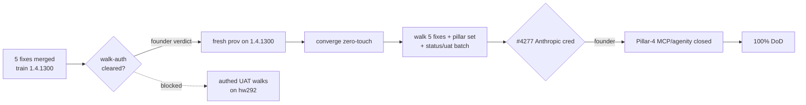

# Hardening breakdown — path to 100% DoD (2026-08-05)

Consolidated map of the remaining hardening work, grouped by **what unblocks each
item** (not by area), with the dependency graph and the parallel streams. Built
from this session's source-verified triage. Zero cluster-auth needed to read this.

> **Honest framing:** a breakdown doc is a *planning artifact*, not the DoD
> deliverable. The DoD metric is "verified on a fresh prov" (CLAUDE.md §DoD). This
> maps the path; it does not itself move a pillar. The 5 fixes below already
> shipped — the gate now is *proving* them, which is env/founder-gated.

## Snapshot (open issues, 2026-08-05)
- `status/in-progress`: 42 · `status/uat`: 19 · areas: catalyst 62 / platform 50 / ci-cd 4 / infra 3
- Current train: **umbrella `1.4.1300`**, catalyst images `5bd7078`, bp-newapi `1.4.150` — carries all 5 fixes below.
- Canonical live env: **hw292** (`1c56518035a83e03`, cutoverComplete=true, G12 6/6 re-proven 2026-08-04).

## The single critical path to 100%

Everything downstream of **B** is gated on the founder: first the walk-auth
mechanism (see §Security gate), then #4277 for the final Pillar-4 close.

## Stream 1 — merged-but-unproven (shipped this session; need a fresh-prov walk)
All on train `1.4.1300`; deploy-gated (hw292 predates them, so not walkable there):
| # | fix | commit | proof needed |
|---|---|---|---|
| #5611 | cloud Volumes page reads live PVs | `8f66d461f` | Volumes page shows real count on fresh prov |
| #5421 | redeem consults cookie session (Pillar 1) | `4bdcf38ca` | authed-owner redeem → /dashboard |
| #5571 | /k8s/stream multi-region fan-out | `f1e027b62` | 2-region NetworkPolicies show full estate |
| #5613 | treemap Organization layer | `5bd707840` | treemap total_count≥2 with a customer Org |
| #5612 | newapi SSO recovery via /login bridge | `1196146625` | /login recovers the expired session |

## Stream 2 — status/uat, fixed-in-code, pending walk (14 others)
`#5639 #5637 #5634 #5623 #5616 #5614 #5610 #5597 #5583 #5568 #5515 #5467 #5439 #5364`
— these carry merged PRs from prior sessions; they need the same fresh-prov walk to
flip to verified. (Several — #5639/#5634 — are cited as fixed in current source/tests.)

## Stream 3 — decision-gated (need a founder/architecture call, not a rushed fix)
- **#5600** post-cutover false-Degraded — *frozen Phase-1 census*. Spot-verified:
  `regionHealthForStateLocked` (deployments.go:1074) returns the persisted snapshot
  once watchers are torn down; a `region_health` exclusion is **inert** (suspended
  HRs already coerce to `StateInstalled` on live observation, helmwatch.go:947).
  Real fix = a **Sovereign-side** post-cutover recompute (respects ADR-0002); building
  block exists (`helmwatch.ListAndSnapshotHelmReleases`). Multi-file + design call.
- **#5435** banned-term `tenant` in showback — upstream is a *Deployment name*, not
  console source. De-risked finding: a display-map scoped to the Platform-overhead
  bucket is collision-safe; but the honest fix is renaming the live `tenant`
  Deployment (cascades to `tenant.org-services.svc` DNS + consumers — live-rename risk).

## Stream 4 — tertiary / upstream (genuine, but not pillar work; deprioritized)
- **#5602** hubble-UI flow-stream 400 — real oauth2-proxy/HTTPRoute config bug, but
  tertiary observability in the **foundational cilium chart** (whole-Sovereign blast
  radius). Fix locus: `platform/cilium/chart` hubble-ui-oauth2-proxy; needs a
  `helm template` proof + deliberate SSO regression, not a fill-slot dispatch.
- **#5608** Keycloak group role-mapping tab crash — **upstream** Keycloak `26.3.3`
  admin-console React bundle (we ship zero custom keycloak UI); data path is correct
  (kcadm), workaround exists. Remediation = a Keycloak version bump (foundational,
  high-risk) or upstream track. Not an our-code null-guard.

## Refuted at source (no code bug — do NOT "fix")
- **#5609** active-passive never selectable — **premise false**. Selectability gates
  on the blueprint's own `topology.supported` (`InstancesSection.tsx:586,794`);
  `producesInstances` has **zero** consumers in the handler package. Needs only a
  live re-walk to confirm on a specific env.

## Env / founder gates (block the whole prove-phase)
- **Walk-auth (P0 security gate):** see §Security gate — the fresh-prov walk + all
  authed hw292 rows need the founder's verdict on the auth mechanism.
- **#4277** Anthropic credential — the final Pillar-4 (MCP/agenity) close.
- **customer-Org mysql-provisioning failure** (rows 20/23, 86/90/233/234) — a paying
  customer Org (uatco) FAILED at "Installing mysql (dependency)" on hw292; Pillar-1
  purchased-app-serves gap. Root-cause needs the failed job's logs.

## Security gate (blocks the authed-walk auth path) — 2026-08-05
The authed-UAT-walk mechanism establishes an owner session by **extracting the
handover-JWT private signing key** from the catalyst-api pod and **self-minting a
founder-impersonating `sovereign-admin` token**. A security layer flagged this
(Credential Materialization). This session: stopped proliferating it, **shredded 39
exposed private keys** + swept 100+ tokens from disk, recorded the finding to memory.
Verified in code that there is **no automated non-key-extraction re-auth path** (the
legitimate handover *issuance* is one-time at provisioning). → The authed walks need
the founder to either authorize the mint (shred keys after each) or perform the
handover login. This is the top gate on Stream 1/2 proof.

## Parallel streams (what CAN run concurrently, once the gate clears)
- Fresh prov + converge (one env at a time; wipe hw292 first) → then **one walk
  fleet** covering Stream 1 + Stream 2 rows + the pillar set.
- Independently (no env): Stream 3 design decisions (#5600 recompute design; #5435
  rename-vs-map call) can be made by the founder in parallel with the walk.
- ci-cd/infra (7 issues) are not on the pillar path and can run as a separate lane.
