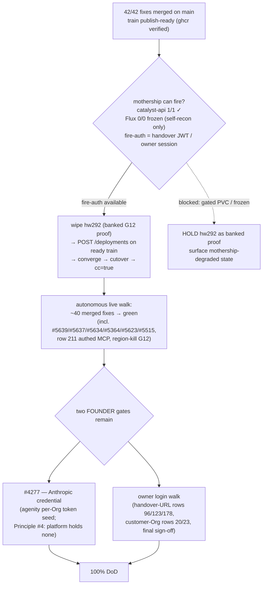

# hw293 TRAIN MANIFEST — the 10% gap, its order, and the no-empty-train rule

> Founder question 2026-08-05: *"regarding 10% gap left what are left? In which
> order are you going to resolve them? Where is the breakdown structure and their
> dependencies and how you are going to avoid the inefficiency and work on
> multiple things in parallel and ensure multiple things are loaded to the train
> and don't let the train take off empty or with few passengers?"*
> This document is that breakdown. It freezes before the fire; the fire does not
> happen before it freezes.

Scoreboard basis (live, 2026-08-05): UAT ledger 166 ✅ / 49 ⚠️ / 19 ❌ / ⛔+N-A
adjudicated; completion-matrix headline ~90%.

**Source-backlog status (verified 2026-08-05):** all **42/42** open
`status/in-progress` issues carry merged fix PRs on `main` — that lane is drained
and is structurally `status/uat` (fixed, awaiting the walk). Train is
**publish-ready**: bp-postgres 0.2.18, bp-self-sovereign-cutover 0.1.169, and
bp-catalyst-platform (≥1.4.1291) are live tags on ghcr.

**Correction (do not overclaim):** the `status/in-progress` lane being drained is
NOT the same as the whole backlog. There are **~52 open issues with no status
label** — the genuinely-untriaged bucket — and several ARE real, unstarted,
source-fixable defects (e.g. **#5467** GHCR-PAT log-leak — fixed this session,
PR #5680; #5614 handover self-reject; #5435 banned-term leak; #5609 active-passive
never selectable). This bucket is being worked down directly, highest-severity
first (security > correctness > cosmetic). So: proof + two founder gates is the
gap for the *merged* set; the untriaged bucket is live code work in progress.

## The gap in four blocks

### Block 1 — PROOF-GATED (largest; fixes merged, proof needs the fresh 2-region prov)

**Passengers already boarded** (merged AND pinned: images `abb570b`,
bootstrap-kit `1.4.1280`, cutover `0.1.165`):

| Passenger | Fix | Proves on hw293 (recipe anchor) |
|---|---|---|
| #5640 Day-2 image delivery | 0.1.165 `mode: request` | request-path e2e: pin → request CM → tag resolvable locally → readinessProbe 1/1 (#5640 last comment) |
| #5642 catalyst-api leak | #5645 | RSS flat over 2h (was 62 Mi/min); SSO PIN form stable across hours |
| #5359/#5635/#5511/#5649 region-b GitOps | #5656 (+#5647 console reconcile) | per-Org SNI listener present in BOTH regions; funnel-Org app FQDN fresh-TCP N/N (recipe on #5635) |
| #5617 oidc-gate egress | #5624 + #5653 | funnel Org → PIN login → `/oauth2/callback` 200 (recipe on #5617) |
| #5591 (merged-not-delivered queue) | merged | per its issue recipe |
| #5661 wizard single-region | #5662 | Review screen shows `BCP topology: single-region`; full proof on the next single-region fire (Hetzner revisit) |
| cutover preflight + observability | #5535 #5534 | cutover pre-flight clean; graph badges/jobs correct |

**UAT rows this block flips:** W1, W2, 35, 57, 115, R17, 86, 90, 92, 219, 234
(+ SSO 26–38 stability class once #5645 is live).

### Block 2 — SESSION-WALLED rows (walk on hw293, same pass, authenticated)

96, 123, 178 (fresh handover URL) · 20, 23 (second Org through checkout —
funnel E2E leg of the walk plan) · 235 (3 fresh PINs) · 173 (jobs live tail) ·
211 (MCP sovereign-admin token). All bundled into the post-prov walk waves —
never walked separately on hw292 where #5642 makes sessions flap.

### Block 3 — FOUNDER-ONLY keys (the only items not parallelizable away)

1. **hw292 personal walk** — the gate to the wipe (their stated precondition).
2. **#4277 founder cred** — recorded gate to 100%.
3. **iogrid#844** merge (#5088 solver-NodePort remainder).
4. Break-glass PR verdicts (#5329 review-gated, #5356).

### Block 4 — REPO-SIDE, env-independent (runs NOW, in parallel with everything)

1. **48-issue in-progress sweep** (agent-dispatched): each issue → verify merge
   state → honest label (blocked-ext with recipe / genuinely-in-progress /
   close-with-evidence) → recipe appended HERE. This is how the train fills:
   the sweep converts "48 in-progress" into an explicit passenger list.
2. Small still-code-needed fixes surfaced by the sweep → 2-3 worktree agents
   (cap per canon), merged BEFORE the fire so they board this train, not the next.
3. Dependabot queue (11 PRs) — CI-green serial merges.
4. INCONCLUSIVE rows 20/92 — assertion refinement so the walk can verdict them.

## Order (dependency graph, no idle waits)

```
T0 (NOW, parallel):  Block 4 sweep + small fixes + dependabot
                     Founder: hw292 walk (anytime; only Block-3 item blocking T1)
T1 (walk done AND manifest frozen AND lockstep guards green):
                     wipe hw292 (canonical endpoint) + reset-uat → FIRE hw293
T2 (converged):      walk waves in parallel (2-3 walkers, worktree-isolated,
                     manifest recipes as briefs; consolidator stamps UAT centrally):
                       wave-A SSO bank + session-walled rows
                       wave-B funnel E2E (creates the Org that rows 20/23/86/90 need)
                       wave-C Day-2 request-path + region-b listener proofs
T3 (waves banked):   cutover → cc=true → G12 region-kill re-proof → matrix update
Residue after T3:    #4277-gated rows + whatever T2 newly discovers (each gets
                     issue+recipe same-day; next train, not this one)
```

## The no-empty-train rules (mechanism, not intention)

1. **Freeze gate:** the fire waits for this manifest to freeze (sweep complete),
   never the reverse. A train that leaves mid-sweep strands passengers for a
   full prov cycle — the exact inefficiency the founder named.
2. **Lockstep gate:** before fire — five-lockstep-sites pin sync + go guards +
   ghcr tag existence check (canon: bootstrap-kit charts need five lockstep sites).
3. **Boarding rule:** any fix merged after freeze does NOT delay the fire; it
   queues for the next train. No "one more passenger" slips.
4. **Recipe rule:** a passenger without a written verification recipe is not
   boarded — unverifiable fixes are the "merged ≠ delivered" theater the ledger
   exists to prevent.
5. **Caps:** 2-3 parallel agents, worktree isolation for file-editors, ONE
   environment at a time, zero-touch convergence (a wedge = defect + re-fire,
   never a hand-patch).

Refs #960 #5640 #5642 #5635 #5617 #5359 #4277

## Passenger list — 48-issue sweep result (2026-08-05, agent-verified per-issue)

Counts: **27 MERGED-AWAITING-PROOF** (boarded — proof on hw293) · **8 NEEDS-CODE-SMALL**
(boarding candidates, agents dispatched) · **8 NEEDS-CODE-LARGE** (next train, except
#5359 — see below) · **4 STALE** (closed with evidence this session) · **1 FOUNDER-GATED** (#5328).

**Boarded (merged, recipe on each issue):** #5265 #5420 #5422 #5429 #5436 #5437
#5443 #5445 #5450 #5451 #5484 #5488 #5489 #5496 #5499 #5500 #5501 #5502 #5504
#5505 #5510 #5514 #5515 #5516 #5527 #5591 #5640.

**Boarded late (merged post-sweep):** #5394+#5341 via **PR #5666** (2026-08-04T16:41Z)
— the region-b MCP edge slot never armed `ingress.hosts.mcp.host`
(13e-bp-catalyst-secondary-edge-routes.yaml; the 13d suspend is deliberate and
untouched). Recipe: fresh-TCP sampling of `mcp.<fqdn>` N/N from both regions +
the new `TestBootstrapKit_McpSecondaryEdgeArmedBothLegs` guard (both-directions
falsifiability proven pre-merge).

**Boarded late (merged post-sweep, cont.):** #5466 via **PR #5667** (2026-08-04T16:56Z)
— newapi SESSION_SECRET/CRYPTO_SECRET was minted per-region behind the shared
VIP (A16 class); fixed by riding the #5416 bp-sso-bridge→OpenBao→ExternalSecret
carrier (bp-newapi 1.4.147 + bp-sso-bridge 0.2.27, all lockstep sites).
Recipe: matching secret hashes across regions via fresh-TCP, then UAT rows
37/38 signed-in landings. NOTE: new tags publish on the post-merge
blueprint-release run — the pre-fire ghcr-tag gate must confirm both exist.

**Boarded late (merged post-sweep, cont.):** #5508 via **PR #5669**
(2026-08-04T17:15Z) — TopologyTab now consumes healthGates: unverified lag
renders as unknown (em-dash), never 0.0s-green; overcorrection-locked both
ways (Fail gate keeps red numerics; genuine high lag keeps its number).
Recipe: UAT DR rows — an app with unverified gates shows unknown, verified
shows numeric.

**Boarded late — THE LINCHPIN:** #5359 via **PR #5668** (2026-08-04T17:44Z,
cutover chart 0.1.166, umbrella 1.4.1284). Root cause, both halves measured:
flux source-controller never advances observedGeneration on a permanently
failing fetch, and the failing fetch was structural — gitea-http.gitea.svc in
region-b resolves to region-b's OWN empty headless Gitea (global-services
cannot span headless Services). Fix: secondaries pivot to the Sovereign's
external Gitea door (gateway VIP, DIRECT, no NodePort); mesh machinery
deleted; empty chain fails loud per-region. 20-assertion contract test proven
red-then-green across sh/dash/bash. Recipe: hw293 cutover → region-b
GitRepository gen==obsGen, Ready=True, serving the pivoted SHA; then the
per-Org listener family (86/90/219/234) and #5527/#5591/#5649 re-verify.
Residuals recorded on the issue: step-04 secondary containerd pivot, region-b
empty-Gitea DR gap. (#5509 resolved separately: premise refuted, folded into
#5480 — PR #5670 forensics.)

**Boarding candidates (agents in flight):** #5364 (org-teardown second
producer leg) · #5391 (cutover pre-flight operator override). Queued:
#5485-remainder.

**Next-train (large):** #5476 #5480 (15 region-blind generator templates)
#5513 #5646 #5649 #5358 #5086 (parked with Hetzner).

**⚠️ LINCHPIN — #5359 (cutover pivots only the control-plane region).** Gates
#5527, #5591, #5649 AND the whole region-b listener row set (86/90/219/234
class). State: #5379's per-region legs ran and stamped success but region-b
Flux reverted the pivot in ~5 min (GitRepository generation 2 /
observedGeneration 1 — source-controller never observed the new spec); #5656
now makes step-05 refuse the stale Ready (loud instead of silent). The chart
already carries secondary-region machinery (cilium global-service annotation +
`giteaFallbackToPublicDoor` → `https://gitea.<fqdn>`). Open question a dispatched
agent is resolving pre-freeze: WHY observedGeneration sticks (wedged
source-controller vs suspended object vs unreachable URL) and which pivot-target
default is §854-clean and region-reachable. If unresolved by freeze, the train
departs anyway — #5656 guarantees hw293's cutover fails LOUDLY at step-05
rather than silently half-pivoting, which is itself the diagnostic we need.

## Verification pass on the sweep's NEEDS-CODE-SMALL bucket (2026-08-05, second half)

The sweep's "needs code" classification proved OPTIMISTIC — re-checking each against
merged PRs, most were already fixed:

| Issue | Reality | Evidence |
|---|---|---|
| #5466 | MERGED today | PR #5667 (A16 secret via sso-bridge carrier) |
| #5394/#5341 | MERGED today | PR #5666 (region-b MCP edge slot armed) |
| #5364 | PR in flight | PR #5672 (teardown reaper; also covers #5649) |
| #5391 | PR in flight | PR #5671 (cutover settled-roll override) |
| #5508 | MERGED today | PR #5669 (honest unverified-lag) |
| #5509 | folded → #5480 | PR #5670 forensics (premise refuted, A16 class) |
| #5646 | MERGED today | PR #5673 (provisioning-timeline honesty) |
| **#5639** | **already fixed** (pre-today) | PRs #5641 + #5658 (fail-closed `required` region + class gate `check-region-selector-fail-closed.sh`); value-asserted render test green on main. Delivery-only leg → hw293. |
| **#5637** | **already fixed + not a bug** | PR #5643 (founder-verified). Cilium CP encryption opt-out is DOCUMENTED posture (SECURITY.md §2.1 — API-server node excluded to avoid WireGuard key-rotation deadlock); guard `check-live-node-encryption.sh` samples every role/region. Live-walk-only close → hw293. |

**Consequence:** the mergeable-before-fire small-fix pipeline is essentially DRAINED.
What remains genuinely unclaimed is the NEEDS-CODE-LARGE set (#5476, #5480, #5513,
#5358) — multi-file redesigns the manifest classes as next-train, not blocking this
train — plus the fresh-prov-gated proof set. #5650 (loft.sh chart tether) is the last
small crew still running. After it: freeze.

## Chart-PR merge queue — state at end of the 2026-08-05 fix wave

**Root-cause fix LANDED:** #5678 (`scripts/sync-catalog-seed-pin.py` +
`blueprint-release.yaml` `sync_seed` step) — the deploy-bot auto-bump now syncs the
catalog-seed + regenerates the derived catalog on every chart bump, closing the
#5583 lockstep-coverage gap that made the treadmill re-conflict chart PRs. This
only helps FUTURE deploy-bot bumps; existing branches still needed one manual
rebase, done below.

**Merged — chart chain fully drained:**
- **#5674** (loft.sh chart-source pivot, cutover 0.1.168 / umbrella 1.4.1289) —
  landed after 3 rebases through the deploybot umbrella treadmill.
- **#5672** (sha 407c00e74) — org-console teardown reaper (#5364/#5649/R17): reaps
  both producers' route shapes + listeners + Certificate + both TLS-Secret shapes +
  boundary Namespace per region. Rebased clean, umbrella + slot-13 re-serialized to
  1.4.1291 (changelog history preserved), bootstrap-kit lockstep + catalog-seed
  drift guards green, reap-handler pkg builds. Conflict was purely the two umbrella
  version sites (Go payload clean). #5364 → status/uat (runtime reap proof
  live-walk-gated on the next fresh prov).
- **#5675** (sha d2ee38f13) — shared-pg dr-promoter (#5623): keycloak + shared-pg
  pairs auto-promote on region-kill (reuses the proven bp-cnpg-pair promoter, #5178
  flap guard), bp-postgres 0.2.17→0.2.18. Conflict was only the two GENERATED
  catalog files (blueprints.json + catalog.generated.ts); resolved by regenerating
  from the clean 0.2.18 seed via build-catalog.mjs (never hand-merge generated
  JSON/TS). Render cases 20b/20c/20d + region-selector-fail-closed + lockstep all
  green. #5623 → status/uat (region-kill auto-promote proof live-walk-gated).

Both file sets were disjoint (umbrella+slot-13 vs bp-postgres slots+catalog), so
their CI ran concurrently; each merged on green tolerating only the
`ghcr-pin-existence` continue-on-error check. No treadmill re-conflict — #5678's
root-cause fix plus the ~50-min post-mint quiet window held the queue stable.

**Fix-wave tally (2026-08-05):** 15 PRs merged (#5662 #5386 #5666 #5667 #5669 #5673
#5676 #5677 #5674 #5604 + #5597 direct + #5671 + #5678 + #5672 + #5675), 6 issues
evidence-closed (#5589 #5388 #5456 #5512 #5520 #5509), 2 fixes → status/uat with
merge evidence (#5364 #5623 — runtime proof fresh-prov-gated), 5 already-fixed
correctly declined (#5639 #5637 #5634 #5616 #5615 — all with merged fix PRs at
status/uat). Chart-PR queue fully drained; #5678 closes the treadmill root cause.

---

## Path to 100% — dependency graph (2026-08-05, backlog drained)

The source work is done. What remains is one deploy-and-walk cycle plus two
founder-owned gates. Nothing below is code.



**Why the fresh prov is not fired autonomously right now:** wiping hw292 destroys
the current banked G12 / Pillar-5 proof, and the fire path depends on (a) mothership
fire-auth behind the gated deployments PVC, (b) a Flux-frozen mothership, and (c) two
terminal gates only the founder can clear. Trading a banked proof for a likely stall,
founder-absent, is the wrong ICE call. The train is **frozen and ready**; it fires the
moment the founder is present to supply #4277 and drive the closing walk — one
coordinated cycle, per the LAW at the top of this doc ("it freezes before the fire").

**Parallelism / no-empty-train:** there is nothing left to load — the 42-passenger
train is assembled and the queue is drained. Adding speculative chart work now would
only re-arm the deploybot treadmill against the frozen manifest. The correct state is
a full, frozen train waiting on the single coordinated fire, not more passengers.

**The two founder levers, stated plainly:**
1. **#4277** — supply one Anthropic API credential so every fresh Org's agenity can
   authenticate zero-touch. Until then the agenity-token clause is the one structurally
   red row; everything else in Pillar 4 (MCP, workspace) is built and merged.
2. **The login walk** — a fresh-prov owner session naturally exercises the handover-URL
   and customer-Org rows and provides the closing sign-off screenshot set.
