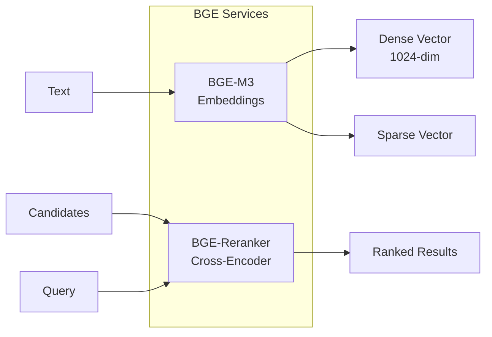

# BGE

BAAI General Embedding models for text embeddings and reranking.

**Status:** Accepted | **Updated:** 2026-02-07

---

## Overview

BGE provides state-of-the-art text embeddings and reranking for RAG systems, supporting multilingual (including Arabic) and hybrid sparse+dense retrieval.



---

## Models

| Model | Purpose | Dimensions |
|-------|---------|------------|
| **BGE-M3** | Multilingual embeddings | 1024 (dense) + sparse |
| **BGE-Reranker-v2-M3** | Cross-encoder reranking | - |

---

## Why BGE?

| Feature | Benefit |
|---------|---------|
| Multilingual | Arabic + English support |
| Hybrid retrieval | Dense + sparse vectors |
| High accuracy | MTEB benchmark leader |
| Reranking | Precision improvement |
| Self-hosted | Data sovereignty |

---

## Deployment

### BGE-M3 Embeddings

```yaml
apiVersion: apps/v1
kind: Deployment
metadata:
  name: bge-m3
  namespace: ai-hub
spec:
  replicas: 1
  template:
    spec:
      containers:
        - name: bge-m3
          image: harbor.<domain>/ai-hub/bge-m3:latest
          ports:
            - containerPort: 8080
          env:
            - name: MODEL_ID
              value: "BAAI/bge-m3"
          resources:
            requests:
              cpu: "2"
              memory: 4Gi
              nvidia.com/gpu: "1"
```

### BGE Reranker

```yaml
apiVersion: apps/v1
kind: Deployment
metadata:
  name: bge-reranker
  namespace: ai-hub
spec:
  replicas: 1
  template:
    spec:
      containers:
        - name: bge-reranker
          image: harbor.<domain>/ai-hub/bge-reranker:latest
          ports:
            - containerPort: 8080
          env:
            - name: MODEL_ID
              value: "BAAI/bge-reranker-v2-m3"
          resources:
            requests:
              cpu: "1"
              memory: 2Gi
              nvidia.com/gpu: "1"
```

---

## API Endpoints

### Embeddings

```bash
curl -X POST http://bge-m3.ai-hub.svc:8080/embed \
  -H "Content-Type: application/json" \
  -d '{
    "texts": ["Hello world", "مرحبا بالعالم"],
    "return_sparse": true
  }'
```

Response:
```json
{
  "dense": [[0.123, 0.456, ...], [0.789, 0.012, ...]],
  "sparse": [{"token_id": 1234, "weight": 0.5}, ...]
}
```

### Reranking

```bash
curl -X POST http://bge-reranker.ai-hub.svc:8080/rerank \
  -H "Content-Type: application/json" \
  -d '{
    "query": "What is AML?",
    "documents": [
      "Anti-Money Laundering guidelines...",
      "Machine Learning tutorial...",
      "AML compliance requirements..."
    ]
  }'
```

Response:
```json
{
  "scores": [0.95, 0.12, 0.89],
  "ranked_indices": [0, 2, 1]
}
```

---

## LangChain Integration

```python
from langchain_community.embeddings import HuggingFaceInferenceAPIEmbeddings

embeddings = HuggingFaceInferenceAPIEmbeddings(
    api_url="http://bge-m3.ai-hub.svc:8080/embed",
    model_name="BAAI/bge-m3"
)

# Generate embeddings
vectors = embeddings.embed_documents(["Hello", "World"])
```

---

## Hybrid Retrieval

```python
# Dense + Sparse search in Milvus
from pymilvus import AnnSearchRequest, WeightedRanker

# Get embeddings
response = requests.post(
    "http://bge-m3.ai-hub.svc:8080/embed",
    json={"texts": [query], "return_sparse": True}
)
dense_vec = response.json()["dense"][0]
sparse_vec = response.json()["sparse"][0]

# Parallel search
dense_req = AnnSearchRequest(dense_vec, "dense_vector", {"metric_type": "COSINE"}, 20)
sparse_req = AnnSearchRequest(sparse_vec, "sparse_vector", {"metric_type": "IP"}, 20)

# Combine results
results = collection.hybrid_search(
    [dense_req, sparse_req],
    rerank=WeightedRanker(0.7, 0.3),
    limit=10
)
```

---

## Performance Tuning

| Parameter | Description | Default |
|-----------|-------------|---------|
| `max_batch_size` | Max texts per request | 32 |
| `max_length` | Max token length | 8192 |
| `normalize` | L2 normalize vectors | true |

---

## Monitoring

| Metric | Query |
|--------|-------|
| Embed latency | `bge_embed_duration_seconds` |
| Rerank latency | `bge_rerank_duration_seconds` |
| Batch size | `bge_batch_size` |
| GPU memory | `nvidia_gpu_memory_used_bytes` |

---

## Consequences

**Positive:**
- State-of-the-art embeddings
- Multilingual support (Arabic)
- Hybrid dense + sparse
- Cross-encoder reranking
- Self-hosted

**Negative:**
- GPU required for performance
- Memory-intensive
- Batch size limits

---

*Part of [OpenOva](https://openova.io)*
