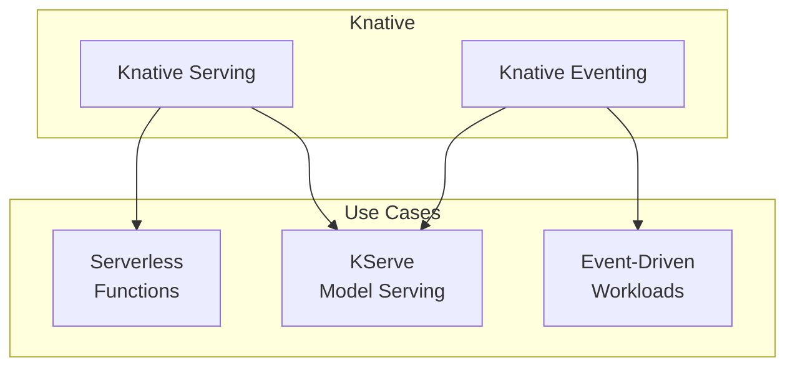

# Knative

Serverless platform for Kubernetes with scale-to-zero and event-driven capabilities.

**Status:** Accepted | **Updated:** 2026-02-07

---

## Overview

Knative provides serverless capabilities on Kubernetes. Used independently for event-driven workloads and as the foundation for KServe model serving.



---

## Components

| Component | Purpose |
|-----------|---------|
| **Knative Serving** | Request-driven compute, scale-to-zero |
| **Knative Eventing** | Event-driven architecture, CloudEvents |

---

## Why Knative?

| Feature | Benefit |
|---------|---------|
| Scale-to-zero | Cost savings for idle workloads |
| Auto-scaling | Handles traffic spikes automatically |
| Revisions | Traffic splitting, canary deployments |
| CloudEvents | Standard event format |
| KServe foundation | Required for ML model serving |

---

## Configuration

### Helm Values

```yaml
knative-serving:
  enabled: true
  config:
    network:
      ingress-class: "cilium"
      domain-template: "{{.Name}}.{{.Namespace}}.{{.Domain}}"
    autoscaler:
      enable-scale-to-zero: "true"
      scale-to-zero-grace-period: "30s"
      stable-window: "60s"

knative-eventing:
  enabled: true
  config:
    default-ch-webhook:
      default-ch-config: |
        clusterDefault:
          apiVersion: messaging.knative.dev/v1
          kind: InMemoryChannel
```

---

## Knative Service Example

```yaml
apiVersion: serving.knative.dev/v1
kind: Service
metadata:
  name: my-service
  namespace: default
spec:
  template:
    metadata:
      annotations:
        autoscaling.knative.dev/min-scale: "0"
        autoscaling.knative.dev/max-scale: "10"
    spec:
      containers:
        - image: harbor.<domain>/my-app:latest
          ports:
            - containerPort: 8080
          resources:
            requests:
              cpu: 100m
              memory: 128Mi
```

---

## Traffic Splitting

```yaml
apiVersion: serving.knative.dev/v1
kind: Service
metadata:
  name: my-service
spec:
  template:
    metadata:
      name: my-service-v2
    spec:
      containers:
        - image: harbor.<domain>/my-app:v2
  traffic:
    - revisionName: my-service-v1
      percent: 90
    - revisionName: my-service-v2
      percent: 10
```

---

## Event-Driven Architecture

```yaml
apiVersion: eventing.knative.dev/v1
kind: Broker
metadata:
  name: default
  namespace: default
---
apiVersion: eventing.knative.dev/v1
kind: Trigger
metadata:
  name: my-trigger
spec:
  broker: default
  filter:
    attributes:
      type: my.event.type
  subscriber:
    ref:
      apiVersion: serving.knative.dev/v1
      kind: Service
      name: my-service
```

---

## Integration with Cilium

Knative uses Cilium as the ingress class:

```yaml
config:
  network:
    ingress-class: "cilium"
```

---

## Monitoring

| Metric | Query |
|--------|-------|
| Request count | `revision_request_count` |
| Request latency | `revision_request_latencies` |
| Pod count | `autoscaler_actual_pods` |
| Desired pods | `autoscaler_desired_pods` |

---

## Consequences

**Positive:**
- Scale-to-zero reduces costs
- Automatic scaling for traffic spikes
- Foundation for KServe model serving
- Event-driven architecture support
- Traffic splitting for canary deployments

**Negative:**
- Cold start latency for scale-to-zero
- Additional complexity
- Requires understanding of Knative concepts

---

*Part of [OpenOva](https://openova.io)*
