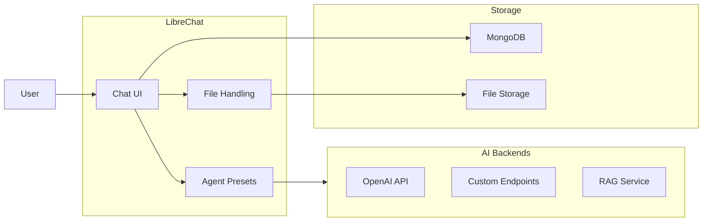
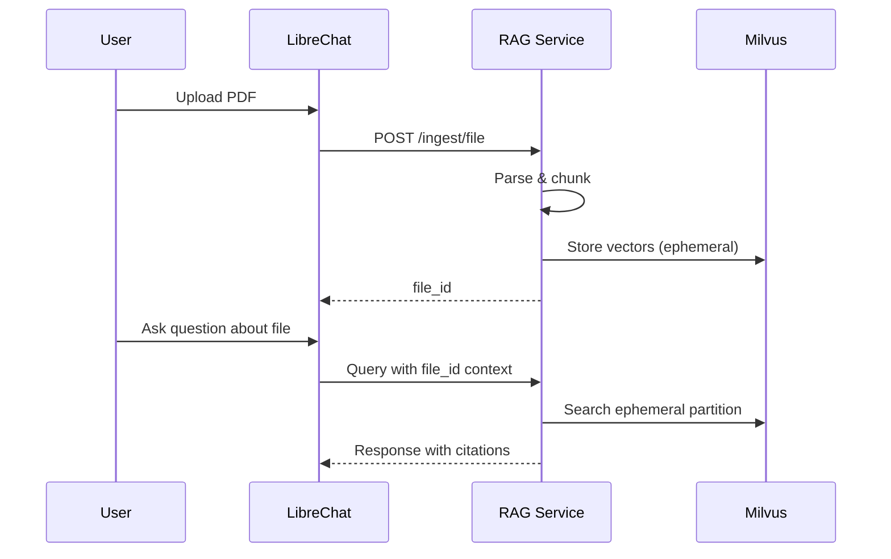

# LibreChat

Open-source chat UI with multi-model support and file uploads.

**Status:** Accepted | **Updated:** 2026-02-07

---

## Overview

LibreChat provides a ChatGPT-like interface supporting multiple AI backends, file uploads, and customizable agent presets.



---

## Why LibreChat?

| Feature | Benefit |
|---------|---------|
| Multi-model | Switch between AI backends |
| Agent presets | Pre-configured assistants |
| File uploads | Document analysis |
| Conversation history | Persistent chat storage |
| SSO integration | Enterprise authentication |

---

## Configuration

### Helm Values

```yaml
librechat:
  replicas: 2

  config:
    endpoints:
      custom:
        - name: "AI Hub"
          apiKey: "${RAG_SERVICE_API_KEY}"
          baseURL: "http://rag-service.ai-hub.svc:8000/v1"
          models:
            default: ["deep-thinker", "quick-thinker", "compliance-advisor"]
          titleModel: "quick-thinker"
          dropParams: ["stop", "user"]

    registration:
      socialLogins: ["openid"]

    fileConfig:
      endpoints:
        custom:
          fileLimit: 10
          fileSizeLimit: 50  # MB
          supportedMimeTypes:
            - "application/pdf"
            - "application/vnd.openxmlformats-officedocument.wordprocessingml.document"
            - "text/plain"

mongodb:
  enabled: true
  auth:
    rootPassword: ""  # From ESO
  persistence:
    size: 10Gi
```

---

## Agent Presets

### Deep Thinker

```json
{
  "name": "Deep Thinker",
  "model": "deep-thinker",
  "description": "Complex reasoning with visible chain-of-thought",
  "systemPrompt": "You are a thoughtful analyst. Think step by step and show your reasoning.",
  "temperature": 0.7,
  "maxTokens": 8192
}
```

### Quick Thinker

```json
{
  "name": "Quick Thinker",
  "model": "quick-thinker",
  "description": "Fast responses for simple queries",
  "systemPrompt": "You are a helpful assistant. Be concise and direct.",
  "temperature": 0.3,
  "maxTokens": 2048
}
```

### Compliance Advisor

```json
{
  "name": "Compliance Advisor",
  "model": "compliance-advisor",
  "description": "Regulatory knowledge with citations",
  "systemPrompt": "You are a compliance expert. Always cite your sources with document references.",
  "temperature": 0.1,
  "maxTokens": 4096
}
```

---

## SSO Configuration

### Azure AD OIDC

```yaml
socialLogins:
  - openid

openidConfig:
  issuer: "https://login.microsoftonline.com/${TENANT_ID}/v2.0"
  clientId: "${CLIENT_ID}"
  clientSecret: "${CLIENT_SECRET}"
  scope: ["openid", "profile", "email"]
  callbackURL: "https://chat.ai-hub.<domain>/oauth/openid/callback"
```

### Keycloak

```yaml
openidConfig:
  issuer: "https://keycloak.<domain>/realms/ai-hub"
  clientId: "librechat"
  clientSecret: ""  # From ESO
  scope: ["openid", "profile", "email"]
```

---

## File Upload Flow



---

## Environment Variables

| Variable | Purpose |
|----------|---------|
| `MONGO_URI` | MongoDB connection string |
| `OPENID_CLIENT_ID` | SSO client ID |
| `OPENID_CLIENT_SECRET` | SSO client secret |
| `CREDS_KEY` | Encryption key for credentials |
| `CREDS_IV` | Encryption IV |
| `JWT_SECRET` | JWT signing secret |

---

## Custom Endpoints

```yaml
endpoints:
  custom:
    - name: "RAG Service"
      baseURL: "http://rag-service.ai-hub.svc:8000/v1"
      apiKey: "${API_KEY}"
      models:
        default:
          - deep-thinker
          - quick-thinker
          - compliance-advisor
          - aiops-advisor
          - dev-advisor
          - internet-search
```

---

## Monitoring

| Metric | Description |
|--------|-------------|
| Active users | Concurrent chat sessions |
| Message count | Total messages sent |
| File uploads | Documents processed |
| Response time | Backend latency |

---

## Consequences

**Positive:**
- ChatGPT-like experience
- Multi-model switching
- File upload support
- Enterprise SSO
- Customizable presets

**Negative:**
- Requires MongoDB
- Complex configuration
- UI customization limited

---

*Part of [OpenOva](https://openova.io)*
