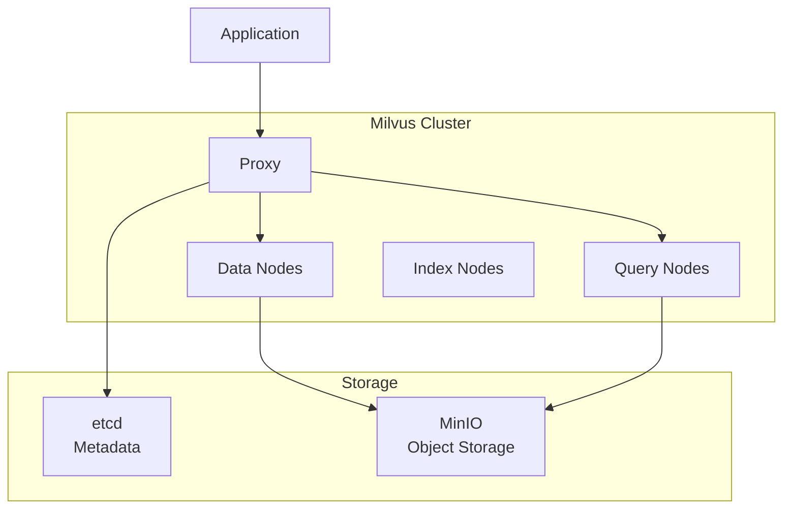

# Milvus

Vector database for similarity search and AI applications.

**Status:** Accepted | **Updated:** 2026-02-07

---

## Overview

Milvus provides high-performance vector similarity search for RAG, recommendation systems, and AI applications.



---

## Why Milvus?

| Feature | Benefit |
|---------|---------|
| Billion-scale vectors | Enterprise-grade scalability |
| Hybrid search | Dense + sparse vectors |
| Multiple indexes | IVF, HNSW, DiskANN |
| GPU acceleration | Optional GPU indexing |
| Cloud-native | Kubernetes-native deployment |

---

## Use Cases

| Use Case | Description |
|----------|-------------|
| RAG | Document chunk retrieval |
| Semantic search | Natural language queries |
| Recommendation | Similar item retrieval |
| Image search | Visual similarity |
| Anomaly detection | Outlier identification |

---

## Configuration

### Helm Values

```yaml
cluster:
  enabled: true

etcd:
  replicaCount: 3
  persistence:
    size: 10Gi

minio:
  enabled: false  # Use external MinIO
  externalS3:
    enabled: true
    host: minio.minio-system.svc
    port: 9000
    accessKey: ""  # From ESO
    secretKey: ""  # From ESO
    bucketName: milvus

proxy:
  replicas: 2
  resources:
    requests:
      cpu: 500m
      memory: 1Gi

queryNode:
  replicas: 2
  resources:
    requests:
      cpu: 1
      memory: 4Gi

dataNode:
  replicas: 2
  resources:
    requests:
      cpu: 500m
      memory: 2Gi

indexNode:
  replicas: 1
  resources:
    requests:
      cpu: 1
      memory: 4Gi
```

---

## Collection Schema

```python
from pymilvus import Collection, FieldSchema, CollectionSchema, DataType

fields = [
    FieldSchema(name="id", dtype=DataType.VARCHAR, max_length=64, is_primary=True),
    FieldSchema(name="document_id", dtype=DataType.VARCHAR, max_length=64),
    FieldSchema(name="chunk_index", dtype=DataType.INT64),
    FieldSchema(name="text", dtype=DataType.VARCHAR, max_length=65535),
    FieldSchema(name="source", dtype=DataType.VARCHAR, max_length=32),
    FieldSchema(name="dense_vector", dtype=DataType.FLOAT_VECTOR, dim=1024),
    FieldSchema(name="sparse_vector", dtype=DataType.SPARSE_FLOAT_VECTOR),
]

schema = CollectionSchema(fields, description="Document chunks")
collection = Collection("documents", schema)
```

---

## Index Types

| Index | Use Case | Memory |
|-------|----------|--------|
| **HNSW** | High recall, fast query | High |
| **IVF_FLAT** | Balanced | Medium |
| **IVF_SQ8** | Memory-efficient | Low |
| **DiskANN** | Billion-scale | Disk-based |
| **GPU_IVF_FLAT** | GPU-accelerated | GPU memory |

### Create Index

```python
index_params = {
    "metric_type": "COSINE",
    "index_type": "HNSW",
    "params": {"M": 16, "efConstruction": 256}
}
collection.create_index("dense_vector", index_params)
```

---

## Hybrid Search

Combine dense and sparse vectors:

```python
from pymilvus import AnnSearchRequest, WeightedRanker

# Dense search
dense_req = AnnSearchRequest(
    data=[dense_vector],
    anns_field="dense_vector",
    param={"metric_type": "COSINE", "params": {"ef": 64}},
    limit=20
)

# Sparse search
sparse_req = AnnSearchRequest(
    data=[sparse_vector],
    anns_field="sparse_vector",
    param={"metric_type": "IP"},
    limit=20
)

# Combine with weighted ranker
results = collection.hybrid_search(
    [dense_req, sparse_req],
    rerank=WeightedRanker(0.7, 0.3),
    limit=10
)
```

---

## Partition Strategy

```python
# Partition by source for isolation
collection.create_partition("compliance")
collection.create_partition("infrastructure")
collection.create_partition("ephemeral")

# Query specific partition
results = collection.search(
    data=[query_vector],
    anns_field="dense_vector",
    partition_names=["compliance"],
    limit=10
)
```

---

## Monitoring

| Metric | Query |
|--------|-------|
| Query latency | `milvus_proxy_search_latency` |
| Insert rate | `milvus_datanode_flush_buffer_op_total` |
| Memory usage | `milvus_querynode_memory_usage` |
| Collection size | `milvus_datacoord_stored_binlog_size` |

---

## Backup

Via Velero with MinIO storage:

```yaml
# Milvus data is stored in MinIO
# MinIO is backed up via Velero to Archival S3
```

---

## Consequences

**Positive:**
- Billion-scale vector search
- Hybrid dense + sparse search
- Multiple index types
- Kubernetes-native
- Active community

**Negative:**
- Complex distributed architecture
- Resource-intensive for large collections
- Learning curve

---

*Part of [OpenOva](https://openova.io)*
