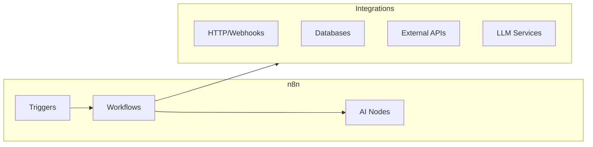

# n8n

Workflow automation platform with AI integrations.

**Status:** Accepted | **Updated:** 2026-02-07

---

## Overview

n8n provides visual workflow automation with native AI/LLM integrations for building intelligent automation pipelines.



---

## Why n8n?

| Feature | Benefit |
|---------|---------|
| Visual workflows | No-code automation |
| AI nodes | Native LLM integration |
| Self-hosted | Data sovereignty |
| 400+ integrations | Connect everything |
| SSO support | Enterprise authentication |

---

## Use Cases in AI Hub

| Use Case | Description |
|----------|-------------|
| Document processing | Ingest → Extract → Enrich |
| Alert workflows | AI-powered notifications |
| Data pipelines | ETL with LLM enrichment |
| Chatbot backends | Complex conversation flows |

---

## Configuration

### Helm Values

```yaml
n8n:
  replicas: 1

  config:
    executions:
      mode: queue
      timeout: 3600
      saveDataOnError: all
      saveDataOnSuccess: all

  env:
    N8N_PROTOCOL: https
    N8N_HOST: n8n.ai-hub.<domain>
    N8N_ENCRYPTION_KEY: ""  # From ESO
    N8N_USER_MANAGEMENT_JWT_SECRET: ""  # From ESO

  persistence:
    enabled: true
    size: 10Gi

  postgresql:
    enabled: true
    auth:
      password: ""  # From ESO
```

---

## SSO Configuration

### Azure AD

```yaml
env:
  N8N_SSO_ENABLED: "true"
  N8N_SSO_PROVIDER: "oidc"
  N8N_SSO_OIDC_ISSUER: "https://login.microsoftonline.com/${TENANT_ID}/v2.0"
  N8N_SSO_OIDC_CLIENT_ID: "${CLIENT_ID}"
  N8N_SSO_OIDC_CLIENT_SECRET: "${CLIENT_SECRET}"
```

### Keycloak

```yaml
env:
  N8N_SSO_OIDC_ISSUER: "https://keycloak.<domain>/realms/ai-hub"
  N8N_SSO_OIDC_CLIENT_ID: "n8n"
```

---

## AI Workflow Example

### Document Enrichment Pipeline

```json
{
  "name": "Document Enrichment",
  "nodes": [
    {
      "name": "Webhook Trigger",
      "type": "n8n-nodes-base.webhook",
      "parameters": {
        "path": "enrich-document",
        "method": "POST"
      }
    },
    {
      "name": "Extract Text",
      "type": "n8n-nodes-base.httpRequest",
      "parameters": {
        "url": "http://unstructured.ai-hub.svc:8000/general/v0/general",
        "method": "POST"
      }
    },
    {
      "name": "LLM Analysis",
      "type": "@n8n/n8n-nodes-langchain.lmChatOpenAi",
      "parameters": {
        "model": "qwen3-32b",
        "baseUrl": "http://langserve.ai-hub.svc:8000/v1",
        "prompt": "Extract key entities and relationships from: {{$json.text}}"
      }
    },
    {
      "name": "Store in Neo4j",
      "type": "n8n-nodes-base.neo4j",
      "parameters": {
        "query": "CREATE (d:Document {id: $id, entities: $entities})"
      }
    }
  ]
}
```

---

## LLM Integration

```yaml
# Connect to internal LLM via LangServe
credentials:
  openAiApi:
    apiKey: "${LANGSERVE_API_KEY}"
    baseUrl: "http://langserve.ai-hub.svc:8000/v1"
```

---

## Monitoring

| Metric | Description |
|--------|-------------|
| Workflow executions | Total runs |
| Execution time | Duration per workflow |
| Error rate | Failed executions |
| Active workflows | Running count |

---

## Consequences

**Positive:**
- Visual workflow builder
- Native AI/LLM nodes
- Self-hosted (data control)
- Extensive integrations
- Queue-based execution

**Negative:**
- Learning curve
- Resource usage for complex workflows
- PostgreSQL dependency

---

*Part of [OpenOva](https://openova.io)*
