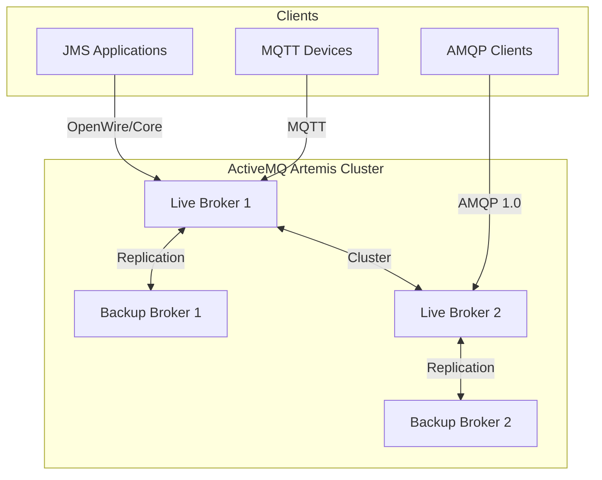
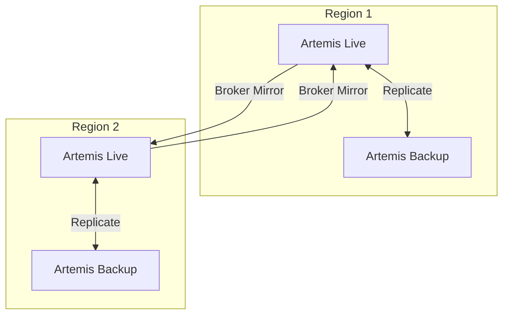

# Apache ActiveMQ Artemis

JMS-compliant high-performance message broker for enterprise Java workloads.

**Status:** Accepted | **Updated:** 2026-02-09

---

## Overview

Apache ActiveMQ Artemis is a high-performance, non-blocking message broker that implements the Java Message Service (JMS) specification. Licensed under the Apache License 2.0, Artemis is the next-generation ActiveMQ broker, built on a proven non-blocking architecture that delivers predictable latency and high throughput. It serves as the upstream project for Red Hat AMQ, making it the standard migration path for enterprises moving off commercial JMS infrastructure.

In the OpenOva platform, ActiveMQ Artemis is offered as an a la carte component for workloads with JMS dependencies, which are particularly common in banking, insurance, and government systems. Many enterprise Java applications rely on JMS for transactional messaging, and replacing the broker protocol is often impractical. Artemis provides a modern, Kubernetes-native deployment option without requiring application changes.

Artemis supports a broad range of protocols including JMS 2.0, AMQP 1.0, STOMP, MQTT, and the legacy OpenWire protocol, enabling it to serve as a drop-in replacement for both ActiveMQ Classic and Red Hat AMQ deployments. The ArtemisCloud Operator manages the full lifecycle on Kubernetes.

---

## Architecture

### Single Region



### Multi-Region (Mirroring)



---

## Why ActiveMQ Artemis?

| Factor | ActiveMQ Artemis | RabbitMQ | Strimzi/Kafka |
|--------|-----------------|----------|---------------|
| Primary use case | JMS enterprise messaging | Task queues, RPC | Event streaming, CDC |
| JMS support | Full JMS 2.0 | Not supported | Not supported |
| OpenWire protocol | Yes (AMQ Classic compat) | No | No |
| Architecture | Non-blocking, journal-based | Erlang BEAM | Partition-based log |
| Transactions | Full XA/JTA support | Limited | Not supported |
| Message groups | Native | Not supported | Partition-based |
| License | Apache 2.0 | MPL 2.0 | Apache 2.0 |
| Red Hat AMQ migration | Direct replacement | Requires rewrite | Requires rewrite |

**Decision:** ActiveMQ Artemis is the choice for workloads with JMS dependencies, XA transaction requirements, or migration from Red Hat AMQ / ActiveMQ Classic. For non-JMS workloads, prefer RabbitMQ (task queues) or Kafka via Strimzi (event streaming).

---

## Key Features

| Feature | Description |
|---------|-------------|
| JMS 2.0 | Full Java Message Service specification compliance |
| Multi-Protocol | JMS (Core/OpenWire), AMQP 1.0, STOMP, MQTT 3.1.1/5.0 |
| Non-Blocking I/O | Journal-based persistence with predictable latency |
| XA Transactions | Distributed transaction support for enterprise workflows |
| Message Groups | Ordered processing with consumer affinity |
| Last Value Queues | Only the latest message per key is retained |
| Broker Mirroring | Asynchronous cross-region data replication |
| Scheduled Delivery | Delayed and scheduled message dispatch |
| Large Messages | Streaming support for messages exceeding memory |
| Diverts | Route copies of messages to secondary destinations |

---

## Configuration

### Artemis Broker (ArtemisCloud Operator)

```yaml
apiVersion: broker.amq.io/v1beta1
kind: ActiveMQArtemis
metadata:
  name: artemis
  namespace: messaging
spec:
  deploymentPlan:
    size: 2
    image: quay.io/artemiscloud/activemq-artemis-broker:2.33.0
    persistenceEnabled: true
    journalType: aio
    messageMigration: true
    storage:
      size: 50Gi
      storageClassName: <storage-class>
    resources:
      requests:
        cpu: 500m
        memory: 2Gi
      limits:
        cpu: 2
        memory: 4Gi
  acceptors:
    - name: all-protocols
      port: 61616
      protocols: core,amqp,stomp,mqtt,openwire
      sslEnabled: false
    - name: amqp
      port: 5672
      protocols: amqp
      sslEnabled: true
      sslSecret: artemis-tls
  console:
    expose: true
  adminUser: admin
  adminPassword:
    secretKeyRef:
      name: artemis-admin-credentials
      key: password
```

### Address Configuration

```yaml
apiVersion: broker.amq.io/v1beta1
kind: ActiveMQArtemisAddress
metadata:
  name: orders-address
  namespace: messaging
spec:
  addressName: orders
  queueName: orders
  routingType: anycast
  queueConfiguration:
    durable: true
    maxConsumers: 10
    purgeOnNoConsumers: false
    deadLetterAddress: DLQ
    expiryAddress: ExpiryQueue
    maxDeliveryAttempts: 5
    redeliveryDelay: 5000
```

### High Availability (Live/Backup Pair)

```yaml
apiVersion: broker.amq.io/v1beta1
kind: ActiveMQArtemis
metadata:
  name: artemis-ha
  namespace: messaging
spec:
  deploymentPlan:
    size: 4
    clustered: true
    persistenceEnabled: true
    journalType: aio
  ha:
    enabled: true
    policy: shared-store
    role: live-only
    replicationPolicy:
      type: replication
      quorumSize: 3
```

---

## Migration from Red Hat AMQ

| Red Hat AMQ | OpenOva Artemis |
|-------------|-----------------|
| AMQ Broker 7.x | Artemis 2.33+ (upstream) |
| AMQ Operator | ArtemisCloud Operator |
| OpenWire clients | No change required |
| JMS connections | No change required |
| JNDI lookups | Update connection factory URLs |
| SSL certificates | Migrate to cert-manager |
| Monitoring | Replace JMX with Prometheus metrics |

---

## Monitoring

| Metric | Description |
|--------|-------------|
| `artemis_message_count` | Messages in queue |
| `artemis_messages_added` | Total messages enqueued |
| `artemis_consumer_count` | Active consumers |
| `artemis_delivering_count` | Messages in-flight |
| `artemis_address_memory_usage` | Address memory consumption |
| `artemis_connection_count` | Active broker connections |

---

## Consequences

**Positive:**
- Direct migration path from Red Hat AMQ and ActiveMQ Classic
- Full JMS 2.0 and XA transaction support for enterprise Java workloads
- Non-blocking architecture delivers consistent low latency under load
- Multi-protocol support enables gradual migration from legacy protocols
- Broker mirroring provides cross-region data replication

**Negative:**
- JVM-based broker requires tuning for garbage collection and heap sizing
- ArtemisCloud Operator is less mature than RabbitMQ Cluster Operator
- Smaller community compared to RabbitMQ for non-Java ecosystems
- Broker mirroring is asynchronous and may lose messages during failover

---

*Part of [OpenOva](https://openova.io)*
