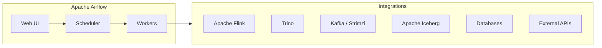

# Apache Airflow

Data pipeline orchestration and workflow automation.

**Status:** Accepted | **Updated:** 2026-02-09

---

## Overview

Apache Airflow is the industry standard for data pipeline orchestration and workflow automation. Licensed under Apache 2.0. Airflow replaces n8n, which changed to the Sustainable Use License (non-open-source).

Airflow provides:
- **DAG-based workflows** for defining complex data pipelines as directed acyclic graphs
- **Scheduling** with cron-like expressions, data-aware scheduling, and backfill support
- **Extensive operator library** with hundreds of pre-built operators for integrating with cloud services, databases, and APIs
- **Web UI** for monitoring, triggering, and debugging workflows
- **Kubernetes-native execution** via KubernetesExecutor for dynamic task scaling



---

## Why Apache Airflow

| Factor | Detail |
|--------|--------|
| License | Apache 2.0 |
| Maturity | Industry standard for data orchestration |
| Community | Apache Software Foundation, massive ecosystem |
| DAGs | Python-defined pipelines (code-first) |
| Operators | 1000+ pre-built operators and hooks |
| Scheduling | Cron, data-aware, event-driven triggers |
| Reason for switch | n8n changed to Sustainable Use License |

---

## Use Cases

| Use Case | Description |
|----------|-------------|
| Data pipelines | ETL/ELT with scheduling and dependency management |
| ML workflows | Model training, evaluation, and deployment pipelines |
| CDC orchestration | Coordinate Debezium, Kafka, and sink connectors |
| Analytics | Scheduled queries via Trino, dbt, or Flink |
| Data lakehouse | Part of OpenOva Titan (Data Lakehouse product) |

Airflow is a core component of the **OpenOva Titan** data lakehouse platform but is also usable standalone for general-purpose workflow orchestration.

---

## Configuration

### Helm Values

```yaml
airflow:
  executor: KubernetesExecutor

  webserver:
    replicas: 1
    defaultUser:
      enabled: false  # Use SSO via Keycloak

  scheduler:
    replicas: 2

  config:
    AIRFLOW__CORE__DAGS_FOLDER: /opt/airflow/dags
    AIRFLOW__CORE__EXECUTOR: KubernetesExecutor
    AIRFLOW__CORE__LOAD_EXAMPLES: "False"
    AIRFLOW__WEBSERVER__EXPOSE_CONFIG: "False"
    AIRFLOW__WEBSERVER__BASE_URL: "https://airflow.<domain>"

  postgresql:
    enabled: true
    auth:
      password: ""  # From ESO

  persistence:
    enabled: true
    size: 10Gi

  ingress:
    enabled: true
    ingressClassName: cilium
    hosts:
      - host: airflow.<domain>
```

---

## SSO Configuration

### Keycloak

```python
# webserver_config.py
from airflow.www.fab_security.manager import AUTH_OAUTH

AUTH_TYPE = AUTH_OAUTH
OAUTH_PROVIDERS = [
    {
        "name": "keycloak",
        "icon": "fa-key",
        "token_key": "access_token",
        "remote_app": {
            "client_id": "airflow",
            "client_secret": "${CLIENT_SECRET}",  # From ESO
            "server_metadata_url": "https://keycloak.<domain>/realms/platform/.well-known/openid-configuration",
            "api_base_url": "https://keycloak.<domain>/realms/platform/protocol/openid-connect",
            "client_kwargs": {"scope": "openid email profile"},
        },
    }
]
```

---

## DAG Example

### Data Pipeline with Flink and Trino

```python
from airflow import DAG
from airflow.providers.cncf.kubernetes.operators.kubernetes_pod import KubernetesPodOperator
from airflow.providers.apache.flink.operators.flink_kubernetes import FlinkKubernetesOperator
from airflow.providers.trino.operators.trino import TrinoOperator
from datetime import datetime, timedelta

default_args = {
    "owner": "platform",
    "retries": 2,
    "retry_delay": timedelta(minutes=5),
}

with DAG(
    "data_lakehouse_pipeline",
    default_args=default_args,
    schedule="0 */6 * * *",
    start_date=datetime(2026, 1, 1),
    catchup=False,
    tags=["titan", "lakehouse"],
) as dag:

    ingest = FlinkKubernetesOperator(
        task_id="flink_ingest",
        application_file="flink-ingest-job.yaml",
        namespace="data",
    )

    transform = TrinoOperator(
        task_id="trino_transform",
        trino_conn_id="trino_default",
        sql="CALL iceberg.system.rewrite_data_files('lakehouse.events')",
    )

    validate = KubernetesPodOperator(
        task_id="validate_output",
        namespace="data",
        image="harbor.<domain>/data-validator:latest",
        cmds=["python", "validate.py"],
    )

    ingest >> transform >> validate
```

---

## Platform Integrations

| Component | Integration |
|-----------|-------------|
| Apache Flink | FlinkKubernetesOperator for stream/batch processing |
| Trino | TrinoOperator for analytical queries |
| Apache Iceberg | Table format for lakehouse storage |
| Kafka (Strimzi) | KafkaProducer/Consumer operators for event-driven triggers |
| MinIO | S3-compatible storage for DAGs and data |
| CNPG | PostgreSQL backend for Airflow metadata |

---

## Monitoring

| Metric | Description |
|--------|-------------|
| `airflow_dag_processing_total_parse_time` | DAG parse time |
| `airflow_executor_running_tasks` | Running tasks |
| `airflow_scheduler_heartbeat` | Scheduler health |
| `airflow_dag_run_duration_success` | Successful DAG run duration |
| `airflow_task_instance_failures` | Failed task instances |

---

## Consequences

**Positive:**
- Industry standard for data orchestration
- Apache 2.0 license (fully open source)
- Python-native DAG definitions (code-first)
- KubernetesExecutor for dynamic scaling
- Massive operator library
- Integrates with Flink, Trino, Iceberg, Kafka

**Negative:**
- Higher resource footprint than lightweight alternatives
- Python dependency for DAG authoring
- PostgreSQL dependency for metadata store

---

*Part of [OpenOva](https://openova.io)*
