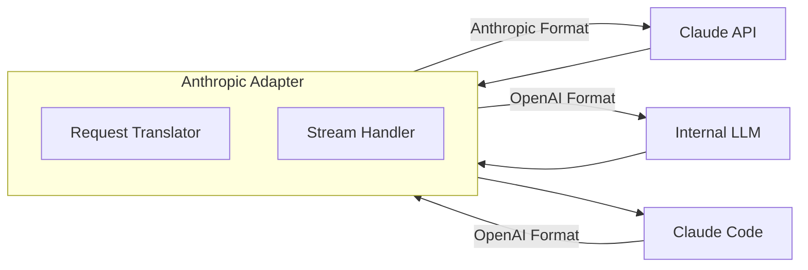

# Anthropic Adapter

OpenAI-compatible proxy for Anthropic Claude API.

**Status:** Accepted | **Updated:** 2026-02-07

---

## Overview

Anthropic Adapter provides an OpenAI-compatible API layer that translates requests to the Anthropic Claude API format, enabling tools like Claude Code to work with internal models.



---

## Why Anthropic Adapter?

| Feature | Benefit |
|---------|---------|
| API translation | OpenAI ↔ Anthropic format |
| Claude Code support | Use internal models with Claude Code |
| Streaming | Real-time response translation |
| Model routing | Route to Claude or internal LLM |

---

## Use Cases

| Use Case | Description |
|----------|-------------|
| Claude Code + internal LLM | Use Claude Code with self-hosted models |
| API compatibility | Anthropic clients on OpenAI backends |
| Model switching | Seamless backend switching |

---

## Configuration

### Deployment

```yaml
apiVersion: apps/v1
kind: Deployment
metadata:
  name: anthropic-adapter
  namespace: ai-hub
spec:
  replicas: 2
  template:
    spec:
      containers:
        - name: adapter
          image: harbor.<domain>/ai-hub/anthropic-adapter:latest
          ports:
            - containerPort: 8000
          env:
            - name: BACKEND_TYPE
              value: "openai"  # or "anthropic"
            - name: BACKEND_URL
              value: "http://vllm.ai-hub.svc:8000/v1"
            - name: BACKEND_API_KEY
              valueFrom:
                secretKeyRef:
                  name: adapter-secrets
                  key: backend-api-key
            - name: DEFAULT_MODEL
              value: "qwen3-32b"
          resources:
            requests:
              cpu: 100m
              memory: 256Mi
```

---

## API Translation

### Anthropic → OpenAI

| Anthropic | OpenAI |
|-----------|--------|
| `messages[].content` (list) | `messages[].content` (string) |
| `max_tokens` | `max_tokens` |
| `system` (top-level) | `messages[0].role: system` |
| `stream: true` | `stream: true` |

### Request Translation

```python
# Anthropic format (input)
{
    "model": "claude-3-opus",
    "max_tokens": 4096,
    "system": "You are helpful.",
    "messages": [
        {"role": "user", "content": "Hello"}
    ]
}

# OpenAI format (translated)
{
    "model": "qwen3-32b",
    "max_tokens": 4096,
    "messages": [
        {"role": "system", "content": "You are helpful."},
        {"role": "user", "content": "Hello"}
    ]
}
```

---

## Claude Code Configuration

```bash
# Set Claude Code to use adapter
export ANTHROPIC_API_KEY="your-adapter-key"
export ANTHROPIC_BASE_URL="http://anthropic-adapter.ai-hub.svc:8000"

# Claude Code will now use internal LLM
claude-code "Explain this code..."
```

---

## Implementation

```python
# proxy.py
from fastapi import FastAPI, Request
from fastapi.responses import StreamingResponse
import httpx

app = FastAPI()

@app.post("/v1/messages")
async def messages(request: Request):
    body = await request.json()

    # Translate Anthropic → OpenAI format
    openai_body = translate_to_openai(body)

    # Forward to backend
    async with httpx.AsyncClient() as client:
        if body.get("stream"):
            return StreamingResponse(
                stream_response(client, openai_body),
                media_type="text/event-stream"
            )
        else:
            response = await client.post(
                f"{BACKEND_URL}/chat/completions",
                json=openai_body
            )
            return translate_to_anthropic(response.json())


def translate_to_openai(anthropic_body: dict) -> dict:
    messages = []

    # Move system to first message
    if "system" in anthropic_body:
        messages.append({
            "role": "system",
            "content": anthropic_body["system"]
        })

    # Convert message content
    for msg in anthropic_body.get("messages", []):
        content = msg["content"]
        if isinstance(content, list):
            # Flatten content blocks
            content = " ".join(
                block.get("text", "")
                for block in content
                if block.get("type") == "text"
            )
        messages.append({"role": msg["role"], "content": content})

    return {
        "model": DEFAULT_MODEL,
        "messages": messages,
        "max_tokens": anthropic_body.get("max_tokens", 4096),
        "stream": anthropic_body.get("stream", False)
    }
```

---

## Streaming Translation

```python
async def stream_response(client, openai_body):
    async with client.stream(
        "POST",
        f"{BACKEND_URL}/chat/completions",
        json=openai_body
    ) as response:
        async for line in response.aiter_lines():
            if line.startswith("data: "):
                data = json.loads(line[6:])
                # Translate to Anthropic SSE format
                anthropic_event = translate_sse(data)
                yield f"event: content_block_delta\ndata: {json.dumps(anthropic_event)}\n\n"
        yield "event: message_stop\ndata: {}\n\n"
```

---

## Monitoring

| Metric | Query |
|--------|-------|
| Request count | `adapter_requests_total` |
| Latency | `adapter_request_duration_seconds` |
| Backend errors | `adapter_backend_errors_total` |
| Stream duration | `adapter_stream_duration_seconds` |

---

## Consequences

**Positive:**
- Claude Code with internal models
- API format translation
- Streaming support
- Easy model switching

**Negative:**
- Feature parity limitations
- Translation overhead
- Some Anthropic features unsupported

---

*Part of [OpenOva](https://openova.io)*
