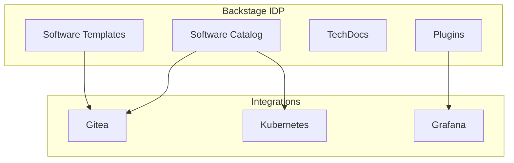

# Backstage

Internal Developer Platform (IDP) for OpenOva.

**Status:** Accepted | **Updated:** 2026-01-17

---

## Overview

Backstage serves as the Internal Developer Platform (IDP) providing:
- Software catalog for discoverability
- Software templates for consistent service creation
- TechDocs for documentation
- Plugin ecosystem for integrations

---

## Architecture



---

## Key Features

### Software Catalog

Central registry of all services, libraries, and infrastructure:

```yaml
apiVersion: backstage.io/v1alpha1
kind: Component
metadata:
  name: talentmesh-api
  annotations:
    backstage.io/kubernetes-id: talentmesh-api
    grafana/dashboard-selector: app=talentmesh-api
spec:
  type: service
  lifecycle: production
  owner: platform-team
  system: talentmesh
  dependsOn:
    - resource:cnpg-database
    - resource:valkey-cache
```

### Software Templates

Scaffolding for new services with best practices built-in:

```yaml
apiVersion: scaffolder.backstage.io/v1beta3
kind: Template
metadata:
  name: typescript-service
spec:
  type: service
  parameters:
    - title: Service Details
      required: [name]
      properties:
        name:
          title: Name
          type: string
  steps:
    - id: fetch
      action: fetch:template
      input:
        url: ./skeleton
    - id: publish
      action: publish:gitea
      input:
        repoUrl: gitea.<domain>?repo=${{ parameters.name }}
    - id: register
      action: catalog:register
```

---

## Plugins

| Plugin | Purpose |
|--------|---------|
| @backstage/plugin-kubernetes | K8s workload visibility |
| @backstage/plugin-grafana | Dashboard integration |
| @backstage/plugin-techdocs | Documentation |
| backstage-plugin-flux | Flux GitOps status |

---

## Integration with OpenOva

### Gitea Integration

Backstage connects to Gitea for:
- Repository discovery and catalog sync
- Template scaffolding (creates repos in Gitea)
- Code search and ownership

### Kubernetes Integration

- Workload visibility per service
- Pod status and logs
- Resource utilization

### Grafana Integration

- Dashboard links from catalog entities
- Metrics visualization
- Alert status

---

## Deployment

Backstage is deployed as a mandatory platform component:

```yaml
apiVersion: kustomize.toolkit.fluxcd.io/v1
kind: Kustomization
metadata:
  name: backstage
  namespace: flux-system
spec:
  interval: 10m
  sourceRef:
    kind: GitRepository
    name: backstage
  path: ./deploy/prod
  prune: true
```

---

## Resource Requirements

| Component | CPU | Memory |
|-----------|-----|--------|
| Backstage | 0.5 | 1Gi |
| PostgreSQL | 0.25 | 512Mi |

---

*Part of [OpenOva](https://openova.io)*
