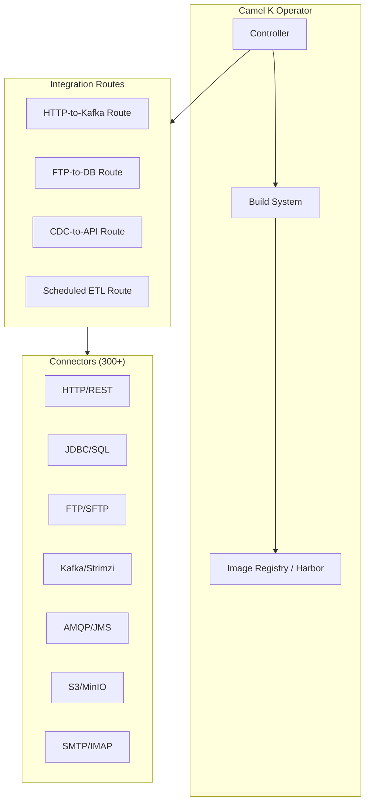
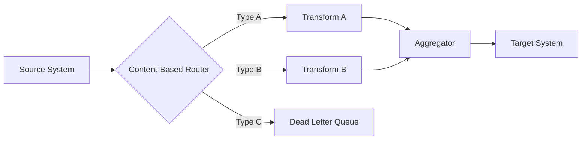

# Apache Camel K

Cloud-native integration framework for Kubernetes.

**Status:** Accepted | **Updated:** 2026-02-09

---

## Overview

Apache Camel K is the Kubernetes-native runtime for Apache Camel, the most comprehensive integration framework in the open-source ecosystem. With over 300 connectors and a full implementation of Enterprise Integration Patterns (EIP), Camel K enables teams to build sophisticated integration routes that connect databases, APIs, message brokers, file systems, and cloud services. It replaces proprietary integration platforms like MuleSoft and IBM Integration Bus for the majority of enterprise integration use cases.

Within OpenOva, Camel K serves as the integration backbone for the **Fuse** microservices integration product. It handles system-to-system integration, protocol bridging, data transformation, and message routing. Camel K integrations are deployed as lightweight Kubernetes-native workloads, managed by the Camel K operator which handles building, packaging, and scaling automatically. Developers write integration routes in Java, YAML, or Groovy DSL, and the operator compiles and deploys them without requiring a full CI/CD pipeline.

Camel K's strength is its connector ecosystem. Need to read from an FTP server, transform CSV to JSON, enrich with an HTTP API call, and publish to a Kafka topic? That is a single Camel route. The framework handles connection pooling, error handling, retry logic, and back-pressure natively, letting developers focus on business logic rather than infrastructure plumbing.

---

## Architecture



### Enterprise Integration Patterns



---

## Key Features

| Feature | Description |
|---------|-------------|
| 300+ Connectors | JDBC, HTTP, FTP, JMS, AMQP, Kafka, S3, SMTP, and many more |
| Enterprise Integration Patterns | Content-based routing, aggregation, splitting, multicast |
| Kubernetes Operator | Automatic build, deploy, and scale of integration routes |
| Multi-Language DSL | Write routes in Java, YAML, Groovy, or Kotlin |
| Knative Integration | Serverless event-driven integrations with autoscale-to-zero |
| Error Handling | Dead letter channels, retry policies, circuit breakers |
| Data Formats | JSON, XML, CSV, Avro, Protobuf, YAML, EDI |
| Kamelets | Reusable connector building blocks with simplified configuration |

---

## Configuration

### Camel K Operator

```yaml
apiVersion: camel.apache.org/v1
kind: IntegrationPlatform
metadata:
  name: camel-k
  namespace: fuse
spec:
  build:
    registry:
      address: harbor.registry.svc:5000
      organization: fuse
      insecure: false
      secret: harbor-credentials
    timeout: 5m
  profile: Kubernetes
  resources:
    requests:
      cpu: 250m
      memory: 512Mi
    limits:
      cpu: 1
      memory: 1Gi
```

### YAML DSL Integration

```yaml
apiVersion: camel.apache.org/v1
kind: Integration
metadata:
  name: order-sync
  namespace: fuse
spec:
  sources:
    - name: order-sync.yaml
      content: |
        - route:
            id: order-sync
            from:
              uri: kafka:orders
              parameters:
                brokers: kafka-kafka-bootstrap.messaging.svc:9093
                groupId: order-sync
                autoOffsetReset: earliest
            steps:
              - unmarshal:
                  json:
                    library: jackson
              - choice:
                  when:
                    - simple: "${body[status]} == 'completed'"
                      steps:
                        - to:
                            uri: sql:INSERT INTO synced_orders (id, amount, status) VALUES (:#${body[id]}, :#${body[amount]}, :#${body[status]})
                            parameters:
                              dataSource: "#orderDataSource"
                    - simple: "${body[status]} == 'cancelled'"
                      steps:
                        - to:
                            uri: http:notification-service.fuse.svc:8080/api/cancellations
                  otherwise:
                    steps:
                      - log: "Unknown order status: ${body[status]}"
                      - to:
                          uri: kafka:orders-dlq
                          parameters:
                            brokers: kafka-kafka-bootstrap.messaging.svc:9093
  traits:
    container:
      configuration:
        requestCPU: 250m
        requestMemory: 256Mi
        limitCPU: 500m
        limitMemory: 512Mi
```

---

## Common Integration Patterns

### REST API to Kafka

```yaml
- route:
    id: rest-to-kafka
    from:
      uri: platform-http:/api/events
      parameters:
        httpMethodRestrict: POST
    steps:
      - marshal:
          json:
            library: jackson
      - to:
          uri: kafka:incoming-events
          parameters:
            brokers: kafka-kafka-bootstrap.messaging.svc:9093
```

### FTP File Processing

```yaml
- route:
    id: ftp-ingest
    from:
      uri: sftp:ftp.partner.com/outbox
      parameters:
        username: "${SFTP_USER}"
        password: "${SFTP_PASS}"
        delay: 60000
        delete: true
    steps:
      - unmarshal:
          csv: {}
      - split:
          tokenize: "\n"
      - marshal:
          json:
            library: jackson
      - to:
          uri: kafka:partner-data
          parameters:
            brokers: kafka-kafka-bootstrap.messaging.svc:9093
```

### Scheduled Database Sync

```yaml
- route:
    id: scheduled-sync
    from:
      uri: timer:sync
      parameters:
        period: 300000  # Every 5 minutes
    steps:
      - to:
          uri: sql:SELECT * FROM orders WHERE synced = false
          parameters:
            dataSource: "#sourceDB"
      - split:
          simple: "${body}"
      - marshal:
          json:
            library: jackson
      - to:
          uri: http:target-api.external.svc:8080/api/orders
      - to:
          uri: sql:UPDATE orders SET synced = true WHERE id = :#${body[id]}
          parameters:
            dataSource: "#sourceDB"
```

---

## Kamelets (Reusable Connectors)

Kamelets are pre-packaged connector building blocks with simplified configuration.

```yaml
apiVersion: camel.apache.org/v1alpha1
kind: KameletBinding
metadata:
  name: s3-to-kafka
  namespace: fuse
spec:
  source:
    ref:
      kind: Kamelet
      apiVersion: camel.apache.org/v1alpha1
      name: aws-s3-source
    properties:
      bucketNameOrArn: incoming-data
      region: us-east-1
      accessKey: "${MINIO_ACCESS_KEY}"
      secretKey: "${MINIO_SECRET_KEY}"
      uriEndpointOverride: http://minio.storage.svc:9000
      overrideEndpoint: true
  sink:
    ref:
      kind: KafkaTopic
      apiVersion: kafka.strimzi.io/v1beta2
      name: s3-events
    properties:
      brokers: kafka-kafka-bootstrap.messaging.svc:9093
```

---

## Error Handling

```yaml
- errorHandler:
    deadLetterChannel:
      deadLetterUri: kafka:integration-dlq?brokers=kafka-kafka-bootstrap.messaging.svc:9093
      redeliveryPolicy:
        maximumRedeliveries: 3
        redeliveryDelay: 1000
        backOffMultiplier: 2
        retryAttemptedLogLevel: WARN
```

---

## Monitoring

| Metric | Description |
|--------|-------------|
| `camel_exchanges_total` | Total messages processed |
| `camel_exchanges_failed_total` | Failed message count |
| `camel_exchanges_inflight` | Currently processing |
| `camel_exchange_processing_duration_seconds` | Processing time per exchange |
| `camel_route_uptime_seconds` | Route uptime |
| `camel_route_policy_redeliveries_total` | Retry attempts |

---

## Consequences

**Positive:**
- 300+ connectors eliminate custom integration code for common protocols
- Enterprise Integration Patterns provide proven solutions for complex routing
- Kubernetes operator automates build and deploy without separate CI/CD
- YAML DSL enables integration development without Java expertise
- Kamelets provide reusable, shareable connector configurations
- Replaces expensive proprietary iPaaS solutions (MuleSoft, IBM IIB)

**Negative:**
- Java-based runtime has higher baseline memory usage than Go-based alternatives
- Complex routes with many components can be difficult to debug
- Build times for initial deployments can be slow (Maven dependency resolution)
- Kamelet ecosystem is still maturing compared to core components
- Operator upgrades require coordination with running integrations
- Deep Camel expertise needed for advanced patterns and custom processors

---

*Part of [OpenOva Fuse](https://openova.io) - Microservices Integration*
