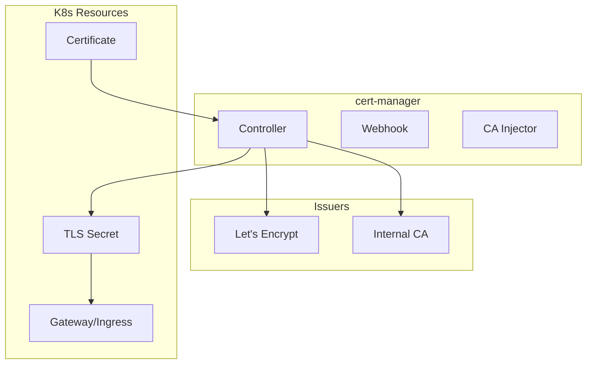

# cert-manager

TLS certificate automation for OpenOva platform.

**Status:** Accepted | **Updated:** 2026-01-17

---

## Overview

cert-manager provides automated TLS certificate management using Let's Encrypt with automatic renewal and Kubernetes-native integration.

---

## Architecture



---

## Challenge Types

| Challenge | Use Case | DNS Provider |
|-----------|----------|--------------|
| HTTP-01 | Public endpoints | Not required |
| DNS-01 | Wildcards, internal | Cloudflare, Route53, etc. |

**Recommended:** DNS-01 for wildcard certificates

---

## Configuration

### ClusterIssuer (Let's Encrypt)

```yaml
apiVersion: cert-manager.io/v1
kind: ClusterIssuer
metadata:
  name: letsencrypt-prod
spec:
  acme:
    server: https://acme-v02.api.letsencrypt.org/directory
    email: admin@<domain>
    privateKeySecretRef:
      name: letsencrypt-prod-key
    solvers:
      - dns01:
          cloudflare:
            apiTokenSecretRef:
              name: cloudflare-api-token
              key: api-token
```

### Certificate

```yaml
apiVersion: cert-manager.io/v1
kind: Certificate
metadata:
  name: wildcard-cert
  namespace: cilium-gateway
spec:
  secretName: wildcard-tls
  issuerRef:
    name: letsencrypt-prod
    kind: ClusterIssuer
  dnsNames:
    - "*.<domain>"
    - "<domain>"
```

---

## Gateway API Integration

cert-manager integrates with Cilium Gateway API:

```yaml
apiVersion: gateway.networking.k8s.io/v1
kind: Gateway
metadata:
  name: main-gateway
  namespace: cilium-gateway
spec:
  gatewayClassName: cilium
  listeners:
    - name: https
      protocol: HTTPS
      port: 443
      tls:
        mode: Terminate
        certificateRefs:
          - name: wildcard-tls
```

---

## Renewal

| Setting | Value |
|---------|-------|
| Renewal window | 30 days before expiry |
| Check interval | 24 hours |
| Retry interval | 1 hour on failure |

cert-manager automatically renews certificates before expiration.

---

## Monitoring

| Metric | Description |
|--------|-------------|
| `certmanager_certificate_expiration_timestamp_seconds` | Certificate expiry time |
| `certmanager_certificate_ready_status` | Certificate readiness |
| `certmanager_http_acme_client_request_count` | ACME requests |

---

*Part of [OpenOva](https://openova.io)*
