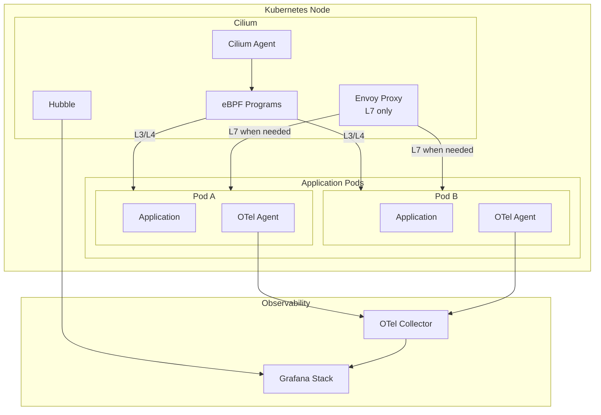
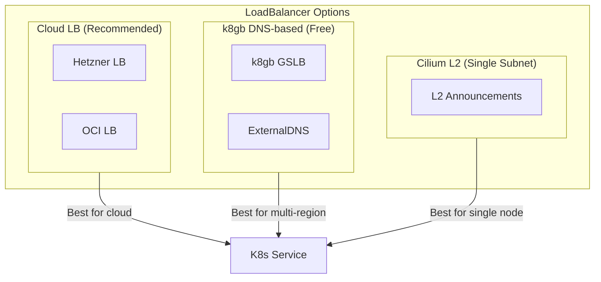

# Cilium

Unified CNI + Service Mesh for Kubernetes with eBPF.

**Status:** Accepted | **Updated:** 2026-02-07

---

## Overview

Cilium provides both Container Network Interface (CNI) and Service Mesh capabilities in a single, unified solution. It replaces Flannel, kube-proxy, and eliminates the need for a separate service mesh like Istio.



---

## Why Cilium?

### CNI Comparison

| Feature | Flannel | Cilium |
|---------|---------|--------|
| Basic networking | Yes | Yes |
| Network policies | No | Yes (L3-L7) |
| Observability | No | Yes (Hubble) |
| kube-proxy replacement | No | Yes |
| eBPF performance | No | Yes |
| Service mesh | No | Yes (built-in) |
| L2 LoadBalancer | No | Yes |
| Gateway API | No | Yes |

### Service Mesh Comparison

| Feature | Istio | Cilium Service Mesh |
|---------|-------|---------------------|
| mTLS | Envoy/ztunnel | eBPF + WireGuard |
| L7 Policies | Envoy | CiliumEnvoyConfig |
| Network Policies | Via CNI | Native (eBPF) |
| Resource Overhead | Medium-High | Low |
| Observability | Envoy metrics | Hubble + OTel |
| CNI Integration | Separate | Unified |
| Complexity | High | Medium |

### Key Finding: OTel Independence

OpenTelemetry auto-instrumentation is **independent** of the service mesh:

| Component | Provides |
|-----------|----------|
| **OpenTelemetry** | SQL queries, HTTP calls, application traces |
| **Service Mesh** | mTLS encryption, L7 routing, network policies |

Cilium provides mesh features without sacrificing observability - OTel handles application tracing regardless of mesh choice.

---

## Features

### CNI Features

| Feature | Purpose |
|---------|---------|
| kubeProxyReplacement | Replace kube-proxy with eBPF |
| hubble | Network observability |
| hubble.relay | Metrics export to Grafana |
| gatewayAPI | Gateway API for ingress |
| encryption | WireGuard-based mTLS |
| envoy | L7 traffic management |
| l2announcements | L2 LoadBalancer for bare-metal |

### Service Mesh Capabilities

| Capability | How Cilium Provides It |
|------------|------------------------|
| mTLS | WireGuard encryption (transparent) |
| L7 Policies | CiliumEnvoyConfig + Network Policies |
| Traffic Management | Gateway API (HTTPRoute, GRPCRoute) |
| Observability | Hubble metrics, flows, traces |
| Circuit Breaker | CiliumEnvoyConfig outlier detection |
| Retries | HTTPRoute retry policies |

---

## Configuration

### Helm Values

```yaml
# values.yaml
kubeProxyReplacement: true
k8sServiceHost: ${API_SERVER_IP}
k8sServicePort: 6443

# Service Mesh features
authentication:
  mutual:
    spire:
      enabled: false  # Using Cilium native

encryption:
  enabled: true
  type: wireguard

# L7 proxy
envoy:
  enabled: true

# Hubble observability
hubble:
  enabled: true
  relay:
    enabled: true
  ui:
    enabled: true
  metrics:
    enabled:
      - dns
      - drop
      - tcp
      - flow
      - icmp
      - http

# Gateway API
gatewayAPI:
  enabled: true

# L2 LoadBalancer (optional)
l2announcements:
  enabled: true
```

---

## Network Policies

### mTLS (Mutual TLS)

```yaml
apiVersion: cilium.io/v2
kind: CiliumNetworkPolicy
metadata:
  name: require-mtls
spec:
  endpointSelector:
    matchLabels:
      app: my-service
  ingress:
    - fromEndpoints:
        - matchLabels:
            app: allowed-client
      authentication:
        mode: required
```

### L7 HTTP Policies

```yaml
apiVersion: cilium.io/v2
kind: CiliumNetworkPolicy
metadata:
  name: http-policy
spec:
  endpointSelector:
    matchLabels:
      app: api-service
  ingress:
    - fromEndpoints:
        - matchLabels:
            app: frontend
      toPorts:
        - ports:
            - port: "8080"
              protocol: TCP
          rules:
            http:
              - method: GET
                path: "/api/v1/.*"
              - method: POST
                path: "/api/v1/users"
```

---

## Gateway API

Cilium replaces traditional ingress controllers with Gateway API:

```yaml
apiVersion: gateway.networking.k8s.io/v1
kind: Gateway
metadata:
  name: cilium-gateway
spec:
  gatewayClassName: cilium
  listeners:
    - name: https
      port: 443
      protocol: HTTPS
      tls:
        mode: Terminate
        certificateRefs:
          - name: tls-secret
---
apiVersion: gateway.networking.k8s.io/v1
kind: HTTPRoute
metadata:
  name: app-route
spec:
  parentRefs:
    - name: cilium-gateway
  hostnames:
    - "app.example.com"
  rules:
    - matches:
        - path:
            type: PathPrefix
            value: /api
      backendRefs:
        - name: api-service
          port: 8080
      timeouts:
        request: 30s
      retry:
        attempts: 3
        backoff: 100ms
```

---

## Resilience Patterns

### Circuit Breaker Tiers

| Service Tier | consecutiveErrors | baseEjectionTime | maxEjectionPercent |
|--------------|-------------------|------------------|-------------------|
| Critical | 3 | 30s | 50% |
| Standard | 5 | 30s | 50% |
| Background | 10 | 60s | 75% |

### Standard Service Circuit Breaker

```yaml
apiVersion: cilium.io/v2
kind: CiliumEnvoyConfig
metadata:
  name: service-circuit-breaker
spec:
  services:
    - name: my-service
      namespace: default
  resources:
    - "@type": type.googleapis.com/envoy.config.cluster.v3.Cluster
      name: my-service
      connect_timeout: 5s
      circuit_breakers:
        thresholds:
          - priority: DEFAULT
            max_connections: 100
            max_pending_requests: 100
            max_requests: 1000
            max_retries: 3
      outlier_detection:
        consecutive_5xx: 5
        interval: 10s
        base_ejection_time: 30s
        max_ejection_percent: 50
```

### Critical Service (Database Proxy)

```yaml
apiVersion: cilium.io/v2
kind: CiliumEnvoyConfig
metadata:
  name: db-proxy-circuit-breaker
spec:
  services:
    - name: db-proxy
      namespace: default
  resources:
    - "@type": type.googleapis.com/envoy.config.cluster.v3.Cluster
      name: db-proxy
      connect_timeout: 3s
      circuit_breakers:
        thresholds:
          - priority: DEFAULT
            max_connections: 50
            max_pending_requests: 50
            max_retries: 2
      outlier_detection:
        consecutive_5xx: 3
        interval: 5s
        base_ejection_time: 30s
        max_ejection_percent: 50
```

### Timeout Configuration

```yaml
apiVersion: cilium.io/v2
kind: CiliumEnvoyConfig
metadata:
  name: service-timeouts
spec:
  services:
    - name: my-service
      namespace: default
  resources:
    - "@type": type.googleapis.com/envoy.config.route.v3.RouteConfiguration
      name: my-service-routes
      virtual_hosts:
        - name: my-service
          domains: ["*"]
          routes:
            - match:
                prefix: "/"
              route:
                cluster: my-service
                timeout: 30s
```

---

## Health Probes

| Probe Type | Purpose | Failure Action |
|------------|---------|----------------|
| Startup | Wait for initialization | Block traffic |
| Readiness | Can accept traffic | Remove from LB |
| Liveness | Process healthy | Restart pod |

### Standard Configuration

```yaml
startupProbe:
  httpGet:
    path: /health
    port: 8080
  initialDelaySeconds: 10
  periodSeconds: 5
  failureThreshold: 30

readinessProbe:
  httpGet:
    path: /health/ready
    port: 8080
  periodSeconds: 10
  failureThreshold: 3

livenessProbe:
  httpGet:
    path: /health/live
    port: 8080
  periodSeconds: 20
  failureThreshold: 3
```

---

## SLO-Based Alerting

| SLI | Target | Alert Threshold |
|-----|--------|-----------------|
| Availability | 99.9% | <99.5% for 5m |
| Latency (p95) | <500ms | >1s for 5m |
| Error Rate | <0.1% | >1% for 5m |

---

## LoadBalancer Options



| Option | Cost | Multi-Region | Use Case |
|--------|------|--------------|----------|
| Cloud LB | Paid | Via k8gb | Production |
| k8gb DNS-based | Free | Native | Cost-sensitive |
| Cilium L2 | Free | No | Single subnet/dev |

---

## OpenTelemetry Integration

OTel is configured independently of Cilium:

```yaml
apiVersion: opentelemetry.io/v1alpha1
kind: Instrumentation
metadata:
  name: auto-instrumentation
  namespace: opentelemetry
spec:
  exporter:
    endpoint: http://collector.opentelemetry.svc:4317
  propagators:
    - tracecontext
    - baggage
  sampler:
    type: parentbased_traceidratio
    argument: "1.0"
  java:
    image: ghcr.io/open-telemetry/opentelemetry-operator/autoinstrumentation-java:latest
  python:
    image: ghcr.io/open-telemetry/opentelemetry-operator/autoinstrumentation-python:latest
  nodejs:
    image: ghcr.io/open-telemetry/opentelemetry-operator/autoinstrumentation-nodejs:latest
```

Pods opt-in via annotation:

```yaml
metadata:
  annotations:
    instrumentation.opentelemetry.io/inject-java: "true"
```

---

## Observability Stack

| Source | Provides |
|--------|----------|
| **Hubble (Cilium)** | Network flows, DNS queries, HTTP metrics (L7), dropped packets |
| **OpenTelemetry** | Application traces, SQL queries, HTTP client calls, custom spans |
| **Grafana Stack** | Loki (logs), Mimir (metrics), Tempo (traces), dashboards |

---

## Migration from Istio

If migrating from Istio:

1. **Install Cilium** with service mesh features
2. **Remove Istio sidecars** (if using sidecar mode)
3. **Convert VirtualService** → HTTPRoute
4. **Convert DestinationRule** → CiliumNetworkPolicy + CiliumEnvoyConfig
5. **Verify OTel** continues working (it's independent)

---

## Consequences

**Positive:**
- Unified CNI + service mesh (single component)
- Advanced network policies (L3-L7)
- Network observability via Hubble
- eBPF performance
- kube-proxy replacement
- L2 LoadBalancer option
- Native Kubernetes Gateway API support
- Lower resource overhead than Istio

**Negative:**
- More complex than Flannel
- eBPF kernel requirements (5.10+)
- Less mature than Istio for some features
- CiliumEnvoyConfig less intuitive than VirtualService

---

*Part of [OpenOva](https://openova.io)*
