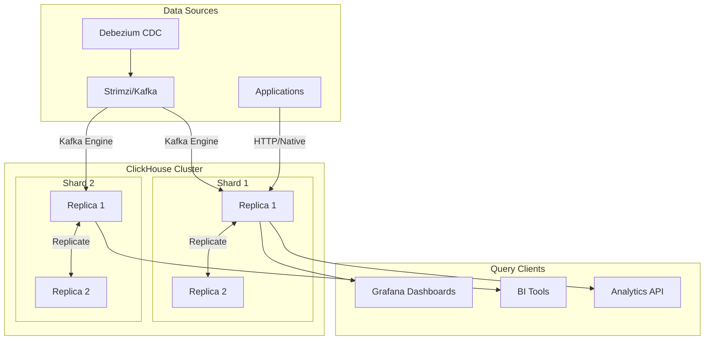
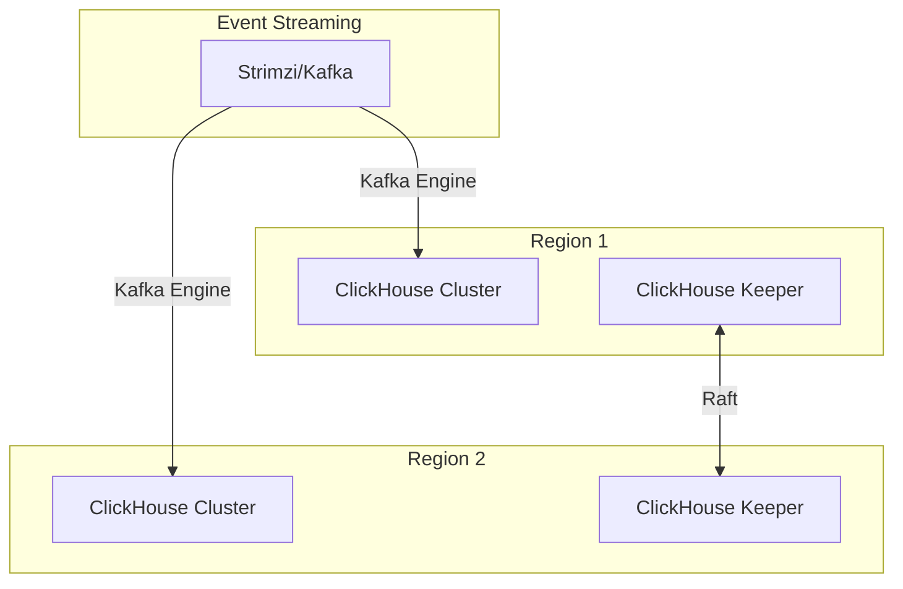

# ClickHouse

Column-oriented OLAP database for real-time analytics.

**Status:** Accepted | **Updated:** 2026-02-09

---

## Overview

ClickHouse is an open-source column-oriented database management system designed for online analytical processing (OLAP). Licensed under the Apache License 2.0, ClickHouse can process analytical queries over billions of rows per second on commodity hardware, making it one of the fastest analytical databases available. It is widely used for real-time analytics, time-series data, log analytics, and business intelligence workloads.

In the OpenOva platform, ClickHouse is offered as an a la carte component for customers who need high-performance analytical capabilities without the cost of managed cloud data warehouses like Snowflake or BigQuery. It integrates naturally with the platform's observability stack for long-term metric retention and with Debezium/Kafka (via Strimzi) for streaming analytics pipelines. The ClickHouse Operator provides Kubernetes-native lifecycle management.

ClickHouse stores data in a columnar format with aggressive compression, enabling queries to scan only the columns needed for a given query. Combined with vectorized query execution, this architecture delivers orders-of-magnitude performance improvements over row-oriented databases for analytical workloads.

---

## Architecture

### Single Region



### Multi-Region



---

## Why ClickHouse?

| Factor | ClickHouse | PostgreSQL (CNPG) | Snowflake / BigQuery |
|--------|------------|-------------------|----------------------|
| Query type | OLAP (analytical) | OLTP (transactional) | OLAP (analytical) |
| Query speed | Billions of rows/sec | Millions of rows/sec | Fast but variable |
| Storage format | Columnar | Row-oriented | Columnar |
| Real-time ingestion | Native support | Possible but slow | Micro-batch |
| Cost | Self-hosted, Apache 2.0 | Self-hosted, Apache 2.0 | Pay-per-query (expensive) |
| Kubernetes-native | ClickHouse Operator | CNPG Operator | Managed only |
| Time-series | Optimized | Possible (TimescaleDB) | Possible |
| Compression | 10-40x | 2-4x | 10-40x |

**Decision:** Use ClickHouse for analytical workloads, time-series data, and log analytics. Use CNPG (PostgreSQL) for transactional workloads. ClickHouse replaces expensive managed OLAP services for self-hosted deployments.

---

## Key Features

| Feature | Description |
|---------|-------------|
| Columnar Storage | Stores and compresses data by column for fast analytical scans |
| MergeTree Engine | LSM-tree-inspired storage engine with automatic data compaction |
| Kafka Engine | Native streaming ingestion from Kafka (via Strimzi) topics |
| Materialized Views | Incrementally updated aggregations on insert |
| Distributed Queries | Scatter-gather queries across shards |
| ClickHouse Keeper | Built-in ZooKeeper-compatible coordination (replaces ZooKeeper) |
| SQL Compatibility | ANSI SQL with extensions for analytics (window functions, arrays, JSON) |
| Tiered Storage | Hot/warm/cold storage policies with S3/MinIO cold tier |
| Projections | Pre-sorted data views for faster queries on secondary sort orders |
| TTL | Automatic data expiration and archival policies |

---

## Configuration

### ClickHouse Cluster (ClickHouse Operator)

```yaml
apiVersion: clickhouse.altinity.com/v1
kind: ClickHouseInstallation
metadata:
  name: clickhouse
  namespace: databases
spec:
  defaults:
    templates:
      dataVolumeClaimTemplate: data-volume
      podTemplate: clickhouse-pod
  configuration:
    zookeeper:
      nodes:
        - host: clickhouse-keeper
          port: 2181
    clusters:
      - name: analytics
        layout:
          shardsCount: 2
          replicasCount: 2
        templates:
          podTemplate: clickhouse-pod
    settings:
      max_concurrent_queries: 200
      max_memory_usage: 10000000000
      max_server_memory_usage_to_ram_ratio: 0.8
    profiles:
      default/max_execution_time: 60
      default/max_rows_to_read: 1000000000
    users:
      default/password_sha256_hex: <sha256-hash>
      default/networks/ip:
        - "10.0.0.0/8"
      readonly/password_sha256_hex: <sha256-hash>
      readonly/profile: readonly
  templates:
    podTemplates:
      - name: clickhouse-pod
        spec:
          containers:
            - name: clickhouse
              image: clickhouse/clickhouse-server:24.3
              resources:
                requests:
                  cpu: 1
                  memory: 4Gi
                limits:
                  cpu: 4
                  memory: 16Gi
    volumeClaimTemplates:
      - name: data-volume
        spec:
          storageClassName: <storage-class>
          accessModes:
            - ReadWriteOnce
          resources:
            requests:
              storage: 500Gi
```

### Kafka Engine (Streaming Ingestion from Strimzi/Kafka)

```sql
-- Source table reading from Kafka (via Strimzi)
CREATE TABLE events_queue (
    event_id UUID,
    event_type String,
    payload String,
    created_at DateTime64(3)
) ENGINE = Kafka
SETTINGS
    kafka_broker_list = 'kafka-kafka-bootstrap.databases.svc:9092',
    kafka_topic_list = 'events.analytics',
    kafka_group_name = 'clickhouse-analytics',
    kafka_format = 'JSONEachRow';

-- Target MergeTree table
CREATE TABLE events (
    event_id UUID,
    event_type LowCardinality(String),
    payload String,
    created_at DateTime64(3)
) ENGINE = ReplicatedMergeTree('/clickhouse/tables/{shard}/events', '{replica}')
PARTITION BY toYYYYMM(created_at)
ORDER BY (event_type, created_at)
TTL created_at + INTERVAL 90 DAY;

-- Materialized view connecting the two
CREATE MATERIALIZED VIEW events_mv TO events AS
SELECT * FROM events_queue;
```

### Tiered Storage (MinIO Cold Tier)

```xml
<storage_configuration>
    <disks>
        <default>
            <keep_free_space_bytes>1073741824</keep_free_space_bytes>
        </default>
        <s3_cold>
            <type>s3</type>
            <endpoint>http://minio.storage.svc:9000/clickhouse-cold/</endpoint>
            <access_key_id>minioadmin</access_key_id>
            <secret_access_key>minioadmin</secret_access_key>
        </s3_cold>
    </disks>
    <policies>
        <tiered>
            <volumes>
                <hot>
                    <disk>default</disk>
                </hot>
                <cold>
                    <disk>s3_cold</disk>
                </cold>
            </volumes>
            <move_factor>0.2</move_factor>
        </tiered>
    </policies>
</storage_configuration>
```

---

## Monitoring

| Metric | Description |
|--------|-------------|
| `ClickHouseProfileEvents_Query` | Total queries executed |
| `ClickHouseProfileEvents_InsertedRows` | Rows inserted |
| `ClickHouseMetrics_MemoryTracking` | Current memory usage |
| `ClickHouseAsyncMetrics_ReplicasMaxQueueSize` | Replication queue depth |
| `ClickHouseProfileEvents_MergeTreeDataWriterRows` | MergeTree write throughput |
| `ClickHouseMetrics_QueryThread` | Active query threads |

---

## Consequences

**Positive:**
- Orders-of-magnitude faster than row-oriented databases for analytical queries
- Native Kafka (via Strimzi) integration enables real-time streaming analytics
- Columnar compression reduces storage costs by 10-40x compared to row stores
- Replaces expensive managed OLAP services (Snowflake, BigQuery) for self-hosted deployments
- Tiered storage to MinIO provides cost-effective long-term data retention

**Negative:**
- Not suitable for OLTP workloads (use CNPG for transactional queries)
- UPDATE and DELETE operations are expensive (merge-on-read semantics)
- Requires careful schema design (sort keys, partitioning) for optimal performance
- ClickHouse Keeper or ZooKeeper adds operational overhead for replicated setups
- Complex JOIN queries across large datasets may require denormalization

---

*Part of [OpenOva](https://openova.io)*
