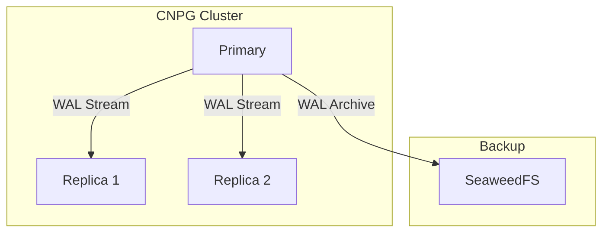
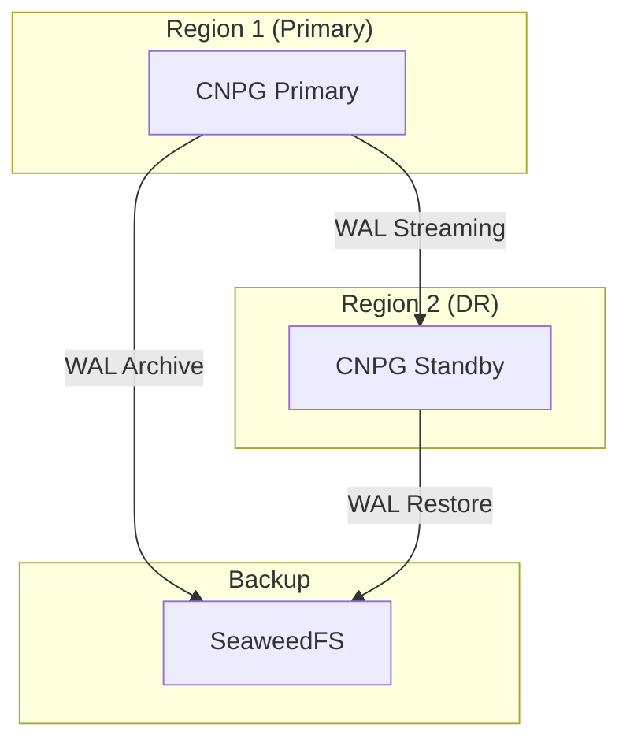

# CNPG (CloudNative PostgreSQL)

Production-grade PostgreSQL operator. **Application Blueprint** (see [`docs/ARCHITECTURE.md`](../../docs/ARCHITECTURE.md) §4.1 — Data services). Used by Organizations that want managed Postgres; also the underlying engine for FerretDB (MongoDB-compatible) and Gitea metadata. Replication via WAL streaming to async standby (Application-tier choice).

**Status:** Accepted | **Updated:** 2026-04-27

---

## Overview

CloudNative PostgreSQL (CNPG) provides production-grade PostgreSQL with:
- Kubernetes-native operator
- WAL streaming for multi-region DR
- Automated backups to SeaweedFS/S3
- High availability with automatic failover

---

## Architecture

### Single Region



### Multi-Region DR



---

## Configuration

### Cluster Definition

```yaml
apiVersion: postgresql.cnpg.io/v1
kind: Cluster
metadata:
  name: <org>-postgres
  namespace: databases
spec:
  instances: 3

  postgresql:
    parameters:
      max_connections: "200"
      shared_buffers: 256MB

  storage:
    size: 10Gi
    storageClass: <storage-class>

  backup:
    barmanObjectStore:
      destinationPath: s3://cnpg-backups/<org>
      endpointURL: http://seaweedfs.storage.svc:8333
      s3Credentials:
        accessKeyId:
          name: seaweedfs-credentials
          key: access-key
        secretAccessKey:
          name: seaweedfs-credentials
          key: secret-key
      wal:
        compression: gzip
    retentionPolicy: "30d"

  monitoring:
    enablePodMonitor: true
```

### DR Replica (Region 2)

```yaml
apiVersion: postgresql.cnpg.io/v1
kind: Cluster
metadata:
  name: <org>-postgres-dr
  namespace: databases
spec:
  instances: 1

  replica:
    enabled: true
    source: <org>-postgres

  externalClusters:
    - name: <org>-postgres
      connectionParameters:
        host: postgres.<env>.<sovereign-domain>
        user: streaming_replica
      password:
        name: pg-replica-credentials
        key: password
```

---

## Backup Strategy

| Type | Schedule | Retention |
|------|----------|-----------|
| WAL Archive | Continuous | 7 days |
| Base Backup | Daily 2 AM | 30 days |
| Point-in-Time | On-demand | Per backup |

### Scheduled Backup

```yaml
apiVersion: postgresql.cnpg.io/v1
kind: ScheduledBackup
metadata:
  name: <org>-daily-backup
  namespace: databases
spec:
  schedule: "0 2 * * *"
  backupOwnerReference: self
  cluster:
    name: <org>-postgres
```

---

## Failover

### Automatic (Within Region)

CNPG automatically promotes replicas when primary fails.

### Manual (Cross-Region)

```bash
# Promote DR cluster
kubectl cnpg promote <org>-postgres-dr -n databases
```

---

## Monitoring

| Metric | Description |
|--------|-------------|
| `cnpg_pg_replication_lag` | Replication lag in seconds |
| `cnpg_pg_database_size_bytes` | Database size |
| `cnpg_pg_stat_activity_count` | Active connections |

---

## PgBouncer Integration

Connection pooling with PgBouncer:

```yaml
apiVersion: postgresql.cnpg.io/v1
kind: Pooler
metadata:
  name: <org>-pooler
  namespace: databases
spec:
  cluster:
    name: <org>-postgres
  instances: 2
  type: rw
  pgbouncer:
    poolMode: transaction
    parameters:
      max_client_conn: "1000"
      default_pool_size: "20"
```

## Webhook caBundle integrity (G64, #4322)

The platform (`cnpg-system`) install owns the cluster-singleton admission
webhooks (`cnpg-{mutating,validating}-webhook-configuration`). Upstream CNPG
(bug [#9817](https://github.com/cloudnative-pg/cloudnative-pg/issues/9817), fix
PR #9819 unmerged) injects the **serving leaf** (`cnpg-webhook-cert` `tls.crt`,
`CA:FALSE`) into the webhook `caBundle` instead of the CA
(`cnpg-ca-secret` `ca.crt`, `CA:TRUE`), and re-asserts it on an hourly tick.
When the served leaf rotates and diverges from the stale caBundle-leaf, the
apiserver fails `x509: certificate signed by unknown authority` and **every
`postgresql.cnpg.io/v1.Cluster` create/patch is rejected cluster-wide**.

This chart fixes it durably (webhook-FULL platform install only — per-Org
webhook-LESS installs skip all of it):

- `cloudnative-pg.config.data.MANAGE_WEBHOOK_CONFIGURATIONS: "false"` — stops the
  operator injecting (corrupting) the caBundle at the source (upstream
  `operator_conf` opt-out for GitOps-managed CA injection; independent of
  serving-cert/CA generation).
- `templates/webhook-cabundle-reasserter.yaml` — the GitOps-side CA injector: a
  post-install/upgrade hook Job + a 10-minute CronJob that read
  `cnpg-ca-secret` `ca.crt` (validated `CA:TRUE`) and write it into both webhook
  configs. The CronJob self-heals any residual re-corruption within minutes.
- `webhook-gate-hook.yaml` asserts the caBundle is a **CA** (`CA:TRUE`), not
  merely non-empty.

Diagnose a recurrence:

```bash
kubectl get validatingwebhookconfiguration cnpg-validating-webhook-configuration \
  -o jsonpath='{.webhooks[0].clientConfig.caBundle}' | base64 -d \
  | openssl x509 -noout -subject -ext basicConstraints     # must be CA:TRUE / CN=cnpg-ca-secret
kubectl -n cnpg-system get cronjob,job -l catalyst.openova.io/component=webhook-cabundle-reasserter
```

---

*Part of [OpenOva](https://openova.io)*
