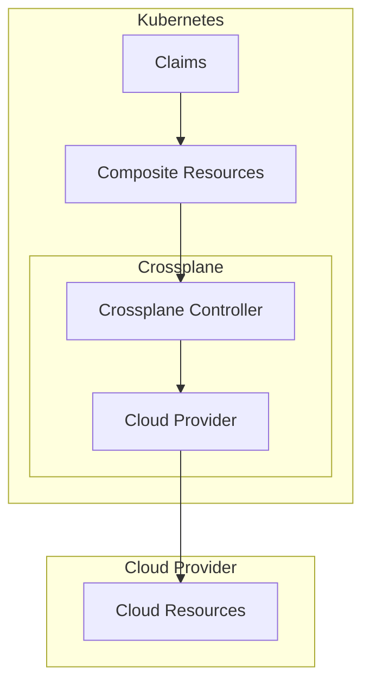

# Crossplane

Day-2 cloud resource provisioning for Catalyst. Per-Sovereign on the management cluster (see [`docs/PLATFORM-TECH-STACK.md`](../../docs/PLATFORM-TECH-STACK.md) §3.2) — manages all non-Kubernetes resources for the entire Sovereign (host clusters, VPCs, DNS records, S3 buckets, third-party SaaS).

> **Crossplane is platform plumbing, never a user-facing surface.** Users see "needs a database, pick existing or new" in the Catalyst console; Blueprint authors write Compositions; advanced users (sovereign-admins, OpenOva engineers) contribute Compositions upstream as Blueprints. End users do NOT write Crossplane Compositions in their Application configs. See [`docs/ARCHITECTURE.md`](../../docs/ARCHITECTURE.md) §4 / §7 (the "no fourth surface" rule) and [`docs/BLUEPRINT-AUTHORING.md`](../../docs/BLUEPRINT-AUTHORING.md) §8.

**Status:** Accepted | **Updated:** 2026-04-27

---

## Overview

Crossplane provides Kubernetes-native cloud resource provisioning for day-2 operations. Terraform handles initial bootstrap; Crossplane manages ongoing infrastructure.

---

## Architecture



---

## OpenTofu vs Crossplane

Catalyst uses **OpenTofu** (the open-source Terraform fork) for bootstrap IaC, not Terraform. See [`docs/PLATFORM-TECH-STACK.md`](../../docs/PLATFORM-TECH-STACK.md) §3.2 and [`platform/opentofu/`](../opentofu/).

| Aspect | OpenTofu | Crossplane |
|--------|----------|------------|
| Phase | Bootstrap (day-0/1) — Phase 0 of Sovereign provisioning, then archived | Day-2+ operations |
| State | External state file | Kubernetes CRDs |
| Drift | Manual detection | Continuous reconciliation |
| Access | CI/CD pipeline (catalyst-provisioner) | K8s RBAC |
| Lifecycle | Point-in-time | GitOps continuous |

**Decision:** Use OpenTofu for initial cluster bootstrap only (Phase 0). All subsequent infrastructure managed via Crossplane.

---

## Supported Providers

| Provider | Status | Crossplane Provider |
|----------|--------|---------------------|
| Hetzner Cloud | Available | hcloud |
| Huawei Cloud | Coming | huaweicloud |
| Oracle Cloud | Coming | oci |
| AWS | Coming | aws |
| GCP | Coming | gcp |
| Azure | Coming | azure |

---

## Configuration

### Provider Configuration

```yaml
apiVersion: pkg.crossplane.io/v1
kind: Provider
metadata:
  name: provider-hcloud
spec:
  package: xpkg.upbound.io/crossplane-contrib/provider-hcloud:v0.4.0
---
apiVersion: hcloud.crossplane.io/v1alpha1
kind: ProviderConfig
metadata:
  name: default
spec:
  credentials:
    source: Secret
    secretRef:
      namespace: crossplane-system
      name: hcloud-credentials
      key: token
```

### Composite Resource Definition

```yaml
apiVersion: apiextensions.crossplane.io/v1
kind: CompositeResourceDefinition
metadata:
  name: xdatabases.compose.openova.io
spec:
  group: compose.openova.io                      # canonical XRD group per BLUEPRINT-AUTHORING §8
  names:
    kind: XDatabase
    plural: xdatabases
  versions:
    - name: v1alpha1
      served: true
      referenceable: true
      schema:
        openAPIV3Schema:
          type: object
          properties:
            spec:
              type: object
              properties:
                size:
                  type: string
                  enum: [small, medium, large]
```

### Composition

```yaml
apiVersion: apiextensions.crossplane.io/v1
kind: Composition
metadata:
  name: database.hcloud.compose.openova.io
spec:
  compositeTypeRef:
    apiVersion: compose.openova.io/v1alpha1     # canonical XRD group per BLUEPRINT-AUTHORING §8
    kind: XDatabase
  resources:
    - name: server
      base:
        apiVersion: hcloud.crossplane.io/v1alpha1
        kind: Server
        spec:
          forProvider:
            serverType: cx21
            image: ubuntu-22.04
```

---

## GitOps Integration

Crossplane resources are managed via Flux:

```yaml
apiVersion: kustomize.toolkit.fluxcd.io/v1
kind: Kustomization
metadata:
  name: crossplane
  namespace: flux-system
spec:
  interval: 10m
  sourceRef:
    kind: GitRepository
    name: crossplane
  path: ./deploy/prod
  prune: true
```

---

## Catalyst Integration

Crossplane Compositions are referenced by Blueprints when an Application requires non-Kubernetes resources (cloud DBs, DNS records, S3 buckets, etc.). End users never see Crossplane directly — they see "needs a database" in the Blueprint's configSchema, rendered as a form in the Catalyst console. Advanced users author Crossplane Compositions and contribute them upstream as Blueprints. See [`docs/BLUEPRINT-AUTHORING.md`](../../docs/BLUEPRINT-AUTHORING.md) §8.

---

*Part of [OpenOva](https://openova.io)*
