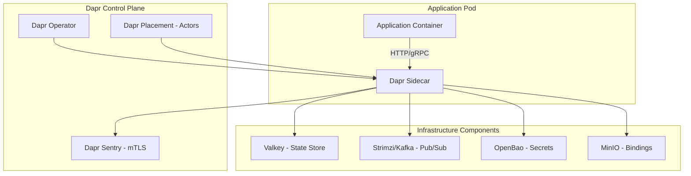

# Dapr

Distributed Application Runtime for microservice building blocks.

**Status:** Accepted | **Updated:** 2026-02-09

---

## Overview

Dapr (Distributed Application Runtime) is a CNCF Graduated project that provides portable, event-driven runtime building blocks for microservices. Rather than embedding distributed systems logic into application code, Dapr runs as a sidecar alongside each service and exposes capabilities like state management, pub/sub messaging, service invocation, and secret management through simple HTTP/gRPC APIs. This approach is language-agnostic: any service that can make HTTP calls can use Dapr, regardless of whether it is written in Go, Java, Python, TypeScript, or any other language.

Within OpenOva, Dapr serves as the application-level abstraction layer for the **Fuse** microservices integration product. It complements Cilium, which handles network-level concerns (L3/L4 routing, mTLS, network policy), by providing application-level building blocks (state, pub/sub, bindings, actors). Together, they form a complete microservices runtime: Cilium owns the network plane, Dapr owns the application plane. This separation avoids the overlap and complexity that traditional service meshes introduce when they try to do both.

Dapr's pluggable component model means that application code never directly couples to infrastructure. A service publishes a message to a "pubsub" topic via Dapr's API; whether that message goes to Kafka (via Strimzi), RabbitMQ, or an in-memory broker is a configuration choice, not a code change. This portability makes it straightforward to run the same application in development (with in-memory components) and production (with managed infrastructure).

---

## Architecture



### Dapr + Cilium Separation

```mermaid
flowchart LR
    subgraph Cilium["Cilium (Network Plane)"]
        L3L4[L3/L4 Routing]
        mTLS_net[Network mTLS]
        NetPol[Network Policy]
        LB[Load Balancing]
    end

    subgraph Dapr["Dapr (Application Plane)"]
        State[State Management]
        PubSub[Pub/Sub Messaging]
        Invoke[Service Invocation]
        Bindings[Input/Output Bindings]
        Actors[Virtual Actors]
    end

    subgraph App["Application"]
        Code[Business Logic]
    end

    Code -->|"App concerns"| Dapr
    Dapr -->|"Network transport"| Cilium
```



---

## Key Features

| Feature | Description |
|---------|-------------|
| State Management | Key/value state with concurrency control and transactions |
| Pub/Sub | Publish and subscribe to topics with at-least-once delivery |
| Service Invocation | Service-to-service calls with retries and mTLS |
| Bindings | Trigger from and send to external systems (cron, S3, queues) |
| Virtual Actors | Stateful, single-threaded actor model for concurrent entities |
| Secrets | Unified secret access across OpenBao, K8s secrets, cloud providers |
| Configuration | Dynamic configuration with change notifications |
| Distributed Lock | Leader election and mutual exclusion primitives |
| Workflow | Orchestrate multi-step processes with durable execution |

---

## Building Block Components

### State Store (Valkey)

```yaml
apiVersion: dapr.io/v1alpha1
kind: Component
metadata:
  name: statestore
  namespace: fuse
spec:
  type: state.redis
  version: v1
  metadata:
    - name: redisHost
      value: valkey.cache.svc:6379
    - name: redisPassword
      secretKeyRef:
        name: valkey-credentials
        key: password
    - name: actorStateStore
      value: "true"
    - name: keyPrefix
      value: "name"
```

### Pub/Sub (Strimzi/Kafka)

```yaml
apiVersion: dapr.io/v1alpha1
kind: Component
metadata:
  name: pubsub
  namespace: fuse
spec:
  type: pubsub.kafka
  version: v1
  metadata:
    - name: brokers
      value: strimzi-kafka-bootstrap.messaging.svc:9093
    - name: consumerGroup
      value: fuse-dapr
    - name: authType
      value: none
    - name: maxMessageBytes
      value: "1048576"
```

### Secret Store (OpenBao)

```yaml
apiVersion: dapr.io/v1alpha1
kind: Component
metadata:
  name: openbao-secrets
  namespace: fuse
spec:
  type: secretstores.hashicorp.vault
  version: v1
  metadata:
    - name: vaultAddr
      value: http://openbao.security.svc:8200
    - name: vaultKVUsePrefix
      value: "false"
    - name: vaultToken
      secretKeyRef:
        name: openbao-token
        key: token
    - name: enginePath
      value: secret
```

### Output Binding (MinIO / S3)

```yaml
apiVersion: dapr.io/v1alpha1
kind: Component
metadata:
  name: s3-output
  namespace: fuse
spec:
  type: bindings.aws.s3
  version: v1
  metadata:
    - name: bucket
      value: fuse-exports
    - name: region
      value: us-east-1
    - name: endpoint
      value: http://minio.storage.svc:9000
    - name: accessKey
      secretKeyRef:
        name: minio-credentials
        key: access-key
    - name: secretKey
      secretKeyRef:
        name: minio-credentials
        key: secret-key
    - name: forcePathStyle
      value: "true"
```

---

## Configuration

### Helm Values

```yaml
dapr:
  global:
    mtls:
      enabled: true
    ha:
      enabled: true

  dapr_operator:
    replicas: 2
    resources:
      requests:
        cpu: 100m
        memory: 128Mi

  dapr_sentry:
    replicas: 2
    trustDomain: fuse.openova.io

  dapr_placement:
    replicas: 3

  dapr_sidecar_injector:
    resources:
      sidecarContainer:
        requests:
          cpu: 100m
          memory: 64Mi
        limits:
          cpu: 500m
          memory: 256Mi
```

### Application Annotation

```yaml
apiVersion: apps/v1
kind: Deployment
metadata:
  name: order-service
  namespace: fuse
spec:
  template:
    metadata:
      annotations:
        dapr.io/enabled: "true"
        dapr.io/app-id: "order-service"
        dapr.io/app-port: "8080"
        dapr.io/app-protocol: "grpc"
        dapr.io/log-level: "info"
        dapr.io/sidecar-cpu-request: "100m"
        dapr.io/sidecar-memory-request: "64Mi"
        dapr.io/sidecar-cpu-limit: "500m"
        dapr.io/sidecar-memory-limit: "256Mi"
    spec:
      containers:
        - name: order-service
          image: registry.<domain>/fuse/order-service:latest
          ports:
            - containerPort: 8080
```

---

## Usage Examples

### Publish Event (any language via HTTP)

```bash
# Publish to a topic via Dapr sidecar
curl -X POST http://localhost:3500/v1.0/publish/pubsub/orders \
  -H "Content-Type: application/json" \
  -d '{"orderId": "123", "amount": 99.99, "status": "created"}'
```

### Subscribe to Events

```yaml
apiVersion: dapr.io/v2alpha1
kind: Subscription
metadata:
  name: order-subscription
  namespace: fuse
spec:
  pubsubname: pubsub
  topic: orders
  route: /api/orders/handle
  scopes:
    - order-processor
```

### Service-to-Service Invocation

```bash
# Call another service through Dapr (with retries, mTLS)
curl http://localhost:3500/v1.0/invoke/payment-service/method/api/charge \
  -H "Content-Type: application/json" \
  -d '{"orderId": "123", "amount": 99.99}'
```

### State Management

```bash
# Save state
curl -X POST http://localhost:3500/v1.0/state/statestore \
  -H "Content-Type: application/json" \
  -d '[{"key": "order-123", "value": {"status": "processing"}}]'

# Get state
curl http://localhost:3500/v1.0/state/statestore/order-123
```

---

## Resiliency Policy

```yaml
apiVersion: dapr.io/v1alpha1
kind: Resiliency
metadata:
  name: fuse-resiliency
  namespace: fuse
spec:
  policies:
    retries:
      defaultRetry:
        policy: exponential
        maxInterval: 30s
        maxRetries: 5
    circuitBreakers:
      defaultBreaker:
        maxRequests: 1
        interval: 30s
        timeout: 60s
        trip: consecutiveFailures > 5
    timeouts:
      defaultTimeout: 30s

  targets:
    apps:
      payment-service:
        retry: defaultRetry
        circuitBreaker: defaultBreaker
        timeout: defaultTimeout
    components:
      statestore:
        outbound:
          retry: defaultRetry
          circuitBreaker: defaultBreaker
```

---

## Monitoring

| Metric | Description |
|--------|-------------|
| `dapr_http_server_request_count` | Inbound request count |
| `dapr_http_client_roundtrip_latency` | Outbound call latency |
| `dapr_component_pubsub_ingress_count` | Messages received via pub/sub |
| `dapr_component_pubsub_egress_count` | Messages published via pub/sub |
| `dapr_component_state_count` | State operations count |
| `dapr_runtime_actor_active_count` | Active actor instances |
| `dapr_sidecar_injection_requests_total` | Sidecar injection events |

---

## Consequences

**Positive:**
- Language-agnostic building blocks eliminate boilerplate distributed systems code
- Pluggable components decouple application code from infrastructure choices
- CNCF Graduated status ensures long-term community and governance stability
- Complements Cilium cleanly: network plane vs application plane, no overlap
- Resiliency policies (retry, circuit breaker, timeout) are declarative, not coded
- Virtual actors simplify stateful entity management (IoT, gaming, session state)

**Negative:**
- Sidecar per pod adds CPU and memory overhead to every service
- Additional network hop through sidecar adds small latency to every call
- Dapr control plane (operator, sentry, placement) requires operational attention
- Component ecosystem quality varies; some connectors are less mature
- Actor placement service requires consensus and adds complexity for actor workloads
- Debugging through sidecar proxies requires familiarity with Dapr's request flow

---

*Part of [OpenOva Fuse](https://openova.io) - Microservices Integration*
