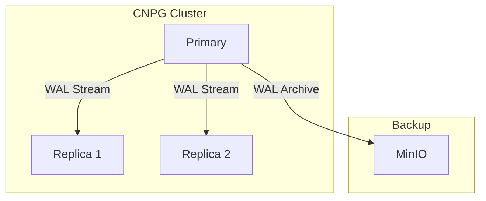
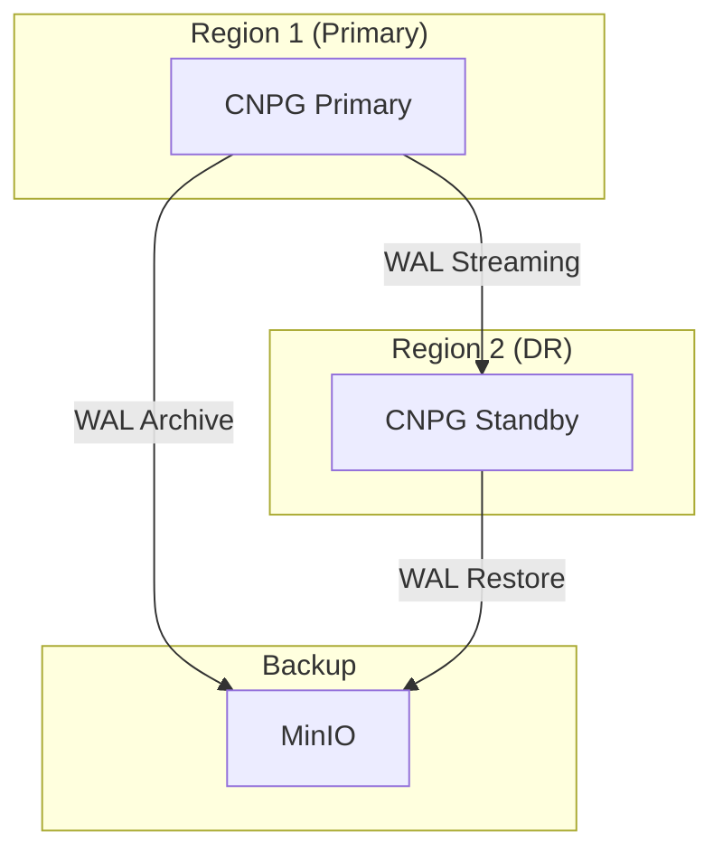

# CNPG (CloudNative PostgreSQL)

PostgreSQL operator for OpenOva platform.

**Status:** Accepted | **Updated:** 2026-01-17

---

## Overview

CloudNative PostgreSQL (CNPG) provides production-grade PostgreSQL with:
- Kubernetes-native operator
- WAL streaming for multi-region DR
- Automated backups to MinIO/S3
- High availability with automatic failover

---

## Architecture

### Single Region



### Multi-Region DR



---

## Configuration

### Cluster Definition

```yaml
apiVersion: postgresql.cnpg.io/v1
kind: Cluster
metadata:
  name: <tenant>-postgres
  namespace: databases
spec:
  instances: 3

  postgresql:
    parameters:
      max_connections: "200"
      shared_buffers: 256MB

  storage:
    size: 10Gi
    storageClass: <storage-class>

  backup:
    barmanObjectStore:
      destinationPath: s3://cnpg-backups/<tenant>
      endpointURL: http://minio.storage.svc:9000
      s3Credentials:
        accessKeyId:
          name: minio-credentials
          key: access-key
        secretAccessKey:
          name: minio-credentials
          key: secret-key
      wal:
        compression: gzip
    retentionPolicy: "30d"

  monitoring:
    enablePodMonitor: true
```

### DR Replica (Region 2)

```yaml
apiVersion: postgresql.cnpg.io/v1
kind: Cluster
metadata:
  name: <tenant>-postgres-dr
  namespace: databases
spec:
  instances: 1

  replica:
    enabled: true
    source: <tenant>-postgres

  externalClusters:
    - name: <tenant>-postgres
      connectionParameters:
        host: postgres.region1.<domain>
        user: streaming_replica
      password:
        name: pg-replica-credentials
        key: password
```

---

## Backup Strategy

| Type | Schedule | Retention |
|------|----------|-----------|
| WAL Archive | Continuous | 7 days |
| Base Backup | Daily 2 AM | 30 days |
| Point-in-Time | On-demand | Per backup |

### Scheduled Backup

```yaml
apiVersion: postgresql.cnpg.io/v1
kind: ScheduledBackup
metadata:
  name: <tenant>-daily-backup
  namespace: databases
spec:
  schedule: "0 2 * * *"
  backupOwnerReference: self
  cluster:
    name: <tenant>-postgres
```

---

## Failover

### Automatic (Within Region)

CNPG automatically promotes replicas when primary fails.

### Manual (Cross-Region)

```bash
# Promote DR cluster
kubectl cnpg promote <tenant>-postgres-dr -n databases
```

---

## Monitoring

| Metric | Description |
|--------|-------------|
| `cnpg_pg_replication_lag` | Replication lag in seconds |
| `cnpg_pg_database_size_bytes` | Database size |
| `cnpg_pg_stat_activity_count` | Active connections |

---

## PgBouncer Integration

Connection pooling with PgBouncer:

```yaml
apiVersion: postgresql.cnpg.io/v1
kind: Pooler
metadata:
  name: <tenant>-pooler
  namespace: databases
spec:
  cluster:
    name: <tenant>-postgres
  instances: 2
  type: rw
  pgbouncer:
    poolMode: transaction
    parameters:
      max_client_conn: "1000"
      default_pool_size: "20"
```

---

*Part of [OpenOva](https://openova.io)*
