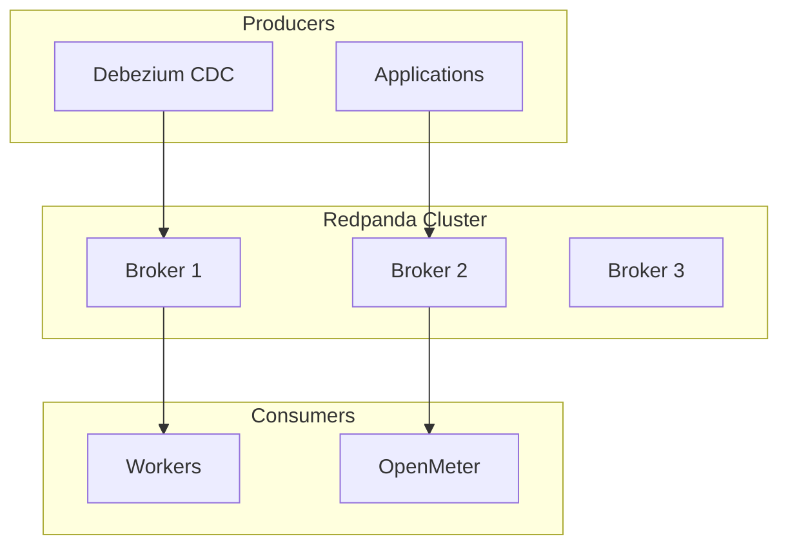
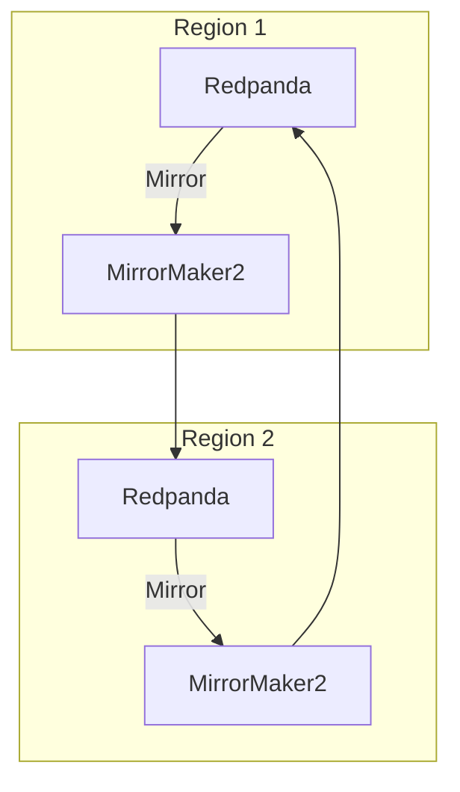
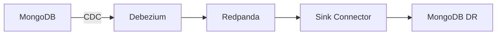

# Redpanda

Kafka-compatible event streaming for OpenOva platform.

**Status:** Accepted | **Updated:** 2026-01-17

---

## Overview

Redpanda provides Kafka-compatible event streaming:
- Drop-in Kafka replacement
- Lower resource footprint
- MirrorMaker2 for cross-region replication
- Debezium integration for CDC

---

## Architecture

### Single Region



### Multi-Region (MirrorMaker2)



---

## Why Redpanda

| Factor | Redpanda | Kafka |
|--------|----------|-------|
| Resource usage | Lower (no JVM) | Higher |
| Latency | Lower | Higher |
| Operations | Simpler | Complex ZooKeeper |
| Compatibility | 100% Kafka API | Native |
| License | BSL → Apache 2.0 | Apache 2.0 |

---

## Configuration

### Redpanda Cluster

```yaml
apiVersion: cluster.redpanda.com/v1alpha1
kind: Cluster
metadata:
  name: redpanda
  namespace: databases
spec:
  image: "docker.redpanda.com/redpandadata/redpanda:v24.1.1"
  replicas: 3
  resources:
    requests:
      cpu: 1
      memory: 2Gi
    limits:
      cpu: 2
      memory: 4Gi
  storage:
    capacity: 100Gi
    storageClassName: <storage-class>
  configuration:
    group: kafka
    name: cluster
    value:
      auto.create.topics.enable: "false"
      default.replication.factor: "3"
      min.insync.replicas: "2"
```

### MirrorMaker2 Configuration

```yaml
apiVersion: kafka.strimzi.io/v1beta2
kind: KafkaMirrorMaker2
metadata:
  name: mm2
  namespace: databases
spec:
  version: 3.6.0
  replicas: 2
  connectCluster: "region2"
  clusters:
    - alias: "region1"
      bootstrapServers: redpanda.region1.<domain>:9092
      tls: {}
    - alias: "region2"
      bootstrapServers: redpanda.databases.svc:9092
  mirrors:
    - sourceCluster: "region1"
      targetCluster: "region2"
      sourceConnector:
        config:
          replication.factor: 3
          offset-syncs.topic.replication.factor: 3
          heartbeats.topic.replication.factor: 3
          checkpoints.topic.replication.factor: 3
          sync.topic.acls.enabled: "false"
      topicsPattern: ".*"
      groupsPattern: ".*"
```

---

## Topics

| Topic Pattern | Purpose | Retention |
|---------------|---------|-----------|
| `cdc.mongodb.*` | MongoDB CDC events | 7 days |
| `events.*` | Application events | 7 days |
| `openmeter.*` | Usage metering | 30 days |

---

## Monitoring

| Metric | Description |
|--------|-------------|
| `redpanda_kafka_request_latency_seconds` | Request latency |
| `redpanda_kafka_partitions_with_under_replicated` | Under-replicated partitions |
| `redpanda_cluster_topics` | Topic count |
| `kafka_consumer_group_lag` | Consumer lag |

---

## Debezium Integration

Redpanda serves as the transport layer for CDC:



---

*Part of [OpenOva](https://openova.io)*
