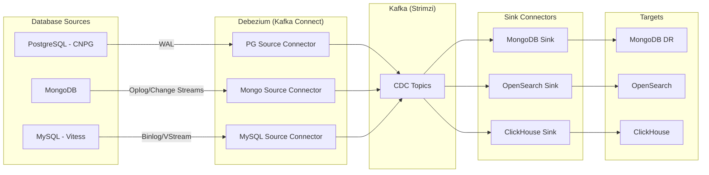
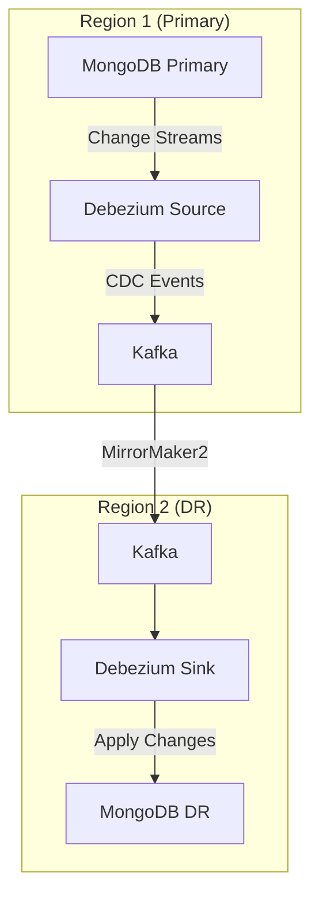
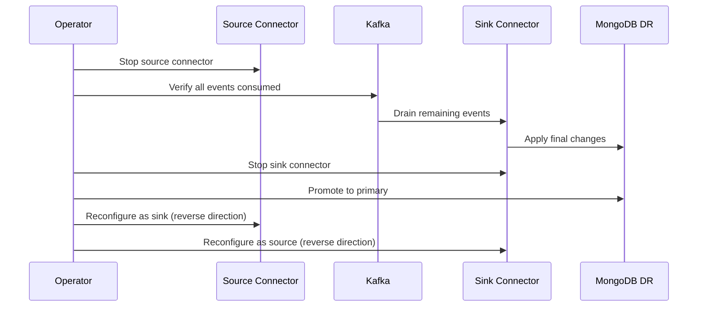

# Debezium

Change Data Capture (CDC) for streaming database changes.

**Status:** Accepted | **Updated:** 2026-02-09

---

## Overview

Debezium is an open-source distributed platform for Change Data Capture (CDC). Licensed under the Apache License 2.0, Debezium captures row-level changes in databases and streams them as events in real time. It monitors database transaction logs (WAL, oplog, binlog) to produce a consistent, ordered stream of every insert, update, and delete operation without impacting the source database's performance.

In the OpenOva platform, Debezium is a critical component for MongoDB cross-region replication. Because MongoDB's native replication is sensitive to network latency and partition tolerance issues across regions, OpenOva uses CDC via Debezium to capture MongoDB changes and replicate them through Kafka (via Strimzi) to disaster recovery clusters. This architecture decouples the replication from the database's own protocol and leverages the existing Kafka infrastructure for fault-tolerant, asynchronous data movement.

Debezium runs as Kafka Connect connectors on Strimzi (the Kafka Connect runtime in OpenOva). It supports source connectors for PostgreSQL (CNPG), MongoDB, and MySQL (Vitess), and sink connectors can deliver changes to OpenSearch, ClickHouse, or any other downstream system. This makes Debezium the universal CDC backbone for all database-to-database and database-to-analytics pipelines in the platform.

---

## Architecture

### CDC Pipeline



### MongoDB Cross-Region Replication



---

## Why Debezium?

| Factor | Debezium CDC | Native Replication | Application-Level CDC |
|--------|-------------|-------------------|-----------------------|
| Source impact | Minimal (reads transaction log) | Varies by database | Requires code changes |
| Consistency | Transactionally consistent | Database-dependent | Error-prone |
| Cross-database | Any source to any sink | Same database only | Custom per pair |
| Network tolerance | Async via Kafka | Latency-sensitive | Application-dependent |
| Schema changes | Captured automatically | Transparent | Must be handled manually |
| Ordering | Per-partition ordering | Database-specific | Manual ordering |
| License | Apache 2.0 | Database license | Custom |

**Decision:** Debezium is mandatory when MongoDB is selected (for cross-region DR). It is recommended for all CDC use cases including PostgreSQL-to-ClickHouse analytics pipelines and database-to-OpenSearch search indexing.

---

## Key Features

| Feature | Description |
|---------|-------------|
| Log-Based CDC | Reads database transaction logs with minimal source impact |
| Exactly-Once Semantics | Supports exactly-once delivery with Kafka transactions |
| Schema Registry | Tracks schema evolution with Avro/JSON Schema support |
| Snapshot Mode | Initial consistent snapshot before streaming changes |
| Transforms | Single Message Transforms (SMTs) for filtering, routing, and enrichment |
| Outbox Pattern | Built-in support for transactional outbox pattern |
| Heartbeat | Periodic heartbeats to detect connector health and progress |
| Signal Table | External signal table for ad-hoc snapshots and schema changes |
| Incremental Snapshots | Non-blocking snapshots of existing data while streaming |
| Dead Letter Queue | Automatic routing of failed events for investigation |

---

## Supported Sources

| Database | Connector | Log Type | OpenOva Component |
|----------|-----------|----------|-------------------|
| PostgreSQL | `io.debezium.connector.postgresql.PostgresConnector` | WAL (logical decoding) | CNPG |
| MongoDB | `io.debezium.connector.mongodb.MongoDbConnector` | Change Streams / Oplog | MongoDB |
| MySQL | `io.debezium.connector.mysql.MySqlConnector` | Binlog | Vitess |

---

## Configuration

### Kafka Connect Cluster (Strimzi)

```yaml
apiVersion: kafka.strimzi.io/v1beta2
kind: KafkaConnect
metadata:
  name: debezium-connect
  namespace: databases
  annotations:
    strimzi.io/use-connector-resources: "true"
spec:
  version: 3.6.0
  replicas: 2
  bootstrapServers: strimzi-kafka-bootstrap.databases.svc:9092
  config:
    group.id: debezium-connect
    offset.storage.topic: debezium-offsets
    config.storage.topic: debezium-configs
    status.storage.topic: debezium-status
    offset.storage.replication.factor: 3
    config.storage.replication.factor: 3
    status.storage.replication.factor: 3
    key.converter: org.apache.kafka.connect.json.JsonConverter
    value.converter: org.apache.kafka.connect.json.JsonConverter
    key.converter.schemas.enable: false
    value.converter.schemas.enable: false
  build:
    output:
      type: docker
      image: harbor.<domain>/debezium/debezium-connect:latest
      pushSecret: harbor-registry-credentials
    plugins:
      - name: debezium-mongodb
        artifacts:
          - type: tgz
            url: https://repo1.maven.org/maven2/io/debezium/debezium-connector-mongodb/2.6.1.Final/debezium-connector-mongodb-2.6.1.Final-plugin.tar.gz
      - name: debezium-postgres
        artifacts:
          - type: tgz
            url: https://repo1.maven.org/maven2/io/debezium/debezium-connector-postgres/2.6.1.Final/debezium-connector-postgres-2.6.1.Final-plugin.tar.gz
      - name: debezium-mysql
        artifacts:
          - type: tgz
            url: https://repo1.maven.org/maven2/io/debezium/debezium-connector-mysql/2.6.1.Final/debezium-connector-mysql-2.6.1.Final-plugin.tar.gz
      - name: mongodb-sink
        artifacts:
          - type: maven
            group: org.mongodb.kafka
            artifact: mongo-kafka-connect
            version: 1.12.0
  resources:
    requests:
      cpu: 500m
      memory: 1Gi
    limits:
      cpu: 2
      memory: 2Gi
```

### MongoDB Source Connector

```yaml
apiVersion: kafka.strimzi.io/v1beta2
kind: KafkaConnector
metadata:
  name: mongodb-source
  namespace: databases
  labels:
    strimzi.io/cluster: debezium-connect
spec:
  class: io.debezium.connector.mongodb.MongoDbConnector
  tasksMax: 1
  config:
    mongodb.connection.string: "mongodb://debezium:${file:/opt/kafka/external-configuration/mongodb-credentials/password}@mongodb.databases.svc:27017/?replicaSet=rs0"
    topic.prefix: cdc.mongodb
    collection.include.list: "<tenant>.*"
    capture.mode: change_streams_update_full
    snapshot.mode: initial
    signal.data.collection: <tenant>.debezium_signal
    heartbeat.interval.ms: 10000
    errors.tolerance: all
    errors.deadletterqueue.topic.name: dlq.mongodb
    errors.deadletterqueue.context.headers.enable: true
```

### PostgreSQL Source Connector

```yaml
apiVersion: kafka.strimzi.io/v1beta2
kind: KafkaConnector
metadata:
  name: postgres-source
  namespace: databases
  labels:
    strimzi.io/cluster: debezium-connect
spec:
  class: io.debezium.connector.postgresql.PostgresConnector
  tasksMax: 1
  config:
    database.hostname: <tenant>-postgres-rw.databases.svc
    database.port: 5432
    database.user: debezium
    database.password: ${file:/opt/kafka/external-configuration/postgres-credentials/password}
    database.dbname: <tenant>
    topic.prefix: cdc.postgres
    schema.include.list: public
    plugin.name: pgoutput
    slot.name: debezium_<tenant>
    publication.name: dbz_publication
    snapshot.mode: initial
    heartbeat.interval.ms: 10000
```

### MongoDB Sink Connector (DR Region)

```yaml
apiVersion: kafka.strimzi.io/v1beta2
kind: KafkaConnector
metadata:
  name: mongodb-sink
  namespace: databases
  labels:
    strimzi.io/cluster: debezium-connect
spec:
  class: com.mongodb.kafka.connect.MongoSinkConnector
  tasksMax: 1
  config:
    connection.uri: "mongodb://admin:${file:/opt/kafka/external-configuration/mongodb-dr-credentials/password}@mongodb.databases.svc:27017"
    database: <tenant>
    topics.regex: "cdc\\.mongodb\\.<tenant>\\..*"
    change.data.capture.handler: com.mongodb.kafka.connect.sink.cdc.debezium.DebeziumCdcHandler
    errors.tolerance: all
    errors.deadletterqueue.topic.name: dlq.mongodb-sink
    errors.deadletterqueue.context.headers.enable: true
    max.batch.size: 100
    write.model.strategy: com.mongodb.kafka.connect.sink.writemodel.strategy.ReplaceOneDefaultStrategy
```

---

## CDC Topics

| Topic Pattern | Source | Purpose | Retention |
|---------------|--------|---------|-----------|
| `cdc.mongodb.<tenant>.*` | MongoDB | MongoDB CDC events | 7 days |
| `cdc.postgres.<tenant>.*` | PostgreSQL (CNPG) | PostgreSQL CDC events | 7 days |
| `cdc.mysql.<tenant>.*` | MySQL (Vitess) | MySQL CDC events | 7 days |
| `dlq.mongodb` | Debezium | Failed MongoDB source events | 30 days |
| `dlq.mongodb-sink` | Sink Connector | Failed MongoDB sink events | 30 days |
| `debezium-offsets` | Kafka Connect | Connector offset tracking | Compact |
| `debezium-configs` | Kafka Connect | Connector configuration | Compact |
| `debezium-status` | Kafka Connect | Connector status | Compact |

---

## Failover Procedure

### MongoDB Cross-Region Failover

1. Verify CDC lag is zero (all events consumed)
2. Stop the source connector in Region 1
3. Verify the sink connector has applied all pending events
4. Stop the sink connector in Region 2
5. Promote MongoDB DR in Region 2 to primary
6. Reconfigure connectors: Region 2 becomes source, Region 1 becomes sink
7. Update application connection strings via k8gb DNS failover



---

## Monitoring

| Metric | Description |
|--------|-------------|
| `debezium_streaming_queue_remaining_capacity` | Connector queue capacity |
| `debezium_streaming_milliseconds_behind_source` | CDC lag in milliseconds |
| `debezium_snapshot_remaining_table_count` | Tables remaining in snapshot |
| `kafka_connect_connector_status` | Connector health status |
| `kafka_connect_task_status` | Task-level health status |
| `debezium_streaming_total_number_of_events_seen` | Total events processed |

### Alerts

```yaml
apiVersion: monitoring.coreos.com/v1
kind: PrometheusRule
metadata:
  name: debezium-alerts
  namespace: databases
spec:
  groups:
    - name: debezium
      rules:
        - alert: DebeziumCDCLagHigh
          expr: debezium_streaming_milliseconds_behind_source > 30000
          for: 5m
          labels:
            severity: warning
          annotations:
            summary: "Debezium CDC lag exceeds 30 seconds"
        - alert: DebeziumConnectorFailed
          expr: kafka_connect_connector_status{status="failed"} > 0
          for: 1m
          labels:
            severity: critical
          annotations:
            summary: "Debezium connector has failed"
```

---

## Consequences

**Positive:**
- Log-based CDC captures all database changes with minimal impact on source performance
- Decouples cross-region replication from database-native protocols
- Universal CDC backbone for PostgreSQL, MongoDB, and MySQL sources
- Leverages existing Kafka (Strimzi) infrastructure for fault-tolerant event delivery
- Enables real-time analytics pipelines (database to ClickHouse/OpenSearch)

**Negative:**
- Adds operational complexity with Kafka Connect cluster management
- Connector failures require manual intervention and potential re-snapshotting
- Schema evolution must be managed carefully to avoid deserialization failures
- CDC lag during high-write periods may delay DR data availability
- Dead letter queue events require investigation and manual reprocessing

---

*Part of [OpenOva](https://openova.io)*
