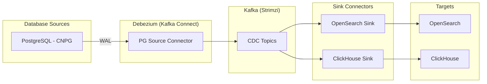
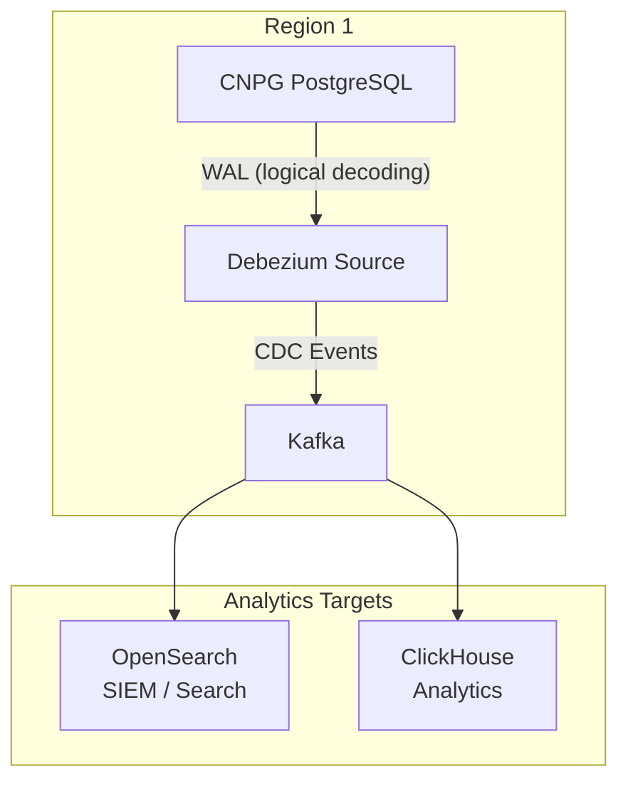

# Debezium

Change Data Capture (CDC) for streaming database changes.

**Status:** Accepted | **Updated:** 2026-02-26

---

## Overview

Debezium is an open-source distributed platform for Change Data Capture (CDC). Licensed under the Apache License 2.0, Debezium captures row-level changes in databases and streams them as events in real time. It monitors database transaction logs (WAL) to produce a consistent, ordered stream of every insert, update, and delete operation without impacting the source database's performance.

In the OpenOva platform, Debezium serves as the CDC backbone for streaming PostgreSQL (CNPG) changes to downstream analytics and search systems. It captures changes from CNPG databases — including FerretDB's underlying PostgreSQL storage — and delivers them to OpenSearch (for SIEM/search indexing) and ClickHouse (for analytics). This enables real-time data pipelines without polling or application-level change tracking.

Debezium runs as Kafka Connect connectors on Strimzi (the Kafka Connect runtime in OpenOva). It supports source connectors for PostgreSQL (CNPG) and sink connectors that deliver changes to OpenSearch, ClickHouse, or any other downstream system.

---

## Architecture

### CDC Pipeline


```mermaid
flowchart LR
    subgraph Sources["Database Sources"]
        CNPG[PostgreSQL - CNPG]
    end

    subgraph CDC["Debezium (Kafka Connect)"]
        PGSource[PG Source Connector]
    end

    subgraph Streaming["Kafka (Strimzi)"]
        Topics[CDC Topics]
    end

    subgraph Sinks["Sink Connectors"]
        OSSink[OpenSearch Sink]
        CHSink[ClickHouse Sink]
    end

    subgraph Targets["Targets"]
        OpenSearch[OpenSearch]
        ClickHouse[ClickHouse]
    end

    CNPG -->|"WAL"| PGSource
    PGSource --> Topics
    Topics --> OSSink
    Topics --> CHSink
    OSSink --> OpenSearch
    CHSink --> ClickHouse
```

### Analytics Pipeline


```mermaid
flowchart TB
    subgraph Region1["Region 1"]
        CNPG1[CNPG PostgreSQL]
        Debezium1[Debezium Source]
        Kafka1[Kafka]
    end

    subgraph Analytics["Analytics Targets"]
        OS[OpenSearch<br/>SIEM / Search]
        CH[ClickHouse<br/>Analytics]
    end

    CNPG1 -->|"WAL (logical decoding)"| Debezium1
    Debezium1 -->|"CDC Events"| Kafka1
    Kafka1 --> OS
    Kafka1 --> CH
```

---

## Why Debezium?

| Factor | Debezium CDC | Application-Level CDC |
|--------|-------------|----------------------|
| Source impact | Minimal (reads transaction log) | Requires code changes |
| Consistency | Transactionally consistent | Error-prone |
| Cross-database | Any source to any sink | Custom per pair |
| Schema changes | Captured automatically | Must be handled manually |
| Ordering | Per-partition ordering | Manual ordering |
| License | Apache 2.0 | Custom |

**Decision:** Debezium is recommended for all CDC use cases including PostgreSQL-to-ClickHouse analytics pipelines and database-to-OpenSearch search indexing. FerretDB data is captured via the PostgreSQL connector since FerretDB stores data in CNPG.

---

## Key Features

| Feature | Description |
|---------|-------------|
| Log-Based CDC | Reads database transaction logs with minimal source impact |
| Exactly-Once Semantics | Supports exactly-once delivery with Kafka transactions |
| Schema Registry | Tracks schema evolution with Avro/JSON Schema support |
| Snapshot Mode | Initial consistent snapshot before streaming changes |
| Transforms | Single Message Transforms (SMTs) for filtering, routing, and enrichment |
| Outbox Pattern | Built-in support for transactional outbox pattern |
| Heartbeat | Periodic heartbeats to detect connector health and progress |
| Signal Table | External signal table for ad-hoc snapshots and schema changes |
| Incremental Snapshots | Non-blocking snapshots of existing data while streaming |
| Dead Letter Queue | Automatic routing of failed events for investigation |

---

## Supported Sources

| Database | Connector | Log Type | OpenOva Component |
|----------|-----------|----------|-------------------|
| PostgreSQL | `io.debezium.connector.postgresql.PostgresConnector` | WAL (logical decoding) | CNPG |

> **Note:** FerretDB stores data in CNPG PostgreSQL. CDC for FerretDB data uses the PostgreSQL connector against the underlying CNPG database.

---

## Configuration

### Kafka Connect Cluster (Strimzi)

```yaml
apiVersion: kafka.strimzi.io/v1beta2
kind: KafkaConnect
metadata:
  name: debezium-connect
  namespace: databases
  annotations:
    strimzi.io/use-connector-resources: "true"
spec:
  version: 3.6.0
  replicas: 2
  bootstrapServers: strimzi-kafka-bootstrap.databases.svc:9092
  config:
    group.id: debezium-connect
    offset.storage.topic: debezium-offsets
    config.storage.topic: debezium-configs
    status.storage.topic: debezium-status
    offset.storage.replication.factor: 3
    config.storage.replication.factor: 3
    status.storage.replication.factor: 3
    key.converter: org.apache.kafka.connect.json.JsonConverter
    value.converter: org.apache.kafka.connect.json.JsonConverter
    key.converter.schemas.enable: false
    value.converter.schemas.enable: false
  build:
    output:
      type: docker
      image: harbor.<domain>/debezium/debezium-connect:latest
      pushSecret: harbor-registry-credentials
    plugins:
      - name: debezium-postgres
        artifacts:
          - type: tgz
            url: https://repo1.maven.org/maven2/io/debezium/debezium-connector-postgres/2.6.1.Final/debezium-connector-postgres-2.6.1.Final-plugin.tar.gz
  resources:
    requests:
      cpu: 500m
      memory: 1Gi
    limits:
      cpu: 2
      memory: 2Gi
```

### PostgreSQL Source Connector

```yaml
apiVersion: kafka.strimzi.io/v1beta2
kind: KafkaConnector
metadata:
  name: postgres-source
  namespace: databases
  labels:
    strimzi.io/cluster: debezium-connect
spec:
  class: io.debezium.connector.postgresql.PostgresConnector
  tasksMax: 1
  config:
    database.hostname: <org>-postgres-rw.databases.svc
    database.port: 5432
    database.user: debezium
    database.password: ${file:/opt/kafka/external-configuration/postgres-credentials/password}
    database.dbname: <org>
    topic.prefix: cdc.postgres
    schema.include.list: public
    plugin.name: pgoutput
    slot.name: debezium_<org>
    publication.name: dbz_publication
    snapshot.mode: initial
    heartbeat.interval.ms: 10000
```

---

## CDC Topics

| Topic Pattern | Source | Purpose | Retention |
|---------------|--------|---------|-----------|
| `cdc.postgres.<org>.*` | PostgreSQL (CNPG) | PostgreSQL CDC events | 7 days |
| `dlq.postgres` | Debezium | Failed source events | 30 days |
| `debezium-offsets` | Kafka Connect | Connector offset tracking | Compact |
| `debezium-configs` | Kafka Connect | Connector configuration | Compact |
| `debezium-status` | Kafka Connect | Connector status | Compact |

---

## Monitoring

| Metric | Description |
|--------|-------------|
| `debezium_streaming_queue_remaining_capacity` | Connector queue capacity |
| `debezium_streaming_milliseconds_behind_source` | CDC lag in milliseconds |
| `debezium_snapshot_remaining_table_count` | Tables remaining in snapshot |
| `kafka_connect_connector_status` | Connector health status |
| `kafka_connect_task_status` | Task-level health status |
| `debezium_streaming_total_number_of_events_seen` | Total events processed |

### Alerts

```yaml
apiVersion: monitoring.coreos.com/v1
kind: PrometheusRule
metadata:
  name: debezium-alerts
  namespace: databases
spec:
  groups:
    - name: debezium
      rules:
        - alert: DebeziumCDCLagHigh
          expr: debezium_streaming_milliseconds_behind_source > 30000
          for: 5m
          labels:
            severity: warning
          annotations:
            summary: "Debezium CDC lag exceeds 30 seconds"
        - alert: DebeziumConnectorFailed
          expr: kafka_connect_connector_status{status="failed"} > 0
          for: 1m
          labels:
            severity: critical
          annotations:
            summary: "Debezium connector has failed"
```

---

## Consequences

**Positive:**
- Log-based CDC captures all database changes with minimal impact on source performance
- Universal CDC backbone for PostgreSQL (CNPG) sources
- Leverages existing Kafka (Strimzi) infrastructure for fault-tolerant event delivery
- Enables real-time analytics pipelines (database to ClickHouse/OpenSearch)
- FerretDB data captured transparently via CNPG PostgreSQL WAL

**Negative:**
- Adds operational complexity with Kafka Connect cluster management
- Connector failures require manual intervention and potential re-snapshotting
- Schema evolution must be managed carefully to avoid deserialization failures
- CDC lag during high-write periods may delay downstream data availability
- Dead letter queue events require investigation and manual reprocessing

---

*Part of [OpenOva](https://openova.io)*
