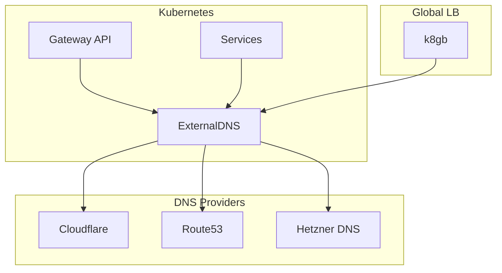
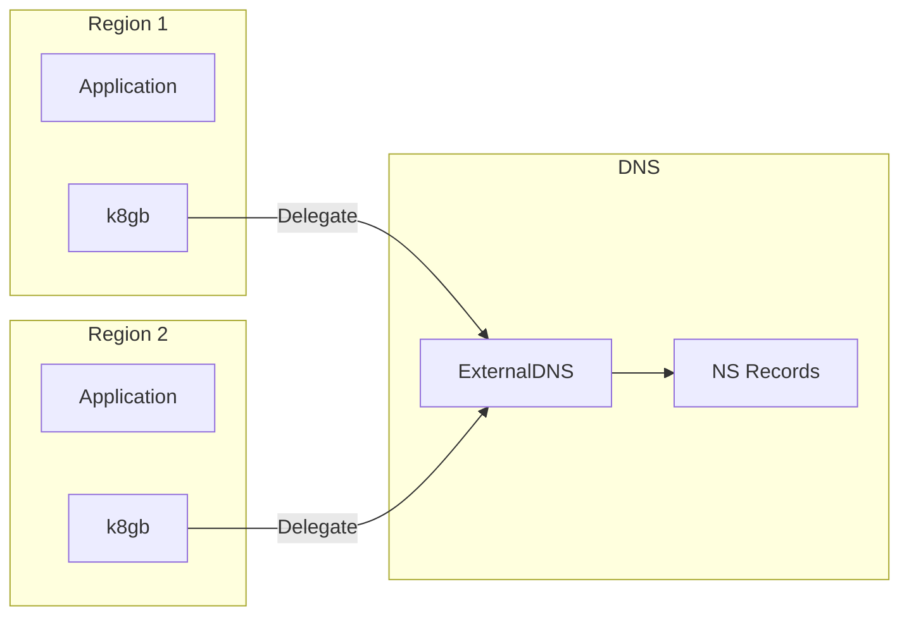

# ExternalDNS

DNS synchronization for OpenOva platform.

**Status:** Accepted | **Updated:** 2026-01-17

---

## Overview

ExternalDNS synchronizes Kubernetes resources (Gateway, Service, Ingress) with external DNS providers, enabling automatic DNS record management.

---

## Architecture



---

## Supported DNS Providers

| Provider | Availability |
|----------|--------------|
| Cloudflare | Always |
| Hetzner DNS | If Hetzner chosen |
| AWS Route53 | If AWS chosen |
| GCP Cloud DNS | If GCP chosen |
| Azure DNS | If Azure chosen |

---

## Configuration

### ExternalDNS Deployment

```yaml
apiVersion: apps/v1
kind: Deployment
metadata:
  name: external-dns
  namespace: external-dns
spec:
  template:
    spec:
      containers:
        - name: external-dns
          image: registry.k8s.io/external-dns/external-dns:v0.14.0
          args:
            - --source=gateway-httproute
            - --source=gateway-grpcroute
            - --source=service
            - --provider=cloudflare
            - --cloudflare-proxied
            - --txt-owner-id=openova
            - --txt-prefix=_externaldns.
          env:
            - name: CF_API_TOKEN
              valueFrom:
                secretKeyRef:
                  name: cloudflare-credentials
                  key: api-token
```

---

## k8gb Integration

ExternalDNS works with k8gb for GSLB:



k8gb delegates a subdomain (e.g., `gslb.<domain>`) and handles health-based DNS responses within that zone.

---

## Record Types

| Source | Record Type | Example |
|--------|-------------|---------|
| Gateway | A/CNAME | `api.<domain>` |
| Service (LoadBalancer) | A | `svc.<domain>` |
| k8gb GslbHttpRoute | NS delegation | `gslb.<domain>` |

---

## TXT Registry

ExternalDNS uses TXT records to track ownership:

```
_externaldns.api.<domain> TXT "heritage=external-dns,external-dns/owner=openova"
```

This prevents ExternalDNS from modifying records it doesn't own.

---

*Part of [OpenOva](https://openova.io)*
