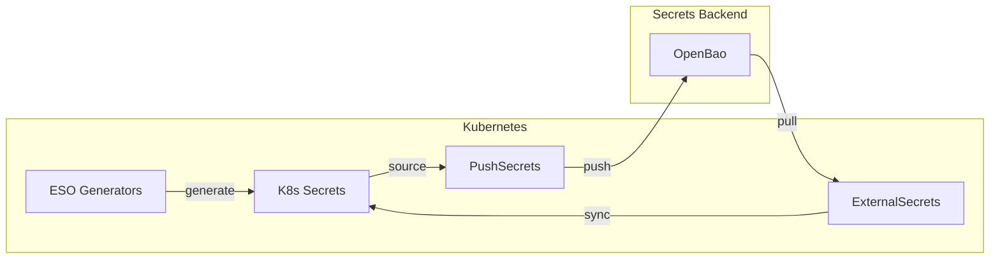
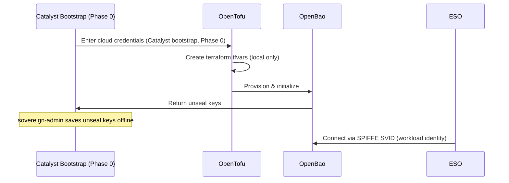

# External Secrets Operator

ESO bridges OpenBao (the Catalyst secret backend) and per-Pod K8s Secrets. Per-host-cluster infrastructure (see [`docs/PLATFORM-TECH-STACK.md`](../../docs/PLATFORM-TECH-STACK.md) §3.3).

**Status:** Accepted | **Updated:** 2026-04-27

---

## Overview

External Secrets Operator (ESO) provides the Kubernetes-native interface for secrets management. Kubernetes Secrets are the **source of truth**, pushed to external backends.

**Critical:** SOPS is completely eliminated. No secrets in Git, ever.



> **See also:** [`platform/openbao/README.md`](../openbao/README.md) for the secret-backend architecture (independent Raft per region, async perf replication, single-primary writes — see also [`docs/SECURITY.md`](../../docs/SECURITY.md) §5).

---

## Key Principles

| Principle | Implementation |
|-----------|----------------|
| No secrets in Git | SOPS eliminated, interactive bootstrap |
| OpenBao is source of truth | Secrets live in OpenBao; K8s Secrets are materialized projections |
| Pull-locally, write-to-primary | ExternalSecret reads from local OpenBao replica; PushSecret writes to the primary region |
| Multi-region reads | Async perf replication propagates writes from primary → replicas |
| Auto-generation | ESO Generators create complex secrets directly into OpenBao |

---

## ESO Components

| Component | Purpose |
|-----------|---------|
| **ExternalSecret** | Pulls secrets from OpenBao into K8s |
| **PushSecret** | Pushes K8s Secrets to OpenBao instance(s) |
| **ClusterSecretStore** | Connection to secrets backend |
| **Generators** | Auto-generate passwords, UUIDs, tokens |

---

## Bootstrap Secrets Flow



---

## Configuration

### ClusterSecretStore (OpenBao)

```yaml
apiVersion: external-secrets.io/v1beta1
kind: ClusterSecretStore
metadata:
  name: vault-region1
spec:
  provider:
    vault:
      server: "https://openbao.<location-code>.<sovereign-domain>"
      path: "secret"
      version: "v2"
      auth:
        kubernetes:
          mountPath: "kubernetes"
          role: "external-secrets"
          serviceAccountRef:
            name: external-secrets
            namespace: external-secrets
```

### ExternalSecret Template

```yaml
apiVersion: external-secrets.io/v1beta1
kind: ExternalSecret
metadata:
  name: <service>-secrets
  namespace: <org>-prod
spec:
  refreshInterval: 1h
  secretStoreRef:
    name: vault-region1
    kind: ClusterSecretStore
  target:
    name: <service>-secrets
  data:
    - secretKey: DATABASE_URL
      remoteRef:
        key: <org>/postgres
        property: url
    - secretKey: API_KEY
      remoteRef:
        key: <org>/api-keys
        property: main
```

### PushSecret to the primary OpenBao

Writes go to the primary region only — replicas refuse writes (perf replication is one-way primary→standby).

```yaml
apiVersion: external-secrets.io/v1alpha1
kind: PushSecret
metadata:
  name: push-db-credentials
  namespace: databases
spec:
  secretStoreRefs:
    - name: bao-primary             # writes hit the primary region only
      kind: ClusterSecretStore
  selector:
    secret:
      name: db-credentials
  data:
    - match:
        secretKey: password
        remoteRef:
          remoteKey: databases/db-credentials
          property: password
```

OpenBao's async Performance Replication propagates the new value to all replicas within ~1s. Each region's ExternalSecret then materializes the new K8s Secret locally.

---

## ESO Generators

ESO Generators create complex secrets automatically, eliminating manual password creation.

### Password Generator

```yaml
apiVersion: generators.external-secrets.io/v1alpha1
kind: Password
metadata:
  name: db-password-generator
  namespace: databases
spec:
  length: 32
  digits: 6
  symbols: 4
  noUpper: false
  allowRepeat: true
---
apiVersion: external-secrets.io/v1beta1
kind: ExternalSecret
metadata:
  name: db-password
  namespace: databases
spec:
  refreshInterval: "0"  # Generate once, never refresh
  target:
    name: db-credentials
    creationPolicy: Owner
  dataFrom:
    - sourceRef:
        generatorRef:
          apiVersion: generators.external-secrets.io/v1alpha1
          kind: Password
          name: db-password-generator
```

### Available Generator Types

| Generator | Use Case |
|-----------|----------|
| Password | Database passwords, API keys |
| UUID | Unique identifiers |
| ECRAuthorizationToken | AWS ECR tokens |
| GCRAccessToken | GCP GCR tokens |
| ACRAccessToken | Azure ACR tokens |

---

## Gitea Token Management

Gitea access tokens for Flux are managed via ESO, following the same patterns as all other secrets.

### Bootstrap Creates Gitea Token

```yaml
apiVersion: v1
kind: Secret
metadata:
  name: gitea-token
  namespace: flux-system
type: Opaque
data:
  username: Zm... # base64 encoded username
  password: Z2l... # base64 encoded Gitea access token
```

### Flux Uses Token

```yaml
apiVersion: source.toolkit.fluxcd.io/v1
kind: GitRepository
metadata:
  name: component
  namespace: flux-system
spec:
  url: https://gitea.<location-code>.<sovereign-domain>/<org>/component.git
  secretRef:
    name: gitea-token  # ESO-managed
```

---

## Managed Secrets

| Secret | Purpose | Created By |
|--------|---------|------------|
| `gitea-token` | Flux access to Gitea | Bootstrap |
| `cloudflare-credentials` | ExternalDNS | Bootstrap |
| `hetzner-credentials` | Cloud provider | Bootstrap |
| `openbao-unseal-keys` | OpenBao auto-unseal | Displayed once |
| `db-credentials` | Database passwords | ESO Generator |

---

## Secret Types

| Secret | Layer | Storage | Rotation |
|--------|-------|---------|----------|
| Cloud credentials | Bootstrap | Interactive (never stored) | On compromise |
| SSH keys | Bootstrap | Interactive (never stored) | On compromise |
| OpenBao unseal keys | Bootstrap | Offline backup | On compromise |
| Database passwords | K8s | ESO + OpenBao | 90 days |
| API keys | K8s | ESO + OpenBao | On compromise |
| JWT signing keys | K8s | ESO + OpenBao | 30 days |
| TLS certificates | K8s | cert-manager | Auto |
| Gitea tokens | K8s | ESO + OpenBao | 90 days |

---

## Why No SOPS?

| SOPS Approach | PushSecrets Approach |
|---------------|---------------------|
| Secrets encrypted in Git | No secrets in Git |
| Manual age key management | OpenBao handles encryption |
| Decrypt before apply | K8s Secret is source |
| Risk of leaked decrypted files | Secrets never on disk |

**Decision:** Interactive bootstrap is simpler and more secure than SOPS.

---

## Critical Backup

The ONLY manual backup required:

- **OpenBao unseal keys** - Displayed once during bootstrap
- Backup: Password manager + physical copy

**Warning:** Losing unseal keys makes OpenBao secrets unrecoverable.

---

## Migration from SOPS

If migrating from SOPS-based setup:

1. Create K8s Secrets from decrypted SOPS files
2. Create PushSecrets to sync to OpenBao
3. Verify secrets in OpenBao
4. Delete SOPS-encrypted files from Git
5. Delete local decrypted files

---

## Consequences

**Positive:**
- No secrets in Git (eliminates leak risk)
- Auto-generation of complex secrets via ESO Generators
- Cross-region availability via OpenBao Performance Replication (replicas serve reads with sub-10ms latency in same continent)
- Backend-agnostic (swap without app changes)
- Gitea tokens managed consistently with all other secrets

**Negative:**
- Requires bootstrap for initial secrets
- ESO operator dependency
- OpenBao/backend operational overhead

---

*Part of [OpenOva](https://openova.io)*
