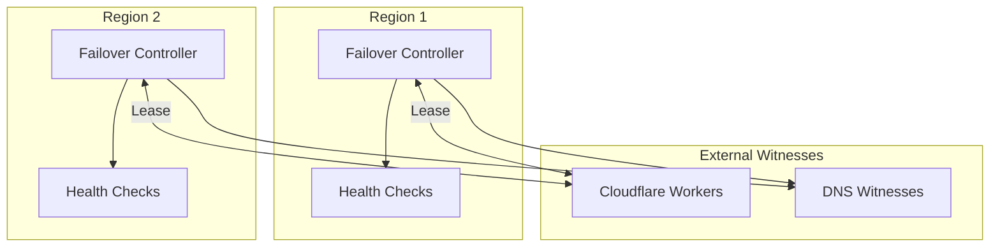
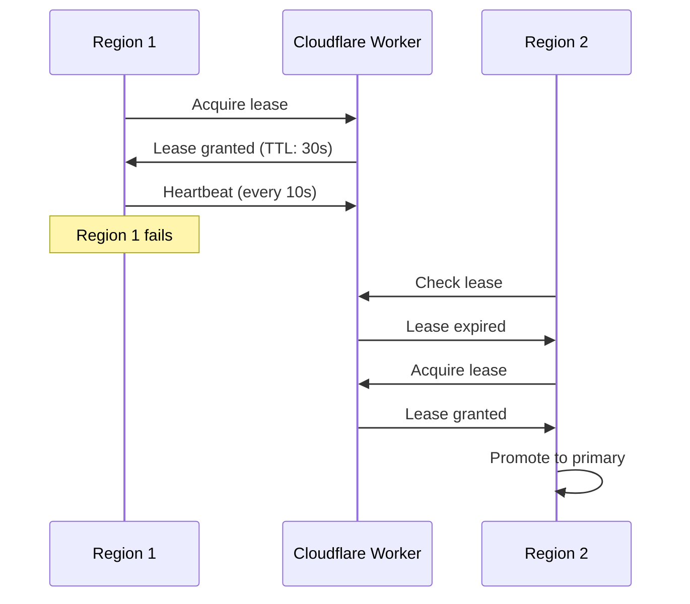
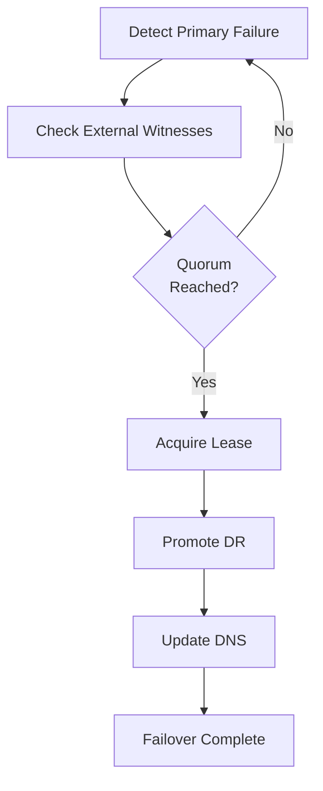

# Failover Controller

Multi-region failover orchestration for OpenOva platform.

**Status:** Accepted | **Updated:** 2026-01-17

---

## Overview

The Failover Controller orchestrates cross-region failover with split-brain protection, ensuring safe promotion of DR regions during outages.

---

## Architecture



---

## Split-Brain Protection

### External DNS Witnesses

Failover Controller queries external DNS witnesses before promotion:

| Resolver | Provider |
|----------|----------|
| 8.8.8.8 | Google |
| 1.1.1.1 | Cloudflare |
| 9.9.9.9 | Quad9 |

**Quorum:** 2/3 must agree the other region is unreachable before promotion.

### Cloudflare Workers Lease

A Cloudflare Worker provides distributed lease management:



---

## Failover Flow



---

## Configuration

### Failover Controller

```yaml
apiVersion: apps/v1
kind: Deployment
metadata:
  name: failover-controller
  namespace: platform-services
spec:
  replicas: 1
  template:
    spec:
      containers:
        - name: controller
          image: openova/failover-controller:v1.0.0
          env:
            - name: REGION
              value: region1
            - name: PEER_REGION
              value: region2
            - name: CLOUDFLARE_WORKER_URL
              valueFrom:
                secretKeyRef:
                  name: failover-config
                  key: worker-url
            - name: DNS_WITNESSES
              value: "8.8.8.8,1.1.1.1,9.9.9.9"
            - name: QUORUM
              value: "2"
```

### Cloudflare Worker

```javascript
// Simplified lease management
export default {
  async fetch(request, env) {
    const { pathname } = new URL(request.url);

    if (pathname === '/acquire') {
      const region = request.headers.get('X-Region');
      const current = await env.LEASE.get('primary');

      if (!current || isExpired(current)) {
        await env.LEASE.put('primary', region, { expirationTtl: 30 });
        return new Response(JSON.stringify({ granted: true }));
      }

      return new Response(JSON.stringify({ granted: false, holder: current }));
    }
  }
};
```

---

## Monitoring

| Metric | Description |
|--------|-------------|
| `failover_lease_status` | Current lease holder |
| `failover_witness_reachable` | DNS witness reachability |
| `failover_last_failover_time` | Last failover timestamp |

---

*Part of [OpenOva](https://openova.io)*
