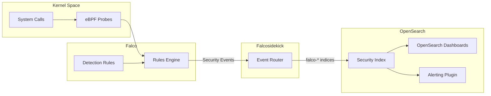
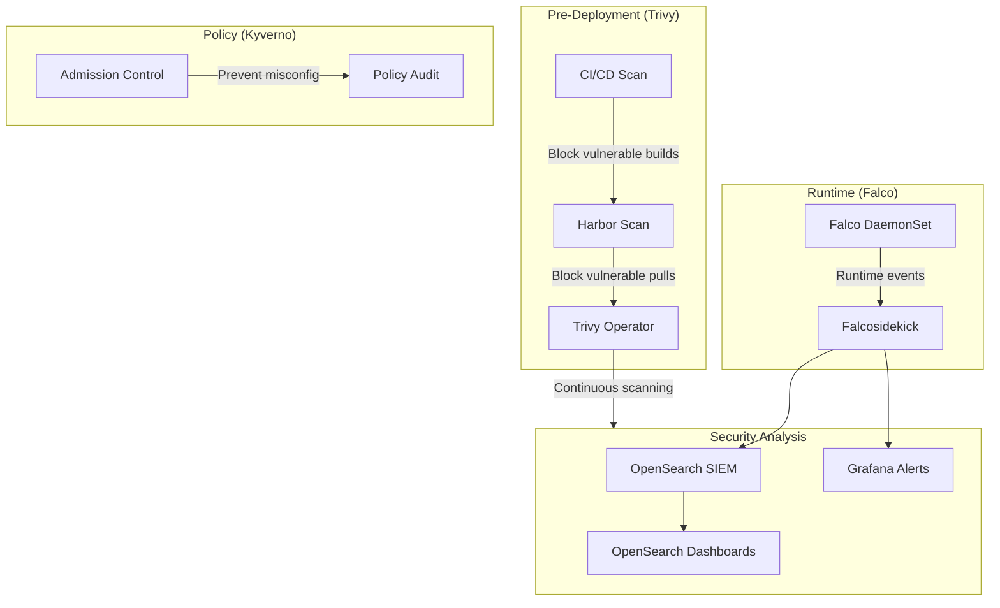
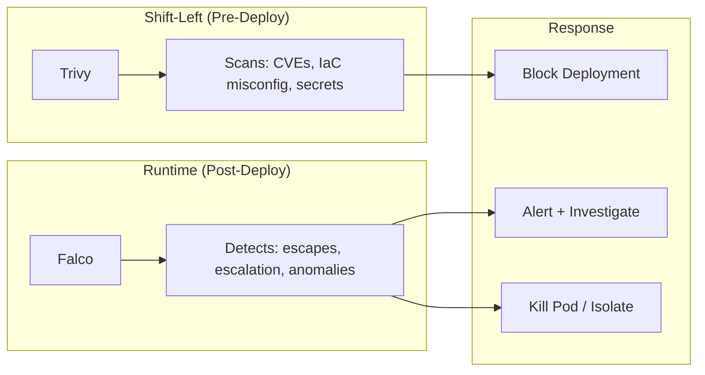

# Falco

Runtime security and threat detection for Kubernetes.

**Status:** Accepted | **Updated:** 2026-02-09

---

## Overview

Falco is a CNCF Graduated cloud-native runtime security project that detects threats and anomalies in real time. Licensed under the Apache License 2.0, Falco monitors system calls at the kernel level using eBPF probes, providing deep visibility into container and host behavior without requiring application instrumentation or sidecar injection.

In the OpenOva platform, Falco serves as the runtime security layer that complements Trivy's static scanning capabilities. While Trivy scans container images, Kubernetes manifests, and IaC for known vulnerabilities before deployment, Falco monitors what containers actually do at runtime: detecting container escapes, privilege escalation attempts, unexpected network connections, cryptomining, and file access violations as they occur.

Falco events are routed through Falcosidekick to OpenSearch, where they are stored, correlated, and visualized as a SIEM (Security Information and Event Management) solution. This pipeline provides security teams with a complete runtime threat detection and investigation workflow using entirely open-source components.

---

## Architecture

### SIEM Pipeline



### Full Security Stack



---

## Why Falco?

| Factor | Falco | Trivy | Kyverno |
|--------|-------|-------|---------|
| Detection type | Runtime behavior | Static vulnerability scan | Policy enforcement |
| When | During execution | Before/after deployment | At admission |
| How | eBPF syscall monitoring | Image/manifest scanning | Webhook validation |
| Detects | Container escape, privilege escalation | CVEs, misconfigurations | Policy violations |
| CNCF status | Graduated | Sandbox (Aqua Security) | Graduated |
| License | Apache 2.0 | Apache 2.0 | Apache 2.0 |

**Decision:** Falco, Trivy, and Kyverno are complementary. Trivy provides shift-left static scanning, Kyverno enforces admission policies, and Falco detects runtime threats. All three are required for defense-in-depth security.

---

## Key Features

| Feature | Description |
|---------|-------------|
| eBPF Kernel Monitoring | Syscall-level visibility without kernel modules or application changes |
| Container Escape Detection | Detects attempts to break out of container namespaces |
| Privilege Escalation Alerts | Monitors for unexpected setuid, capability changes, and root access |
| Network Anomaly Detection | Identifies unexpected outbound connections and port scanning |
| File Integrity Monitoring | Alerts on unauthorized reads/writes to sensitive paths |
| Cryptomining Detection | Detects known mining binaries and connection patterns |
| K8s Audit Log Analysis | Processes Kubernetes API server audit events |
| Custom Rules | Flexible rule language for organization-specific detections |
| Falcosidekick | Event router supporting 60+ output destinations |
| Talon Response | Automated response actions (kill pod, isolate network) |

---

## Threat Detection Categories

| Category | Example Rules |
|----------|---------------|
| Container Escape | Mount namespace escape, container breakout via `nsenter` |
| Privilege Escalation | Unexpected `setuid` binary, capability escalation |
| Lateral Movement | Unexpected SSH connections, internal port scanning |
| Persistence | Crontab modification, systemd unit creation in container |
| Data Exfiltration | Bulk data reads from sensitive paths, DNS tunneling |
| Cryptomining | Known miner binary execution, stratum protocol connections |
| Supply Chain | Unexpected binary download during runtime, `curl | bash` patterns |
| Filesystem | Write to `/etc/passwd`, modification of package manager databases |

---

## Configuration

### Falco DaemonSet (Helm)

```yaml
apiVersion: helm.toolkit.fluxcd.io/v2beta1
kind: HelmRelease
metadata:
  name: falco
  namespace: falco-system
spec:
  interval: 10m
  chart:
    spec:
      chart: falco
      version: "4.x"
      sourceRef:
        kind: HelmRepository
        name: falcosecurity
        namespace: flux-system
  values:
    driver:
      kind: modern_ebpf

    collectors:
      kubernetes:
        enabled: true

    falcoctl:
      artifact:
        install:
          enabled: true
        follow:
          enabled: true
      config:
        artifact:
          allowedTypes:
            - rulesfile
            - plugin
          install:
            refs:
              - falco-rules:3
          follow:
            refs:
              - falco-rules:3

    falco:
      rules_files:
        - /etc/falco/falco_rules.yaml
        - /etc/falco/falco_rules.local.yaml
        - /etc/falco/rules.d
      load_plugins:
        - name: k8saudit
          library_path: libk8saudit.so
        - name: json
          library_path: libjson.so
      json_output: true
      json_include_output_property: true
      log_stderr: true
      log_syslog: false
      priority: notice
      buffered_outputs: false
      http_output:
        enabled: true
        url: http://falcosidekick.falco-system.svc:2801

    resources:
      requests:
        cpu: 100m
        memory: 512Mi
      limits:
        cpu: 1
        memory: 1Gi

    tolerations:
      - effect: NoSchedule
        operator: Exists
```

### Falcosidekick

```yaml
apiVersion: helm.toolkit.fluxcd.io/v2beta1
kind: HelmRelease
metadata:
  name: falcosidekick
  namespace: falco-system
spec:
  interval: 10m
  chart:
    spec:
      chart: falcosidekick
      version: "0.8.x"
      sourceRef:
        kind: HelmRepository
        name: falcosecurity
        namespace: flux-system
  values:
    config:
      opensearch:
        hostPort: https://opensearch.search.svc:9200
        index: falco
        type: _doc
        minimumPriority: notice
        username: falco-writer
        password: ""
        existingSecret: opensearch-falco-credentials
        createIndexTemplate: true

      prometheus:
        extralabels: "source:falco"

      webhook:
        address: ""
        minimumPriority: critical

    webui:
      enabled: true
      replicaCount: 1

    resources:
      requests:
        cpu: 50m
        memory: 128Mi
      limits:
        cpu: 500m
        memory: 256Mi
```

### Custom Rules

```yaml
# /etc/falco/falco_rules.local.yaml
- rule: Unexpected Outbound Connection from Database
  desc: Detect outbound network connections from database containers
  condition: >
    outbound and
    container and
    container.image.repository contains "mongo" or
    container.image.repository contains "postgres" or
    container.image.repository contains "mysql"
  output: >
    Unexpected outbound connection from database container
    (command=%proc.cmdline connection=%fd.name
    container_id=%container.id image=%container.image.repository
    namespace=%k8s.ns.name pod=%k8s.pod.name)
  priority: WARNING
  tags: [network, database, mitre_exfiltration]

- rule: Write Below Binary Directories in Container
  desc: Detect writes to binary directories within containers
  condition: >
    write and container and
    (fd.directory = /usr/bin or fd.directory = /usr/sbin or
     fd.directory = /bin or fd.directory = /sbin)
  output: >
    Write to binary directory in container
    (user=%user.name command=%proc.cmdline file=%fd.name
    container_id=%container.id image=%container.image.repository)
  priority: CRITICAL
  tags: [filesystem, mitre_persistence]

- rule: Crypto Mining Binary Detected
  desc: Detect known cryptocurrency mining binaries
  condition: >
    spawned_process and container and
    (proc.name in (xmrig, ccminer, minerd, cpuminer, bfgminer))
  output: >
    Crypto mining binary detected
    (user=%user.name command=%proc.cmdline
    container_id=%container.id image=%container.image.repository
    namespace=%k8s.ns.name pod=%k8s.pod.name)
  priority: CRITICAL
  tags: [cryptomining, mitre_execution]
```

---

## Trivy vs Falco (Complementary Roles)



| Aspect | Trivy | Falco |
|--------|-------|-------|
| When | Pre-deployment / continuous | Runtime |
| What | Known CVEs, misconfigurations | Behavioral anomalies |
| How | Image/manifest scanning | Kernel syscall monitoring |
| Action | Block build/deploy | Alert, investigate, respond |
| Scope | Static analysis | Dynamic analysis |

---

## Monitoring

| Metric | Description |
|--------|-------------|
| `falco_events_total` | Total security events generated |
| `falco_events_by_priority` | Events grouped by severity |
| `falcosidekick_outputs_total` | Events forwarded per output |
| `falcosidekick_outputs_errors_total` | Output delivery failures |
| `falco_kernel_drops_total` | Dropped syscall events (capacity issue) |

---

## Consequences

**Positive:**
- CNCF Graduated with deep kernel-level visibility via eBPF
- Detects threats that static scanning cannot (runtime behavior anomalies)
- Completes the security triad with Trivy (static) and Kyverno (policy)
- Falcosidekick provides flexible routing to OpenSearch SIEM and 60+ destinations
- Extensive default ruleset covers MITRE ATT&CK framework tactics

**Negative:**
- eBPF driver requires compatible kernel versions (5.8+ recommended)
- High event volume in noisy environments requires rule tuning to reduce false positives
- DaemonSet deployment adds resource overhead on every node
- Custom rule development requires understanding of Linux syscall semantics
- Kernel-level monitoring adds a sensitive privileged workload to the cluster

---

*Part of [OpenOva](https://openova.io)*
