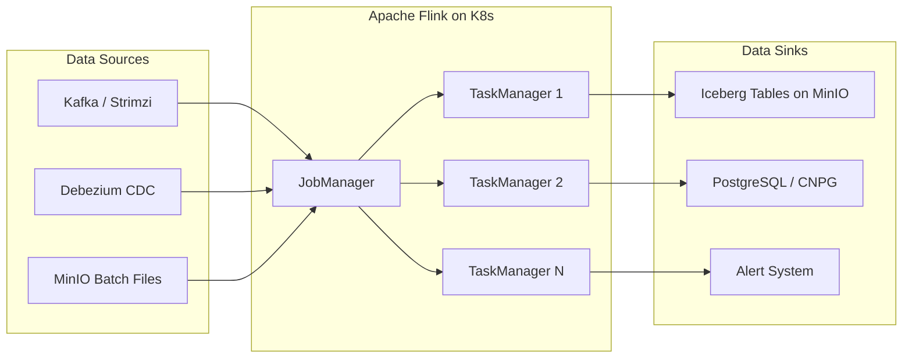

# Apache Flink

Unified stream and batch processing engine.

**Status:** Accepted | **Updated:** 2026-02-09

---

## Overview

Apache Flink is a distributed processing engine for stateful computations over both bounded (batch) and unbounded (streaming) data. Unlike frameworks that bolt streaming onto a batch engine, Flink was built streaming-first, making it the most capable engine for real-time data pipelines. It handles exactly-once semantics, event-time processing, and complex event processing out of the box.

Within OpenOva, Flink serves as the data processing engine for the **Titan** data lakehouse product. It ingests data from Kafka topics (via Strimzi), CDC streams (via Debezium), and batch sources, transforms and enriches it, and writes the results directly into Iceberg tables on MinIO. This creates a unified architecture where a single engine handles both real-time streaming and periodic batch ETL, eliminating the need for separate processing frameworks.

Flink runs natively on Kubernetes via the official Flink Kubernetes Operator. The operator manages the full lifecycle of Flink applications: deployment, scaling, savepoints, upgrades, and failure recovery. This Kubernetes-native approach replaces Apache Spark for environments where container orchestration is the primary compute platform, avoiding the complexity of YARN or standalone cluster managers.

---

## Architecture



### End-to-End Data Flow


---

## Key Features

| Feature | Description |
|---------|-------------|
| Unified Stream & Batch | Single engine for real-time and periodic processing |
| Exactly-Once Semantics | Guaranteed correctness via checkpointing and two-phase commit |
| Event-Time Processing | Process events based on when they occurred, not when they arrived |
| Native Iceberg Sink | First-class Iceberg integration for lakehouse writes |
| Kubernetes Operator | Full lifecycle management (deploy, scale, savepoint, upgrade) |
| Flink SQL | Write pipelines in SQL without Java/Scala code |
| Stateful Processing | Managed state with RocksDB backend and incremental checkpoints |
| Watermarks | Handle late-arriving data with configurable watermark strategies |

---

## Configuration

### Flink Kubernetes Operator

```yaml
apiVersion: flink.apache.org/v1beta1
kind: FlinkDeployment
metadata:
  name: titan-flink
  namespace: data-lakehouse
spec:
  image: flink:1.20-java17
  flinkVersion: v1_20
  flinkConfiguration:
    taskmanager.numberOfTaskSlots: "4"
    state.backend: rocksdb
    state.checkpoints.dir: s3://flink-checkpoints/titan
    state.savepoints.dir: s3://flink-savepoints/titan
    s3.endpoint: http://minio.storage.svc:9000
    s3.access-key: ${MINIO_ACCESS_KEY}
    s3.secret-key: ${MINIO_SECRET_KEY}
    s3.path.style.access: "true"
    execution.checkpointing.interval: "60000"
    execution.checkpointing.min-pause: "30000"
    restart-strategy: exponential-delay
    restart-strategy.exponential-delay.initial-backoff: 1s
    restart-strategy.exponential-delay.max-backoff: 60s
  serviceAccount: flink
  jobManager:
    resource:
      memory: 2048m
      cpu: 1
  taskManager:
    replicas: 3
    resource:
      memory: 4096m
      cpu: 2
```

### Streaming Job (CDC to Iceberg)

```yaml
apiVersion: flink.apache.org/v1beta1
kind: FlinkSessionJob
metadata:
  name: cdc-to-iceberg
  namespace: data-lakehouse
spec:
  deploymentName: titan-flink
  job:
    jarURI: s3://flink-jobs/cdc-to-iceberg-1.0.jar
    entryClass: io.openova.titan.CDCToIcebergJob
    args:
      - --kafka.bootstrap.servers
      - strimzi-kafka-bootstrap.messaging.svc:9093
      - --kafka.group.id
      - titan-cdc-consumer
      - --iceberg.catalog.uri
      - jdbc:postgresql://titan-postgres.databases.svc:5432/iceberg_catalog
      - --iceberg.warehouse
      - s3://iceberg-warehouse/
    parallelism: 4
    upgradeMode: savepoint
```

---

## Flink SQL Example

Write streaming pipelines without Java code using Flink SQL.

```sql
-- Create source table from Kafka topic
CREATE TABLE cdc_orders (
    order_id    BIGINT,
    customer_id BIGINT,
    amount      DECIMAL(10, 2),
    status      STRING,
    created_at  TIMESTAMP(3),
    WATERMARK FOR created_at AS created_at - INTERVAL '5' SECOND
) WITH (
    'connector' = 'kafka',
    'topic' = 'dbserver1.public.orders',
    'properties.bootstrap.servers' = 'strimzi-kafka-bootstrap.messaging.svc:9093',
    'format' = 'debezium-json',
    'scan.startup.mode' = 'earliest-offset'
);

-- Create sink table writing to Iceberg
CREATE TABLE iceberg_orders (
    order_id    BIGINT,
    customer_id BIGINT,
    amount      DECIMAL(10, 2),
    status      STRING,
    created_at  TIMESTAMP(3),
    order_date  DATE
) PARTITIONED BY (order_date)
WITH (
    'connector' = 'iceberg',
    'catalog-name' = 'titan',
    'catalog-type' = 'jdbc',
    'uri' = 'jdbc:postgresql://titan-postgres.databases.svc:5432/iceberg_catalog',
    'warehouse' = 's3://iceberg-warehouse/',
    'write.format.default' = 'parquet',
    'write.parquet.compression-codec' = 'zstd'
);

-- Continuous streaming insert with derived partition column
INSERT INTO iceberg_orders
SELECT
    order_id,
    customer_id,
    amount,
    status,
    created_at,
    CAST(created_at AS DATE) AS order_date
FROM cdc_orders;
```

---

## Savepoint Management

Savepoints enable zero-downtime upgrades and job migration.

```bash
# Trigger a savepoint before upgrading
kubectl patch flinksessionjob cdc-to-iceberg \
  --type merge \
  -p '{"spec":{"job":{"state":"suspended","upgradeMode":"savepoint"}}}'

# Resume from savepoint after upgrade
kubectl patch flinksessionjob cdc-to-iceberg \
  --type merge \
  -p '{"spec":{"job":{"state":"running","initialSavepointPath":"s3://flink-savepoints/titan/savepoint-abc123"}}}'
```

---

## Monitoring

| Metric | Description |
|--------|-------------|
| `flink_jobmanager_job_uptime` | Job uptime in milliseconds |
| `flink_taskmanager_job_task_numRecordsInPerSecond` | Input throughput |
| `flink_taskmanager_job_task_numRecordsOutPerSecond` | Output throughput |
| `flink_jobmanager_job_numRestarts` | Job restart count |
| `flink_taskmanager_Status_JVM_Memory_Heap_Used` | Heap memory usage |
| `flink_taskmanager_job_task_checkpointAlignmentTime` | Checkpoint alignment time |
| `flink_jobmanager_job_lastCheckpointDuration` | Last checkpoint duration |

---

## Consequences

**Positive:**
- Unified engine for streaming and batch eliminates dual-framework complexity
- Native Iceberg integration enables direct lakehouse writes with exactly-once guarantees
- Kubernetes operator automates deployment, scaling, and failure recovery
- Flink SQL allows analysts to define pipelines without Java/Scala expertise
- Savepoints enable zero-downtime upgrades and job migration
- Event-time processing with watermarks handles late data correctly

**Negative:**
- Stateful processing requires careful checkpoint and state backend configuration
- RocksDB state backend needs local SSD storage for optimal performance
- Complex windowing and join semantics have a steep learning curve
- Memory tuning (network buffers, managed memory, JVM heap) requires expertise
- Operator upgrades require coordination with running job savepoints
- Debugging distributed streaming jobs is inherently more difficult than batch

---

*Part of [OpenOva Titan](https://openova.io) - Data Lakehouse*
