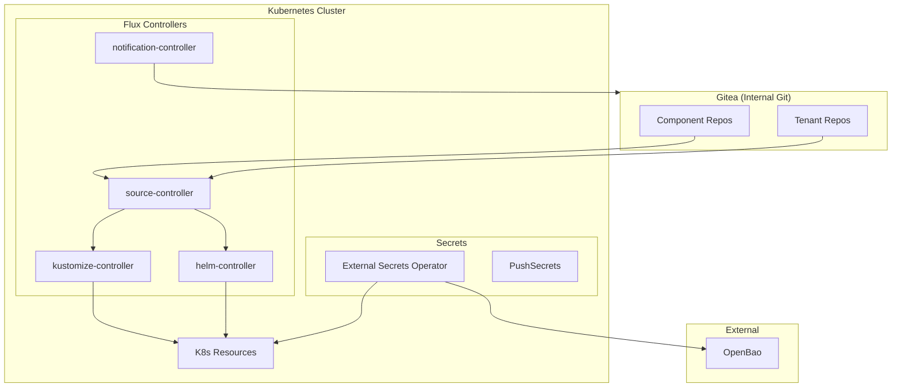
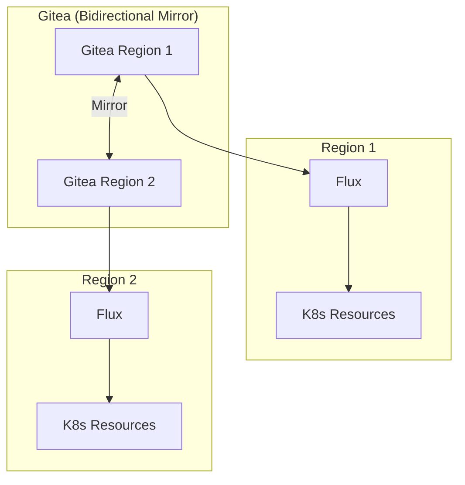

# Flux

GitOps delivery engine for OpenOva platform.

**Status:** Accepted | **Updated:** 2026-01-17

---

## Overview

Flux provides GitOps-based continuous delivery with Gitea as the internal Git provider and External Secrets Operator for secrets management.

---

## Architecture



---

## Why Flux

| Factor | Flux | ArgoCD |
|--------|------|--------|
| Memory overhead | ~200MB | ~500-800MB |
| Architecture | Kubernetes-native CRDs | Separate UI/API |
| Secrets | Via ESO (PushSecrets) | Via ESO (PushSecrets) |
| CLI workflow | Excellent | UI-focused |

**Key Decision Factors:**
- Lower resource overhead
- CLI-focused fits single-developer workflow
- Kubernetes-native CRDs
- Works well with External Secrets Operator
- Integrates seamlessly with Gitea

---

## Components

| Controller | Memory | Purpose |
|------------|--------|---------|
| source-controller | 64MB | Git/Helm repo sync |
| kustomize-controller | 64MB | Kustomization apply |
| helm-controller | 64MB | HelmRelease management |
| notification-controller | 32MB | Alerts |

---

## Repository Structure

```
flux/
├── clusters/
│   └── <region>/
│       ├── flux-system/       # Flux controllers
│       ├── network/           # cilium, stunner, k8gb
│       ├── security/          # kyverno, external-secrets, cert-manager
│       ├── database/          # cnpg, mongodb, valkey
│       ├── middleware/        # strimzi
│       ├── storage/           # minio, velero
│       ├── observability/     # grafana (LGTM stack)
│       ├── autoscaling/       # keda
│       ├── workplace/         # stalwart
│       └── tenants/           # product deployments
```

---

## Categories

| Category | Components | Purpose |
|----------|------------|---------|
| network | cilium, stunner, k8gb | CNI + Service Mesh, TURN, GSLB |
| security | kyverno, external-secrets, cert-manager | Policy, secrets, TLS |
| database | cnpg, mongodb, valkey | Database operators |
| middleware | strimzi | Apache Kafka streaming |
| storage | minio, velero | Object storage, backup |
| observability | grafana | LGTM stack |
| autoscaling | keda | Event-driven scaling |
| workplace | stalwart | Email server |
| tenants | `<tenant>` | Product deployments |

---

## Configuration

### GitRepository for Gitea

```yaml
apiVersion: source.toolkit.fluxcd.io/v1
kind: GitRepository
metadata:
  name: <component>
  namespace: flux-system
spec:
  interval: 5m
  url: https://gitea.<domain>/<org>/<component>.git
  ref:
    branch: main
  secretRef:
    name: gitea-token
```

### Kustomization

```yaml
apiVersion: kustomize.toolkit.fluxcd.io/v1
kind: Kustomization
metadata:
  name: <component>
  namespace: flux-system
spec:
  interval: 10m
  targetNamespace: <namespace>
  sourceRef:
    kind: GitRepository
    name: <component>
  path: ./deploy/prod
  prune: true
  wait: true
  healthChecks:
    - apiVersion: apps/v1
      kind: Deployment
      name: <component>
      namespace: <namespace>
```

---

## Multi-Region GitOps



- Each region has its own Flux installation
- Both Gitea instances mirror repositories bidirectionally
- Flux in each region pulls from local Gitea
- Region-specific configuration handled via Kustomize overlays

---

## Secrets Management

Flux uses External Secrets Operator (ESO) with PushSecrets pattern:

- **No SOPS**: SOPS has been eliminated from the architecture
- **PushSecrets**: 100% PushSecrets pattern for multi-region
- **K8s Secrets as source of truth**: Apps read from K8s Secrets only

---

## Release Management

### Release Flow

```
Feature Branch → PR → main → Flux Sync → Staging → Promote → Production
                                            ↓
                                      Canary Analysis (Flagger)
                                            ↓
                                      Auto-Rollback (on failure)
```

### Environment Strategy

| Environment | Sync Interval |
|-------------|---------------|
| Staging | 1m |
| Production | 10m |

### Rollback Strategy

| Trigger | Action |
|---------|--------|
| Flagger metric failure | Auto-rollback |
| Manual intervention | Git revert + sync |
| Emergency | `kubectl rollout undo` |

---

## Bootstrap

```bash
# Initial cluster bootstrap (Gitea)
flux bootstrap git \
  --url=https://gitea.<domain>/openova/flux \
  --branch=main \
  --path=clusters/<region> \
  --token-auth
```

---

## Key Commands

```bash
# Status overview
flux get all

# Force reconciliation
flux reconcile kustomization tenants

# View logs
flux logs --all-namespaces

# Suspend (manual gate)
flux suspend kustomization <tenant>-prod
```

---

## Sync Intervals

| Resource | Interval |
|----------|----------|
| GitRepository | 1 minute |
| Kustomization | 10 minutes |
| HelmRelease | 10 minutes |

---

## Gitea Actions Integration

Gitea Actions can trigger Flux reconciliation:

```yaml
# .gitea/workflows/notify-flux.yaml
name: Notify Flux
on:
  push:
    branches: [main]

jobs:
  notify:
    runs-on: ubuntu-latest
    steps:
      - name: Trigger Flux reconciliation
        run: |
          curl -X POST \
            -H "Authorization: Bearer ${{ secrets.FLUX_WEBHOOK_TOKEN }}" \
            https://flux-webhook.<domain>/hook/...
```

---

*Part of [OpenOva](https://openova.io)*
